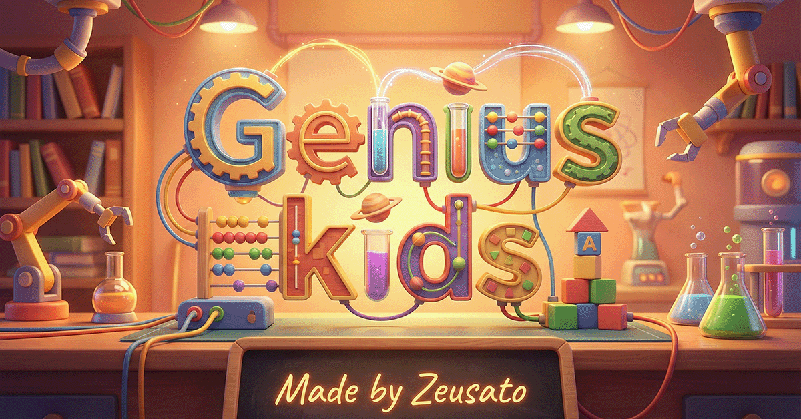

# MathGenius Kids: Nền Tảng Giáo Dục STEM Tương Tác



## 1. Giới Thiệu (Introduction)

**MathGenius Kids** là một nền tảng ứng dụng web (Progressive Web App - PWA) được thiết kế nhằm mục đích hỗ trợ trẻ em (Lớp 1 - 5) tiếp cận các kiến thức Toán học, Khoa học tự nhiên và Tư duy lập trình một cách trực quan và sinh động. Hệ thống kết hợp giữa phương pháp giáo dục truyền thống và mô hình **Gamification** (trò chơi hóa) để tối đa hóa sự hứng thú và hiệu quả học tập.

Ứng dụng không chỉ là một công cụ luyện toán mà là một hệ sinh thái học tập đa dạng, từ việc mô phỏng các hiện tượng thiên văn, sinh học, hóa học đến rèn luyện tư duy thuật toán máy tính.

---

## 2. Các Phân Hệ Giáo Dục (Core Modules)

Hệ thống được chia thành 4 phân hệ chính, đảm bảo phủ rộng các lĩnh vực trong giáo dục STEM (Science, Technology, Engineering, Mathematics).

### 2.1. Phân Hệ Toán Học (Mathematics Engine)
Đây là lõi của hệ thống, cung cấp chương trình học bám sát khung chương trình tiểu học (Lớp 1-5).
*   **Cơ Chế Sinh Câu Hỏi Động (Dynamic Generation):** Hệ thống không sử dụng ngân hàng câu hỏi tĩnh mà sử dụng các thuật toán (Algorithms) để sinh câu hỏi mới mỗi lần truy cập, đảm bảo tính đa dạng vô hạn.
*   **Phạm Vi Kiến Thức:**
    *   Số học: Cộng, Trừ, Nhân, Chia, Số thập phân, Phân số.
    *   Hình học: Nhận diện hình, Chu vi, Diện tích, Thể tích.
    *   Đại lượng: Đổi đơn vị đo lường, Tiền tệ, Xem giờ.
    *   Toán có lời văn & Tư duy logic.
*   **Chế Độ Luyện Tập:** Trắc nghiệm, Điền khuyết, Chọn đúng/sai.

### 2.2. Phân Hệ Khoa Học Tự Nhiên (Scientific Simulations) 🔬
Cung cấp các phòng thí nghiệm ảo và mô hình trực quan để giải thích các khái niệm trừu tượng.

*   **🧬 Cây Tiến Hóa Sinh Học (Evolutionary Tree):** [MỚI]
    *   Sơ đồ hóa lịch sử tiến hóa của sinh giới từ sinh vật đơn bào đến động vật có vú hiện đại.
    *   Cấu trúc phân cấp khoa học: Giới (Kingdom) -> Ngành (Phylum) -> Lớp (Class) -> Bộ (Order) -> Họ (Family).
    *   Tích hợp Infographic chi tiết cho từng mắt xích tiến hóa (Khủng long, Thú cổ, Chim, v.v.).

*   **🌌 Mô Phỏng Hệ Mặt Trời (Solar System 3D):**
    *   Sử dụng công nghệ WebGL (Three.js) để dựng lại mô hình 3D thời gian thực của các hành tinh.
    *   Cung cấp số liệu thiên văn chính xác: Chu kỳ quỹ đạo, đường kính, nhiệt độ bề mặt.

*   **⚛️ Bảng Tuần Hoàn Tương Tác (Interactive Periodic Table):**
    *   Hiển thị tính chất hóa lý của 118 nguyên tố.
    *   Mô hình nguyên tử Bohr 3D mô phỏng chuyển động của electron.

*   **⚡ Phòng Thí Nghiệm Điện (Electrical Lab):**
    *   Môi trường Sandbox cho phép kéo thả linh kiện (Pin, Đèn, Dây dẫn, Công tắc) để lắp ráp mạch điện.
    *   Mô phỏng dòng electron và các định luật vật lý cơ bản về mạch điện.

### 2.3. Phân Hệ Tư Duy Máy Tính (Computer Science) 🤖
*   **KidCoder (Visual Programming):**
    *   Môi trường lập trình kéo thả (Block-based coding) tương tự Scratch.
    *   Rèn luyện tư duy thuật toán: Tuần tự (Sequence), Vòng lặp (Loops), Điều kiện (Conditionals).
    *   Nhiệm vụ: Lập trình robot vượt chướng ngại vật thông qua các cấp độ tư duy tăng dần.

### 2.4. Phân Hệ Xã Hội & Logic
*   **1000 Câu Hỏi Vì Sao:** Cơ sở dữ liệu tri thức về tự nhiên, xã hội và con người.
*   **Giải Đố Nhân Sư:** Các câu đố dân gia và logic giúp rèn luyện tư duy ngôn ngữ và suy luận.

### 2.5. Trợ Lý Học Tập AI (AI Learning Assistant) 🤖 [MỚI]
Hệ thống tích hợp **"Bo Biết Tuốt"** - một trợ lý ảo thông minh được phát triển dựa trên mô hình AI tiên tiến, đóng vai trò như một người bạn đồng hành trong học tập.

*   **🤖 Tương Tác Thân Thiện:** Bo xưng hô gần gũi, gọi tên học sinh, có giọng văn khích lệ và phù hợp với tâm lý lứa tuổi tiểu học.
*   **📚 Giải Đáp Kiến Thức:** Hỗ trợ giải bài tập toán (hướng dẫn từng bước), giải thích các hiện tượng khoa học, lịch sử và văn hóa.
*   **🛡️ An Toàn Tuyệt Đối:** Hệ thống lọc nội dung nghiêm ngặt, chỉ trả lời các vấn đề liên quan đến giáo dục, kiên quyết từ chối nội dung độc hại.
*   **🧪 Hỗ Trợ Công Thức & Markdown:** Hiển thị công thức toán học chuyên nghiệp (LaTeX) và định dạng văn bản trực quan.

---

## 3. Kiến Trúc Gamification & Hệ Thống Thưởng

Chúng tôi áp dụng các cơ chế tâm lý học hành vi để duy trì động lực học tập:

1.  **Hệ Thống Tiền Tệ Ảo (Star System):**
    *   Hoàn thành bài tập/nhiệm vụ -> Nhận Sao.
    *   Sao được dùng để "đầu tư" vào Avatar hoặc mở khóa định dạng giao diện (Themes).

2.  **Cơ Chế Gacha & Bộ Sưu Tập (Collectibles):**
    *   Mô hình phần thưởng ngẫu nhiên (Variable Ratio Schedule) giúp tăng sự phấn khích.
    *   Học sinh sưu tập các thẻ bài (Pokemon, Dragon Ball, v.v.) với độ hiếm khác nhau.
    *   Khuyến khích sự kiên trì và hoàn thành mục tiêu dài hạn.

3.  **Hệ Thống Thành Tích (Achievements):**
    *   Ghi nhận các cột mốc quan trọng (Ví dụ: "Giải đúng 100 bài toán", "Hoàn thành 5 cấp độ code").
    *   Cung cấp lộ trình phấn đấu rõ ràng cho người học.

---

## 4. Đặc Tả Kỹ Thuật (Technical Specifications)

Dự án được xây dựng trên nền tảng công nghệ web hiện đại, tối ưu hóa hiệu năng và trải nghiệm người dùng (UX).

*   **Frontend Framework:** React 19 + TypeScript (Đảm bảo Type safety và maintainability).
*   **Build Tool:** Vite (Tốc độ build và HMR siêu tốc).
*   **Trí Tuệ Nhân Tạo (AI):**
    *   **Google Gemini 2.5 Flash API:** Xử lý ngôn ngữ tự nhiên, tư duy logic và giải đáp kiến thức.
    *   **KaTeX & Remark-math:** Hiển thị công thức toán học và định dạng Markdown chuyên nghiệp.
*   **Đồ Họa & 3D:**
    *   Three.js + React Three Fiber: Xử lý các mô hình 3D phức tạp (Hệ mặt trời, Nguyên tử).
    *   Tailwind CSS: Xây dựng giao diện Responsive, hiện đại theo triết lý "Utility-first".
*   **PWA Core:** Workbox (Hỗ trợ chạy Offline, Caching strategy, Installable trên mobile/desktop).
*   **Data Visualization:** Recharts (Biểu đồ thống kê tiến độ học tập).
*   **Deployment:** GitHub Pages (CI/CD Automated).

### Cấu Trúc Thư Mục (Directory Structure)

```
mathgenius-kids/
├── src/
│   ├── data/               # Dữ liệu tĩnh & Cấu trúc cây (Evolution, Elements...)
│   │   ├── evolution/      # Ontology Cây tiến hóa
│   ├── services/           # Business Logic Layer
│   │   ├── mathEngine.ts   # Thuật toán sinh đề toán
│   │   ├── kidCoderGenerator.ts # Logic sinh màn chơi lập trình
│   ├── components/         # React Components (Presentation Layer)
│   │   ├── solar/          # 3D Components
│   │   ├── electricity/    # Circuit Components
│   └── pages/              # Application Views
├── public/                 # Static Assets (Infographics, Models, Icons)
└── ...
```

---

## 5. Hướng Dẫn Cài Đặt (Installation Guide)

Dành cho nhà phát triển muốn đóng góp hoặc chạy cục bộ.

### Yêu Cầu Hệ Thống
*   Node.js (version 18 trở lên)
*   npm hoặc yarn

### Các Bước Triển Khai

1.  **Clone Repository:**
    ```bash
    git clone https://github.com/zeusato/Genius-kids.git
    cd Genius-kids
    ```

2.  **Cài Đặt Thư Viện (Dependencies):**
    ```bash
    npm install
    ```

3.  **Khởi Chạy Môi Trường Phát Triển:**
    ```bash
    npm run dev
    ```
    Truy cập `http://localhost:5173` để xem ứng dụng.

    *Lưu ý: Để sử dụng tính năng AI, bạn cần cấu hình Gemini API Key trong phần "Hồ sơ" của ứng dụng.*

4.  **Đóng Gói (Build Production):**
    ```bash
    npm run build
    ```

---

## 6. Bản Quyền & Đóng Góp

*   **License:** MIT License. Mã nguồn mở cho mục đích giáo dục phi lợi nhuận.
*   **Credits:** Dữ liệu khoa học được tổng hợp từ NASA, Wikipedia và các nguồn tài liệu giáo dục chính thống.

---
*Phát triển bởi đội ngũ kỹ sư yêu thích giáo dục & khoa học.*
