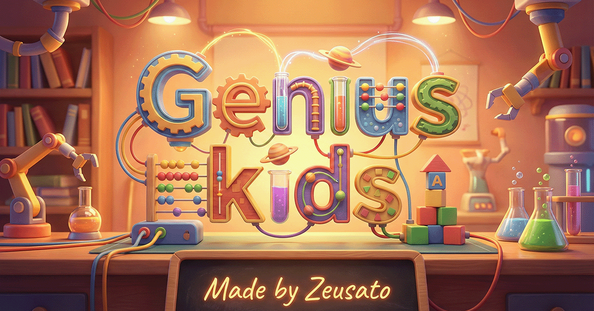

# Genius Kids (MathGenius Kids)



Ứng dụng học tập dạng web (PWA) cho trẻ từ mầm non đến lớp 5: ôn luyện Toán theo chương trình GDPT 2018, tiếng Anh, khoa học tương tác 3D, thư viện sách và nhiều trò chơi tư duy. Chạy offline sau khi tải gói nội dung; mỗi bé có hồ sơ, sao và bộ sưu tập riêng lưu trên máy.

Bản chạy thật: <https://zeusato.github.io/Genius-kids/>

## Nội dung chính

Sảnh khám phá chia theo độ tuổi (mầm non / lớp 1–5). Các khu:

| Khu | Nội dung |
| --- | --- |
| **Ôn Luyện** (`/study`) | Câu hỏi sinh theo thuật toán, bám GDPT 2018 cho lớp 1–5; hai chế độ Luyện tập / Kiểm tra; lớp nhỏ có đọc to đề bài |
| **Tiếng Anh** (`/english`) | Lộ trình K → A1–C3: sách tương tác, từ vựng, ngữ pháp, hội thoại, luyện tập có AI |
| **Mầm non** (`/preschool/*`) | Vườn chữ cái A–Z và tập tô, đếm số, màu sắc & hình dạng |
| **Khoa học** (`/science`) | Xem bảng dưới |
| **Thư viện** (`/library`) | Sách lật trang, 1000 câu hỏi Vì Sao |
| **Đố vui Nhân Sư**, **Piano Nhí** | Câu đố logic – ngôn ngữ; đàn và bài hát trong vườn |
| **Trò chơi** (`/game`) | Xem bảng dưới |

Phần **Học bài** của Ôn Luyện có 188 bài từ mầm non đến lớp 5: kiến thức, ví dụ từng bước, chỗ dễ nhầm, 3 câu “Em thử”, sổ tay công thức có tìm kiếm và in. Mã nguồn đã bật đủ sáu lớp cho production; bản build cục bộ đã kiểm tra học và lưu tiến độ offline. Xem [bàn giao và trạng thái phát hành](docs/study-learn/README.md), [kế hoạch và dàn bài](docs/study-learn-plan.md).

### Khoa học

| Mô-đun | Điểm nhấn |
| --- | --- |
| **Hệ Mặt Trời** | Mô hình 3D theo tỉ lệ số liệu NASA, texture CC BY 4.0, vị trí thật theo ngày, cắt lớp hành tinh |
| **Xưởng Hành Tinh** | Tự nặn hành tinh và đưa vào hệ Mặt Trời |
| **Bảng Tuần Hoàn** | 118 nguyên tố tên theo SGK, kính lọc, mẫu vật 3D, lặn vào nguyên tử, thí nghiệm, trò chơi |
| **Điện & Mạch Điện** (Xưởng Ánh Sáng) | Bàn đồ chơi 3D nối dây thật, bộ giải mạch DC (Ohm/Kirchhoff), sơ đồ biến hình, so sánh nối tiếp/song song, soi dây tới mạng tinh thể, phòng thử vật dẫn, 13 bài · 12 nhiệm vụ · 12 vụ thám tử |
| **Khám Phá Tế Bào** | Tế bào 3D có cửa sổ cắt, bào quan, thí nghiệm phân chia |
| **Cây Tiến Hóa** | Cây sự sống theo thời gian, cỗ máy thời gian, infographic |

### Trò chơi

Lật Thẻ, Giai Điệu Vui Nhộn, Đua Tốc Độ, Đại Chiến Rồng Thần, Đường Đua Thần Tốc, Sudoku, Kỹ Sư Máy Móc (bánh răng), Lập Trình Nhí (Rover), Làng Mầm (nông trại), và bàn cờ: Cờ Vua, Cờ Tướng, Cờ Ca-rô, Cờ Cá Ngựa, Ô Ăn Quan, Cờ Tỉ Phú.

### Thưởng và hồ sơ

Hoàn thành bài/nhiệm vụ nhận **sao** (ghi sổ theo hồ sơ, không cộng lặp), dùng sao đổi avatar, giao diện, mở thẻ sưu tập (gacha) và thành tích. Trợ lý **Bo Biết Tuốt** (Gemini) trả lời câu hỏi học tập — cần nhập API key trong phần cài đặt AI của ứng dụng.

## Công nghệ

- React 19 + TypeScript, Vite, React Router, Tailwind CSS
- Three.js + React Three Fiber / drei / postprocessing cho các cảnh 3D (tải lười theo từng mô-đun)
- PWA (vite-plugin-pwa, injectManifest) với gói tải offline chủ động
- Vitest cho engine thuần (bộ giải mạch, luật cờ, sinh câu hỏi, nội dung…)
- Gemini API qua `services/geminiClient.ts` (tự chọn model flash mới nhất); Supabase cho ảnh infographic

## Cấu trúc thư mục

```text
App.tsx, index.tsx        khởi động, định tuyến
src/pages/                trang theo route (Science, Electricity, PeriodicTable, Study…)
src/components/           mô-đun lớn: solar, planetmaker, periodic, electricity, cell,
                          evolution, study, preschool, hub, achievements, shared
src/english/              toàn bộ khu tiếng Anh (nội dung, engine, sách)
src/data/                 dữ liệu tĩnh theo mô-đun
games/                    từng trò chơi một thư mục (engine thuần + giao diện)
modules/farm/             Làng Mầm
tellMeWhy/, riddle/       Vì Sao, Đố vui
services/                 hồ sơ, lưu trữ, AI, âm thanh, cập nhật
pwa/                      service worker và tải gói offline
scripts/                  sinh dữ liệu, texture, benchmark
docs/                     kế hoạch nâng cấp và báo cáo từng mô-đun
public/                   ảnh, âm thanh, font, texture
```

Mỗi mô-đun lớn tách **engine thuần** (không React/Three, có test) khỏi lớp hiển thị; kế hoạch và quyết định thiết kế nằm trong `docs/<mô-đun>-plan.md`.

## Chạy cục bộ

Yêu cầu Node.js 20+.

```bash
git clone https://github.com/zeusato/Genius-kids.git
cd Genius-kids
npm install
npm run dev
```

Mở <http://localhost:3000/Genius-kids/> (có dấu `/` cuối). Tạo một hồ sơ học sinh để vào các khu.

| Lệnh | Việc |
| --- | --- |
| `npm run dev` | Máy chủ phát triển (cổng 3000) |
| `npm test` | Chạy toàn bộ test Vitest |
| `npm run build` | Build production vào `dist/` (kèm kiểm nội dung tiếng Anh) |
| `npm run preview` | Xem bản build |

Tham số hữu ích khi kiểm tra cảnh 3D: `?tier=low|high`, `?fx=0`, `?debug=perf`, `?intro=0` (tùy mô-đun, xem file `params.ts` trong mô-đun đó).

## Triển khai

Push lên nhánh `main` → GitHub Actions (`.github/workflows/deploy.yml`) build và đưa lên GitHub Pages.

## Giấy phép

MIT, phục vụ giáo dục phi lợi nhuận. Dữ liệu khoa học tổng hợp từ NASA, IUPAC, SGK/Chương trình GDPT 2018 và các nguồn giáo dục chính thống; nguồn chi tiết ghi trong từng mô-đun.
