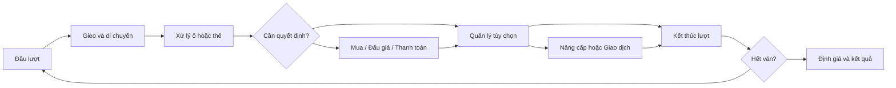

# Cờ Tỉ Phú 3D — nghiên cứu và kế hoạch xây dựng

Ngày nghiên cứu: 15/09/2026. Trạng thái: bản nghiên cứu ban đầu, lưu để tham khảo. Luật và kết quả triển khai hiện hành nằm trong [báo cáo triển khai](co-ti-phu-implementation-report.md); các mục đấu giá, giao dịch và giới hạn vòng bên dưới đã được thay thế theo yêu cầu của Đại ca.

## 1. Kết luận thiết kế

Em đề xuất **Phố Nhỏ Tỉ Phú**: khu phố Việt Nam bằng đồ chơi 3D, 2–4 người cùng một thiết bị, có máy thay các ghế còn lại. Người chơi mua cửa hàng, thu tiền thuê, nâng cấp và thương lượng; phố thay đổi hình dáng theo những quyết định ấy.

- **Bàn chính 32 ô**. Hai mươi ô phù hợp nhập môn, nhưng ít chỗ cho nhiều nhóm cửa hàng và ô đặc biệt. Bản đầu tập trung một bàn; độ dài ván điều chỉnh bằng số vòng lượt và bộ luật.
- **Thông tin của mọi người đều công khai**: tiền, tài sản, nâng cấp, thẻ giữ lại, đề nghị giao dịch. Bộ sự kiện và kết quả xúc xắc chưa xuất hiện thì không ai biết trước.
- Cận cảnh phục vụ hành động: mua cửa hàng, nâng cấp, rút sự kiện. Giao dịch tiền tự tính, có giải thích ngắn.
- Luật gia đình kết thúc sau số vòng lượt định trước hoặc khi một người không thể trả khoản bắt buộc sau thanh lý. Trong trường hợp đó cả bàn kết thúc, không để người bị loại ngồi chờ một ván dài.
- Các con số kinh tế, thời lượng và ngân sách đồ họa bên dưới là **giá trị khởi điểm cần thử nghiệm**, không phải kết quả đã đo hoặc luật Monopoly chính thức.

## 2. Nghiên cứu các phiên bản đáng học hỏi

Phương pháp: đọc trang nhà phát hành, hướng dẫn chính thức và mô tả sản phẩm. Em chọn theo mức phù hợp với dự án: chơi chung màn hình, trẻ dễ hiểu, quyết định có ý nghĩa, phản hồi 3D, nhịp ván. Đây là đánh giá thiết kế có nguồn, chưa phải đánh giá sau khi trực tiếp chơi thử tất cả sản phẩm, cũng không phải bảng xếp hạng doanh thu hay điểm người dùng.

| Tham chiếu | Điều nguồn xác nhận | Điều em đề xuất học cho dự án |
| --- | --- | --- |
| [MONOPOLY — Marmalade](https://www.marmaladegamestudio.com/games/monopoly) | Có Pass & Play trên một thiết bị, chơi máy, Quick Mode và House Rules | Luồng lập bàn nhanh; người thật và máy cùng ván; luật nhanh tách rõ; xem toàn bộ tài sản |
| [MONOPOLY — Ubisoft, bản 2024](https://news.ubisoft.com/en-us/article/6KBIQNPgqtAQWeyvX7UTPI/monopoly-accessibility-spotlight) | Thành phố 3D, thao tác vật lý có cách thay thế/bỏ qua; hướng dẫn đúng lúc; cỡ chữ và tương phản; tự lưu, ba mức máy | Bàn sống động, nhưng xúc xắc chỉ cần một chạm; chuyển tiền tự tính; hiệu ứng có thể rút gọn; màu đi cùng biểu tượng |
| [Monopoly Junior 2-in-1 — Hasbro](https://consumercare.hasbro.com/de-ch/product/monopoly-junior-board-game-2-sided-gameboard-2-games-in-1-monopoly-game-for-ages-4-plus/17175F4C-737F-481B-97D4-44A68472DA91) | Hai mức luật cho nhóm tuổi khác nhau, địa điểm quen thuộc, mục tiêu đếm/mua/thu tiền | Cửa hàng trẻ nhận ra ngay; nhập môn ít quyết định hơn; từng bước mở thêm chiều sâu |
| [Fortune Street / Boom Street — Nintendo](https://www.nintendo.com/en-gb/Games/Wii/Boom-Street-280693.html) | Mua, đầu tư, giao dịch cửa hàng; có Easy và Standard; Standard thêm cổ phiếu; tối đa bốn người chơi tại nhà | Giá trị đến từ danh mục và nâng cấp; màn tổng tài sản rõ ràng; nội dung nâng cao nên thành bộ luật riêng. Đây là tham chiếu thiết kế đời trước; dịch vụ online Wii đã ngừng |
| [Richman 11 — trang Steam của nhà phát hành](https://store.steampowered.com/app/2074800/Richman_11/?l=english) | Nhân vật/bản đồ, đầu tư tài sản, dùng thẻ, cổ phiếu, tùy chỉnh ván, local multiplayer | Nhân vật có cá tính và sự kiện làm bàn sinh động. Thẻ chiến thuật và cổ phiếu chỉ cân nhắc ở giai đoạn sau; không mặc nhiên gọi đây là bản được đánh giá tốt nhất |
| [MONOPOLY GO! — Scopely](https://www.scopely.com/en/news/its-time-to-take-that-chance-monopoly-go-is-here) | Xây công trình, Shutdown/Bank Heist, sự kiện, bộ sưu tập và tương tác xã hội | Tham khảo cách công trình thay đổi và phản hồi nhận tiền; cần thiết kế vòng chơi chung màn hình riêng, không suy ra từ trải nghiệm mobile của GO! |
| [Monopoly Classic — hướng dẫn Hasbro](https://www.hasbro.com/common/instruct/Monopoly_Vintage.pdf) | Mua, thuê, đấu giá, xây, thế chấp; có luật rút gọn và giới hạn thời gian | Đấu giá và giao dịch là nguồn quyết định đáng giữ. Bộ luật gia đình của dự án phải được ghi riêng, tránh trộn lẫn với luật gốc |

**Cập nhật thị trường:** [Hasbro Games Junior Collection](https://en.bandainamcoent.eu/hasbro/news/hasbro-gamestm-junior-collection-brings-classic-family-favourites-life-new-digital) được công bố cho ngày 06/11/2026, có local multiplayer tối đa bốn người. Tại ngày nghiên cứu 15/09/2026 sản phẩm này chưa phát hành; chỉ dùng thông tin công bố để tham khảo hướng thiết kế, không coi là chất lượng đã được kiểm chứng.

## 3. Thẻ bí mật và chơi chung màn hình

### Phân biệt các loại thông tin

| Loại thông tin | Bản đề xuất hiển thị thế nào |
| --- | --- |
| Tiền, tài sản, giá thuê, công trình | Công khai; chạm avatar hoặc công trình để xem |
| Sự kiện vừa rút | Lật ở giữa bàn; cả bàn cùng đọc; giữ đến khi người chơi bấm tiếp tục |
| Phiếu giữ lại | Công khai cạnh avatar, có loại, số lượng và tác dụng |
| Đề nghị mua bán/đổi tài sản | Công khai cả hai vế và tiền còn lại sau giao dịch |
| Lá tiếp theo, thứ tự bộ bài, xúc xắc chưa gieo | Không hiển thị cho bất kỳ người chơi hoặc máy nào |
| Quyết định người khác chưa chọn | Chưa biết vì họ chưa quyết định; không cần màn hình riêng |

[Luật Monopoly dạng bàn](https://www.hasbro.com/common/instruct/Monopoly_Vintage.pdf) dùng bộ Chance/Community Chest úp, rút và làm theo hướng dẫn; thẻ Get Out of Jail Free được giữ đến khi dùng hoặc giao dịch. Việc công khai phiếu giữ lại là lựa chọn UX của bản mình, không phải khẳng định mọi biến thể Monopoly đều buộc công khai mọi thông tin.

[Monopoly Deal của Shuffle/Cartamundi](https://www.shuffle.cards/resources/manuals/en_gb/MonopolyDeal_GameGuide_EN.pdf) yêu cầu giữ bí mật bài trên tay. Cơ chế đó không phù hợp mục tiêu nhìn chung một màn hình nếu giữ nguyên luật. V1 của dự án không dùng bài trên tay bí mật, mục tiêu bí mật hoặc đấu giá kín.

**Hệ quả:** không cần che màn hình, lật úp máy hay tài khoản riêng cho từng khách. Có thể bật nhắc “Đến lượt Bông”; mặc định không bắt chuyền máy/xác nhận sau mỗi thao tác. Mọi ghế trên cùng thiết bị hoạt động theo sự tin cậy tại bàn; không hứa ngăn người ngồi cạnh chạm hộ.

## 4. Quy mô bàn: vì sao 32 ô?

| Quy mô | Phù hợp | Đánh đổi |
| --- | --- | --- |
| 20 ô | Demo và nhập môn ngắn | Sau khi dành ô sự kiện/tiện ích, ít tài sản để chia nhóm; bốn người tranh cùng số ít điểm |
| 24 ô | Chế độ trẻ nhỏ có thể làm sau | Dễ nhìn, ít mô hình; cần một cấu hình kinh tế riêng |
| **32 ô** | **Bàn chính cho 2–4 người** | Có đủ nhóm cửa hàng, tiện ích và sự kiện; cần phóng to ô khi tương tác trên điện thoại |
| 40 ô | Bàn lớn, luật và tài sản phong phú hơn | Tăng nội dung, thời gian đọc và khối lượng cân bằng; để sau khi bàn chính đã vui |

Với hai xúc xắc, tổng trung bình là 7: chỉ xét chuyển động cơ bản, 20/7 ≈ 2,9 lượt để đi một vòng bàn, 32/7 ≈ 4,6 lượt. Đây là ước lượng quãng đường, chưa tính thẻ dịch chuyển hoặc các ô đặc biệt; không thể suy ra độ dài ván chỉ từ số ô.

Bàn 32 ô bố trí trên chu vi lưới 9 × 9: **4 × (9 − 1) = 32 vị trí duy nhất**. Mỗi cạnh có bảy ô ở giữa và hai góc dùng chung; không đếm góc hai lần.

### Danh mục 32 ô khởi điểm

| ID | Ô | Loại |
| --- | --- | --- |
| 0 | Quảng trường xuất phát | Góc, nhận tiền khi đi qua/đến theo luật |
| 1 | Tiệm bánh | Ẩm thực A |
| 2 | Chuyện khu phố | Sự kiện cộng đồng |
| 3 | Quán nước | Ẩm thực A |
| 4 | Tiệm kem | Ẩm thực A |
| 5 | Bến xe điện Đông | Giao thông |
| 6 | Nhà sách | Sáng tạo B |
| 7 | Chăm sóc phố | Phí cố định |
| 8 | Công viên nghỉ chân | Góc, không mất lượt |
| 9 | Xưởng vẽ | Sáng tạo B |
| 10 | Tiệm đồ chơi | Sáng tạo B |
| 11 | Trạm điện mặt trời | Tiện ích |
| 12 | Vườn hoa | Thiên nhiên C |
| 13 | Cơ hội | Sự kiện cơ hội |
| 14 | Tiệm cây | Thiên nhiên C |
| 15 | Nông trại nhỏ | Thiên nhiên C |
| 16 | Quảng trường lễ hội | Góc, thưởng cố định khi dừng |
| 17 | Tiệm xe đạp | Vận động D |
| 18 | Chuyện khu phố | Sự kiện cộng đồng |
| 19 | Sân bóng | Vận động D |
| 20 | Hồ bơi | Vận động D |
| 21 | Bến xe điện Tây | Giao thông |
| 22 | Tiệm thú cưng | Chăm sóc E |
| 23 | Bảo dưỡng phố | Phí cố định |
| 24 | Sửa xe | Góc, trả phí rồi về ô 8; lượt sau đi bình thường |
| 25 | Phòng khám thú cưng | Chăm sóc E |
| 26 | Tiệm làm đẹp thú cưng | Chăm sóc E |
| 27 | Trạm nước sạch | Tiện ích |
| 28 | Rạp phim | Giải trí F |
| 29 | Cơ hội | Sự kiện cơ hội |
| 30 | Sân khấu | Giải trí F |
| 31 | Khu vui chơi | Giải trí F |

Tổng: 18 cửa hàng trong sáu nhóm × ba, hai giao thông, hai tiện ích, bốn sự kiện, hai phí, bốn góc = 32. Màu nhóm kinh doanh và màu chủ sở hữu có vị trí riêng; không đổi màu toàn mô hình khiến người chơi mất dấu nhóm.

## 5. Bộ luật gia đình đề xuất

### 5.1 Chuẩn bị và kết thúc

- 2–4 ghế; tối thiểu một người thật. Chủ hồ sơ là một ghế; bạn nhập tên/chọn avatar, máy chọn Dễ/Vừa/Khó.
- Đầu ván tất cả xuất phát tại ô 0, có 600 đồng chơi, chưa sở hữu tài sản. Chọn ngẫu nhiên ghế bắt đầu; giữ thứ tự ghế trong ván.
- Hai xúc xắc 1–6 độc lập. Hai mặt giống nhau vẫn là một lượt, không thêm lượt trong bộ luật này.
- “Vòng lượt” nghĩa là mỗi ghế đã đi một lần; khác với một nhân vật chạy vòng quanh bàn.
- **Gia đình:** 12 vòng lượt. **Chơi nhanh:** tám vòng lượt, tắt đấu giá và thương lượng; dùng cùng bàn. Thay bộ luật trước khi bắt đầu, không đổi giữa ván.
- Mục tiêu thời lượng Gia đình: 2 người khoảng 15–25 phút, 3 người 20–30 phút, 4 người 25–40 phút. Đây là mục tiêu cần đo với người thật, không phải thời gian bảo đảm; người chơi không bị đồng hồ thúc.
- Hết vòng cuối, mọi ghế được đủ số lượt rồi tính tài sản. Nếu xảy ra mất khả năng chi trả bắt buộc sau thanh lý, kết thúc cả bàn ngay theo ngoại lệ đã giới thiệu đầu ván.
- Tổng tài sản = tiền mặt + giá mua niêm yết của tài sản đang sở hữu + chi phí niêm yết các cấp nâng cấp đang tồn tại. Không tính lại tiền đã chi hoặc cộng tiền thuê giả định. Bằng tổng tài sản thì cùng thắng.

### 5.2 Một lượt

1. Nhấn xúc xắc trên bàn; thấy từng mặt và tổng.
2. Nhân vật tự đi, từng ô sáng đúng nhịp; xử lý tiền xuất phát nếu có.
3. Đến ô, mở lựa chọn ngay cạnh ô: mua, để lại, trả phí, sự kiện hoặc xem tài sản.
4. Xử lý xong việc bắt buộc, người chơi được **một hành động quản lý tùy chọn**: nâng cấp một tài sản hoặc gửi một đề nghị giao dịch.
5. Nhấn kết thúc lượt. Nếu không có hành động tùy chọn hợp lệ, hệ thống chuyển lượt sau phản hồi ngắn.

Thanh lý để trả nghĩa vụ bắt buộc không tiêu tốn hành động quản lý. Máy dùng cùng các action hợp lệ như người thật.

### 5.3 Mua, thuê, nâng cấp

- Đến cửa hàng chưa có chủ: mua theo giá niêm yết hoặc không mua. Giá và tiền còn lại luôn hiện trước khi chọn.
- Cửa hàng có chủ khác: tự chuyển đúng tiền thuê, nối hiệu ứng từ người trả đến người nhận; ghi rõ nguyên nhân.
- Đến tài sản của mình: không trả thuê. Có thể nâng cấp nó ở bước quản lý nếu hợp lệ.
- Mua tài sản nhận cấp 0, hình thức quầy nhỏ. Cấp 1 thành cửa hàng hoàn chỉnh, không cần đủ nhóm. Cấp 2 cần sở hữu đủ ba cửa hàng trong nhóm.
- Đủ nhóm cộng 10 vào tiền thuê mỗi cửa hàng của nhóm. Bonus này xuất hiện như một dòng riêng trong phép tính.
- Mỗi lượt tăng tối đa một cấp tại một cửa hàng. Không nâng hai cấp trong cùng một hành động.
- Nếu bán/đổi một cửa hàng làm mất bộ, phải hạ mọi cửa hàng cấp 2 trong nhóm xuống cấp 1 trước giao dịch; hiển thị toàn bộ hoàn tiền và chi phí trước khi chấp nhận. V1 chỉ cho giao dịch cửa hàng cấp 0 để giữ luồng đơn giản.
- Giao thông và tiện ích mua được, không có cấp xây dựng. Sở hữu cặp tăng giá thuê theo bảng, không nhân ngầm với xúc xắc.

### 5.4 Đấu giá và thương lượng

**Gia đình — đấu giá công khai:** Khi người đến ô không mua, mở đấu giá gồm tất cả ghế còn đủ tiền, bắt đầu từ ghế kế tiếp. Giá mở là 50% giá niêm yết làm tròn lên bội 10, tăng tối thiểu 10. Bấm bỏ là rời phiên; người đang giữ giá cao nhất không tự nâng giá của mình. Chỉ được đấu bằng tiền mặt, không đi vay hoặc thanh lý giữa phiên. Không ai đấu thì tài sản còn thuộc ngân hàng. Một người giữ giá, tất cả người khác bỏ thì chốt; không có đồng hồ cho người thật.

**Gia đình — thương lượng công khai:** Sau xử lý ô, chủ lượt có thể dùng hành động quản lý gửi một đề nghị: tối đa một tài sản cấp 0 mỗi bên và một khoản tiền bù từ một bên. Chỉ giao dịch với một ghế, không tặng miễn phí, không lời hứa trả sau, không chuỗi phản giá. Người nhận chọn đồng ý/từ chối; từ chối vẫn dùng hết hành động quản lý. Giao dịch áp dụng nguyên tử: đổi tài sản và chuyển tiền cùng một lần, hoặc không đổi gì. Luồng hiển thị hai tên lớn, cả hai vế và tổng tài sản/tiền còn lại; xác nhận cuối cần thiết vì là giao dịch với người khác.

Đây là phạm vi hoàn chỉnh của bản Gia đình. Nếu bản thử cho thấy hai cơ chế này làm trẻ chờ quá lâu, có thể tắt bằng preset Chơi nhanh; không thay đổi âm thầm luật Gia đình.

### 5.5 Thiếu tiền

- Mua/nâng cấp tự nguyện bị vô hiệu nếu không đủ tiền; giải thích số còn thiếu.
- Với tiền thuê/phí bắt buộc: mở “Cần thêm 40 đồng” kèm tài sản có thể thanh lý.
- Bán cấp nâng cấp hoàn 50% chi phí niêm yết; giảm từ cấp cao nhất. Bán tài sản về ngân hàng hoàn 50% giá niêm yết sau khi đã bán nâng cấp, đồng thời xóa chủ.
- Tiền thanh lý và nghĩa vụ chỉ được ghi một lần. Không đổi chủ qua giao dịch trong lúc giải quyết nợ bắt buộc.
- Nếu thanh lý tất cả vẫn thiếu: trả phần có thể trả, ghi khoản chưa thanh toán trong kết quả, kết thúc cả bàn. Không để cash âm hoặc tiếp tục ván với một khoản nợ không có quy tắc xử lý.
- V1 chưa có thế chấp/lãi vay/cổ phiếu; các cơ chế đó cần bộ luật nâng cao và bảng định giá riêng.

### 5.6 Góc bàn và dịch chuyển

- Đi tiến qua hoặc dừng ở ô 0 nhận 100, một lần cho mỗi lần vượt mốc; dừng đúng ô không nhận hai lần.
- Ô 8 nghỉ chân: không thu phí, không mất lượt, không cộng tiền phạt tích lũy.
- Ô 16 lễ hội: dừng ở đây nhận 30 từ ngân hàng; đi ngang không nhận.
- Ô 24 sửa xe: trả 30, sau đó chuyển thẳng đến ô 8, không nhận tiền đi qua xuất phát. Không phát sinh hiệu ứng ô đến lần nữa, lượt sau đi bình thường.
- Thẻ đi tiến đến địa chỉ: xử lý qua xuất phát, sau đó xử lý ô đến. Thẻ lùi ba ô không nhận tiền xuất phát, nhưng vẫn xử lý ô đến.
- Sau khi rút thẻ gây dịch chuyển, nếu ô đến lại là ô sự kiện thì dừng ở đó, không rút tiếp trong cùng chuỗi. Không có chuỗi sự kiện vô hạn.

## 6. Kinh tế và thẻ — dữ liệu khởi điểm

Đơn vị hiển thị là **đồng chơi**, số nguyên. Mọi giao dịch dùng engine; hình ảnh tiền không quyết định số dư.

| Nhóm | Giá mua mỗi ô | Thuê cấp 0 / 1 / 2 | Giá mỗi lần nâng |
| --- | ---: | --- | ---: |
| A — Ẩm thực | 100 | 10 / 30 / 70 | 50 |
| B — Sáng tạo | 120 | 10 / 40 / 90 | 60 |
| C — Thiên nhiên | 140 | 20 / 50 / 110 | 70 |
| D — Vận động | 160 | 20 / 60 / 130 | 80 |
| E — Chăm sóc | 180 | 30 / 70 / 150 | 90 |
| F — Giải trí | 200 | 30 / 80 / 170 | 100 |

- Bonus đủ nhóm: +10/ô, áp dụng ngoài bảng trên.
- Bến xe: giá 150; thuê 20 nếu có một, 50 nếu cùng chủ cả hai.
- Tiện ích: giá 120; thuê 10 nếu có một, 30 nếu cùng chủ cả hai.
- Phí ô 7/23: 20/30. Các khoản cộng/trừ và bonus đều có nguồn/đích rõ ràng trong sổ giao dịch.
- Ngân hàng có thể phát/thu tiền theo luật; không giả định tổng tiền mặt toàn ván luôn cố định. Tổng tiền người chơi chỉ thay đổi theo giao dịch với ngân hàng; chuyển giữa người chơi phải bảo toàn.

### Bộ sự kiện ban đầu: 24 lá, hai bộ × 12

Mỗi bộ gồm sáu hiệu ứng, mỗi hiệu ứng hai lá. Nội dung là của dự án, hình minh họa riêng. Lá dùng xong về chồng bỏ; khi bộ rút hết, xáo chồng bỏ với RNG đã lưu.

| Bộ | Sáu hiệu ứng, mỗi loại hai bản |
| --- | --- |
| Chuyện khu phố | Hội chợ +30; hàng xóm đặt hàng +40; chăm vườn −20; sửa biển hiệu −20; lễ hội cùng vui: ngân hàng trả mọi người +20; phiếu giảm phí tối đa 30 cho lần thanh toán bắt buộc kế tiếp |
| Cơ hội | Đến ô 0 và nhận đúng một lần 100; tiến đến cửa hàng chưa có chủ gần nhất; lùi ba ô; quà bất ngờ +30; sửa xe −30; phiếu hỗ trợ nâng cấp tối đa 20 |

Quy tắc phụ phải có trong engine:

- “Gần nhất” tính theo hướng tiến, bỏ qua ô mình đang đứng. Nếu không còn cửa hàng chưa có chủ, đổi thành ngân hàng trả +20.
- Phiếu đều công khai, tự áp dụng ở lần đủ điều kiện kế tiếp; mỗi người giữ tối đa một phiếu mỗi loại. Rút trùng đổi thành +10.
- Phiếu phí: ngân hàng bù phần được giảm cho bên nhận, người trả chỉ trả phần còn lại; dùng một lần, tối đa 30, không sinh số âm.
- Phiếu nâng cấp: ngân hàng hỗ trợ phần giảm, không trả tiền dư; chỉ dùng nếu người chơi chọn một nâng cấp hợp lệ. Giá trị chấm điểm công trình vẫn theo bảng niêm yết, không theo khoản đã giảm.
- Lá đang được giữ không có trong bộ rút/bộ bỏ. Dùng xong mới về chồng bỏ; rút bản trùng đã đổi +10 cũng đưa lá đó vào chồng bỏ.
- Bot chỉ biết danh sách hiệu ứng, lá đã công khai và phiếu đang giữ; không đọc vị trí lá trong bộ rút.

### Cân bằng bằng mô phỏng và chơi thử

- Chạy ít nhất 10.000 ván có seed cho mỗi cấu hình 2/3/4 người và hai preset; xoay mọi vị trí ghế, cả bot cùng cấp lẫn khác cấp.
- So tỷ lệ thắng theo ghế, mức tiền theo vòng, tỷ lệ bộ hoàn chỉnh, lượt phải thanh lý, số đấu giá/giao dịch thành công, nguyên nhân kết thúc.
- Mục tiêu thử ban đầu: bot cùng cấp chênh ghế không quá khoảng năm điểm phần trăm; phá sản trước vòng bốn dưới 5%; giữa ván có nâng cấp đáng kể. Các ngưỡng là tiêu chí điều chỉnh, không phải đã đạt.
- Ước lượng thời lượng từ mô phỏng chỉ đo số quyết định/lượt; cần người thật để đo thời gian đọc, suy nghĩ và cảm giác chờ.
- Thử trực tiếp nhóm trẻ mục tiêu và nhóm gia đình 2–4 người. Nếu giao dịch khó hiểu, ưu tiên cải thiện mô tả và preset trước khi thêm tính năng.

## 7. Trải nghiệm trên bàn và hình ảnh 3D

### Ngôn ngữ hình ảnh

Khu phố Việt Nam thu nhỏ: mái ngói, cây bàng, xe điện, vườn hoa, quầy kem, tiệm sách. Bàn là sa bàn đồ chơi, đường đi ở viền, công trình phía trong từng ô; giữa bàn có quảng trường, cây và chi tiết nền thấp. Tên, nhân vật, biểu tượng và bố cục mỹ thuật do dự án thiết kế riêng.

- Tài sản chưa mua là quầy đóng cửa; khi mua mở biển và cắm cờ chủ. Nâng cấp thêm tầng/mái/hiên/đèn, dễ phân biệt từ góc cao.
- Sáu nhóm công trình có màu nền kèm biểu tượng riêng. Chủ sở hữu có cờ/avatar và viền riêng; không dùng màu làm tín hiệu duy nhất.
- Bốn nhân vật trung tính về sức mạnh, khác dáng và hoạt ảnh. Chọn ngoại hình không đổi kinh tế hoặc xác suất xúc xắc.
- Người đi bộ và xe cảnh chỉ hoạt động ở vùng nền, mật độ thấp; không đi đè lên đường đếm ô hoặc che nút.

### Nhịp thao tác

| Hành động | Thể hiện |
| --- | --- |
| Gieo xúc xắc | Xúc xắc ở quảng trường, chạm một lần; kết quả hiện rõ khoảng một giây |
| Di chuyển | 0,18–0,25 giây/ô ở nhịp thường; đánh sáng ô tiếp theo, dừng rõ tại đích |
| Mua tài sản | Tờ đề nghị cạnh ô: tên, nhóm, giá, thuê, tiền còn lại; nút Mua/Không mua |
| Nâng cấp | Xem trước cấp mới và giá thuê; bấm xây, công trình mọc lên khoảng 1–1,5 giây |
| Trả/nhận tiền | Hiện “Bông → Minh Anh: 40”, hai số dư chuyển cùng nhịp; không tung quá nhiều đồng xu |
| Rút sự kiện | Thẻ ở trung tâm bàn, hình + một câu + số tiền/đích đến; chờ bấm tiếp tục |
| Đấu giá/giao dịch | Màn điều khiển chung gắn với tài sản, từng người được gọi tên rõ ràng |

Camera intro khoảng 9–12 giây: toàn phố → nhân vật → cụm cửa hàng → góc chơi. Kế thừa bài học từ hai game hiện tại: cận cảnh có thời gian ngắm, không lặp cảnh thừa. Trong ván chỉ dịch camera khi cần đọc hành động; nút về góc chuẩn luôn sẵn, có chế độ Giảm chuyển động và xem nhanh hoạt ảnh.

Trên tablet/desktop, lựa chọn neo vào ô và tự né mép. Trên điện thoại dọc, camera đưa ô đến vùng trung tâm, bảng lựa chọn xuất hiện sát vùng đó, tối đa khoảng một phần ba màn hình. Tất cả vùng chạm chính ít nhất 48 CSS px; không yêu cầu chạm chính xác một mô hình nhỏ trong toàn cảnh.

Thanh HUD chỉ giữ lượt, vòng còn lại, tiền/tổng tài sản, tạm dừng và góc nhìn. Người chơi có thể chạm công trình bất kỳ để xem thông tin công khai; chỉ chủ lượt được thực hiện action thay đổi state. Khi đang quay intro/di chuyển, không nhận thêm lệnh gieo hoặc mua.

## 8. Tạo asset với Flow và mô hình 3D

Flow dùng cho concept, bảng màu, ảnh bìa, minh họa sự kiện và texture. Hình từ Flow không tự trở thành mesh 3D tương tác; mô hình cần dựng bằng mesh hiện có hoặc glTF có quy mô/polycount phù hợp.

| Gói asset | Phạm vi bản đầu |
| --- | --- |
| Phong cách | Một key art toàn phố, một bộ tham chiếu ban ngày, bảng vật liệu |
| Công trình | Sáu bộ mô-đun nhóm × ba cấp; 18 cửa hàng có biển/đạo cụ riêng; thêm bến xe, tiện ích và bốn góc |
| Nhân vật | Bốn mẫu/biến thể, dùng chung skeleton hoặc hoạt ảnh đơn giản |
| Sự kiện | 12 minh họa gốc cho 24 lá, khung thẻ và biểu tượng tiền/di chuyển |
| Giao diện | Bìa hub, thumbnail, biểu tượng nhóm, token 2D dự phòng |
| Âm thanh | Xúc xắc, bước đi, mở cửa, xây, nhận tiền, thẻ, kết quả; điều khiển âm lượng riêng |

Làm một cửa hàng đủ ba cấp và một nhân vật trước để kiểm tra cận cảnh. Sau khi đạt phong cách/hiệu năng mới nhân rộng; tránh dựng xong 18 cửa hàng rồi phải làm lại cả bộ.

Ngân sách thử ban đầu: khoảng 150–200 draw calls, 200–300 nghìn tam giác trên cảnh thường; mục tiêu 60 fps máy tính và ít nhất 30 fps trên thiết bị di động đại diện. Đây là giới hạn dự kiến cần đo. Dùng instancing cho cây/đèn/đạo cụ, texture atlas, tái sử dụng vật liệu, giới hạn bóng động. Chế độ nhẹ bỏ dân cảnh, giảm DPR/bóng; mất WebGL chuyển sang bàn 2D giữ nguyên ván.

## 9. Kiến trúc triển khai trong dự án hiện tại

Đã đọc các mô-đun HorseRace/OAnQuan và điểm tích hợp hiện có. Kế thừa cách tổ chức, không dùng engine cá ngựa để xử lý kinh tế.

```text
games/PropertyTown/
  model.ts             # Match, Player, Tile, Ownership, Liability, Action, Event
  board.ts             # 32 ID, nhóm, ánh xạ vòng sang tọa độ 3D/2D
  rules.ts             # family-v1 / quick-v1, số vòng, các giới hạn
  economy.ts           # giá, thuê, định giá, bán lại
  cards.ts             # hai bộ thẻ và effect dữ liệu
  engine.ts            # validate, legalActions, reduce(state, action)
  rng.ts               # xúc xắc/bộ bài tái lập được
  bot.ts / bot.worker.ts
  persistence.ts       # schema, draft, phiên bản luật, kết quả
  animation.ts         # event -> timeline hình ảnh
  Board3D.tsx / Board2D.tsx / BoardCamera.tsx
  PropertyTownGame.tsx / preview.tsx
public/co-ti-phu/
co-ti-phu-preview.html
scripts/benchmark-property-town.ts
```

### State và luồng hành động

Match cần: matchId, rulesVersion, boardVersion, owner, players, activeSeat, firstSeat, round, roundLimit, phase, tokenPositions, cash, ownership/levels, heldVouchers, shuffledDecks/discards, RNG state, pendingLiability, auction/trade, revision, elapsed, endReason, finalResult.



- Engine thuần dữ liệu sinh state và event; scene chỉ trình diễn. Kết quả xúc xắc sinh trước rồi hoạt ảnh theo kết quả, không để physics quyết định luật.
- Lệnh kèm matchId/revision/actor; từ chối lệnh trùng, cũ, không đúng ghế/phase, hoặc tài sản đã đổi chủ.
- Lưu sau mỗi action nguyên tử. Reload không lặp trả tiền/rút thẻ: lưu state đã commit và phase/pending decision; hoạt ảnh có thể bỏ qua khi khôi phục.
- Intro là trạng thái giao diện, chỉ chạy ván mới/chơi lại; tiếp tục bản lưu đi thẳng đến bàn. Bot đợi scene sẵn, intro hết, không dialog/pause rồi mới làm việc.
- Luồng AI nhận **BotObservation** đã lọc, không nhận thứ tự deck/RNG tương lai. Worker trả action + matchId/revision/requestId; timeout/lỗi dùng action hợp lệ an toàn, không để đứng chờ.
- Pause, ẩn tab, thoát ván hủy worker/timer; resume hoặc replay lên lịch lại đúng phase. Kiểm tra riêng khi bot đi trước và khi chơi lại trên cùng canvas.

### Máy Dễ/Vừa/Khó

- Dễ: ưu tiên mua nếu vẫn còn dự phòng, nâng đơn giản, có biến thiên lựa chọn nhưng luôn hợp lệ.
- Vừa: tính cash dự phòng cho lần trả phí/thuê gần tới, giá trị đủ bộ, số lượt còn lại, bid tối đa, đề nghị giao dịch hai chiều.
- Khó: mô phỏng nhiều tương lai từ thông tin công khai với các seed giả định độc lập; so giá trị thuê, tài sản cuối ván và rủi ro thiếu tiền. Không xem xúc xắc hoặc thẻ thực tế chưa công khai.
- Ngân sách suy nghĩ mục tiêu 200–800 ms trên worker; sau khoảng hai giây có fallback. Nhịp trình diễn của máy vẫn dễ theo dõi, không bắn liên tiếp action không nghỉ.
- Mô phỏng cân bằng cần kiểm tra bot không thể bị khai thác bằng giao dịch lặp, mua quá giá để biếu tiền, hoặc cố tình hết tiền khi đấu giá.

### Điểm tích hợp

- Thêm ID `co-ti-phu` ở `src/components/hub/catalog.ts`, ảnh `HubArt`, lazy entry ở `games/GameLauncher.tsx`.
- Thêm record/types và `completePropertyTown` ở `StudentContext`, lịch sử kết quả, xóa dữ liệu theo hồ sơ như các game hiện tại.
- Lưu kết quả theo matchId một lần; kết quả không cấp tiền thật hoặc đổi sang tiền của cửa hàng ứng dụng. Mặc định không cấp sao để tránh lặp bot lấy thưởng.
- PWA precache bundle cần thiết, ảnh UI/bàn 2D và asset nhẹ; loại preview/concept lớn khỏi precache. Kiểm tra offline sau lần tải đầu hoàn chỉnh.
- Tuổi mục tiêu đề xuất: tiểu học; lớp nhỏ vào preset hướng dẫn/Chơi nhanh. Chưa mặc định đưa bộ luật Gia đình vào danh mục mầm non trước khi thử độ dễ hiểu.

## 10. Các chặng triển khai và điều kiện hoàn tất

| Chặng | Công việc | Kết quả xem được / điều kiện chuyển chặng |
| --- | --- | --- |
| 1. Luật và kinh tế | Schema 32 ô, bảng giá, event, engine, invariants, bot nền | Chạy trọn ván bằng mô phỏng, không mắc phase, có báo cáo cân bằng bước đầu |
| 2. Bản chơi 2D hoàn chỉnh | Lobby, chọn ô, mua/thuê/nâng, auction/trade, phiếu, thanh lý, kết quả, save/resume | 2–4 người và máy chơi từ đầu đến cuối trên một màn hình; xử lý hết quyết định, chưa cần đồ họa hoàn thiện |
| 3. Mẫu 3D đại diện | Bàn, một nhóm ba cấp, một nhân vật, camera, Flow concept | Một lượt mua và nâng cấp đủ đẹp ở góc cao/cận, chạm tốt cả điện thoại; đo hiệu năng |
| 4. Toàn bộ khu phố | Sáu nhóm, 18 cửa hàng, góc/tiện ích, bốn nhân vật, thẻ và âm thanh | Tài sản và cấp đọc được trên toàn bàn; đầy đủ hai preset |
| 5. Hoàn thiện nhịp chơi | Bot ba mức, intro, skip/reduced motion, mobile, fallback, guide | Không có khoảng chờ vô nghĩa; người chơi hiểu mình đang trả gì và chọn gì |
| 6. Tích hợp và nghiệm thu | Hub, hồ sơ, offline, regression, trẻ/gia đình chơi thử | Đạt checklist, xác nhận độ dài ván; rồi mới xem xét bản đồ/bộ luật khác |

Chặng 1 → 2 là phụ thuộc cứng; mẫu mỹ thuật có thể chuẩn bị trong thời gian cân bằng. Chặng 3 phải được đánh giá trước khi sản xuất toàn bộ asset. Không chốt lịch theo ngày chỉ từ số ô; khối lượng mô hình và kết quả thử luật quyết định lịch thực tế.

### Checklist nghiệm thu

- Board: đúng 32 ô duy nhất, mọi nhóm đủ ba, đường 3D/2D và logic dùng chung ID.
- Money: không âm, không NaN, không trả thuê hai lần, giao dịch giữa hai người bảo toàn tiền; giao dịch ngân hàng có ledger.
- Ownership: mỗi tài sản tối đa một chủ, cấp hợp lệ, không giữ cấp 2 khi mất bộ; phiếu không bị nhân đôi.
- RNG: cùng state/seed/action tái lập được; resume không đổi kết quả; bot không có quyền đọc deck/RNG tương lai.
- Endgame: tám/12 vòng đủ lượt; insolvency kết thúc có lý do; tính tài sản và hòa đúng; replay đổi phiên, record không lặp.
- Interaction: hai lần chạm liên tiếp chỉ tạo một action; auction, trade, thẻ và debt đều có lối kết thúc; không mất quyết định khi xoay màn hình.
- Lifecycle: máy đi trước, pause khi đang nghĩ, đóng/mở tab, replay sau thắng/thua, bật 2D giữa intro, context loss và tải lại ở mỗi phase.
- Camera: intro dân cảnh/cửa hàng vừa đủ, camera về đúng preset; reduced motion không làm logic chạy sớm; nút skip không bỏ nghĩa vụ tiền.
- Accessibility/performance: đọc được tên/số trên 390px, vùng chạm 48px, không chỉ dùng màu/âm thanh, có 2D, không tăng số material/mesh sau nhiều ván.
- Validation: unit/property tests engine/economy/cards; UI kiểm tra flow thật; benchmark đủ seed; TypeScript, build, PWA/offline và hồi quy Cá ngựa/Ô ăn quan.

## 11. Các quyết định còn là đề xuất

Em khuyến nghị mặc định **32 ô, phố Việt Nam, 2–4 người, thông tin công khai, Gia đình 12 vòng và Chơi nhanh tám vòng**. Chưa ghi nhận Đại ca đã chốt các lựa chọn này.

Các thay đổi có ảnh hưởng lớn nếu Đại ca muốn đổi: bàn chính 40 ô; bắt buộc luật Monopoly cổ điển đầy đủ; chơi đến người cuối cùng thay vì kết thúc cả bàn khi mất khả năng chi trả; hoặc thêm thẻ chiến thuật bí mật. Mỗi lựa chọn đó cần sửa kinh tế, luồng chung màn hình và phạm vi thử nghiệm tương ứng.

Mốc bắt đầu triển khai hợp lý sau kế hoạch: engine + bàn 2D 32 ô + một vòng mua/thuê/nâng cấp chơi được, sau đó mới nhân rộng mô hình 3D.
