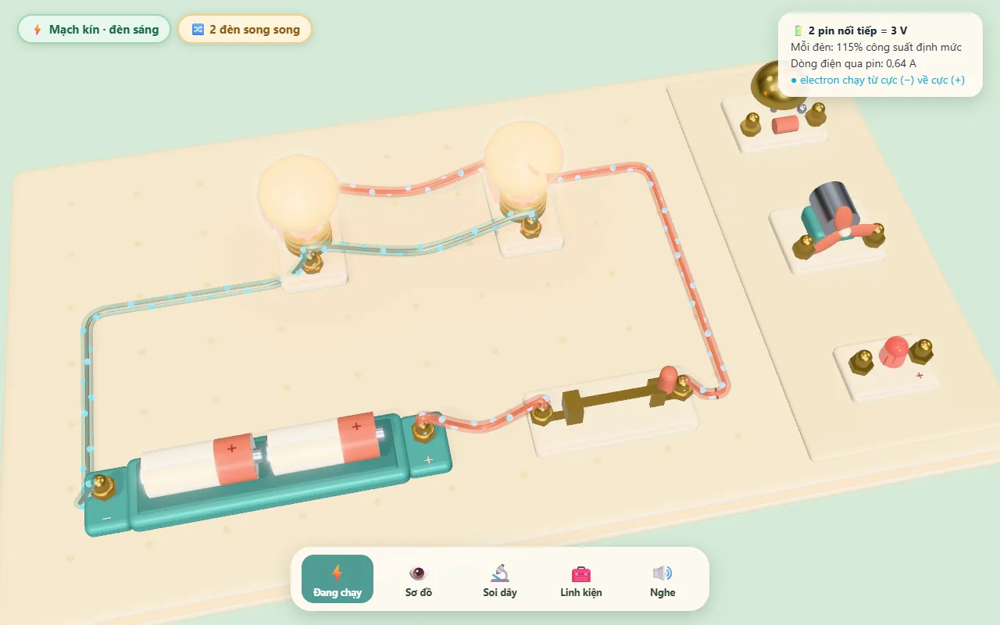
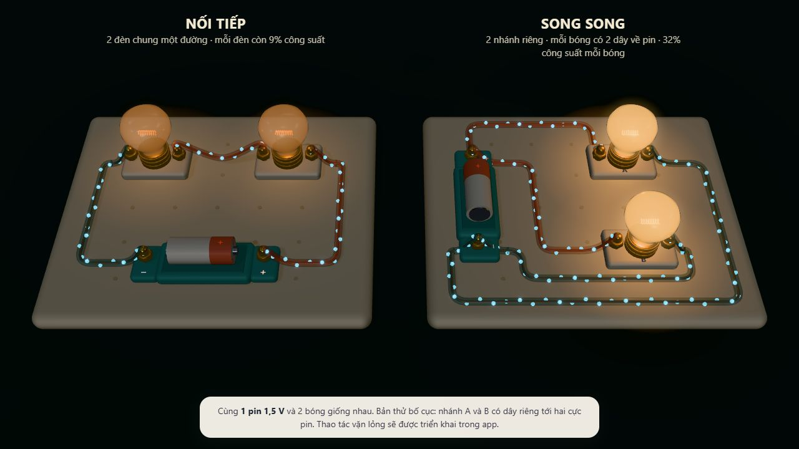
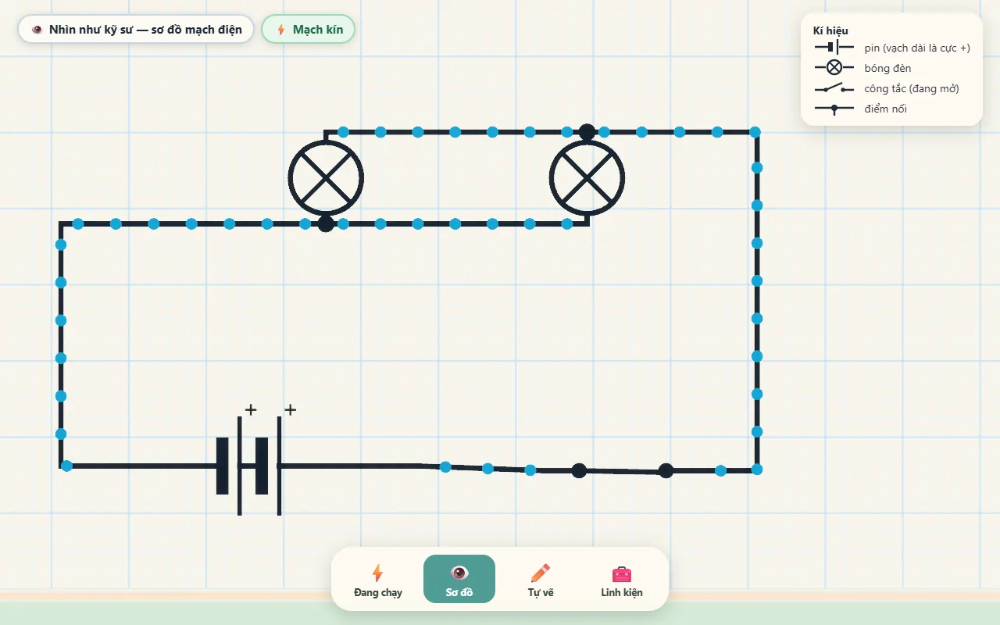
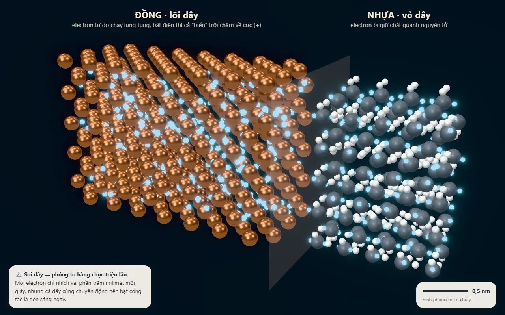
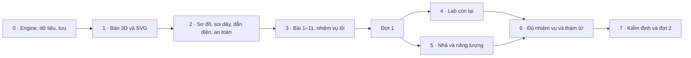

# Xưởng Ánh Sáng — kế hoạch nâng cấp Điện & Mạch Điện

Bản hoàn thiện ngày 29/09/2026 · Phạm vi hiện tại: thiết kế, nghiên cứu và bản thử; **chưa triển khai tính năng vào app**.
Route giữ `/science/electricity`. Tên trên sảnh khoa học vẫn là **Điện & Mạch Điện**; **Xưởng Ánh Sáng** là tên trải nghiệm bên trong.

> Bé tự tay làm ra ánh sáng, rồi nhìn xuyên qua điều vừa xảy ra.
>
> Mỗi hiệu ứng cần giúp bé nhận ra một quan hệ: nối kín → có dòng; thêm tải → đổi độ sáng; đổi nhánh → đổi cách mạch phản ứng. Đẹp để dễ hiểu và muốn thử tiếp.

## 0. Bản thiết kế trong một phút

Một bàn thí nghiệm đồ chơi 3D, bảng kem và cọc đồng, dây san hô/xanh ngọc, bóng đèn hổ phách. Bé bước vào phòng tối, tự nối dây để thắp bóng đầu tiên. Khi thành công, ánh sáng soi ra góc bàn, sổ sáng chế và những vật có thể khám phá tiếp.

Sau đó **chính mạch bé vừa lắp** có ba cách nhìn:

1. **Đồ thật**: đèn, pin, cầu dao, dây có vỏ nhựa và lõi đồng.
2. **Sơ đồ**: vật thể gọn lại thành kí hiệu; vị trí, kết nối và trạng thái công tắc được giữ.
3. **Bên trong**: chọn dây hoặc linh kiện để nhìn cấu tạo, quay lại đúng mạch đang làm.

Các chế độ không tạo ba mạch riêng. Một mô hình mạch, một kết quả giải điện, nhiều cách biểu diễn.

| Phần | Việc bé thực sự làm | Khoảnh khắc cần đạt |
| --- | --- | --- |
| Bàn tự do | Lắp, nối, tháo, xoay, lưu sáng chế | Dây hút vào cọc; công tắc chạm là đóng; ánh sáng phản hồi ngay |
| Hành trình | 13 nhiệm vụ có dẫn dắt và bằng chứng hoàn thành | Bé tự dự đoán rồi kiểm tra, thay vì chỉ đọc lời giải |
| Phòng thí nghiệm | Dẫn điện, pin trái cây, điện từ, tĩnh điện, máy phát | Một mẫu dẫn yếu không thắp bóng nhưng cảm biến vẫn phát hiện |
| Ngôi nhà | Tắt thiết bị thừa, thay đèn, nhận ra mối nguy | Cùng căn phòng sáng như trước nhưng dùng ít điện hơn |
| Thử thách và thám tử | Lắp đồ có ích, đo để tìm lỗi | Tìm đúng lỗi bằng chứng cứ; không cần tháo mò cả mạch |

**Xem trước**: [bản trình bày trực quan](electricity-wow/design-review.html). Ảnh bên dưới thuộc bản thử đã có, không phải ảnh tính năng hoàn thành.

| Bàn thí nghiệm | Hai kiểu mắc mạch trong tối |
| --- | --- |
|  |  |
| Sơ đồ từ cùng một mạch | Đi vào bên trong dây |
|  |  |

Một số chữ/số trên ảnh bản thử cũ chưa theo đặc tả cuối; đặc tả dưới đây và ba phụ lục là chuẩn khi triển khai.

## 1. Tài liệu nào là chuẩn

Đọc plan này trước, sau đó dùng các phụ lục để triển khai. Các bảng số, ID nội dung và hợp đồng dữ liệu trong phụ lục là nguồn chuẩn; bản thử chỉ là bằng chứng khảo sát.

| Tài liệu | Trách nhiệm |
| --- | --- |
| [Engine và mô hình điện](electricity-wow/research/engine-spec.md) | Thông số, dấu dòng/áp, bộ giải, hội tụ, thời gian, hỏng linh kiện, kiểm thử độc lập |
| [Nội dung và chương trình](electricity-wow/research/content-spec.md) | Nguồn, 13 bài, 16 mẫu vật, 12 nhiệm vụ, 12 lỗi, ngôi nhà, tiêu chí hoàn thành |
| [Tương tác và tiến độ](electricity-wow/research/interaction-progress-spec.md) | Tọa độ bàn, chạm, bàn phím, đi dây, lưu mạch, chuyển dữ liệu cũ, thưởng và fallback |
| [Mục lục bản thử](electricity-wow/README.md) | Cách chạy, giới hạn và kết quả kiểm tra |

Nếu có khác biệt: engine-spec quyết định đại lượng vật lý; content-spec quyết định ID/nội dung/điều kiện học; interaction-progress-spec quyết định dữ liệu và thao tác. Thay đổi ảnh hoặc câu quảng bá phải theo các hợp đồng này.

### 1.1 Hiện trạng đã đối chiếu code

- `circuitEngine.ts` xét đồ thị cọc và vòng kín, chưa tính V/A/W. Cần giữ các ca hành vi đúng thành kiểm thử, **không coi mọi kết luận của engine cũ là chân lý**.
- Cọc bóng đèn đang có nhãn cực như pin; bài công tắc chỉ kiểm có tải sáng. Cần nhãn cọc trung tính và kiểm bật/tắt thực sự điều khiển tải.
- Bố cục bài học theo pixel khiến bóng thứ hai tràn màn dọc.
- Tiến độ là hai khóa dùng chung; sao nằm trong hồ sơ. Hai nguồn này không đủ xác định ai đã làm bài cũ.
- Module hiện có 8 bài và 15 thử thách. Phải giữ đường truy cập cho đến khi có nội dung thay thế tương ứng.
- Có năm ảnh ý tưởng, một bản thử 3D dựng cảnh sẵn, một bộ giải số mẫu. Chưa có editor kéo/thả mới, bộ nội dung mới hoặc benchmark trên thiết bị đích.

## 2. Nghiên cứu và những điều quyết định thiết kế

### 2.1 Học từ đâu, áp dụng điều gì

| Nguồn | Điều học được | Quyết định cho Xưởng Ánh Sáng |
| --- | --- | --- |
| [PhET Circuit Construction Kit: DC](https://phet.colorado.edu/en/simulations/circuit-construction-kit-dc) | Trải nghiệm xây mạch và liên hệ vật thật với sơ đồ; tài liệu kỹ thuật/giáo viên được dẫn trong engine-spec | Một mạch chung giữa các góc nhìn, thao tác trực tiếp, số đo chỉ xuất hiện khi cần |
| [Falstad Circuit Simulator](https://www.falstad.com/circuit/) | Dòng điện có chuyển động, trạng thái linh kiện hiện ngay khi tương tác | Cho thấy đường dòng điện và phản hồi liên tục; không mang giao diện chuyên gia vào màn trẻ nhỏ |
| [Exploratorium Hand Battery](https://www.exploratorium.edu/snacks/hand-battery) | Thay điều kiện tiếp xúc và vật liệu rồi quan sát phép đo | Lab phải có biến để thử và có kết quả bất ngờ; số đo phụ thuộc điều kiện |
| Phụ lục GDPT 2018 và hướng dẫn EVN trong [content-spec](electricity-wow/research/content-spec.md) | Tách yêu cầu học chính thức, kiến thức xem trước và hành động an toàn | Không gán nhầm lớp học; tình huống điện nhà yêu cầu lùi ra/báo người lớn |

Không sao chép mô hình, ảnh, âm thanh hay câu nguyên văn từ PhET/SGK. Tự dựng tài sản, viết lời giải thích; ghi nguồn cho kiến thức và giả định.

### 2.2 Chương trình và lứa tuổi

- **Khoa học 5** là trục nội dung: mạch đơn giản, vật dẫn/cách điện, dùng điện an toàn và tiết kiệm. Chi tiết yêu cầu và trang nguồn ở content-spec.
- **KHTN 7**: nam châm điện là kiến thức xem trước.
- **KHTN 8**: nhiễm điện, dòng điện, nguồn, tác dụng dòng điện, đo và kí hiệu mạch.
- **KHTN 9**: định luật Ohm, nối tiếp/song song, năng lượng và công suất.
- Lớp 1–2 trải nghiệm định tính, tự đọc to, bộ đồ nghề gọn; không bắt hoàn thành bài nâng cao để mở bàn tự do.
- Lớp 3–4 có dự đoán, LED, vật dẫn yếu và so sánh hai cách mắc. Lớp 5 có nút bật V/A/W, mũi tên dòng điện quy ước và nhiệm vụ đo.
- `allowPreschool: false` giữ nguyên. Tuổi thay độ sâu và lượng trợ giúp, không thay định luật hoặc kết quả cùng một mạch.

### 2.3 Giới hạn khoa học phải nói rõ

Đây là **mô hình DC giáo dục theo Ohm/Kirchhoff**, dùng linh kiện đơn giản hóa. Bộ giải quyết định I/U/P; ánh sáng, âm thanh và hình ảnh lấy từ kết quả đó. Mô hình nhiệt, pin cạn và động cơ là mô hình minh họa đã định nghĩa, không phải bản sao chính xác mọi linh kiện ngoài đời.

| Mẫu chuẩn | Giá trị khởi điểm | Tính chất |
| --- | --- | --- |
| Viên pin | 1,5 V; nội trở mẫu 0,2 Ω | Mẫu mô phỏng; nội trở thật thay đổi theo loại, tình trạng, nhiệt độ |
| Bóng sợi đốt | 2,5 V / 0,3 A; R cố định 8,333… Ω; P định mức 0,75 W | Dùng điện trở nóng cố định; chưa giải điện trở phụ thuộc nhiệt |
| Dây | 0,02 Ω mỗi dây | Điện trở quy ước ổn định; kéo dây cho đẹp không tự đổi kết quả |
| Pin chanh Cu/Zn | 0,95 V; 450 Ω | Mẫu hiệu chuẩn cho trải nghiệm, không hứa mọi quả chanh cho cùng số đo |
| LED đỏ | Ngưỡng và điện trở theo engine-spec | Phân biệt bắt đầu dẫn, đủ nhìn thấy, quá dòng |

Với preset trực quan đã sửa: một pin/một bóng khoảng 34% P định mức; hai bóng nối tiếp với ba dây khoảng 8,7% mỗi bóng; song song với bốn dây riêng khoảng 32,5% mỗi bóng. **32,5% gần 34%, không bằng nhau tuyệt đối** vì nguồn có nội trở. Fixture bộ giải cũ dùng hai dây chung cho ra khoảng 32,2%; engine-spec ghi rõ cả hai netlist. Cùng kiểu mắc không có nghĩa mọi giá trị I/U/P giống hệt: solver giữ điện trở từng dây, còn phân loại kiểu mắc gộp chúng thành nút ngữ nghĩa.

Chiều electron ngược chiều dòng điện quy ước trong dây kim loại. Tín hiệu điện lan nhanh, còn vận tốc trôi phụ thuộc dòng, tiết diện và mật độ hạt tải; không ghi một tốc độ cố định cho mọi dây. Chuyển động chấm là minh họa, không theo thời gian/kích thước thật.

### 2.4 Bản thử đã chứng minh và chưa chứng minh

- `proto/mna-proto.mjs` chạy được các netlist nhỏ. `research/solver-cases.txt` lưu đầu ra khảo sát; không dùng chính đầu ra này làm chuẩn đúng duy nhất.
- `proto/mna-proto-check.mjs` bổ sung đối chiếu công thức độc lập cho những mạch mẫu. Vẫn cần kiểm thử production cho trạng thái động, dữ liệu xấu và giới hạn hội tụ.
- `proto/bench.html` chứng minh hướng vật liệu, ánh sáng, dây và sơ đồ ở **cảnh dựng sẵn**. Nút trong ảnh không chứng minh chức năng editor đã có.
- Bản thử trước ghi khoảng 131 draw call, 100k tam giác; đó là số khảo sát, chưa đạt ngân sách bàn thật. Thời gian giải khoảng 1 ms/mạch mẫu chỉ là tham khảo, không là cam kết thiết bị.
- Chưa xác nhận kéo thả trên Android/iOS, context recovery, lưu tiến độ, chống thưởng lặp hay tốc độ trên Iris Xe. Các mục này là cổng nghiệm thu triển khai.

## 3. Những khoảnh khắc làm nên trải nghiệm

### 3.1 Một phút đầu: tự tay thắp sáng

Không bắt xem phim. Khi lần đầu mở hành trình:

| Nhịp | Hình và âm | Hành động của bé | Tiêu chí |
| --- | --- | --- | --- |
| Nhìn thấy | Góc bàn tối vừa đủ, thấy hai cọc pin và hai cọc bóng; câu dẫn ≤ 12 từ | Chọn bắt đầu hoặc bỏ qua | Không dùng tối đen che cọc; có lựa chọn không âm thanh |
| Sợi dây đầu | Cọc gần nhất sáng viền; dây đi theo tay, gắn cọc có tiếng tách nhỏ | Nối một dây | Đèn vẫn tắt, không phát thưởng vì mạch chưa kín |
| Khép mạch | Dây tóc ấm lên, vùng bàn được chiếu sáng; chấm electron bắt đầu chuyển động | Nối dây còn lại | Phản hồi điện sau commit ≤ 100 ms; độ sáng theo solver |
| Nhận ra | Bàn sáng để lộ sổ và công tắc; một câu “Em vừa thắp sáng bóng đèn!” | Tự chạm công tắc hoặc đi tiếp | Không confetti che kết quả; thưởng đầu tiên chỉ một lần |

Mở màn lưu hoàn thành theo hồ sơ; các lần sau vào đúng việc đang làm. Có “Thắp đèn lần nữa”; `?intro=0` cho kiểm tra. Không buộc hoàn thành mở màn để dùng module.

### 3.2 Phép biến hình: mạch thật thành sơ đồ

Trong 0,8 giây: camera chuyển lên trên; vỏ linh kiện mờ; cọc giữ nguyên; kí hiệu hiện đúng tâm; dây chuyển thành nét. **Không mất selection, công tắc, dòng hoặc vị trí dây**. Chạm “Đồ thật” trở lại cùng trạng thái.

Có một chi tiết dễ nhớ: chọn bóng trong sơ đồ thì bóng tương ứng nháy viền trong bản thật khi chuyển về. Bé hiểu kí hiệu đại diện cho chính món đồ đang cầm.

Reduced motion: thay morph bằng chuyển mờ ≤ 150 ms. Thao tác nối dây đang dở phải hủy rõ ràng trước khi đổi góc nhìn, không để lại dây nửa chừng.

### 3.3 Hai bàn, một câu dự đoán

Nhiệm vụ nối tiếp/song song có nút **Đặt cạnh nhau**. Hai mạch mẫu cùng pin và cùng loại bóng, camera và thang sáng giống nhau. Trước khi vặn lỏng bóng A, bé chọn dự đoán; sau khi thử, hai trạng thái đứng cạnh nhau với một câu giải thích ngắn.

Đây là chế độ so sánh có giới hạn hai mạch mẫu, không nhân đôi toàn bộ editor. Chỉ mạch đang thao tác nhận input; kết quả và đơn vị được tính riêng, không dùng luật “mạch bên trái luôn tắt”.

**Bố cục song song đã chốt theo góp ý Đại ca:** mỗi bóng có hai dây riêng về hai cực pin; hai bóng có bốn dây, hai nhánh có khoảng trống phân cách. Không dùng dây bắc từ cọc bóng A sang cọc bóng B trong preset nhập môn, dù có thể tương đương về điện. Chọn A/B làm sáng viền toàn bộ nhánh tương ứng; sơ đồ cho thấy hai tải nối cùng hai nút nguồn. Mạch tự do tương đương vẫn được chấm đúng. [Ảnh bố cục sửa](electricity-wow/concept-parallel-clear.png).

### 3.4 Chui vào sợi dây

Chọn dây → “Soi bên trong”: camera đi từ vỏ nhựa đến bó đồng rồi mạng tinh thể. Tên dây/cọc A–B giữ ở breadcrumb để bé biết đang nhìn đâu. Công tắc mini vẫn điều khiển **mạch bên ngoài**.

- Không điện: electron vẫn có chuyển động vi mô minh họa, không trôi có hướng.
- Có điện: xuất hiện thành phần trôi có hướng, chậm hơn chuyển động ngẫu nhiên; cùng lúc một chú thích ngắn giải thích tín hiệu lan nhanh.
- Vỏ nhựa: điện tích bị ràng buộc; nhãn “mô hình minh họa”, không vẽ nhựa như đồng chỉ ít electron hơn.
- Quay lại bàn: giữ vị trí, selection và kết quả; một cọc sáng giúp tìm lại dây.

Không import cả chunk bảng tuần hoàn để lấy lattice: tách hàm hình học thuần dùng chung nếu cần. Liên kết đến Đồng số 29 là lựa chọn thêm, không tự rời bài.

### 3.5 Những bất ngờ có lời giải

- **Vật dẫn yếu**: bóng không sáng nhưng cảm biến phát hiện dòng. Câu chốt: “Đèn tắt chưa đủ để kết luận vật không dẫn điện.”
- **Đèn chanh**: thêm nguồn nối tiếp, LED đủ sáng trong mẫu thiết kế; thay bằng bóng thường thì gần như không thấy sáng. Không hứa “đúng ba quả” ở thí nghiệm thật.
- **Nhà vẫn sáng, công tơ chậm hơn**: đổi các bóng có độ sáng sử dụng tương đương; công suất định mức khác nhau, phép tính năng lượng hiển thị rõ khi bé yêu cầu.
- **Sổ sáng chế**: bức ảnh mạch thật, tên do bé đặt, ngày hoàn thành và điều đã khám phá. Không biến sổ thành bảng xếp hạng tốc độ.

## 4. Hệ thống hình ảnh, âm thanh và màn hình

### 4.1 Hướng mỹ thuật đã chọn cho bản thiết kế

| Thành phần | Quy tắc |
| --- | --- |
| Bàn | Kem ấm, lưới lỗ chìm nhẹ, viền bo; không thêm đồ trang trí cản đường dây |
| Linh kiện | Khối đồ chơi đủ lớn để cầm; nhựa xanh ngọc, tay gạt san hô, cọc đồng; độ bóng có kiểm soát |
| Dây | Vỏ có độ trong vừa đủ, lõi đồng đọc được; xanh ngọc/san hô là nhận diện dây, không gán mọi tải có cực |
| Ánh sáng | Bóng là điểm nhìn chính; sàn và mặt bàn dưới ngưỡng bloom; không làm màn trắng xóa |
| Nhãn | Chữ của app, tương phản rõ, cỡ đọc được trên điện thoại; biểu tượng luôn có tên |
| Âm thanh | Tiếng tách khi gắn cọc, công tắc rõ nhưng nhỏ; chuông/motor theo trạng thái, không phát lặp sau khi rời cảnh |
| Phản hồi sai | Một chỗ cần sửa được chỉ ra; không màn đỏ phủ cả bàn, không chê trẻ |

Hộp đồ nghề dùng icon render từ chính mô hình. Không thêm thư viện 3D hay nguồn asset mới nếu bộ Three/R3F hiện tại đáp ứng.

### 4.2 Bố cục và tương tác

**Bàn logic cố định 14×8 ô.** Màn dọc nhìn cùng bàn thành **8×14** qua phép đổi tọa độ hiển thị. Không thay dữ liệu mạch khi resize. Bỏ hoàn toàn đặc tả cũ 14×8 → 8×12.

- Desktop/tablet ngang: bàn chính, toolbox hẹp bên trái, thẻ nhiệm vụ bên phải có thể thu gọn; thanh góc nhìn dưới cùng.
- Điện thoại dọc: đề bài tối đa hai dòng; toolbox dạng drawer; bảng thuộc tính dạng bottom sheet, không cùng lúc mở hai sheet. “Vừa bàn” trừ đúng vùng UI che phủ.
- Hit target tối thiểu 44 px. Khi hai cọc quá gần ở overview, chạm mở vùng chọn phóng lớn có tên cọc; không phóng to mô hình bằng cách làm sai topology.
- Kéo từ thân là di chuyển linh kiện; kéo từ cọc là nối dây. Thêm ngón thứ hai hủy thao tác chưa commit rồi chuyển pan/zoom; thả tay không vô tình nối dây.
- Hai cách nối ngang hàng: kéo-thả hoặc chọn cọc A rồi chọn B. Bàn phím và danh sách cọc DOM dùng được trong cả 3D và SVG.
- Dây giao nhau không tự nối. Junction phải là cọc hoặc nút nối có ID; kí hiệu chấm chỉ dựa trên kết nối thật.
- Cọc trống không luôn là lỗi: chỉ chỉ ra chỗ hở liên quan mục tiêu hoặc đường cần cấp điện; không nhấp nháy mọi vật chưa dùng trong toolbox.

Chi tiết hit test, cancel, undo/redo, giới hạn và schema ở [interaction-progress-spec](electricity-wow/research/interaction-progress-spec.md).

### 4.3 Các trạng thái phải có thiết kế

Loading có tên cảnh; solver lỗi có hướng sửa và không thưởng; mạch hở có vị trí phù hợp; chưa có mạch lưu có CTA rõ; lưu thất bại giữ mạch trong bộ nhớ và báo chưa lưu; mất WebGL chuyển SVG giữ cùng mạch; chưa tải âm thanh dùng TTS hoặc chữ; rời tab tắt audio và dừng đồng hồ mô phỏng.

Không render cửa chưa phát hành như nút bấm chết. Đợt 1 chỉ hiện các nội dung đã chạy; đợt 2 bổ sung cửa nhà/lab tương ứng.

## 5. Nội dung có thể chuyển thành dữ liệu

Nguồn chuẩn: [content-spec](electricity-wow/research/content-spec.md). Mỗi nội dung có ID ổn định, release, độ tuổi gợi ý, preset, dụng cụ cho phép, bằng chứng qua bài, lời giải/gợi ý, nguồn và trường hợp sai. Không suy luận bài hoàn thành chỉ từ “có một đèn đang sáng”.

### 5.1 Hành trình 13 bài

| # | Việc làm | Kiểm cốt lõi | Đợt |
| --- | --- | --- | --- |
| 1 | Phân loại đồ dùng quanh em | Đúng từng vật; phân biệt điện pin và điện nhà | 1 |
| 2 | Nhận ra mối nguy | Chỉ ra và chọn hành động an toàn; không tự sửa ổ điện | 1 |
| 3 | Thắp bóng đầu tiên | Tải mục tiêu sáng, không đoản mạch | 1 |
| 4 | Sửa đường hở | Xác định, nối lại và xác nhận thay đổi | 1 |
| 5 | Đặt công tắc có tác dụng | Ghi nhận cả bật và tắt điều khiển đúng bóng | 1 |
| 6 | Hai cọc tiếp xúc của bóng/pin | So sánh tiếp xúc đúng/sai; không yêu cầu nối tắt bóng | 1 |
| 7 | Thử vật dẫn/cách điện | Mẫu dễ thấy trước, dùng sensor khi kết quả yếu | 1 |
| 8 | Vật thật và sơ đồ | Hai biểu diễn cùng topology; câu đối chiếu kí hiệu | 1 |
| 9 | Thêm pin và giới hạn tải | So sánh hộp một pin với hộp hai pin, rồi đảo một viên; demo quá tải là tùy chọn | 1 |
| 10 | Mạch nối tiếp | Hai tải nối tiếp, so sánh sáng, vặn lỏng rồi quan sát | 1 |
| 11 | Mạch song song | Hai nhánh độc lập; tháo một bóng và kiểm bóng còn lại | 1 |
| 12 | Dùng điện tiết kiệm | Đúng nhu cầu sử dụng và kWh, không chỉ tắt hết | 2 |
| 13 | Điện từ đâu đến | Theo chuỗi nguồn → truyền tải → nơi dùng, nhận ra chuyển hóa năng lượng | 2 |

Mỗi bài 2–5 phút là mục tiêu thiết kế, không là đồng hồ ép bé. Chữ dẫn ≤ 3 câu/lượt, nút nghe luôn có, tự đọc lớp 1–2. Không chặn thao tác vì chờ TTS lỗi; có timeout và lựa chọn tiếp tục bằng chữ.

### 5.2 Phòng thí nghiệm

**Lab dẫn điện thuộc GĐ2/đợt 1**, vì bài 7 phụ thuộc nó. 16 mẫu có thông số hiệu chuẩn và điều kiện tiếp xúc trong phụ lục. Các lab pin trái cây, điện từ/chuông, tĩnh điện và máy phát thuộc GĐ4/đợt 2.

Mỗi lab có: một biến điều khiển; kết quả đo/quan sát; hai trạng thái cần so sánh; câu kết luận; ghi chú giới hạn mô hình. Cảnh tĩnh điện không ép vào bộ giải DC. Điện từ và máy phát dùng mô hình liên kết riêng có thông số công bố, không giả vờ MNA giải được từ trường.

Pin bàn tay là hoạt động bổ sung sau lab pin trái cây, dùng galvanometer minh họa. Không đưa thao tác làm ướt tay vào ngữ cảnh điện nhà.

### 5.3 Nhiệm vụ và thám tử

12 nhiệm vụ có chuyện và 12 ca lỗi có ID/contract trong phụ lục. Đợt 1 có bốn nhiệm vụ lõi và bốn ca thám tử đã đủ công cụ; phần còn lại mở khi dependencies tương ứng hoàn thành.

- Trước bài: mục tiêu và sao tối đa hiện rõ.
- Sao cho bằng chứng học, không cho thao tác nhanh hay số lần thử ít.
- “Gọn” là mục tiêu phụ có kiểm chứng mạch lời giải, không phạt thêm dây cần thiết cho một cách mắc hợp lệ.
- Ca thám tử chỉ kết luận khi có bằng chứng quan sát/đo đúng; đổi linh kiện mò có thể sửa mạch nhưng không tự hoàn thành phần suy luận.
- Cả dây tóc, LED và nguồn có trạng thái hỏng trong dữ liệu; “Thay mới” là hành động có thể hoàn tác theo đặc tả.

### 5.4 Nhà và số liệu năng lượng

Nhà ống ba tầng cắt một mặt, cùng phong cách đồ chơi. Sáu mối nguy dùng chung dữ liệu với bài 2; tác vụ yêu cầu lùi ra/báo người lớn, không hướng dẫn trẻ tự sửa điện nhà.

Công suất thiết bị là bộ số **minh họa**, không là thông số mọi thiết bị ngoài đời. `kWh = Σ(W × giờ)/1000`. Nếu dùng tiền: đơn giá bài tập cấu hình sẵn, ghi “ước tính theo đơn giá bài tập”, không gọi là hóa đơn EVN thực tế. Không cần biểu giá điện trực tuyến để chạy bài.

Nhà máy là sơ đồ dòng năng lượng; chưa đưa tỷ lệ cơ cấu điện Việt Nam nếu chưa có dataset gắn năm, đơn vị và nguồn được duyệt. Phạm vi này chủ động bỏ tỷ lệ thời sự, giữ bài chạy offline và không nhanh lỗi thời.

## 6. Hợp đồng kỹ thuật

### 6.1 Một luồng dữ liệu

`Input → command → Circuit + SimState → solve → analysis → evidence → presentation`

- `Circuit`: linh kiện, cọc, dây, bố trí, tham số và trạng thái có thể lưu.
- `SimState`: đồng hồ, nhiệt/charge, trạng thái động, sự kiện hỏng. Không trộn với camera/hover.
- `Solution`: điện áp và dòng có dấu; kết quả hội tụ/diagnostic; không hiển thị số NaN hoặc dùng kết quả chưa hội tụ để thưởng.
- `Analysis`: kết nối, tải được cấp, đoản mạch/quá tải và điều khiển; có thể phân tích từng mạch con.
- `Evidence`: sự kiện học có thứ tự, ví dụ đã mở công tắc, tải tắt, đã đóng công tắc, tải sáng. Gắn session, mục tiêu và phiên bản nội dung.
- `Presentation`: độ sáng, dòng chấm, âm thanh, camera; không sửa kết quả điện để làm đẹp.

Tách `editRevision` cho lệnh người chơi thay đổi điện và `solveRevision` cho mọi thay đổi đầu vào bộ giải, kể cả runtime. Solution luôn phải khớp `solveRevision`; cửa sổ bằng chứng chỉ reset khi người chơi thay đổi điều kiện đối chứng/mục tiêu. Chuông tự đổi tiếp điểm không xóa lịch sử gõ cần để xác nhận “kêu”; predicate này dùng cửa sổ sự kiện 0,5 giây.

### 6.2 Khi nào giải lại

Command làm thay đổi kết nối hoặc thông số điện đánh dấu `electricalDirty`. Di chuyển/xoay để trình bày không đổi điện trở dây hay trạng thái điện; chỉ dựng lại geometry/routing.

Đồng hồ mô phỏng bước cố định theo engine-spec. Pin thay trạng thái, nguồn quay tay đổi đầu ra, cầu chì/bóng đứt và tiếp điểm chuông đổi đều là **sự kiện điện**, cập nhật model rồi giải lại. Hạn chế tần suất nguồn liên tục; không chạy “tháo thử” mọi tải trên mỗi frame.

Rời tab/ẩn cảnh/tạm dừng: đóng băng thời gian, hủy âm thanh kéo dài. Trở lại không cộng dồn hàng phút thành một bước làm cháy linh kiện. Undo/redo và reset phục hồi snapshot theo hợp đồng, không tự rút lại hay cộng lại sao.

### 6.3 Phân chia file

```text
src/pages/ElectricityPage.tsx        sảnh + điều hướng + kết nối hồ sơ
src/components/electricity/
  engine/                          TS thuần; không React/Three/audio/storage
    circuit.ts parts.ts solver.ts analysis.ts simulation.ts
    route.ts evidence.ts objectives.ts fixtures/ *.test.ts
  bench/                           R3F lazy, một canvas trong phiên mục
    BenchCanvas.tsx Board.tsx parts/ Wires.tsx Electrons.tsx
    Schematic.tsx WireDive.tsx Interaction.tsx Effects.tsx materials.ts
    labs/ House.tsx
  flat/                            SVG + DOM, chung engine và controller
    FlatBench.tsx PostList.tsx
  controller/                      command queue, gesture state, lesson session
  ui/                              toolbox, sheet, HUD, lesson, feedback, sổ
  progress/                        profile commands, ledger, migration, saves
  legacy/                          giao diện cũ tạm thời, không làm solver chuẩn
src/data/electricity/               typed content + fixtures + nguồn
scripts/                           sinh audio/icon khi triển khai
```

Các helper dùng chung đặt vào thư mục thuần, không import page của môn khác. Tích hợp route/lazy giữ đường dẫn hiện tại, thêm `StudentProfile.electricity` theo phụ lục; không thêm một kho sao thứ hai.

### 6.4 Hiệu năng và tài nguyên

- Editor đợt 1: tối đa 24 linh kiện/40 dây; UI, import và test dùng cùng giới hạn này, từ chối dây trùng cùng đôi cọc. Hard limit engine là 64 linh kiện/128 dây/192 cọc/8 LED; engine vẫn giải được nhánh song song trùng endpoint trong netlist thuần. Giới hạn lớn hơn không có nghĩa editor tự cho phép nhập vượt mức.
- Scene chuẩn để đo: 12 linh kiện + 14 dây; mục tiêu ≤ 60 draw call phần scene, ≤ 150k tam giác tier cao, ≤ 60k tier thấp. Báo riêng draw call hậu kỳ; không giấu composer khỏi tổng báo cáo.
- Electron toàn bàn dùng instancing/points; chia sẻ geometry/material; explicit dispose khi thay đường dây hoặc rời module. Tài sản sinh bằng code vẫn có chi phí bundle/GPU, không gọi là “0 byte”.
- Tier cao DPR ≤ 1,75, bloom và tone mapping một lần. Tier thấp DPR 1, không composer, giảm particle, ánh sáng giả.
- Số đèn cố định theo tier từ lúc warmup. Chọn bốn nguồn mạnh nhất có hysteresis để không nhấp nháy khi thứ hạng đổi.
- Warmup theo stage sắp vào; nếu quá 2,5 giây hiện tiến trình/fallback, không gọi timeout là bằng chứng shader đã sẵn sàng.
- Đo 30 giây sau warmup với kéo dây, xoay view và 12 linh kiện; ghi median/p95 frame time, thiết bị/browser/DPR. Mục tiêu desktop 50 fps median, mobile low 30 fps median; thử trên máy thật trước khi xác nhận.
- Trong trang trình bày: pause animation khi ẩn. Trong app: không setState mỗi frame; chỉ UI theo sự kiện hoặc sample rate có giới hạn.

### 6.5 Fallback và khả năng sử dụng

**SVG/DOM dùng cùng solver** là fallback chính khi không có WebGL2 hoặc mất context. Giữ mạch, undo, bài đang làm và lời giải. Soi dây thay bằng hình cắt lớp tĩnh có tương tác công tắc; nhà dùng hotspot/hình đơn giản cùng dữ liệu.

Source module cũ được giữ tạm để đối chiếu. Kho 15 thử thách cũ dùng adapter chuyển đề/preset sang engine mới, chung UI lưu và không phát sao; không nối lại component cũ có hàm cộng sao vào bản mới. Chỉ gỡ source sau khi adapter, nội dung thay thế và migration đã được kiểm.

## 7. Tiến độ, sao và chuyển dữ liệu

Hợp đồng chi tiết ở [interaction-progress-spec](electricity-wow/research/interaction-progress-spec.md).

- Một hồ sơ sở hữu tiến độ, bằng chứng hoàn thành, award ledger và sổ sáng chế. Mọi command mang `ownerId`; đổi hồ sơ hủy callback/voice của phiên cũ.
- Sao và dấu đã trao ghi cùng snapshot hồ sơ, đọc lại bản mới nhất trước commit; không dùng `currentStudent.stars + N` từ closure cũ.
- Khóa tiến độ cũ không có owner: giữ ở kho “Thành tích cũ trên máy”, không tự gán cho tất cả trẻ. Khi người dùng nhận vào một hồ sơ, chỉ nhập dấu đã học bản cũ; không cộng sao hoặc tự chứng nhận kỹ năng mới.
- Không xóa khóa cũ sau một lần parse. Migration có marker/version, backup và kiểm tra ghi thành công; chạy lại cho cùng kết quả.
- Mỗi mạch lưu gồm schema version, owner, topology, layout và state cần thiết; ảnh thumbnail là cache có thể tái tạo. Dữ liệu lạ/đứt tham chiếu bị từ chối với thông báo, không crash.
- Thưởng lesson/mission/badge có ID duy nhất; reload, double click, retry lưu và hai tab cùng hoàn thành không cộng đôi.
- Phụ lục nêu ranh giới đồng bộ với writer của các môn khác. Không tuyên bố an toàn đa tab toàn app trước khi kiểm tra các writer dùng chung quy tắc.

## 8. Lộ trình đã sửa phụ thuộc

### 8.1 Hai đợt phát hành rõ ràng

**Đợt 1 — Bàn khám phá hoàn chỉnh:** GĐ0–3. Bàn 3D + SVG, ba góc nhìn, lab dẫn điện, cảnh an toàn nhỏ, bài 1–11, bốn nhiệm vụ và bốn ca thám tử. Giữ truy cập 15 thử thách cũ dưới mục “Bản cũ”. Không gọi đợt này là thay toàn bộ nội dung.

**Đợt 2 — Mở rộng thế giới:** GĐ4–6. Các lab còn lại, nhà/năng lượng, bài 12–13 và đủ 12+12 nội dung. GĐ7 là kiểm định toàn bộ trước khi đóng việc chuyển đổi.



### GĐ0 — Khóa nền tảng

- Kiểm tra working tree, ghi baseline commit và danh sách thay đổi đang có; tạo nhánh `codex/electricity-wow` khi bắt đầu code. Không reset main hay mang thay đổi môn khác vào commit này.
- Chuyển thông số, ID và schema từ phụ lục thành TS; netlist compiler, bộ giải, simulation/evidence, lưu và migration tests.
- Tạo mạch lời giải/mạch sai cho nội dung đợt 1; chưa thay UI đang chạy.
- **Nghiệm thu:** công thức độc lập, Kirchhoff, chiều dòng, LED, nguồn đối nhau, mạch floating và lỗi hội tụ; simulation pin/cầu chì/bóng; ownership/idempotency; test cũ có baseline ghi rõ. Build qua. Không lấy transcript của prototype làm oracle duy nhất.

### GĐ1 — Bàn đủ dùng, hai renderer

- Tám linh kiện lõi: hộp pin, bóng, cầu dao, nút nhấn, chuông, còi, motor/quạt, LED. Thêm điện trở cố định (gồm 100 Ω), dây, connector và cảm biến cơ bản. Khay “LED + bảo vệ” đưa ra hai linh kiện nhìn thấy rõ, không giấu điện trở trong LED; nhiệm vụ LED và lab dẫn điện đợt 1 cần điện trở này.
- Kéo, chạm-chạm, bàn phím, undo/redo, lưu/mở mạch; renderer 3D và SVG chung controller; ban ngày/ban đêm.
- **Nghiệm thu:** lắp song song hai bóng bằng chạm ở 390×844; xoay màn không thay topology; nhả nút nhấn khi pointercancel; save/reload; lỗi WebGL giữ bài; stress scene đạt hoặc có biện pháp hạ tier được ghi rõ.
- Deliverable: ảnh ngày/đêm, clip nối dây, báo số đo. Cảnh chưa đẹp phải điều chỉnh trong giai đoạn này, không đẩy toàn bộ sang GĐ7.

### GĐ2 — Biểu diễn và lab nền

- Morph sơ đồ, tự vẽ, cutaway bóng/pin và soi dây; so sánh nối tiếp/song song.
- **Lab dẫn điện 16 mẫu** và **cảnh an toàn nhỏ** dùng dữ liệu chung với nhà. Đây là dependencies của bài 2 và 7, không chờ GĐ4/GĐ5.
- **Nghiệm thu:** đổi view không đổi circuit hash điện; crossings/junction đúng; điều khiển công tắc trong cutaway; vật dẫn yếu không bị chấm sai là cách điện; bàn phím/reduced motion/fallback đọc được đầy đủ bài.

### GĐ3 — Hành trình và đợt 1

- Onboarding thắp đèn, bài 1–11, voice/audio, hint ba mức, sổ, huy hiệu có thể đạt trong phạm vi đợt 1.
- Bốn mission/fault đợt 1 theo ID trong content-spec; kho thử thách cũ vẫn truy cập được dưới nhãn “Luyện thêm”, không phát sao mới kể cả đề cũ chưa từng làm.
- **Nghiệm thu:** mỗi bài có fixture đúng và ít nhất ba lỗi đặc trưng; bằng chứng thao tác bắt buộc; tự đọc lớp 1–2; lớp 5 có số; không ép trẻ nhỏ làm phần nâng cao để mở sandbox. Đi một phiên 15 phút không dead end.
- Đóng một bản phát hành có thể chơi trọn; ghi các giới hạn đã biết, review sản phẩm trước khi sang đợt 2.

### GĐ4 — Các lab mở rộng

- Pin trái cây, nam châm điện/chuông, tĩnh điện và máy phát. Cutaway chuông/motor nâng sâu theo model lab.
- **Nghiệm thu:** bảng input/output, fixture và câu giới hạn mô hình cho từng lab; sensor không hứa số đo ngoài đời; tắt/rời cảnh dừng audio; reduced motion vẫn có thao tác tương đương. Không mô tả cảm giác “nặng tay thật” nếu thiết bị không hỗ trợ lực phản hồi.

### GĐ5 — Ngôi nhà và nguồn năng lượng

- Nhà 3 tầng, task tiết kiệm/an toàn, power-trip; bài 12–13. Giữ hình nhà hấp dẫn nhưng mỗi lần chỉ một nhiệm vụ rõ.
- **Nghiệm thu:** công thức kWh và thời gian mô phỏng đúng; giữ thiết bị cần thiết; đơn giá minh họa có nhãn; mỗi hotspot có đáp án hành động an toàn; SVG dùng được cùng nhiệm vụ.

### GĐ6 — Hoàn chỉnh nhiệm vụ

- Đủ 12 mission, 12 fault và huy hiệu; thay dần kho cũ sau khi đối chiếu chức năng.
- **Nghiệm thu:** content validators kiểm 100% ID/dependency/preset/source; mọi ca có lời giải và phản ví dụ; threshold không bất khả thi; thử cách giải hợp lệ khác với mẫu; replay không thưởng lặp.

### GĐ7 — Kiểm định phát hành

- Chạy test có liên quan, full regression và build; test một phiên cold cache/offline phù hợp chính sách app, đổi hồ sơ, quota storage, reload và context loss.
- Đo trên desktop và ít nhất một Android tầm thấp; iOS kiểm touch/audio khi có thiết bị. Chưa đo thì ghi **chưa xác minh**, không đánh dấu đạt.
- Đối chiếu rubric thị giác; lưu ảnh/clip/metrics và known issues. Giữ fallback SVG lâu dài; gỡ module cũ là quyết định riêng, không tự động xóa vì code mới đã build.

## 9. Cổng chất lượng: điều kiện để gọi là “wow”

| Cổng | Bằng chứng cần lưu | Không đạt khi |
| --- | --- | --- |
| Hiểu được | Bé thắp bóng và biết công tắc làm gì sau hướng dẫn ngắn | Cần đọc đoạn dài hoặc bị kẹt ở nối cọc |
| Có chiều sâu | Thấy khác biệt nối tiếp/song song trong tối, tự kiểm bằng vặn lỏng | Hai bên có độ sáng giả bằng nhau hoặc kết luận viết sẵn |
| Liền mạch | Clip thật → sơ đồ → soi dây → về bàn | Mất mạch, reset công tắc, camera cắt đột ngột không lý do |
| Dễ chạm | Phiên ở 390×844 có kéo và chạm-chạm | Mất linh kiện ngoài khung, hit target chồng gây chọn nhầm |
| Đúng kiến thức | Contract + nguồn + numerical/evidence tests | Nhầm electron với năng lượng; bóng tắt bị coi luôn là cách điện |
| Có thể dùng lâu | Lưu, đổi hồ sơ, reset/retry/2 tab được kiểm | Mất mạch hoặc thưởng hai lần |
| Máy yếu vẫn học | Cùng bài chạy trong SVG/tier thấp | Mất WebGL là mất bài hoặc dùng engine cho kết quả khác |

Không cần chờ người dùng duyệt từng lựa chọn nhỏ khi đã bắt đầu triển khai. Cuối mỗi giai đoạn có kết quả cụ thể để review; xuất bản/deploy và gỡ nội dung cũ là hành động riêng ngoài phạm vi plan này.

## 10. Quyết định mặc định và giới hạn phạm vi

Những quyết định dưới đây là lựa chọn thiết kế để người triển khai không phải đoán; không diễn giải thành việc Đại ca đã duyệt từng chi tiết hoặc cho phép triển khai ngay.

1. Đồ chơi 3D theo ảnh hub; SVG là fallback cùng engine.
2. Mạch sống, dùng công tắc; không nút “Bật nguồn” giả bên ngoài mạch.
3. Electron mặc định; chiều dòng điện quy ước là overlay có nhãn từ lớp 5.
4. Bàn canonical14×8, portrait8×14 qua view transform; không sửa model khi resize.
5. Hai đợt phát hành, dẫn điện và an toàn nhỏ được đưa lên trước các bài phụ thuộc.
6. Thưởng có ledger theo hồ sơ; không gán bừa tiến độ cũ hoặc trả lại sao cũ.
7. Nhà 3D ở đợt 2; số liệu công suất/đơn giá minh họa, không phụ thuộc API hay biểu giá mới nhất.
8. Không AC/điện lưới để nối, không transistor/logic gate/oscilloscope, không multiplayer, cloud sync, nhập netlist tùy ý hay procedural nhiệm vụ vô hạn trong scope này.
9. Không cố làm mô hình lượng tử/điện từ chính xác đầy đủ. Các mô hình ngoài DC có hợp đồng riêng và nhãn mức đơn giản hóa.
10. Tài sản cũ tiếp tục dùng làm tham khảo, không coi ảnh prototype là bằng chứng chức năng hoặc hiệu năng production.

## 11. Trạng thái bàn giao

| Phần | Trạng thái |
| --- | --- |
| Plan chính và ba phụ lục | Đã hoàn thiện đặc tả; dùng làm đầu vào GĐ0 |
| Bản trình bày trực quan | Minh họa định hướng; không phải màn production |
| Bản thử solver | 21/21 ca kiểm số điện qua với công thức độc lập, gồm bố cục song song bốn dây; cần viết lại theo hợp đồng production |
| Editor, thao tác chạm, storage, nội dung production | Chưa triển khai |
| GĐ0–7 và benchmark thiết bị | Chưa nghiệm thu |

Khi bắt đầu triển khai, cập nhật trạng thái theo bằng chứng test/ảnh/clip, không dùng dấu hoàn thành cho việc chỉ mới được mô tả.

## Nguồn và cách duy trì

Các URL, trang chương trình, nguồn vật lý và an toàn được ghi cạnh dữ liệu trong [engine-spec](electricity-wow/research/engine-spec.md) và [content-spec](electricity-wow/research/content-spec.md). Ngày rà soát: 29/09/2026. Mỗi record dữ liệu production cần `sourceIds`, `modelVersion`, `isIllustrative` khi là giả định. Không trích nguyên văn dài từ nguồn; cập nhật kiến thức cần điều chỉnh fixture và nội dung liên quan trong cùng thay đổi.
