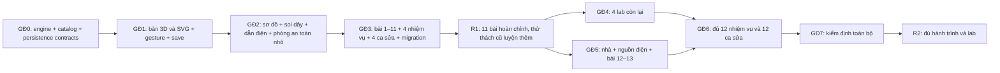

# Điện & Mạch điện — hợp đồng tương tác, lưu tiến độ và phát hành

Ngày 29/09/2026. Phụ lục triển khai cho [plan chính](../../electricity-wow-plan.md). Các kích thước, ngưỡng và thời gian trong tài liệu này là **quyết định thiết kế cần kiểm bằng bản thử**, không phải số đo đã đạt. Đại ca có thể giao từng gói dưới đây cho người triển khai mà không phải tự đoán cách xử lý điện thoại, tiến độ cũ hay mất WebGL.

## 1. Căn cứ code hiện tại và những quyết định thay thế

Đã đối chiếu `src/pages/ElectricityPage.tsx`, `src/components/electricity/{CircuitCanvas,PlaygroundView,circuitEngine}.tsx/ts`, `src/data/electricityData.ts`, `src/components/periodic/collectionStore.ts`, `src/pages/PeriodicTablePage.tsx`, `src/contexts/StudentContext.tsx`, `src/english/completion.ts`, `services/profileService.ts` và `types.ts`.

| Hiện trạng kiểm được trong repo | Quyết định cho bản mới |
| --- | --- |
| Bàn cũ lưu vị trí pixel; bản plan dùng ngang 14×8 và dọc 8×12 | Chỉ có một bàn logic **14×8**; portrait hiển thị **8×14**. Không đổi kích thước hay tọa độ mô hình khi resize |
| Hai khóa tiến độ cũ không chứa `studentId`; số sao nằm riêng trong `math_profiles` | Giữ thành tích cũ thành kho chung trên máy, không đoán người sở hữu; nhập vào hồ sơ chỉ khi người dùng chọn |
| Bài cũ được thưởng 1 sao; thử thách thưởng theo `difficulty`; việc ghi hoàn thành và cộng sao là hai lần ghi | Hoàn thành, dấu đã thưởng và số dư sao của bản mới ở cùng một bản ghi hồ sơ, commit một lần |
| Mẫu Bảng tuần hoàn có scoping tốt nhưng cộng sao từ snapshot React | Tái dùng quy ước tên khóa và kệ huy hiệu; thưởng Điện dùng action riêng có owner, đọc mới và ledger |
| Engine cũ chỉ tìm vòng kín | Fallback phát hành là SVG dùng **cùng engine mới**, không dùng kết quả sáng/tắt của engine cũ |
| Bài 2 cần cảnh an toàn; bài 7 cần lab vật dẫn, trước GĐ4 | Chuyển cảnh an toàn nhỏ và lab vật dẫn sang GĐ2; ngôi nhà đầy đủ vẫn GĐ5 |

## 2. Một bàn logic, nhiều cửa sổ nhìn

### 2.1 Tọa độ và phép chiếu

- `Circuit.board = { w: 14, d: 8 }`; tọa độ liên tục trong `[0,14]×[0,8]`, tâm/cọc bám lưới nguyên theo định nghĩa footprint. Mọi footprint phải nằm trọn trong biên có lề 0,5 ô. Dây đi trong hành lang lề được định nghĩa riêng.
- Dữ liệu bài học, mạch lưu, lời giải và undo đều dùng tọa độ canonical `(x,z)` này.
- Ngang: `T(x,z) = (x,z)`. Dọc: `T(x,z) = (z,14-x)`, nghịch đảo `T⁻¹(u,v) = (14-v,u)`. Đó là phép đổi hệ hiển thị; **không sửa `Part.rot` hoặc các post ID**.
- 3D thực hiện bằng camera/nhóm gốc của bàn; hit test đưa tia chạm về mặt phẳng bàn canonical. SVG dùng đúng `T`; cùng đầu vào màn hình phải ra cùng ô/cọc.
- Resize, chuyển 3D↔SVG, sơ đồ↔đồ chơi: hủy gesture đang dở, giữ circuit hash, lựa chọn và kết quả engine; fit lại camera. Không sinh undo entry, không chạy bộ giải do đổi hướng màn hình.
- Mạch từ prototype có tọa độ 14×8 giữ nguyên. Loại bỏ yêu cầu test “transpose hai lần” trên dữ liệu: thay bằng test `T⁻¹(T(p)) = p` và hash circuit không đổi sau 10 lần resize.

### 2.2 Điện thoại và vùng chạm

- Dùng chiều cao viewport khả dụng (`100dvh`), trừ header, safe area và panel nhiệm vụ. Ở dọc: câu dẫn tối đa 2 hàng, hộp đồ nghề là hàng cuộn ngang đóng/mở, panel thông tin là sheet; không chồng sheet đang mở lên vùng cần nối dây.
- Camera overview fit cả footprint và hành lang dây, lề tối thiểu 16 CSS px. Góc nhìn dọc cao hơn ngang để tránh bóng trước che cọc sau. Nút **“Vừa bàn”** luôn có.
- Không hứa mọi vật chạm được ở overview. Cọc có mục tiêu chạm **44×44 CSS px** ở chế độ tương tác; ngưỡng lấy theo màn hình, không cố định `0,45 ô`. Nếu hai mục tiêu chồng nhau, chọn linh kiện mở hai nút cọc A/B (hoặc +/− với pin), mỗi nút 44 px, đồng thời camera phóng nhẹ vùng đó. Không âm thầm chọn cọc gần nhất khi còn mơ hồ.
- Lớp 1–2 mặc định nối bằng **chạm cọc đầu → chạm cọc đích**; kéo dây vẫn có. Cọc nguồn giữ viền và nhãn trong suốt bước chọn đích. Pin có +/−; bóng dùng “Cọc A/B”; LED dùng “Anôt (+)/Catôt (−)” ở thẻ chi tiết.
- Bài dựng sẵn phải để các cọc quan trọng không bị thân linh kiện che ở cả hai hướng. Nếu bài không đạt, sửa seed/layout trước; không sửa topology hay tự dồn các linh kiện lúc xoay điện thoại.
- Di chuyển vào ô đang chiếm: ghost đỏ và trả về chỗ cũ khi thả. Thả đồ mới: ghost gợi ý ô trống gần nhất trong bán kính 2 ô, chọn theo khoảng cách rồi `z,x`; phải nhìn thấy vị trí trước khi thả. Không đẩy các linh kiện đã lắp đi chỗ khác.

## 3. Bộ điều phối gesture dùng chung 3D và SVG

`InteractionController` thu một dòng Pointer Events, giữ `Map<pointerId, pointer>`, phân quyền cho edit hoặc camera. R3F/SVG chỉ cung cấp `pick(screenPoint)`, `screenToBoard()`, `renderPreview()`; reducer phát `Command` sau commit. Không để `OrbitControls` và editor cùng xử lý một gesture.

| Trạng thái | Sự kiện | Hành vi / trạng thái kế tiếp |
| --- | --- | --- |
| `idle` | Down vào cọc | `pressPost`: ghi cọc và điểm đầu, chưa thêm dây |
| `pressPost` | Up với độ lệch <8 CSS px | `wireArmed`: viền cọc đầu, nhắc “Chọn cọc còn lại” |
| `pressPost` | Move ≥8 px | `wireDrag`: preview dây theo điểm chạm |
| `wireArmed` | Tap cọc khác | Nếu đích hợp lệ và route có đường: `AddWire` một lần → `idle` |
| `wireArmed` | Tap cọc nguồn / Escape / nền | Hủy chọn, không đổi mạch |
| `wireDrag` | Up tại đích hợp lệ | `AddWire` một lần → `idle`; thả ngoài đích thì hủy |
| `idle` | Down vào thân linh kiện | `pressPart`; không tự bật công tắc ở Down |
| `pressPart` | Move ≥8 px | `partDrag`: giữ vị trí gốc, preview vị trí mới; dây đi theo ghost |
| `pressPart` | Up <8 px | Công tắc thường: một lệnh toggle; tải/nguồn: chọn và mở lệnh |
| `partDrag` | Up hợp lệ | `MovePart` một lần; điện học không đổi nếu không đổi tiếp xúc |
| `partDrag` | Up ngoài bàn / footprint đè nhau | Phục hồi vị trí gốc; không tạo undo |
| `idle` | Down nút nhấn | `holdButton`: đóng ngay; Up/Cancel luôn mở lại |
| Bất kỳ state một ngón | Ngón thứ hai vào vùng bàn | Hủy preview edit; nhả nút nhấn; `cameraGesture` nhận cả hai ngón |
| `cameraGesture` | Hai ngón move | Pan theo tâm; zoom theo tỉ lệ khoảng cách; giới hạn camera |
| `cameraGesture` | Còn một ngón | `awaitAllUp`; không biến ngón còn lại thành kéo linh kiện |
| `awaitAllUp` | Tất cả ngón đã nhấc | `idle` |
| Bất kỳ | `pointercancel`, capture mất bất ngờ, blur, đổi hồ sơ, đổi scene, mở modal, mất context | Rollback preview, nhả mọi nút giữ, xóa active pointers → `idle` |

Quy tắc thực hiện:

1. Chỉ primary mouse button/pen contact sửa bàn; nút giữa chuột pan. Wheel zoom trong vùng bàn và clamp theo camera; ngoài bàn trang cuộn bình thường.
2. Đặt `touch-action: none` **trên surface tương tác**, không trên toàn trang. Trên toolbox cuộn ngang dùng `pan-x`; drag từ toolbox chỉ bắt đầu sau ngưỡng và hướng kéo vào bàn. Mỗi món cũng có nút “Đặt lên bàn” cho thao tác không kéo.
3. Capture tại surface canvas/SVG thực đang xử lý Pointer Events; không capture ở div bọc Canvas. Dùng một adapter sự kiện thay vì mix native capture với các handler R3F tự mutating. Pick đích dây từ screen position hiện tại, không từ `event.target` đã bị capture. Pointer Events quy định capture đổi nơi nhận sự kiện; trình duyệt có thể phát `pointercancel` và tự nhả capture khi Up/Cancel. [MDN Pointer Events](https://developer.mozilla.org/en-US/docs/Web/API/Pointer_events)
4. Khi Down trúng nhiều vùng, thứ tự ưu tiên: cọc → nút giữ → thân linh kiện → dây → nền. Dùng screen distance và bộ chọn khi mơ hồ. Tap dây chỉ chọn; nút “Cắt dây” 44 px mới xóa.
5. Preview của drag không ghi save, không ghi reward và không xét hoàn thành. Nút nhấn là thay đổi điện thực trong lúc giữ, nên có thể phát simulation event; nhả do cancel không được bỏ sót.
6. Undo/redo theo command, tối đa 50 bước. Một kéo, một dây, một lần xoay là một bước. Pin nóng/cháy theo thời gian không làm đầy history; undo topology phục hồi trạng thái điện liên quan từ snapshot command và giải lại. Undo sau khi đã nhận sao không xóa ledger, redo không thưởng lại.
7. “Dọn bàn” có xác nhận nội bộ bằng hai lựa chọn “Dọn”/“Giữ bàn”, sau đó một undo entry. Đổi bài lưu draft trước; không tự ghi đè mạch đặt tên.

### 3.1 Bàn phím, đọc màn hình và giảm chuyển động

- DOM companion phản ánh danh sách linh kiện/cọc/dây theo thứ tự ổn định; nhãn chứa tên và trạng thái, ví dụ “Bóng 1, cọc A, đã nối với cực dương pin”. Canvas không phải vùng duy nhất để thao tác.
- Tab tới toolbar → danh sách linh kiện → cọc; trong mỗi nhóm dùng mũi tên di chuyển focus. Enter trên cọc là chạm-chạm nối; Escape hủy. Khi đang chọn linh kiện, mũi tên di chuyển từng ô, R xoay 90°, Delete xóa kèm dây liên quan thành một command; input đặt tên không nhận phím tắt của bàn.
- Space trên nút nhấn đóng khi keydown, mở khi keyup/blur; Space trên công tắc bật/tắt một lần, bỏ qua `event.repeat`.
- Focus ring ở DOM và halo trên bàn cùng đối tượng. Thay đổi “mạch kín”, đèn tắt, lỗi nối dây đọc bằng vùng `aria-live=polite`, gom sự kiện và không đọc lặp mỗi frame.
- `prefers-reduced-motion`: morph thành fade ≤150 ms, camera đi thẳng tới đích, electron thành mũi tên thưa, không rung/nảy/quầng nhấp nháy. Công suất và cách làm bài vẫn nguyên.
- Nút **“Nghe lại”**, phụ đề và **“Tiếp tục”** luôn có. Tắt tiếng hoặc TTS lỗi không chặn bài. Auto advance chỉ khi câu đọc đã kết thúc và người dùng hoàn thành thao tác; người dùng có thể chọn Tiếp tục ngay.

## 4. Routing, giao cắt và điểm nối

### 4.1 Hợp đồng đường dây

- Wire chỉ nối `PostRef` theo ID. Hình học không tạo tiếp xúc điện: hai dây cắt trên màn hình, đè nhau hoặc đi sát đều **không tự nối**.
- `route(circuit, wire)` dùng lưới routing 0,5 ô; post chính xác trên lưới linh kiện nguyên. Raster footprint cộng clearance 0,25 ô. Đầu dây rời cọc theo hướng cọc đến một điểm lead-out trước khi đi vuông góc.
- Thuật toán A* state `(x,z,heading)`; cost cơ sở 1/đoạn, đổi hướng +2, cắt dây khác +8, dùng lại đoạn không chung đầu +12. Nếu nhiều nghiệm bằng nhau, thứ tự hướng cố định +x,+z,−x,−z, rồi tie-break tọa độ. Duyệt wire theo ID tạo cố định. Những số này là tham số mỹ thuật, không đi vào engine vật lý.
- Không cho route xuyên footprint hoặc qua cọc không phải đầu dây. Khi không còn đường hợp lệ: preview đỏ, ghi “Chừa một lối cho dây nhé”; không thêm dây xuyên linh kiện.
- Kéo linh kiện thử reroute dây gắn nó cùng các tuyến cũ bị footprint mới chắn. Chạy preview gộp một lần mỗi frame; sau commit tính lại tất định toàn bộ tuyến cần sửa. Chỉ “dây gắn với vật đang kéo” là chưa đủ để tránh cắt các dây khác.
- Cùng hai PostRef đã có dây: báo “Hai cọc này đã nối rồi”, không tạo dây trùng. UI và import so cặp endpoint không thứ tự, nên dây A→B và B→A là trùng. Đây là ràng buộc editor để tránh thao tác vô tình: solver vẫn xử lý nhiều nhánh điện hợp lệ giữa cùng hai nút trong raw netlist và trong các bài kiểm engine. Dây nối hai cọc khác nhau của cùng linh kiện được phép: đó có thể là bypass/đoản mạch cần dạy. Dây từ cọc về chính nó bị từ chối.
- Route là dữ liệu dẫn xuất, không lưu cùng circuit. Store thêm `routerVersion` trong preset/ảnh kiểm tra nếu cần so sánh hình; thay thuật toán route không đổi mạch điện.

### 4.2 Quy ước nhìn thấy phải đúng với topology

| Tình huống | Bàn đồ chơi | Sơ đồ |
| --- | --- | --- |
| Hai dây khác nhau giao cắt | Dây có ID xếp sau nhô lên một cầu nhỏ; lõi không chạm | Cầu vượt bán nguyệt hoặc khoảng ngắt ở một tuyến; **không có chấm** |
| Nhiều dây cùng đến một cọc | Các đầu kẹp cùng vào cọc đồng; fan-out ngắn tách lane | Một chấm ở nút nhánh thật, các nhánh chụm đúng tâm |
| Điểm nối trống giữa bàn | Dùng linh kiện `junction` một nút điện, đầu nối rõ ràng | Chấm nút và các nhánh nối tới nó |
| Hai tuyến đi trùng đoạn | Tách lane bằng offset đối xứng theo ID, không cắt gấp tại đầu | Tách lane; không nhập thành một net chỉ vì trùng hình |

`junction` là hạt nối nhỏ của hộp đồ nghề, một `PostRef`, không phải một nguồn/tải. Không cần thao tác “bấm vào chỗ hai dây cắt nhau để nối” ở R1. Nếu sau này có lệnh “Tạo điểm nối ở đây”, lệnh phải tạo junction và tách dây rõ ràng, một undo transaction.

Chấm nhánh xác định bằng bậc của **nút hiển thị**, tính cả chân linh kiện ở cọc. Hai dây + một chân bóng đã là ba nhánh. Không dùng quy tắc sai “đủ ba dây mới có chấm”. Không chấm mọi giao điểm cùng điện thế: cùng điện thế không đồng nghĩa có tiếp xúc tại nơi đó.

Kiểm route bắt buộc: giao chéo không nối, hai dây chung cọc nối, junction ba nhánh, bypass bóng gây thay đổi dòng đúng, dây trùng bị chặn, vòng đi tránh linh kiện vừa di chuyển, đổi portrait giữ nguyên endpoint và topology, không dây chui dưới mặt bàn.

### 4.3 Mạch song song để dạy: nhìn thấy ngay hai đường riêng

**Quyết định bắt buộc theo góp ý của Đại ca:** preset song song dùng trong bài học, mở màn so sánh, ảnh giới thiệu và bằng chứng nghiệm thu phải nối **mỗi bóng trực tiếp về cả hai cực pin bằng hai sợi dây riêng**. Hai bóng dùng bốn dây. Không nối chuyền từ cọc bóng này sang cọc bóng kia, dù cách đó có thể đúng về điện; trẻ cần nhận ra hai nhánh độc lập chỉ bằng nhìn hình.

Fixture tối thiểu, với pin `B`, hai bóng `L1`, `L2`:

```text
Song song (4 dây):                 Nối tiếp (3 dây):
B.+ ─── L1.A                       B.+ ─── L1.A
L1.B ─── B.−                       L1.B ─── L2.A
B.+ ─── L2.A                       L2.B ─── B.−
L2.B ─── B.−
```

Danh sách trên là kết nối endpoint để kiểm tự động, không là bố cục màn hình. A/B là tên hai tiếp điểm của bóng, không là cực điện cố định.

- **Bàn đồ chơi:** đặt pin ở khoảng giữa hai bóng; một nhánh đi vùng trên, một nhánh đi vùng dưới (đổi thành hai bên khi camera portrait nếu cần). Mỗi nhánh tạo một đường nhìn liên tục: cực + → dây → bóng riêng → dây → cực −. Bốn đầu dây tại pin đều nhìn thấy, fan-out ngắn tách nhau; chỉ cùng chạm tại hai cọc pin. Không chồng thành một thân dây chung, không giao cắt, không đi xuyên linh kiện và không khuất sau hộp pin.
- **Sơ đồ:** giữ hai bóng ở hai nhánh tách biệt giữa cùng hai nút nguồn; điểm chung đánh dấu rõ tại cực +/−. Giữ nhận dạng nhánh 1/2 và liên hệ vị trí với bàn đồ chơi qua morph. Sơ đồ không được gộp hình thành một chuỗi hai bóng hoặc khiến người xem phải lần ngược dây mới biết đâu là nhánh.
- **Routing preset:** thêm `presentationHints.branchCorridors` cho các wire ID của từng nhánh; đó là hành lang trình bày, không là net điện và không sửa kết quả solver. Các preset dạy song song cấm giao cắt và cấm dây chạy trùng đoạn ngoài fan-out tại cọc. A* phải tìm route trong hành lang đã khai báo; nếu không tìm được, bài test seed thất bại để sửa bố cục, không lặng lẽ trở về dây nối chuyền.
- **Chạm một bóng hoặc nhãn “Nhánh 1/2”:** làm nổi toàn bộ đường của riêng nhánh đó từ + về −, gồm hai dây, hai tiếp điểm và bóng; nhánh còn lại giảm nhấn. Giữ đủ tương phản để vẫn thấy nó đang sáng. Nhãn ngắn: “Mỗi bóng có một đường riêng tới pin”. Màu nhấn thể hiện nhánh đang chọn, không đổi nhãn A/B của bóng thành +/−.
- **Vặn lỏng/tháo bóng 1:** chỉ bóng 1 và dòng trên nhánh 1 dừng; bóng 2 tiếp tục sáng theo nghiệm solver mới. Nếu nguồn có nội trở, độ sáng bóng 2 có thể tăng nhẹ khi bỏ tải — không hardcode giữ nguyên tuyệt đối. Gắn chú thích “Nhánh kia vẫn kín”. Thử cùng hành động ở nối tiếp: cả hai bóng tắt.
- **Bàn tự do:** vẫn chấp nhận các cách mắc tương đương đúng, kể cả nối chuyền các cọc cùng nút điện. Validator phân loại bằng topology/kết quả điện, không đếm “bốn dây trực tiếp” để quyết định đúng sai của mạch do bé tự lắp. Ràng buộc trực tiếp bốn dây áp dụng cho **preset trình bày của bài học**, không phải định nghĩa vật lý của song song.

Gate riêng cho preset so sánh: pin và hai bóng giống nhau giữa hai phía; phía nối tiếp có một đường qua cả hai bóng, phía song song có hai đường riêng về pin. Chụp đủ bàn đồ chơi và sơ đồ ở 1280×800 lẫn 390×844; ở kích thước hiển thị thật phải phân biệt được bốn dây, không có nối chuyền tải, giao cắt hoặc đoạn che khuất. Clip bắt buộc chọn từng nhánh rồi vặn lỏng từng bóng ở cả hai loại mạch. Test cấu trúc kiểm đúng bốn endpoint pair ở fixture song song; test solver kiểm nhánh còn lại vẫn dẫn khi một bóng bị mở. Cả hai phải đạt, vì ảnh đẹp không thay được topology đúng và topology đúng chưa bảo đảm ảnh dễ hiểu.

## 5. Một lần hoàn thành, một lần thưởng

### 5.1 Nguồn dữ liệu chính

Tiến độ có ảnh hưởng tới sao lưu trong `StudentProfile.electricity`, cùng `StudentProfile.stars` ở `math_profiles`. `electricityBadges` là trường trình bày đồng bộ từ tiến độ; không làm nguồn riêng để quyết định đã cộng sao hay chưa.

```ts
interface ElectricityProgressV1 {
  schema: 1;
  revision: number;
  completions: Record<string, {
    completedAt: string;
    contentVersion: number;
    best: 1 | 2 | 3;
    evidence: string[]; // mã action/kiểm định, không phải mọi frame
  }>;
  awards: Record<string, {
    stars: number;
    awardedAt: string;
    source: 'lesson' | 'mission' | 'fault' | 'badge';
  }>;
  badges: string[];
  counters: { fixedFaultIds: string[]; sortedObjectIds: string[]; drawnPresetIds: string[] };
  legacy?: { snapshotId: string; lessonIds: number[]; challengeIds: string[]; importedAt: string };
}
// awardId ổn định: electricity:lesson:L03-firstLight:complete,
// electricity:badge:firstLight.
// Sao từng mức: electricity:mission:flashlight:tier:1, ...:tier:2, ...:tier:3.
// Dùng đúng ID trong content-spec; không lấy số thứ tự hiển thị làm ID.
```

- ID thưởng không ghép random session hoặc contentVersion. Chỉnh lời dẫn hay vật liệu không được làm bài tự nhận thưởng lần hai.
- Với nhiệm vụ tối đa N sao: mức 1 thưởng 1 sao; nâng từ 1 lên 3 thêm 2 sao bằng hai tier ID còn thiếu. Lặp mức 3 cộng 0. Bài học hoàn thành thưởng 1 sao; huy hiệu +10 sao, đúng một badge ID.
- Mức đạt của mission phải có ba predicate riêng, không dựa vào đếm hiệu ứng hoặc chạm nút Kiểm tra. `best` và tier ledger commit cùng lúc. Bài chỉ hỗ trợ tối đa 1/2 sao không thể phát tier ngoài phạm vi.
- Huy hiệu xét từ hành động thực đã lưu, không tự trao từ `legacy`. Ví dụ `seriesParallel` phải có evidence vặn lỏng bóng ở cả hai topology; `sorter` đếm ID vật phân loại đúng, không đếm click.

### 5.2 Action lưu và lỗi ghi

Thêm action `completeElectricity(ownerId, completionCommand)` vào `StudentActionsType`, và module reducer thuần `applyElectricityCompletion(latestProfile, validatedCommand)`. Capture owner khi bắt đầu phiên; kiểm lại trước commit. Canvas không được gọi trực tiếp `updateStudent({...currentStudent, stars: ...})`.

Luồng commit:

1. Chờ khóa `genius-electricity-profiles` qua Web Locks; mọi tab Điện, nhập legacy và cấp huy hiệu dùng cùng khóa. Khóa dùng để phối hợp các bên cùng tuân thủ tên khóa, không phải khóa vật lý tự chặn mọi lần ghi localStorage. [MDN Web Locks](https://developer.mozilla.org/en-US/docs/Web/API/Web_Locks_API)
2. Kiểm owner còn được chọn và hồ sơ còn tồn tại; đọc lại `math_profiles`, không dùng snapshot lúc gesture bắt đầu.
3. Validate command/evidence theo content, tính các award ID còn thiếu; union tiến độ và huy hiệu; tăng sao bằng tổng delta đó. Không có `await` giữa lần đọc cuối và ghi.
4. `saveProfiles(updated)` một lần. Chỉ sau khi thành công mới đổi `studentsRef`, React state và phát âm thanh/toast thưởng. Lỗi quota/private mode trả `{ok:false, pending:true}`; vẫn cho chơi, hiện “Chưa lưu được, thử lại”, giữ cùng command ID để retry.
5. Refresh sau crash đọc ledger; có entry thì trả thành công với `earned=0`. Ghi draft phụ thất bại sau bước 4 không khiến thưởng được phát lại.

Không có Web Locks: vẫn chơi, giữ kết quả chờ và cho xuất mạch, nhưng chưa cấp sao bền vững; hiện một thông báo ngắn về lưu tiến độ. Không giả lập mutex bằng `localStorage.setItem('lock')` vì thao tác đó không có compare-and-swap.

**Giới hạn tích hợp phải ghi đúng:** hiện các writer khác trong app chưa dùng chung một khóa (English dùng tên khóa riêng). Cơ chế trên bảo vệ các tab Điện với nhau, không chứng minh được hai module khác nhau đồng thời cập nhật cùng `math_profiles`. GĐ0 phải thêm kiểm thử tái hiện trường hợp này. Nếu phạm vi phát hành yêu cầu bảo đảm liên module, cần nâng `profileService` và mọi writer sang một coordinator chung trước khi tuyên bố bảo đảm đó; không được giải quyết bằng việc copy lại snapshot cũ. Đây là hạn chế sẵn có cần thể hiện trong ghi chú kỹ thuật, không chặn thao tác học thường ngày một tab.

### 5.3 Đổi, xóa hồ sơ và khách

- Khi đổi hồ sơ: hủy gestures, TTS, timer và completion callback cũ; save draft theo owner cũ đã capture; load dữ liệu owner mới. Callback cũ tới muộn bị từ chối, không chuyển thưởng cho người vừa chọn.
- `guest` có tiến độ tạm/nháp riêng; không cộng vào sao tài khoản. Chọn một hồ sơ không tự nhận thành tích khách. Bản lưu có thể được “Sao chép vào sổ của…” qua thao tác rõ ràng.
- Xóa hồ sơ dọn draft/notebook theo đúng ID và DB index; không xóa kho legacy chung của máy hay dữ liệu các bé khác.
- Phản hồi `storage` tải lại tiến độ từ nguồn chính; khi tab đang kéo chỉ cập nhật sau khi hủy/commit gesture theo revision, không thay circuit giữa thao tác.

## 6. Di chuyển dữ liệu cũ mà không gán nhầm hay cộng trùng

Hai khóa `electricity_completed_lessons` và `electricity_completed_challenges` **không có owner và không chứng minh số sao đã nhận bởi hồ sơ nào**. Tổng sao hiện có trong từng hồ sơ là dữ liệu phải giữ nguyên; không tính lại bằng số bài cũ.

### 6.1 Quy trình duy nhất

1. Đọc/validate hai mảng; giữ lesson ID nguyên 1–8 và challenge ID đã khai báo trong code (`e1..e5`, `m1..m6`, `h1..h4`). Dedupe, sort. Dữ liệu lỗi JSON được sao lưu raw để có thể khôi phục, không ghi đè bằng mảng trống.
2. Lưu snapshot `electricity_legacy_archive_v1`, gồm dữ liệu chuẩn hóa và `snapshotId` tất định. Giữ nguyên hai khóa gốc trong ít nhất một bản phát hành; không còn ghi thêm vào chúng khi ở giao diện mới.
3. Sảnh có mục nhỏ **“Thành tích cũ trên máy”**, xem 8 bài/15 thử thách đã làm. Không tự chép vào tất cả hồ sơ và không gán cho hồ sơ đầu tiên mở trang.
4. Có nút tùy chọn **“Đưa vào hồ sơ [tên đang chọn]”**. Dòng giải thích: “Thành tích cũ dùng chung trên máy. Sao đang có được giữ nguyên.” Chọn nhận là chỉ nhận thông tin lịch sử; không thưởng sao, không cấp huy hiệu và không mark bài mới hoàn thành.
5. Ghi nhận claim của `snapshotId` trong `StudentProfile.electricity.legacy` dưới cùng khóa thưởng. Kiểm toàn bộ hồ sơ trước claim; một snapshot chỉ có một owner. Một mirror ở archive chỉ giúp hiển thị, không là nguồn quyết định claim, tránh hai commit lệch nhau.
6. Retry/mở lại đọc claim trong hồ sơ; không nhập lần hai. Nếu owner bị xóa, archive vẫn còn nhưng hiện “Đã từng gắn với hồ sơ đã xóa”; không tự chuyển owner. Claim giữ trong archive sau khi xóa là dấu chống tự nhập lại, không chứa thông tin cá nhân ngoài ID.

### 6.2 Bảng nối lịch sử với nội dung mới

| Bài cũ | Nội dung hiện tại trong code | Bài mới đề xuất tiếp tục | Cách thể hiện sau import |
| --- | --- | --- | --- |
| 1 | Dòng điện là gì? | 3, Soi dây | Nhãn “Đã xem bản cũ”; vẫn làm mới từ thao tác |
| 2 | Mạch kín và mạch hở | 4 | Nhãn lịch sử, mở gợi ý tiếp tục bài 4 |
| 3 | Nguồn điện – Pin | 6, 9 | Không tự hoàn thành thử cực pin/điện áp mới |
| 4 | Công tắc điện | 5 | Không tự công nhận điều khiển độc lập mới |
| 5 | Lắp mạch đơn giản | 3 | Nhãn lịch sử, không trao lại sao cũ |
| 6 | Mạch nối tiếp | 10 | Cần thực hiện so sánh độ sáng và vặn lỏng mới |
| 7 | Mạch song song | 11 | Cần thực hiện nhánh độc lập mới |
| 8 | So sánh và ứng dụng | 10, 11 | Nhãn lịch sử, không suy ra hai bài mới đều xong |

Thử thách cũ giữ nguyên ID trong archive; `m4` gợi ý Quạt thổi nến, `h1`/`h3` gợi ý Phòng thông minh, `h2` gợi ý Báo trộm. Hoàn thành nhiệm vụ mới có predicate mới được tính là phần học mới và có ledger mới; đó không phải phát lại phần thưởng legacy. **Chơi lại kho thử thách cũ không phát sao mới**, bất kể trước đó đã hoàn thành hay chưa; nhãn nói rõ “Luyện thêm”.

## 7. Sổ sáng chế và nháp đang chơi

```ts
interface CircuitDocumentV1 {
  schema: 1;
  id: string;
  ownerId: string;
  revision: number;
  title: string; // trim, 1–40 kí tự hiển thị
  createdAt: string;
  updatedAt: string;
  circuit: Circuit; // board14×8, parts, wire endpoint IDs, trạng thái pin/bóng
  source?: { type: 'sandbox' | 'lesson' | 'mission'; id: string };
  view: { mode: 'bench' | 'schematic'; night: boolean };
  thumbnailKey?: string;
}
```

- IndexedDB `electricity-notebook-v1`: stores `documents`, `drafts`, `thumbnails`, index theo `ownerId`; tối đa 12 document/owner, 1 draft đang chơi cho mỗi mode. Khóa draft luôn gồm owner. Không nhét base64 ảnh vào `math_profiles`.
- Giới hạn **editor và import R1**: ≤24 linh kiện, ≤40 dây, JSON document ≤128 KiB. Bộ giải có hard limit riêng **64 linh kiện/128 dây** để kiểm raw netlist và có dư địa cho dụng cụ/adapter; giới hạn engine không làm tăng giới hạn mà hộp đồ nghề cho lắp. Import vượt giới hạn editor phải báo rõ và giữ file gốc, không âm thầm cắt bớt. Thumbnail 256×160 WebP ≤40 KiB là mục tiêu, vượt thì giảm chất lượng hoặc bỏ ảnh. Thumbnail là tùy chọn: lưu mạch thành công không phụ thuộc chụp ảnh WebGL.
- Save snapshot tại command commit, debounce 600 ms cho nháp; flush trước đổi bài. Ghi `{document, thumbnail}` theo transaction khi ảnh sẵn; nếu ảnh lỗi, dùng SVG thumbnail sinh từ circuit. Save revision theo compare với bản đang lưu; xung đột hai tab mở bản “Bản sao từ tab khác”, không ghi đè im lặng.
- Lưu mức pin `charge01` (0–1), `broken`, `loose`, cells, switch và trạng thái cầu chì; không lưu dòng điện, route mesh, nhiệt tạm, phase electron. Mở lại giữ pin đã dùng và linh kiện hỏng/lỏng đúng bản lưu, giải mới, nhiệt về môi trường, đồng hồ không tiến khi đóng app. Nút rõ **“Thay pin/bóng mới”** phát command phục hồi linh kiện được chọn; thao tác này có thể undo/redo. Không tự thay pin hoặc sửa bóng khi mở sổ; thumbnail phản ánh đúng trạng thái đã lưu.
- Import mạch (nếu làm) chỉ nhận schema hiểu được, tọa độ hữu hạn trong biên, ID duy nhất, kind thuộc catalog, endpoint tồn tại, không có hai dây trùng cặp endpoint và không vượt giới hạn editor. Schema tương lai mở read-only với “Bản lưu cần phiên bản mới hơn”; không tự xóa. Ngoài phạm vi không thêm đồng bộ cloud hoặc chia sẻ công khai.
- IDB lỗi: giữ mạch trong RAM, báo chưa lưu và cho “Tải mạch JSON”; hoàn thành bài/thưởng vẫn phụ thuộc commit hồ sơ riêng, không giả vờ sổ đã lưu.

## 8. Fallback và phục hồi phải là một sản phẩm hoàn chỉnh

- GĐ1 xây `SvgBench` dùng cùng `Circuit`, `solve/analyze`, controller, command, content validator, progress action và DOM HUD. 3D là một renderer khác, không là nơi giữ nguồn dữ liệu chính.
- Khởi động không có WebGL2 hoặc tạo renderer lỗi → SVG tự động. Shader timeout → vẫn hiện “Đang bày bàn…” với nút **“Dùng bàn sơ đồ”**, không nhìn màn trắng. `webglcontextlost`: chặn tác vụ renderer, giữ model bên ngoài Canvas, cancel gestures, chuyển SVG; “Thử lại 3D” là tùy chọn.
- SVG có đủ đặt/xoay/nối/cắt, công tắc/nút nhấn, đèn theo công suất, night bằng tương phản, sơ đồ, lời dẫn, đọc to, save/load và reward. Soi dây/nhìn trong có hình cắt SVG theo các bước với cùng chú thích. Các lab R2 và ngôi nhà phải có giao diện DOM/SVG đạt mục tiêu học trước khi được mở cho fallback.
- 3D→SVG giữa bài không đổi solution hash, completion predicate, số sao, vị trí hoặc undo. Máy thấp không bị dạy lại “hai bóng nối tiếp sáng như song song”.
- `legacy/` chỉ để so sánh/dev trong thời gian chuyển đổi. Khi cần hiển thị 15 đề cũ, adapter chuyển seed/đề sang engine mới và chung UI lưu; không nối toàn bộ component cũ có hàm cộng sao vào app mới.
- Chỉ xóa legacy source khi adapter, archive và migration đã kiểm; archive dữ liệu của người dùng không bị xóa cùng source.

## 9. Những khoảnh khắc khiến bàn có cá tính

Theo đúng ảnh hub và prototype: mặt bàn kem, chân đồng xước nhẹ, nhựa xanh ngọc, dây san hô, ánh đèn mật ong. Chọn 3 điểm nhấn dưới đây cho R1; không chất thêm confetti quanh mọi thao tác.

| Khoảnh khắc | Choreography cụ thể | Điều kiểm được |
| --- | --- | --- |
| **Bàn sống lại trong tay bé** | Down cọc làm vòng đồng sáng viền; dây tạm bám đầu ngón; snap có tiếng “tách” nhỏ. Khi mạch kín, dây tóc lên nhiệt và vệt sáng lan trên mặt bàn, bảng tên nhiệm vụ hiện “Em vừa thắp sáng căn phòng” | Không trì hoãn solver để chờ hiệu ứng. Chỉ có một lần chime khi chuyển chưa đạt→đạt |
| **Hai cách nối, một câu trả lời** | Đặt hai mạch mẫu cạnh nhau; song song có bốn dây riêng về hai cực pin như mục 4.3, chọn bóng thì nổi trọn nhánh. Nút “Vặn lỏng cùng lúc” cho thấy một bên tối cả, bên kia còn một đèn. Trên điện thoại chia hai vùng trên/dưới, camera đứng yên | Cả hai mạch đều được giải; preset không có dây nối chuyền giữa hai bóng ở phía song song; clip có chọn nhánh và tháo từng bóng |
| **Thế giới nhỏ nằm trong sợi dây** | Chọn dây và nút kính lúp; camera khóa vào sợi dây, vỏ nhựa tách, xuất hiện thước tỉ lệ và copper lattice cùng phong cách Bảng tuần hoàn | Không dùng pinch một ngón trên dây để vào dive vì tranh chấp với zoom bàn; luôn có “Về bàn”, giữ nguyên mạch |
| **Bản thiết kế từ chính phát minh của bé** | Trong Sổ sáng chế, ảnh đồ chơi và tờ sơ đồ là hai mặt cùng một mạch; tên bé ở nhãn giấy, dấu “Mạch hoạt động” chỉ có khi validator đúng | Thumbnail của đúng circuit, không ảnh ngẫu nhiên; font tiếng Việt rõ ở 390 px |

Chế độ so sánh là preset học tập trong scene, không nhân đôi toàn bộ Canvas. “Vặn lỏng cùng lúc” phát hai command vào hai model so sánh, còn tiến độ chỉ xét khi bài yêu cầu đã thực hiện. Mở màn hiện lần đầu theo hồ sơ, sau đó có nút **“Thắp sáng lại”** trong sảnh; không bắt xem lại mỗi lần vào bài.

## 10. Phụ thuộc phát hành và bằng chứng nghiệm thu



R1 không ghi “thay toàn bộ module cũ” rồi bỏ mất thử thách: phải có 4 nhiệm vụ mới chơi hết và archive 15 đề cho luyện lại. Bản đồ/sảnh R1 **chỉ hiện nội dung đã phát hành và chơi được**; không có cửa “Sắp mở”, màn trắng hoặc nút bấm không tác dụng. R2 bổ sung các cửa tương ứng khi nội dung đạt nghiệm thu. Bài 12–13 không tính vào mẫu số tiến độ R1; ghi rõ “11 nhiệm vụ đang mở”.

| Gate | Ca kiểm bắt buộc | Bằng chứng cần lưu |
| --- | --- | --- |
| GĐ0 lưu | Double callback, retry sau crash, hai tab Điện, đổi/xóa owner, quota fail, malformed legacy, claim lặp, nâng sao 1→3→3 | Test tự động với expected ledger và balance; ghi rõ giới hạn cross-module |
| GĐ1 điện thoại | 390×844 và 844×390; nối 2 bóng song song bằng chạm-chạm và kéo; cancel giữa drag; thêm ngón thứ hai; nhả nút giữ ngoài bàn | Clip tương tác thật, kết quả circuit JSON, ảnh vùng hit target |
| GĐ1 fallback | Force SVG lúc khởi động, context loss giữa drag, cùng preset 3D/SVG | Solution hash và predicate bằng nhau; không thêm sao |
| GĐ2 sơ đồ | 10 preset, giao cắt/nhánh đúng, cùng endpoint sau morph/resize, đọc bằng bàn phím | Ảnh đối chiếu hai renderer và keyboard walkthrough |
| GĐ2 song song dễ hiểu | Hai bóng có bốn dây riêng trực tiếp về pin, hai nhánh tách rõ, chọn nổi trọn nhánh, tháo một bóng không tắt nhánh kia; so với nối tiếp ba dây | Ảnh bàn đồ chơi và sơ đồ ở desktop/phone, clip chọn/tháo từng nhánh, fixture endpoint và kiểm solver mục 4.3 |
| GĐ3 tiến độ | Hai hồ sơ và guest; legacy không tự gán; nhập không cộng sao; bài mới có evidence; tab restore không thưởng lại | Fixture trước/sau `math_profiles`, total stars không đổi bởi migration |
| GĐ3 nội dung | Làm hết 11 bài gồm safety và conductors; 4 nhiệm vụ/4 ca sửa có lời giải và ca sai; TTS tắt vẫn đi hết | Content tests + clip happy path |
| R1 chất lượng | Production build, test phù hợp, console sạch ở thao tác lõi; đo thiết bị thật, báo riêng máy và browser dùng | Báo cáo đo, không lấy ảnh prototype làm bằng chứng sản phẩm |

Các ca persistence/gesture phải viết vì đây là rủi ro mất dữ liệu và hành vi dễ sai; không cần tạo test cho từng màu, border hay thời lượng hiệu ứng. Khi gate chưa chạy, trạng thái là **chưa kiểm**, không ghi đã đạt chỉ vì kế hoạch có mục đó.
