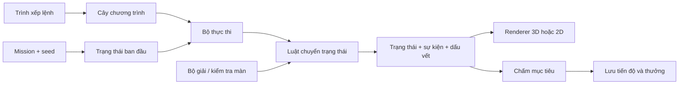

# KidCoder: Biệt đội Rover — kế hoạch làm lại

Ngày: 08/09/2026. Trạng thái: **đã triển khai bản v2 tại local; đã qua kiểm thử tự động và kiểm tra trình duyệt. Chưa phát hành hoặc nghiệm thu trên thiết bị cảm ứng thật/người chơi nhỏ tuổi.**

Báo cáo hiện trạng, các điều chỉnh so với đề xuất và kết quả kiểm tra nằm trong [kidcoder-implementation.md](D:/Quyetnm/Dev/mathgenius-kids/docs/kidcoder-implementation.md). Phần bên dưới giữ lại cơ sở thiết kế ban đầu; các mục tiêu trải nghiệm và hiệu năng không mặc nhiên trở thành kết quả đã đo.

Kế hoạch dựa trên việc đọc KidCoder, bộ sinh/giải màn, hồ sơ học sinh và các bộ dựng hình của Hệ Mặt Trời/Xưởng hành tinh trong project. Những nhận xét hiện trạng bên dưới là kết quả đọc mã nguồn; các chỉ tiêu hiệu năng và thời lượng phát triển là mục tiêu cần kiểm chứng khi triển khai.

## 1. Quyết định sản phẩm

Làm KidCoder thành trò chơi lập trình rover thám hiểm: chọn điểm đến trên bản đồ hành trình, chuyển cảnh xuống một khu vực nhỏ, xếp lệnh, chạy thử, quan sát lỗi và sửa chương trình. Rover phân tích mẫu vật, kích hoạt trạm nghiên cứu và mở đường tới đích.

Phạm vi bản v2 đề xuất:

- **40 nhiệm vụ được thiết kế và kiểm chứng, chia 5 chương × 8 bài**; thêm luyện tập có seed sau khi học khái niệm.
- Lứa tuổi thiết kế chính: khoảng 6–11; mở bài theo kỹ năng đã học, cho phép chọn bài dễ hơn. Hướng dẫn có hình và đọc tiếng Việt, không cần gõ mã.
- Mỗi nhiệm vụ hướng tới 3–8 phút; cho thử lại, dùng gợi ý và chạy chậm. Thời gian được ghi nhận để tham khảo, không dùng làm điều kiện thắng.
- Trình xếp lệnh hỗ trợ chuỗi lệnh, lặp hữu hạn, điều kiện; có kéo thả, sửa tại chỗ, chạy từng bước và xem bước sai.
- Bàn chơi 3D góc nhìn cố định, lưới logic 6×6 đến 10×10. Có chế độ 2D dùng cùng luật chơi.
- Giữ sao và lịch sử KidCoder cũ. Tiến độ chiến dịch mới có mã riêng.
- Mốc chơi thử đầu tiên: **12 bài hoàn chỉnh** gồm chương 1 và bốn bài đầu chương 2.

Tên hiển thị đề xuất: **KidCoder — Biệt đội Rover**. Trong menu game tiếp tục nhận diện KidCoder để học sinh cũ tìm thấy.

## 2. Những phần hiện tại cần xử lý

| Hiện trạng đã thấy trong mã | Hệ quả đối với bản mới | Quyết định |
|---|---|---|
| Curriculum có 45 bài trong 5 cấp; bản đồ được sinh khi vào bài | Có sẵn ý tưởng tăng độ khó, nhưng bài học và biến thể chưa tách rõ | Thiết kế 40 bài mới với mục tiêu học cụ thể; luyện tập sinh ngẫu nhiên là chế độ riêng |
| `loop` có trong `CommandType`, chưa có nút/chương trình lồng hay nhánh thực thi tương ứng | Chưa thể coi vòng lặp là tính năng đã có | Xây cây chương trình và bộ thực thi lặp thật |
| `solveLevel` lưu vị trí, hướng, trạng thái chìa khóa; hộp là vật cản tĩnh, không theo dõi đủ vật phẩm/quái vật đã xử lý | Không đủ để xác nhận bài đẩy hộp, thu thập đầy đủ hoặc tối ưu chương trình mới | Bộ giải và gameplay gọi chung luật chuyển trạng thái |
| Sinh màn dùng `Math.random`, thử tối đa 300 lần và gọi bộ giải đồng bộ | Khó tái lập lỗi; có khả năng gây khựng khi tìm màn | Seed ổn định, ngân sách tìm kiếm, chuyển luyện tập sang Worker |
| Luật thắng kiểm tra đích và chìa khóa; không bắt buộc thu đủ `requiredStars` | Mục tiêu hiển thị và điều kiện hoàn thành chưa gắn chặt | Mục tiêu bắt buộc/điểm thưởng được khai báo tường minh |
| Thu thập và hiển thị sao trên bàn phụ thuộc `isStageCompleted` | Chơi lại không giữ nguyên trải nghiệm vật phẩm | Trạng thái thế giới và lịch sử nhận thưởng tách nhau |
| `addGameResult` chỉ được gọi trong `handleNextLevel` | Thắng rồi rời game trước khi bấm tiếp có thể chưa lưu kết quả | Ghi nhận tại sự kiện hoàn thành, trước bước chuyển màn |
| Kết thúc bài cuối vẫn tăng `levelId + 1` | Có thể đi ra ngoài curriculum | Màn tổng kết chiến dịch, chọn lại bài hoặc luyện tập |
| Logic di chuyển, thời gian chạy, UI và thưởng nằm chung trong `KidCoderGame` | Khó đồng bộ khi thêm tạm dừng, lặp, điều kiện và 3D | Tách engine, phiên chạy, trình soạn thảo, renderer và tiến độ |

Nguồn trong project:

- [KidCoderGame.tsx](D:/Quyetnm/Dev/mathgenius-kids/games/KidCoder/KidCoderGame.tsx): thao tác, thực thi, điều kiện thắng và thưởng.
- [kidCoderGenerator.ts](D:/Quyetnm/Dev/mathgenius-kids/services/kidCoderGenerator.ts): curriculum, sinh màn, bộ giải.
- [KidCoderLevelSelect.tsx](D:/Quyetnm/Dev/mathgenius-kids/games/KidCoder/KidCoderLevelSelect.tsx) và [KidCoderPage.tsx](D:/Quyetnm/Dev/mathgenius-kids/src/pages/KidCoderPage.tsx): mở khóa bài và chuyển màn.
- [StudentContext.tsx](D:/Quyetnm/Dev/mathgenius-kids/src/contexts/StudentContext.tsx), [profileService.ts](D:/Quyetnm/Dev/mathgenius-kids/services/profileService.ts), [types.ts](D:/Quyetnm/Dev/mathgenius-kids/types.ts): cộng sao, lịch sử và lưu hồ sơ.

## 3. Vòng chơi và màn hình

### 3.1. Một lượt chơi

1. Chọn nhiệm vụ trên bản đồ hành trình; thấy kỹ năng sẽ học và huy hiệu đã đạt.
2. Camera tiến gần điểm đến, chuyển sang bàn chơi. Hiệu ứng có thể bỏ qua và tuân theo tùy chọn giảm chuyển động.
3. Đọc/nghe mục tiêu ngắn, ví dụ: “Quét hai mẫu đá rồi đưa rover về trạm”. Làm sáng lần lượt rover, mẫu vật và đích.
4. Chạm để thêm lệnh hoặc kéo lệnh vào vị trí trong chương trình. Hướng của rover luôn có mũi tên rõ.
5. Bấm Chạy hoặc Từng bước. Khối đang thực thi sáng lên; vòng lặp hiện lượt hiện tại, điều kiện hiện nhánh được chọn.
6. Khi lỗi, rover dừng trước thao tác không hợp lệ; giữ lại chương trình, tô đúng khối gây lỗi và giải thích cách quan sát.
7. Khi đạt mục tiêu, lưu kết quả; hiển thị huy hiệu, kiến thức vừa dùng và nút thử tối ưu/tiếp tục.

### 3.2. Bố cục và thao tác

| Thiết bị | Bố cục đề xuất |
|---|---|
| Máy tính/tablet ngang | Bàn chơi bên trái khoảng 60%; chương trình và nhóm lệnh bên phải |
| Điện thoại/tablet dọc | Bàn chơi phía trên; chương trình cuộn phía dưới; thanh Chạy/Từng bước cố định trong vùng thao tác |
| Chế độ 2D | Lưới nhìn từ trên, icon và nhãn mục tiêu; dùng cùng bộ lệnh, tiến độ và tiêu chí chấm |

- Kéo thả có bóng xem trước và vạch chèn; lệnh đặt sai nhóm trả về vị trí cũ. Kéo nhóm mang theo các lệnh con.
- Có cách thao tác tương đương không cần kéo: chọn khối, thêm trước/sau/vào trong, chuyển lên/xuống. Hỗ trợ bàn phím và màn hình cảm ứng.
- Khối có biểu tượng, chữ ngắn và hình dạng phân biệt; không chỉ dùng màu. Vùng chạm mục tiêu tối thiểu 44×44 CSS pixel.
- Có hoàn tác/làm lại khi sửa chương trình, nhân bản khối và thùng rác. Xóa nhóm nhiều lệnh có cơ hội hoàn tác ngay.
- Chạy, Tạm dừng, Tiếp tục, Từng bước, Về đầu; tốc độ 0,5×/1×/2×. Bản đầy đủ có xem lại bước trước bằng lịch sử trạng thái.
- Sửa lệnh khi đang tạm dừng kết thúc phiên chạy cũ và đưa mô phỏng về đầu. Không tiếp tục một phiên chạy bằng chương trình đã đổi.
- Camera khóa góc trong khi lập trình. Có thể phóng to để nhìn, nhưng hướng trên bàn và ý nghĩa trái/phải không tự thay đổi.

## 4. Bộ lệnh và luật chơi

| Lệnh | Quy tắc | Bắt đầu |
|---|---|---|
| Tiến | Đi đúng một ô theo hướng rover; ô đến phải đi được | Chương 1 |
| Quay trái/phải | Đổi hướng 90°, giữ nguyên vị trí | Chương 1 |
| Quét | Phân tích mẫu ở ô ngay trước mặt; mẫu đã phân tích được ghi trong trạng thái, không cần đi vào ô đá | Chương 2 |
| Lặp N lần | Chạy nhóm lệnh con, N từ 2–6; thể hiện rõ số lượt | Chương 3 |
| Nếu / Nếu…thì…không thì | Đọc cảm biến rồi chạy nhánh tương ứng | Chương 4 |
| Kích hoạt | Tương tác với thiết bị ở ô trước mặt, ví dụ bật trạm mở cổng đã liên kết | Chương 5 |
| Đẩy | Đẩy một kiện hàng trước mặt một ô; rover tiến vào ô kiện hàng vừa rời | Chương 5 |

Cảm biến v2 giới hạn ở hai câu hỏi dễ hiểu: **“Phía trước đi được?”** và **“Phía trước có mẫu chưa quét?”**. Trạng thái cảm biến hiện cạnh rover để học sinh kiểm tra dự đoán.

Quy tắc đặc biệt cần chốt trong engine:

- Quét khi không có mẫu mới hoặc kích hoạt khi không có thiết bị hợp lệ trả về lỗi giải thích được; không âm thầm coi như đã làm việc.
- Thiết bị đã bật giữ trạng thái; việc kích hoạt lại không đảo trạng thái trừ khi nhiệm vụ khai báo rõ loại công tắc bật/tắt. V2 dùng loại bật một lần.
- Cổng chỉ mở theo thiết bị liên kết trong dữ liệu bài. Mẫu vật, thiết bị, hộp và cầu đều có ID ổn định.
- Đẩy vào ô có hộp khác, tường hoặc ngoài bản đồ bị chặn. Kiện hàng chuyên dụng đẩy vào khe cầu sẽ trở thành cầu, mất vai trò vật cản và cho rover đi qua ở bước sau.
- Địa hình trang trí không được tự làm thay đổi ô đi được. Dốc/cầu có thể đi phải có kết nối tường minh trong dữ liệu bài.
- Mục tiêu gồm về đích và các mẫu/thiết bị bắt buộc. Cờ mục tiêu phụ được chấm riêng; tới đích thiếu mục tiêu vẫn có phản hồi cụ thể.
- Chỉ xét thắng khi chương trình kết thúc hợp lệ; đi qua đích giữa chừng rồi chạy lỗi không được nhận kết quả thắng.

Giới hạn ban đầu: 48 khối được soạn, tối đa hai cấp cấu trúc điều khiển lồng nhau, tối đa 256 bước thực thi. Bộ đếm an toàn tính cả đánh giá điều kiện và lượt lặp; bộ đếm hành động rover được hiển thị riêng. Không thực thi chuỗi JavaScript hay `eval` từ nội dung lệnh.

Các cơ chế nhảy và chiến đấu của bản cũ không thuộc chương trình v2 này. Sau v2 có thể thêm hàm “Lệnh của em”, nhiều rover và biến số khi trình soạn thảo/curriculum đã đủ rõ.

## 5. Nội dung 40 nhiệm vụ

Độ khó tăng bằng yêu cầu tư duy trước khi tăng kích thước bản đồ. Mỗi chương có bài hướng dẫn, bài tự làm, bài tìm lỗi và bài tổng hợp. Chương điều kiện dùng nhiều tình huống cố định để kiểm tra một chương trình có xử lý được cả hai nhánh.

### Chương 1 — Trạm huấn luyện Trái Đất: chuỗi lệnh

Lưới 6×6, đường rõ, ít chi tiết nền. Tận dụng cây, đường, nhà trạm và pin mặt trời.

| ID | Nhiệm vụ | Kỹ năng chính |
|---|---|---|
| earth-01 | Khởi động rover | Thêm và chạy 2–3 lệnh tiến |
| earth-02 | Dừng đúng bến | Đếm bước, tránh thừa lệnh |
| earth-03 | Góc rẽ bên trái | Phân biệt quay với di chuyển |
| earth-04 | Góc rẽ bên phải | Đọc hướng rover sau khi quay |
| earth-05 | Chuyến đi chữ L | Ghép tiến và quay theo thứ tự |
| earth-06 | Vòng qua vườn cây | Lập kế hoạch đường đi tránh vật cản |
| earth-07 | Sửa chuyến xe lạc | Tìm một lệnh sai bằng chạy từng bước |
| earth-08 | Về trạm nghiên cứu | Tự viết một chương trình hoàn chỉnh |

### Chương 2 — Mặt Trăng: quan sát và mục tiêu

Lưới 6×6–7×7; đất xám, hố nhỏ, trạm và mẫu đá. Địa hình vẫn được biểu diễn rõ thành ô.

| ID | Nhiệm vụ | Kỹ năng chính |
|---|---|---|
| moon-01 | Mẫu đá đầu tiên | Quét mẫu ở phía trước |
| moon-02 | Đứng đúng hướng | Quay trước khi quét |
| moon-03 | Hai điểm khảo sát | Làm đủ mục tiêu rồi về đích |
| moon-04 | Vòng qua miệng hố | Chọn tuyến hợp lệ |
| moon-05 | Mẫu vật bị bỏ quên | Hiểu vì sao tới đích chưa hoàn thành |
| moon-06 | Trình tự khảo sát | Chọn thứ tự thăm mục tiêu |
| moon-07 | Máy quét nhìn nhầm | Sửa vị trí/hướng ở một bước cụ thể |
| moon-08 | Chuyến khảo sát độc lập | Kết hợp điều hướng, quét và về trạm |

### Chương 3 — Sao Hỏa: vòng lặp

Lưới 7×7–8×8; đường gờ, cụm đá và các trạm lặp theo mẫu.

| ID | Nhiệm vụ | Kỹ năng chính |
|---|---|---|
| mars-01 | Đường dài gọn lệnh | Thay nhiều lệnh tiến bằng Lặp |
| mars-02 | Chọn số lượt | Hiểu thiếu/thừa một lượt |
| mars-03 | Hai lệnh một lượt | Lặp nhóm gồm tiến và quét |
| mars-04 | Tuyến đường bậc thang | Nhận ra mẫu tiến–quay lặp lại |
| mars-05 | Viền khu nghiên cứu | Lặp đoạn có nhiều bước và góc quay |
| mars-06 | Phần việc còn lại | Ghép vòng lặp với lệnh ngoài nhóm |
| mars-07 | Vòng lặp chạy quá xa | Sửa số lượt hoặc phạm vi nhóm |
| mars-08 | Chương trình gọn gàng | Tổng hợp; có thử thách lặp lồng tùy chọn |

### Chương 4 — Trạm băng hư cấu: điều kiện

Lưới 7×7–9×9. Ghi rõ đây là địa điểm tưởng tượng trong thế giới game. Mỗi bài cần rẽ nhánh có 2–3 bố cục đã kiểm chứng; dùng cùng một chương trình để chạy các bố cục.

| ID | Nhiệm vụ | Kỹ năng chính |
|---|---|---|
| ice-01 | Cảm biến đường đi | Quan sát đúng/sai của cảm biến |
| ice-02 | Chỉ đi khi an toàn | Nếu phía trước đi được thì tiến |
| ice-03 | Gặp đá thì đổi hướng | Nếu/không thì |
| ice-04 | Có mẫu mới thì quét | Điều kiện theo mẫu chưa phân tích |
| ice-05 | Hai tuyến, một chương trình | Kiểm tra chương trình qua hai bố cục |
| ice-06 | Khảo sát nhiều điểm | Kết hợp lặp hữu hạn và điều kiện |
| ice-07 | Hai nhánh bị đảo | Sửa logic thay vì chỉ sửa đường đi |
| ice-08 | Rover biết ứng biến | Vượt bộ tình huống gồm cả nhánh đúng/sai |

### Chương 5 — Khu nghiên cứu: thiết bị và bài toán tổng hợp

Lưới 8×8–10×10. Dùng kiến trúc của Xưởng hành tinh để tạo khu nghiên cứu có cổng, sân đáp, máy phát và cầu. Bản đồ chiến dịch là dữ liệu riêng được thiết kế sẵn.

| ID | Nhiệm vụ | Kỹ năng chính |
|---|---|---|
| station-01 | Bật trạm liên lạc | Lệnh kích hoạt và trạng thái thiết bị |
| station-02 | Mở đường tới đích | Quan hệ thiết bị–cổng |
| station-03 | Di chuyển kiện hàng | Đẩy và dự đoán ô đứng mới |
| station-04 | Lắp cầu qua khe | Vật thể làm thay đổi đường đi |
| station-05 | Đừng chặn đường về | Lập kế hoạch trước khi đẩy |
| station-06 | Khôi phục khu nghiên cứu | Ghép quét, thiết bị và đường đi |
| station-07 | Sửa nhiệm vụ gặp sự cố | Tìm lỗi trong chương trình có nhóm |
| station-08 | Chỉ huy chuyến thám hiểm | Bài tổng hợp và tổng kết chiến dịch |

## 6. Tái sử dụng asset và nâng hình ảnh

| Tài nguyên hiện có | Cách dùng trong KidCoder | Công việc bổ sung |
|---|---|---|
| Hành tinh, texture và chuyển động camera của Solar System | Chọn điểm đến, ảnh chương và chuyển cảnh | Camera chuyển cảnh riêng; chỉ tải tài nguyên cần cho chương |
| Bộ sinh địa hình/biome của Planet Workshop | Tham khảo màu, đá, nước/băng và cách dựng mặt đất | Adapter sang lưới nhỏ; đường đi do dữ liệu nhiệm vụ quyết định |
| 14 loại công trình, ba phong cách | Chọn trạm, đài quan sát, sân đáp, điện mặt trời/gió làm đạo cụ | Phiên bản gọn, hạ chiều cao, cắt chi tiết bị che hoặc không cần |
| `vehicleParts` và primitive instancing | Dùng cách ghép thân, bánh, đèn và vật liệu | Mẫu rover sáu bánh riêng, camera/mắt, ăng-ten và đầu quét |
| Cây, đường, cư dân, xe | Cảnh trạm Trái Đất và vài chuyển động nền | Giới hạn mật độ, tắt chuyển động gây nhiễu trong khi chạy lệnh |
| Dữ liệu thiên văn, infographic, audio tiếng Việt | Thẻ khám phá ngắn sau nhiệm vụ liên quan | Chọn lọc nội dung phù hợp; audio lệnh/hướng dẫn cần bổ sung riêng |

Các điểm vào đã kiểm tra: [architecture.ts](D:/Quyetnm/Dev/mathgenius-kids/src/components/planetmaker/rendering/architecture.ts), [vehicleModels.ts](D:/Quyetnm/Dev/mathgenius-kids/src/components/planetmaker/rendering/vehicleModels.ts), [environment.ts](D:/Quyetnm/Dev/mathgenius-kids/src/components/planetmaker/rendering/environment.ts), [solar scene core](D:/Quyetnm/Dev/mathgenius-kids/src/components/solar/scene3d/core.ts).

Mẫu xe hiện tại chủ yếu phục vụ minh họa chuyển động; rover cần logic nhiệm vụ mới. `buildingInstances` đang phụ thuộc tọa độ/kiểu dữ liệu của thị trấn, nên cần adapter hoặc tách phần dựng hình cục bộ trước khi dùng. Không coi các bộ dựng này là module có thể gắn trực tiếp mà không điều chỉnh.

Hướng mỹ thuật: mô hình khối gọn, bo cạnh vừa phải, màu rõ, vật liệu đồng bộ. Dành chi tiết cho rover, mẫu vật, thiết bị và cầu; giảm chi tiết nền. Rover có bánh quay theo quãng đường, xoay đầu quét, đèn trạng thái và dấu bánh ngắn. Mỗi hiệu ứng phục vụ một hành động nhìn thấy được.

Vách cao hoặc công trình không được che ô cần suy luận; khi cần thì hạ/cắt mái hoặc làm mờ phần che. Ranh giới ô, hướng rover, vật cản và mục tiêu vẫn rõ khi tắt bóng/hiệu ứng. Không dùng cây và nhà ở Trái Đất nguyên trạng cho mọi môi trường.

## 7. Hiệu năng và chuyển cảnh

Tách cảnh hành trình khỏi bàn chơi giúp giới hạn công việc GPU theo khu vực đang nhìn. Mức giảm thực tế phải đo trên thiết bị; dùng lại asset tự nó không bảo đảm FPS tốt.

- Chỉ một Canvas hoạt động. Khi vào nhiệm vụ, hạ màn hành trình rồi nạp bàn chơi; cảnh Hệ Mặt Trời và toàn bộ thị trấn không tiếp tục chạy ở nền.
- Lưới tối đa 10×10 cho chiến dịch; một rover, tối đa khoảng 100 đạo cụ nhìn thấy. Cây, đá và nhà lặp được gom theo geometry/material.
- Quy đổi vị trí/hướng logic sang hình ảnh một chiều. Animation không quyết định va chạm, thắng/thua hoặc số bước.
- Đứng yên thì render theo nhu cầu; khi chạy dùng frame loop cho animation, không đẩy React state ở mỗi frame.
- Tải theo route/chương, dùng `BASE_URL` của project cho asset. Đổi bài giải phóng tài nguyên riêng; tài nguyên dùng chung có vòng đời rõ.
- Worker chỉ xử lý tạo/kiểm tra biến thể; hủy công việc cũ khi chuyển bài hoặc đổi học sinh.

| Mức | Thiết lập ban đầu | Mục tiêu đo |
|---|---|---|
| Nhẹ | DPR 1, bóng giả dưới rover, ít hạt, không hậu kỳ | ≤30 draw calls, khoảng ≤80.000 tam giác lượt vẽ chính |
| Cân bằng | DPR tối đa 1,5; bóng chọn lọc; hiệu ứng quét và bánh xe | ≤60 draw calls, khoảng ≤150.000 tam giác lượt vẽ chính |
| Đẹp | DPR tối đa 2; bóng/chi tiết tăng có giới hạn | Chỉ bật sau khi có số đo; giữ khả năng tự hạ chất lượng |

Các con số trên là ngân sách đề xuất, không phải kết quả benchmark. Cần ghi cả shadow pass, texture memory, frame time và lần khựng tải cảnh. Nghiệm thu trên ít nhất một tablet Android tầm trung và một máy tính GPU tích hợp, ghi rõ model/độ phân giải: mục tiêu 30 FPS ổn định trên tablet, 60 FPS trên máy tính ở cấu hình phù hợp. Lưu p95 frame time khi chạy bài nặng, loại riêng thời gian nạp cảnh khỏi mẫu animation.

2D là chế độ chủ động hoặc dự phòng khi WebGL lỗi. Hướng dẫn đọc vẫn có chữ/icon nếu thiết bị thiếu giọng nói hay audio chưa tải được.

## 8. Kiến trúc triển khai

Thư mục gốc đề xuất: `D:/Quyetnm/Dev/mathgenius-kids/games/KidCoder/`.

```text
engine/       types, rules, program, interpreter, goals, scoring, solver
content/      campaign, missions, themes, hints, learningObjectives
generation/   seededRng, templates, validation, generationWorker
session/      useKidCoderSession, executionClock, trace
editor/       ProgramEditor, CommandPalette, ProgramBlock, insertOperations
rendering/    RoverBoard3D, RoverBoard2D, RoverModel, BoardTerrain, assetAdapter
ui/           MissionBrief, RunControls, MissionResult, ExpeditionMap
progress/     progressTypes, migration, completion, draftStorage
```



Hợp đồng dữ liệu cần chốt trước khi dựng nhiều màn:

- `MissionDefinition`: ID, phiên bản nội dung/luật, chương, mục tiêu học, seed, kích thước, terrain/cạnh đi được, vật thể, vị trí đầu, lệnh cho phép, mục tiêu, ngân sách thưởng, chương trình mẫu và các tình huống kiểm tra.
- `ProgramNode`: ID ổn định, loại lệnh; `repeat` có số lượt và thân; `if` có cảm biến và nhánh. Các thao tác thêm/xóa/di chuyển luôn giữ cây hợp lệ.
- `WorldState`: vị trí/hướng rover, tập mẫu đã quét, trạng thái thiết bị/cổng, hộp/cầu và trạng thái kết thúc. Dữ liệu có thể tuần tự hóa.
- `ExecutionState`: stack vòng lặp/nhánh, ID khối hiện tại, bộ đếm, trạng thái chạy. Tách khỏi thế giới và khỏi animation.
- `StepResult`: trạng thái mới, các sự kiện hình ảnh, lỗi có mã/ngữ cảnh, ID khối gây ra bước đó.
- `AttemptResult`: nhiệm vụ/seed/phiên bản, chương trình, mục tiêu đạt, số khối, số hành động, thời lượng hoạt động và gợi ý đã dùng.

Luật chuyển trạng thái là hàm thuần, dùng được từ UI, Worker và test. Scheduler giữ `runId`; timer/animation/Worker của phiên cũ không được cập nhật phiên mới. Pause hoặc đổi tốc độ không thay đổi kết quả logic. Trace lưu đủ trạng thái chương trình lẫn thế giới để xem lại nhánh/lượt lặp chính xác.

Trình soạn thảo v2 chọn React dạng danh sách có nhóm lồng, phù hợp số lệnh hữu hạn và thao tác cảm ứng. Việc thêm nhiều loại biến, hàm hoặc canvas lập trình tự do sẽ được đánh giá riêng sau v2.

## 9. Sinh màn, kiểm chứng và gợi ý

Chiến dịch dùng dữ liệu bài đã biên soạn và chương trình mẫu chạy được. Mỗi bài chỉ phát hành khi chương trình mẫu qua cùng engine mà học sinh sử dụng. Bài điều kiện phải có tình huống thực thi được cả hai nhánh; thay đổi bố cục không được vô tình bỏ mất khái niệm đang học.

Luyện tập được sinh từ template theo kỹ năng:

1. Chọn template, seed và giới hạn theo chương.
2. Tạo bài kèm một chương trình chứng minh có thể hoàn thành.
3. Chạy chương trình đó qua engine để kiểm tra toàn bộ mục tiêu và giới hạn.
4. Kiểm tra đường tắt làm mất kỹ năng cần luyện; giữ các lời giải khác hợp lệ.
5. Khi cần, tìm đường bằng trạng thái đầy đủ: hướng, mẫu đã quét, thiết bị/cổng, vị trí hộp và cầu đã lắp.
6. Nếu hết ngân sách tìm kiếm, trả về bài đã kiểm chứng cùng kỹ năng. Không đổi âm thầm sang màn quá dễ không còn khái niệm cần học.

Ngân sách khởi điểm cho Worker: tối đa 100.000 trạng thái hoặc khoảng 250 ms tìm kiếm cho một yêu cầu, tùy ngưỡng nào tới trước; đo lại sau bản chơi thử. Giới hạn bài sinh phức tạp: tối đa hai hộp, ba mẫu bắt buộc và ít thiết bị. Kết quả tìm kiếm có trạng thái `solved`, `unsolvable`, `budgetExceeded`; hết thời gian không có nghĩa là vô nghiệm.

**Phân biệt ba phép đo:** số khối được soạn, số hành động rover thực hiện và số bước của bộ thực thi. Đường đi ít hành động nhất không đồng nghĩa chương trình có ít khối nhất khi có vòng lặp. V2 dùng ngân sách khối được biên soạn và kiểm tra bằng chương trình mẫu; chỉ hiển thị “ngắn nhất” nếu có chứng minh đúng với tiêu chí đó.

Gợi ý có ba mức: nhắc mục tiêu/hướng quan sát; chỉ vùng hoặc khối cần xem lại; minh họa một đoạn lệnh. Không cần dịch vụ AI bên ngoài để chấm bài hay tạo lời giải. Gợi ý được ghi nhận để học sinh xem lại, không trừ sao đã nhận.

## 10. Tiến độ, sao và tương thích dữ liệu

Mỗi nhiệm vụ có ba huy hiệu độc lập: hoàn thành toàn bộ mục tiêu bắt buộc; đạt thử thách phụ được công bố; viết trong ngân sách khối. Mỗi huy hiệu mới cấp một sao chung, tối đa ba sao cho một nhiệm vụ chiến dịch. Có thể quay lại cải thiện và nhận phần chưa đạt.

Ví dụ: lần đầu đạt một huy hiệu thì cộng một sao; lần sau đạt đủ ba thì cộng thêm hai. Đổi seed luyện tập, chạy lại hoặc bấm nút nhiều lần không tạo thêm thưởng cho huy hiệu đã nhận. Luyện tập tự do cho thành tích tại chỗ, không cấp sao chiến dịch lặp vô hạn.

Thiết kế lưu v2:

- Thêm trường tùy chọn, có phiên bản, vào `StudentProfile` cho tiến độ KidCoder mới. Lưu ID nhiệm vụ, huy hiệu đã nhận, lời giải tốt nhất gọn, seed và bản nháp gần nhất; dữ liệu cũ đọc được khi thiếu trường này.
- Khóa thưởng theo `studentId + campaignId + missionId + badgeId`. Phiên bản sửa nội dung không tự đổi khóa thưởng; bản sửa bài có thể yêu cầu đánh giá lại kỹ năng nhưng không cấp lại huy hiệu đã trả thưởng.
- Giữ `gameType: 'kidcoder'` để tương thích thống kê chung; dùng `difficulty` có tiền tố v2 và metadata phiên bản tùy chọn. Mã cũ kiểu `1-1` tiếp tục được coi là lịch sử v1.
- Khi thắng, tạo một cập nhật hồ sơ gồm tiến độ, phần sao mới, lịch sử và thành tích liên quan. Lưu thành công rồi mới hiển thị trạng thái đã lưu. Nút Tiếp tục chỉ chuyển bài.
- Khóa ghi nhận cùng một attempt; thử lại thao tác lưu phải cho cùng kết quả. Nếu lưu lỗi, giữ kết quả trong phiên và cho thử lưu lại trước khi rời bài; không báo đã lưu.
- Giới hạn dung lượng bản nháp/lời giải; trace từng bước chỉ giữ trong phiên, không nối vô hạn vào `gameHistory`. Thời lượng tính thời gian hoạt động, loại thời gian tab ẩn/tạm dừng.

Điểm kỹ thuật cần xử lý khi tích hợp: `StudentContext` hiện lưu toàn bộ danh sách hồ sơ qua effect, còn `addGameResult` không chống trùng theo ID. Cần một đường ghi nhận hoàn thành có kiểm tra trùng và cập nhật từ hồ sơ mới nhất, phối hợp với cơ chế lưu của context; không thêm một writer riêng có thể bị effect ghi đè. `migrateProfile` có nhánh trả về sớm, nên việc bổ sung mặc định v2 phải bao phủ cả hồ sơ đã từng migrate.

Phạm vi bảo đảm ban đầu là một cửa sổ đang ghi hồ sơ. Nếu hỗ trợ nhiều cửa sổ cùng chơi, phải thêm cơ chế khóa/điều phối ghi trước khi tuyên bố chống cộng trùng xuyên cửa sổ; `localStorage` riêng lẻ không cung cấp transaction nhiều writer.

Chuyển đổi từ bản cũ:

1. Giữ nguyên 45 bài cũ trong phần thành tích cũ và giữ toàn bộ số dư sao.
2. Không đổi trực tiếp “đã qua cấp 5 cũ” thành “đã biết điều kiện/vòng lặp” vì nội dung khác nhau.
3. Người đã chơi có thể làm bài kiểm tra nhanh để bỏ qua hướng dẫn cơ bản; các huy hiệu mới vẫn đạt bằng nhiệm vụ tương ứng.
4. Triển khai v2 sau cờ tính năng. Trong giai đoạn kiểm thử còn đường quay lại v1; dữ liệu hai phiên bản không ghi đè nhau.
5. Kiểm tra vòng xuất/nhập dữ liệu hồ sơ có giữ đủ trường v2, lịch sử v1 và sao. Không giả định một luồng sao lưu hiện tại tự hỗ trợ schema mới.

## 11. Kết nối sâu với Xưởng hành tinh

Đây là hướng mở rộng **v2.1**, sau khi 40 nhiệm vụ và engine ổn định:

- Trong Xưởng hành tinh có “Tạo nhiệm vụ rover tại đây”. Chọn khu vực nhỏ, điểm đầu, đích, mẫu và thiết bị.
- Tạo bản chụp địa hình/đạo cụ thành dữ liệu KidCoder riêng. Chuyển thành lưới, đơn giản vật cản, xác nhận đường đi; mọi thay đổi khi chơi tác động lên bản chụp.
- Nhiệm vụ lưu ID/phiên bản hoặc hash bản chụp. Sửa/xóa thị trấn gốc không làm hỏng một bài KidCoder đã lưu; có thể chọn tạo lại phiên bản mới từ thị trấn.
- Dùng bộ kiểm chứng trước khi cho chơi/chia sẻ; nhập dữ liệu phải giới hạn kích thước, số vật thể, số khối và kiểm tra schema.
- Lưu bản chụp lớn trong kho riêng có phiên bản, không đẩy vào mỗi bản ghi hồ sơ. Việc xuất/nhập nhiệm vụ đi kèm bản chụp cần được thiết kế cùng tính năng này.

Các hướng khác sau v2: hàm do học sinh đặt tên, hai rover phối hợp, nhiệm vụ vận chuyển, công cụ soạn bài cho người lớn, bộ sưu tập rover mở bằng thành tích. Những phần này không phải điều kiện hoàn tất bản v2.

## 12. Thứ tự triển khai và sản phẩm bàn giao

| Mốc | Hạng mục | Kết quả cần có trước khi đi tiếp | Quy mô sơ bộ |
|---|---|---|---|
| M0 | Chốt luật, schema, mỹ thuật và bộ ca hồi quy | Spec lệnh/mục tiêu/thưởng; ví dụ minh họa cho mọi cơ chế; danh sách ca dữ liệu cũ | 1–2 ngày công |
| M1 | Engine, cây lệnh, interpreter, trace và kiểm chứng | Chạy được các bài mẫu gồm lặp, điều kiện, hộp/cầu; kết quả xác định; giới hạn chạy hữu hiệu | 4–6 ngày công |
| M2 | Một vòng chơi hoàn chỉnh: editor cơ bản, 3D/2D, rover, lưu tiến độ | **12 bài đầu** chơi được trên máy tính/cảm ứng; lưu ngay khi thắng; thoát/vào lại đúng; thử các cơ chế nâng cao bằng bài nội bộ | 5–8 ngày công |
| M3 | Editor nhóm, điều kiện, gợi ý, hoàn thiện chương 2–4 | Thêm 20 bài, tổng **32 bài**; kéo nhóm và kiểm tra nhiều tình huống ổn định | 5–8 ngày công |
| M4 | Chương 5, luyện tập có seed, màn hành trình/tổng kết và hoàn thiện nội dung | Đủ **40 bài**, Worker có fallback đúng kỹ năng, huy hiệu và thưởng cải thiện hoạt động | 4–6 ngày công |
| M5 | Đo hiệu năng, khả năng tiếp cận, hồi quy hồ sơ và phát hành | Báo cáo thiết bị, đủ tiêu chí nghiệm thu, đường quay lại v1 trong đợt đầu | 3–5 ngày công |

Tổng quy mô dự kiến: **22–35 ngày công kỹ thuật**, với asset được tái sử dụng như mô tả. Đây là ước lượng lập kế hoạch, cần điều chỉnh sau M2; không phải cam kết thời gian chạy của công cụ. Thiết kế bài và kiểm tra độ dễ hiểu chiếm công sức đáng kể bên cạnh code. M2 là mốc Đại ca có thể đánh giá thao tác, hình ảnh và cách học trước khi sản xuất hết nội dung.

Các file dùng chung có khả năng thay đổi: trang KidCoder, kiểu hồ sơ và context/profile service; adapter asset chỉ tách phần cần thiết. Mọi thay đổi tới bộ dựng dùng chung phải kiểm tra lại Hệ Mặt Trời và Xưởng hành tinh ở góc nhìn/độ chi tiết đang có.

## 13. Kiểm thử và tiêu chí nghiệm thu

### Logic và nội dung

- Mỗi hành động có ca hợp lệ, ngoài biên, vật cản và trạng thái đối tượng thay đổi; đẩy không xuyên hộp và cầu lắp xong đi được.
- Lặp, điều kiện và lồng nhóm chạy đúng số lượt; trace tô đúng khối/lượt. Pause/đổi tốc độ/renderer không thay đổi kết quả.
- 40 chương trình mẫu qua toàn bộ tình huống kiểm tra. Có kiểm tra lời giải hợp lệ khác chương trình mẫu; không chấm bằng so khớp một đáp án cứng.
- Chạy bộ seed cố định cho từng nhóm template, khởi điểm 1.000 seed/nhóm trong kiểm tra phát hành; phát lại chương trình chứng minh qua engine. Trả về fallback đúng khi hết ngân sách.
- Bộ giải và gameplay không có luật va chạm/mục tiêu khác nhau. Báo kết quả tìm kiếm hết ngân sách riêng với vô nghiệm.
- Màn cuối dẫn tới tổng kết, không phát sinh chương thứ sáu ngoài curriculum.

### Tương tác và trạng thái

- Chuột, chạm và bàn phím đều thêm/sửa/di chuyển được lệnh, kể cả lệnh trong nhóm; cuộn không làm phát sinh kéo nhầm.
- Thử lại giữ chương trình, đặt lại mẫu/thiết bị/hộp đúng trạng thái đầu. Chơi lại bài đã thắng vẫn thu thập/quét bình thường.
- Bấm Chạy nhiều lần, đổi bài lúc animation/Worker chạy, đổi học sinh hoặc thoát trang không có callback cũ cập nhật màn mới.
- Hướng trái/phải và bước tiến nhìn rõ ở cả 3D lẫn 2D. Công trình không che mất ô quyết định.
- Có thử trực tiếp trên thiết bị cảm ứng thật; mô phỏng viewport trên desktop chưa đủ xác nhận kéo thả dễ dùng.

### Lưu, thưởng và tương thích

- Thắng rồi quay menu/tải lại vẫn còn tiến độ đã xác nhận lưu. Cùng attempt ghi nhận hai lần chỉ trả thưởng một lần.
- Chơi lại từ một lên ba huy hiệu chỉ cộng thêm hai sao; seed mới và sửa phiên bản nội dung không reset quyền nhận thưởng.
- Giả lập lỗi lưu: hiện thông báo đúng, giữ kết quả để thử lại, không báo đã lưu hoặc cộng hai lần sau retry.
- Hồ sơ cũ thiếu trường v2, hồ sơ đã migrate và dữ liệu sao lưu/khôi phục đều đọc được; lịch sử, sao và thành tích của game khác giữ đúng.
- Kiểm tra tích hợp với thống kê/thành tích chung để cùng một kết quả không tăng số lượt thắng nhiều lần do rerender.

### Đồ họa và chất lượng phát hành

- Ghi số đo FPS/frame time, draw calls, geometry/texture và tải cảnh trên thiết bị đã chọn; đo cả bài nặng và chuyển qua lại nhiều bài.
- WebGL lỗi có chế độ 2D; giảm chuyển động/tắt âm thanh hoạt động; nút và lời hướng dẫn vẫn dùng được ở màn nhỏ.
- TypeScript, bộ kiểm thử phù hợp và production build đạt. Kiểm tra asset dưới base path `/Genius-kids/`, tải lại trang và tài nguyên chưa có trong cache.
- Hoàn thành thử chơi quan sát với người dùng đúng lứa tuổi trước khi gọi trải nghiệm “dễ dùng”; ghi nhận nơi cần người lớn giúp, lỗi hiểu trái/phải và thao tác kéo nhóm.

## 14. Rủi ro cần theo dõi

| Rủi ro | Cách giảm và điểm kiểm tra |
|---|---|
| Đẹp hơn nhưng khó đọc đường | Khóa góc nhìn, lưới rõ, giới hạn chiều cao và chế độ 2D; kiểm tra từ M2 |
| Trình xếp lệnh lồng khó dùng trên điện thoại | Giới hạn độ sâu, vùng chèn rộng, thêm cách chọn vị trí không cần kéo; thử cảm ứng từ M2 |
| Bộ giải bùng nổ trạng thái khi có hộp/thiết bị | Bài chiến dịch có lời giải chứng minh; giới hạn đối tượng, Worker và fallback cùng kỹ năng |
| Trẻ chỉ nhớ đường thay vì hiểu điều kiện | Bài nhiều tình huống dùng chung chương trình, yêu cầu quan sát kết quả cảm biến |
| Asset thị trấn kéo theo quá nhiều phụ thuộc | Adapter nhỏ và mô hình giản lược; kiểm tra kích thước tải/geometry khi ghép từng loại |
| Cập nhật hồ sơ gây lỗi sang game khác | Chốt một đường ghi có chống trùng, kiểm tra các thao tác thưởng/mua đồ; không sửa lưu trữ lớn cùng lúc với dựng UI |
| Phạm vi mở rộng vô hạn | Nghiệm thu 12 bài ở M2, 40 bài ở M5; nhiệm vụ từ thị trấn cá nhân và nhiều rover nằm ở v2.1 |

## 15. Tài liệu tham khảo

NASA có trò chơi lập trình rover đi tới các tảng đá và phân tích chúng. Đây là tham khảo cho hoạt động khảo sát trong chủ đề không gian, không phải bằng chứng rằng thiết kế mới đã được đánh giá hiệu quả giáo dục: [Explore Mars: A Rover Game](https://www.nasa.gov/stem-content/explore-mars-a-rover-game/).

Lộ trình từ chuỗi lệnh, vòng lặp tới điều kiện và việc hỗ trợ người học nhỏ tuổi có thể tham khảo [Code.org Computer Science Fundamentals](https://code.org/en-US/curriculum/computer-science-fundamentals). Thứ tự 40 nhiệm vụ ở tài liệu này là thiết kế riêng cho project; chưa tuyên bố đạt chứng nhận hay đã đối chiếu đầy đủ một chuẩn chương trình học.

Chi tiết năng lực asset và các giới hạn đồ họa thị trấn đã ghi tại [planet-maker-graphics-upgrade.md](D:/Quyetnm/Dev/mathgenius-kids/docs/planet-maker-graphics-upgrade.md). Số đo của thị trấn chỉ dùng làm bối cảnh, không thay thế benchmark KidCoder.
