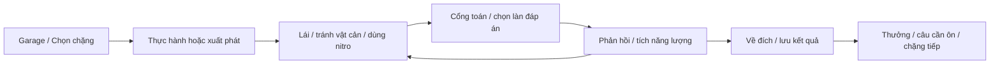

# Đường Đua Thần Tốc — Cúp Sao Băng

Ngày: 10/09/2026. Trạng thái: **Đã triển khai bản remake trong workspace** theo yêu cầu tiếp theo của Đại ca. Tài liệu này giữ thiết kế ban đầu; phạm vi thực tế và kết quả kiểm thử nằm trong [báo cáo triển khai](math-racing-remake-implementation.md).

Đại ca yêu cầu tiếp nối chuỗi remake, nâng cấp rõ đồ họa, gameplay và trải nghiệm; cho phép dùng Google Flow để tạo ảnh, nhân vật, vật thể và xử lý asset khi phù hợp. Em đề xuất giữ tên **Đường Đua Thần Tốc**, dùng **Cúp Sao Băng** làm chủ đề: giải đua kart qua ba vùng đất, tính đúng để tích nitro, chọn đường chạy và vượt các tay đua máy.

## 1. Kết quả cần nhìn thấy

Trong mười giây đầu, người chơi phải thấy một thế giới đua xe có chiều sâu: xe và tay đua chuyển động, đường uốn qua cảnh vật, đối thủ phía trước và đích đến rõ ràng. Trong một lượt chơi, người chơi phải có quyết định về làn, đáp án và thời điểm tăng tốc. Sau lượt chơi, thấy tiến bộ học toán, phần thưởng vừa mở và chặng tiếp theo.

| Trục nâng cấp | Bản hiện tại | Bản đề xuất |
| --- | --- | --- |
| Đồ họa | Đường thẳng CSS, một PNG xe, khung tối đa 480 px | Cảnh 3D cách điệu phủ vùng chơi; đường cong, cầu, cảnh vật có lớp; kart có tay đua và animation |
| Cảm giác lái | Xe dịch giữa ba vị trí cố định | Đổi làn có nội suy, nghiêng thân xe, bánh xoay, camera nhìn trước và tăng tốc có âm thanh/hiệu ứng |
| Gameplay | Lái vào đáp án, tăng điểm/combo, sai mất mạng | Xen kẽ cổng toán với đoạn lái; tích và dùng nitro, tránh vật cản, vượt ba đối thủ máy |
| Hành trình | 10/15/20 câu theo độ khó | Ba vùng × bốn chặng; mỗi chặng giới thiệu hoặc phối hợp cơ chế; có đích và giải thưởng vùng |
| Việc học | Phép tính ngẫu nhiên, chung với tốc độ | Nội dung theo lớp/kỹ năng; nhịp lái chọn riêng; xem lại lỗi và luyện những câu cần ôn |
| Trải nghiệm | Menu, chơi, thắng/thua | Garage → chọn chặng → đua → kết quả; có hướng dẫn thực hành, pause, khôi phục và chơi nhanh |

## 2. Cơ sở khảo sát

Đã đọc `games/MathRacing/`, các bản kế hoạch/triển khai Memory, SpeedMath, Dragon và Discovery Hub; kiểm tra điểm vào, hồ sơ, thưởng và PWA. Đã mở `/Genius-kids/__race` tại local, bắt đầu và xem bố cục bản hiện tại; đây là khảo sát giao diện ngắn, chưa phải kiểm thử hoàn tất ván hoặc thử thiết bị thật.

| Quan sát từ mã hiện tại | Hệ quả cần xử lý |
| --- | --- |
| `MathRacingGame.tsx` gộp luật, frame loop, UI, input và thưởng | Tách engine, render, điều khiển, lưu và âm thanh để thay đồ họa mà giữ luật ổn định |
| `max-w-[480px]` áp dụng cả desktop | Thiết kế riêng bố cục dọc/ngang, dành màn hình cho đường đua |
| `RacingTrack.tsx` và `lanes.ts` chủ động dùng làn thẳng để tránh lệch vật thể | Renderer mới cần một hệ tọa độ đường dùng chung cho xe, cổng, vật cản, hitbox và nhãn |
| Có kiểu `obstacle` nhưng `spawnQuestionSequence()` chỉ sinh đáp án | Vật cản cần luật sinh và điều kiện tránh được, không chỉ thêm hình |
| Số câu tăng khi sinh nhóm đáp án | Tiến độ mới đếm câu đã chốt, tách khỏi nhóm đang đi tới |
| Hai đáp án nhiễu sinh độc lập | Có thể trùng nhau; sinh tập ba đáp án khác nhau và đúng duy nhất |
| Cộng 10 điểm cùng thưởng combo nhưng `maxScore = TARGET_QUESTIONS * 10` | Điểm thực có thể vượt mẫu số; tách điểm học tập và điểm đua |
| `durationSeconds` luôn bằng 0 | Ghi thời gian hoạt động thật, loại pause/hướng dẫn/xem lại |
| Chưa có pause/visibility handling; collision chỉ kiểm tra vị trí hiện tại trong dải 80–95 | Frame dài có nguy cơ vượt qua cổng mà chưa chấm; cần xử lý giao cắt theo thời gian |
| Comment “<50”, “<100” không được ràng buộc trong phép cộng | Dải tổng hiện có thể tới 69 và 148; generator mới kiểm tra cả toán hạng lẫn kết quả |
| Route dùng `math-racing`, lịch sử/thành tích dùng `math_racing` | Giữ ánh xạ rõ, không tạo hai hệ lịch sử hoặc thưởng trùng |
| Hai thành tích cũ có mốc thắng 5/20/50 và điểm 1000/5000/10000 | Phải xử lý tương thích khi chuyển sang chiến dịch hữu hạn và thang điểm mới |

Các nguy cơ frame/callback nêu trên là kết luận từ code, chưa phải lỗi runtime đã tái hiện. Lịch sử, sao và thành tích cũ phải được giữ nguyên.

## 3. Hướng mỹ thuật và cách dựng

**Phong cách:** mô hình đồ chơi 3D có chất liệu rõ, khối tròn, lốp dày, kim loại sơn màu, ánh sáng ấm. Xe và vật quan trọng có silhouette rõ; nền nhiều chi tiết ở hai bên, phần đường và chữ sạch. Bảng màu chính: xanh ngọc, vàng mật ong, kem; mỗi vùng có bảng màu và kiến trúc riêng. HUD dùng ngôn ngữ Nunito, góc bo và độ tương phản của hub đã remake.

**Chọn 3D cách điệu làm hướng chính.** Dùng Three.js / React Three Fiber đã có trong dự án và kinh nghiệm dựng GLB/animation ở Dragon. Đường được dựng từ đường cong có chiều dài và ba làn; xe di chuyển theo tọa độ dọc đường và độ lệch ngang. Bản đầu chưa cần thư viện mô phỏng vật lý xe: điều khiển phải dễ hiểu và có thể kiểm thử chính xác.

Xe có thân xe riêng, bánh quay theo quãng đường, bánh trước đánh lái, người cầm vô lăng nghiêng theo xe, bóng tiếp xúc mặt đường và animation về đích. Một khung kart chuẩn với ba bộ thân/màu, dùng chung khớp và animation; không cần ba hệ xe độc lập. Đổi ngoại hình không đổi thông số thi đấu.

Camera nhìn từ phía sau hơi cao, nhìn trước khúc cua và giữ đường chân trời ổn định. Prototype thử FOV khoảng 45–55°, vị trí xe ở phần ba dưới. Đọc câu hỏi thì camera ổn định; nitro chỉ nới FOV nhẹ và thêm vệt hai bên. Không bắt người chơi điều khiển camera khi đang đua. Garage có xoay xem xe bằng kéo, với nút góc nhìn sẵn cho bàn phím.

**Phương án nhẹ:** renderer Canvas 2.5D dùng sprite kart và các đoạn đường phối cảnh, chạy cùng engine. Không nhân đôi luật hoặc tiến độ. M0 phải kiểm chứng khả năng chạy trên thiết bị mục tiêu trước khi sản xuất đầy đủ asset; nếu 3D không đạt, chọn 2.5D làm renderer chính trước M1. Mất WebGL giữa ván thì pause và khôi phục snapshot sang renderer nhẹ.

## 4. Một lượt đua và nhịp toán–lái

Mục tiêu một chặng khoảng **2–3 phút hoạt động**, bài đầu 60–90 giây. Đây là ngân sách thiết kế cần đo; chế độ thư thả và xem giải thích có thể lâu hơn.

1. Tại garage, chọn chặng; nhìn rõ lớp/kỹ năng, nhịp lái và xe trước khi bấm Đua. Cấu hình gần nhất được nhớ theo hồ sơ.
2. Bài đầu có đoạn thực hành ngắn: đổi làn → đi qua một cổng toán → dùng nitro. Có thể bỏ qua; hướng dẫn không chấm điểm.
3. Đoạn lái 5–8 giây: đổi làn để đi qua đường năng lượng, tránh vật cản đã nhìn thấy, tìm cơ hội vượt đối thủ.
4. Tới khu toán: đường mở thoáng, một phép tính cố định trên HUD, ba cổng cùng câu hỏi hiện rõ. Lái vào đáp án; cũng có thể chạm bảng đáp án cố định để đặt làn đích.
5. Đúng nhận năng lượng và tăng chuỗi; sai hiện phép tính đúng, giảm tốc ngắn và được tiếp tục. Chọn “Xem cách làm” để pause và đọc giải thích.
6. Trở lại đoạn lái: dùng nitro vừa tích để bứt lên. Kết hợp các đoạn thành một đường đua liền mạch, có mốc cảnh báo chặng cuối và vạch đích thật.
7. Qua đích, lưu kết quả rồi hiện bảng thành tích và xe ăn mừng. Các nút Chơi lại, Chặng tiếp, Luyện câu sai và Garage hoạt động ngay khi kết quả sẵn sàng.



### Quy tắc tránh quá tải

- Mỗi thời điểm chỉ có **một nhóm câu hỏi có thể trả lời**. Không hiện hai nhóm đáp án của hai câu trên cùng đường.
- Khu toán không có vật cản, đối thủ không che số hoặc đẩy xe. Đường chỉ cong nhẹ tại đây.
- Tính thời gian đọc từ khi cả câu và ba đáp án đã rõ. Mốc thử ban đầu: Thư thả 9 giây, Vừa sức 7 giây, Thử thách 5,5 giây. Câu phức tạp được cộng thêm ngân sách theo loại, không chỉ theo lớp.
- Khu toán có tốc độ tiếp cận cổng được chuẩn hóa. Nitro đang dùng được bảo toàn phần thời lượng còn lại và tiếp tục sau khu toán; bấm nitro tại đây sẽ đặt lệnh chờ có hiển thị rõ.
- Người chơi vẫn đổi làn và chọn đáp án ngay khi câu xuất hiện. Không bắt chờ nghe/đọc xong mới mở input. Đáp án chỉ chốt một lần khi xe qua vạch, có chỉ báo làn đang chọn.
- Khi hết cửa sổ, chốt làn đích theo timestamp input đã nhận trước vạch; không phụ thuộc một frame animation đang dở. Đổi từ làn trái sang phải bằng nút đáp án có đủ thời gian tới cổng.
- Thư thả có lựa chọn “Chờ em chọn”: thế giới thi đấu dừng trước cổng cho đến khi chọn đáp án. Chạm bảng đáp án hoặc phím 1/2/3 xác nhận; điều khiển trái/phải có nút Chọn riêng. Kỷ lục tách khỏi đua tính giờ.
- Không dùng màu sắc để báo trước đáp án đúng. Vệt sáng trước khi qua cổng chỉ cho biết làn được chọn.

## 5. Các cơ chế tạo chiều sâu

| Cơ chế | Luật v2 đề xuất | Tác dụng |
| --- | --- | --- |
| Cổng toán | Ba đáp án duy nhất; trả lời bằng làn; sai vẫn đi tiếp | Giữ bản sắc lái xe và tính nhẩm |
| Nitro | Mỗi câu đúng +25 năng lượng; đủ 100 dùng một lần tăng tốc khoảng 2,5 giây; tự dùng là tùy chọn | Kiến thức tạo lợi thế đua nhìn thấy được |
| Chuỗi đúng | Từ câu đúng thứ ba, thêm 5 năng lượng/câu, tối đa thanh 100 | Có mục tiêu liên tiếp, không làm điểm học tập vượt trần |
| Vật cản | Cọc tiêu/đệm mềm, va vào giảm tốc ngắn; có ít nhất một đường tránh được | Đoạn lái có quyết định thực tế |
| Đường năng lượng | Nhặt đủ một cụm nhỏ +10 năng lượng; mỗi đoạn lái tối đa một cụm | Thưởng tay lái khéo nhưng toán vẫn là nguồn nitro chính |
| Đối thủ máy | Ba tay đua có hồ sơ tốc độ, độ chính xác, thời gian phản ứng và cách dùng nitro | Thấy vượt xe, tụt vị trí và chạy đích có ý nghĩa |
| Chặng chung kết | Phối hợp cơ chế đã học; thêm một đoạn nước rút cuối | Có cao trào mà không đổi điều khiển phút cuối |

**Công bằng:** vật cản chỉ sinh khi còn đủ thời gian nhận biết và đổi làn; không chặn cả ba làn, không khóa lối vì hai vật cản liên tiếp. Tránh yêu cầu đổi hai làn tức thì. Va chạm có thời gian miễn va ngắn để một vật không trừ nhiều lần. Đối thủ là xe máy có nhãn rõ, không phải người chơi trực tuyến; bản đầu không có va chạm đẩy giữa các xe.

Vị trí đua tính từ quãng đường và thời điểm về đích thực của bốn xe. AI dùng cùng giới hạn tốc độ và quy tắc khu toán, kết quả câu hỏi được sinh theo seed/hồ sơ đã chọn. AI không đọc đáp án người chơi để đổi kết quả, không dịch chuyển tới trước đích. M0 mô phỏng các tỷ lệ đúng để kiểm tra kiến thức thật sự giúp tăng cơ hội thắng.

**Sai không bị loại khỏi chặng.** Bỏ kết thúc sớm vì ba mạng; mức phạt đầu tiên thử là giảm tốc khoảng 0,8 giây, đứt combo và hiển thị lời giải ngắn. Va vật cản không tính là sai toán. Không dùng rung mạnh/chớp đỏ toàn màn hình làm phản hồi mặc định.

## 6. Nội dung và hành trình v2

Phạm vi đầy đủ: **12 chặng, ba vùng × bốn chặng; ba ngoại hình kart, bốn tay đua** gồm nhân vật mặc định của người chơi và ba đối thủ. Hoàn thành một chặng mở chặng tiếp; thưởng trang trí theo mốc, chọn xe/màu tại garage.

| Vùng | Đồ họa và âm thanh | Bốn chặng |
| --- | --- | --- |
| **Thung Lũng Chong Chóng** | Đồng cỏ, cối gió, khán đài gỗ, ánh nắng ấm | 1. Làm quen làn/cổng; 2. Tích nitro; 3. Cọc tiêu và đường năng lượng; 4. Cúp thung lũng |
| **Vịnh San Hô** | Đường ven biển, cầu qua nước, phao, cờ và hải đăng | 5. Nhịp đường cong; 6. Chọn lúc tăng tốc; 7. Hai cụm vật cản cách xa; 8. Cúp hải đăng |
| **Thành Phố Sao Băng** | Thành phố trên cao lúc hoàng hôn, mái vòm, tàu bay, đèn đường | 9. Phối hợp cơ chế; 10. Chuỗi tính nhẩm; 11. Lái ổn định; 12. Chung kết Cúp Sao Băng |

Chặng 1 dùng 4 cổng, chặng 2 dùng 6; chặng thường 8, cúp vùng 10. Độ khó lái tăng bằng cách phối hợp cơ chế đã học; không tự tăng phạm vi toán chỉ vì đi sang vùng mới. Không thêm sương mù che số, mặt băng mất lái hay bước nhảy cần phản xạ mới trong v2.

Ba chế độ dùng chung engine:

- **Hành trình:** 12 chặng có nội dung và phần mở khóa rõ; tiếp tục chặng đang chơi.
- **Đua nhanh:** chọn vùng/kỹ năng/nhịp, đề mới có seed và kỷ lục theo cấu hình; mở sẵn để thử cảnh.
- **Luyện tay lái toán học:** lấy kỹ năng/câu vừa sai, tắt đối thủ và dùng nhịp thư thả; hoàn thành cho phản hồi học tập.

### Phạm vi toán

Lớp lấy từ hồ sơ, có thể chọn kỹ năng ôn phù hợp trong garage. Nhịp lái và hỗ trợ nằm ở cấu hình riêng. V2 chỉ dùng bài ngắn có đáp án số đủ đọc trong ba cổng; không đưa bài văn dài vào đoạn đang chạy.

| Hồ sơ | Gói nội dung ban đầu |
| --- | --- |
| Lớp 1 | Cộng/trừ trong 10 và 20, điền số còn thiếu |
| Lớp 2 | Cộng/trừ trong 100, nhân/chia 2 và 5 sau khi chủ động chọn |
| Lớp 3 | Bảng nhân/chia đến 10, cộng/trừ số tròn trăm, số còn thiếu |
| Lớp 4–5 | Nhân/chia nhẩm với 10/100, quan hệ phép tính, biểu thức tối đa hai bước đã chọn kỹ năng |

Đây là các gói luyện nhẩm đề xuất, chưa tuyên bố bao phủ toàn chương trình. Phân số, số thập phân, đơn vị hỗn hợp và lời văn để sau khi có layout/khung thời gian phù hợp. Giữ quy tắc hub hiện tại: mầm non chưa mở game này.

Generator có seed, kiểm tra miền giá trị, không âm ngoài kỹ năng cho phép, phép chia nguyên và mẫu số khác 0. Đáp án nhiễu dựa trên lỗi hợp lý, đủ ba giá trị khác nhau; không lặp lại ngay câu vừa gặp. Mỗi câu chứa phép tính, đáp án, lời giải ngắn, kỹ năng và ngân sách đọc. Chuẩn bị tối thiểu 6 mẫu có biến thể cho mỗi nhóm lớp, kiểm tra bằng seed thay vì viết ngân hàng số cố định.

## 7. Bố cục và trải nghiệm

**Garage:** xe ở giữa, chọn chặng và cấu hình gọn; cho thấy chặng gần nhất, phần thưởng kế tiếp và nút Đua nổi bật. Cài đặt nâng cao thu gọn. Không bắt chọn độ khó lần thứ hai ở hộp chuẩn bị của hub.

**Trong đua:** vùng thế giới khoảng 75–85% màn hình tùy thiết bị. Trên cùng là pause, vị trí và tiến độ; câu toán nằm trong dải riêng, không chồng điểm. Đáy có trái/phải, thanh nitro và nút tăng tốc; khi có câu hỏi, ba bảng đáp án cố định gắn với ba làn. Số trên cổng trong cảnh và bảng DOM lấy từ cùng dữ liệu.

**Desktop:** tận dụng chiều ngang để thấy cảnh và đối thủ; không kéo toàn bộ đường thành một đường quá rộng. **Mobile dọc:** ưu tiên đường, câu và nút; rút gọn bảng hạng còn vị trí hiện tại. **Mobile ngang/tablet:** mở rộng tầm nhìn; không ép xoay thiết bị.

Điều khiển: ←/→ hoặc A/D đổi làn; 1/2/3 chọn làn đáp án; Space dùng nitro; Escape pause. Mobile có nút lớn tối thiểu 48 px và vuốt tùy chọn. Có focus rõ, nhãn nút, modal giữ/trả focus; bàn phím không làm cuộn trang khi điều khiển game. Chạm bảng đáp án là phương thức đầy đủ, không bắt đuổi theo chữ đang chuyển động.

Pause khi ẩn tab, mất focus hoặc đổi hồ sơ; trở lại hiện Tiếp tục, không tự lao vào vật cản. Thoát về garage giữ draft. Chọn Bắt đầu lại mới bỏ ván dở. Giảm chuyển động tắt rung, camera roll, vệt nhanh và đổi FOV; có renderer nhẹ và chế độ chờ chọn. Kết quả đúng/sai luôn có chữ/ký hiệu.

Âm thanh gồm máy xe biến thiên nhẹ, đổi làn, nhặt năng lượng, nitro, qua cổng và về đích. Phát âm thanh sau thao tác đầu; phối với MusicContext hiện tại, hạ nhạc khi nghe câu hỏi. TTS là tùy chọn và có thể ngắt bằng trả lời; lỗi TTS không làm mất lượt. Nhạc mới là hạng mục riêng sau prototype, không phụ thuộc tạo nhạc để có bản chơi.

## 8. Asset và Google Flow

Ngày 10/09, em đã truy cập được project [Game Assets](https://flow.google.com/project/7b20f6a9-d1ff-4fbb-9152-27694219b8d5). Giao diện đang có Nano Banana 2, thêm ảnh tham chiếu vào prompt, mục Images và Characters. Khảo sát mục Tools chưa xác nhận công cụ tách nền chuyên dụng. **Chưa chạy lô sinh ảnh, chưa xác minh alpha xuất ra hoặc khả năng dựng mô hình 3D của Flow.**

Flow phù hợp để chốt mỹ thuật, tạo chân dung, ảnh môi trường, tham chiếu xe/vật thể và sprite cho phương án nhẹ. Xe/nhân vật 3D trong cảnh cần dựng mesh, khớp và animation riêng; ảnh nhân vật không tự trở thành mô hình xoay được. Dự án đã có tiền lệ tự dựng GLB tại `scripts/build-dragon-assets.mjs`.

### Lô đầu: chốt chất lượng trước khi sản xuất hàng loạt

| Asset | Đầu ra cần chọn | Mục đích và kiểm tra |
| --- | --- | --- |
| Key visual thung lũng | 1 ảnh ngang | Màu, vật liệu, tỷ lệ xe/cảnh; có khoảng trống cho HUD |
| Bộ tham chiếu kart chính | 1 bảng trước/bên/sau | Cùng hình dáng giữa các góc; dùng để dựng mesh, không coi là sprite animation |
| Tay đua chính | 1 mẫu chuẩn + 2 biểu cảm | Mũ bảo hiểm/áo/đặc trưng nhất quán; nhìn rõ ở avatar nhỏ |
| Nền xa thung lũng | 1 ảnh ngang | Dùng ở garage/lớp cảnh xa, không chứa mặt đường tương tác |
| Đạo cụ | 1 bảng tham chiếu | Cọc, cổng, pin năng lượng, cờ, chong chóng để dựng hình tương tác |

Lô đầu mục tiêu **7 ảnh được chọn**, số yêu cầu sinh có thể nhiều hơn. Sau lô này dựng một xe và 30–60 giây đường chạy để so ảnh thiết kế với hình trong game. Không mở rộng cả bộ khi model hoặc góc nhìn thực tế còn lệch.

### Bộ v2 sau khi mẫu đạt

- Ba ảnh môi trường và ba ảnh bìa vùng; ưu tiên cắt ảnh sẵn khi bố cục cho phép.
- Bốn nhân vật chuẩn, mỗi nhân vật ba biểu cảm cho garage/kết quả; dùng reference đã chọn để giữ thiết kế.
- Ba thiết kế kart trên một hệ khớp; các màu sơn là material trong runtime.
- Khoảng 10–12 đạo cụ 3D dùng lại giữa các đoạn đường: cổng, cọc, hàng rào, pin, khán đài, cờ, đèn, cây, đá và cột mốc.
- Hiệu ứng nitro, bụi, bóng, tia lấp lánh dựng bằng hạt/mesh hoặc texture nhỏ; chữ, số, nút và đáp án dựng bằng DOM/SVG.

### Tách nền và đưa asset vào game

1. Sinh một vật thể/nhân vật mỗi ảnh, đủ toàn thân, nền phẳng tương phản, chừa biên; dùng cùng reference, góc nhìn và ánh sáng. Không mặc định chữ “transparent” trong prompt đảm bảo có alpha thật.
2. Xuất file được chọn về local theo luồng tải/export được hỗ trợ. Giữ bản gốc và nguồn; không gắn URL tạm có hạn dùng vào runtime.
3. Thử tách nền trên **một asset mẫu** bằng chức năng thực tế có sẵn hoặc công cụ xử lý ảnh được chọn lúc triển khai. PNG chỉ được coi là đạt khi kiểm tra kênh alpha và pixel nền; nền caro bị vẽ vào ảnh không phải nền trong suốt.
4. Xem viền trên trắng, tối và màu đường, ở kích thước chơi thật và phóng lớn: không viền xanh/trắng, không mất bánh xe/anten/tay. Tách bóng khỏi sprite, tạo bóng trong engine để đổi mặt đường không lộ mảng nền.
5. Chuẩn hóa pivot ở điểm tiếp đất, tỷ lệ các góc/nhân vật và khung cắt. WebP có alpha cho sprite, PNG nếu cần giữ dữ liệu gốc; texture/ảnh nén theo ngân sách.
6. Nếu tách nền không đạt, dùng ảnh trong khung chân dung hoặc dựng lại vật thể bằng geometry từ mẫu. Sprite phương án nhẹ ưu tiên render từ chính model 3D đã có để đồng nhất góc và animation.
7. Ghi manifest: tên file, nguồn/ID Flow, prompt, ảnh tham chiếu, kích thước, dung lượng, alpha, pivot, phiên bản và nơi sử dụng. Tài liệu dự kiến ở `public/math-racing/art/README.md`; công cụ đóng gói ở `scripts/install-racing-art.mjs`.

Prompt gốc cho mỹ thuật:

> Original premium children's kart racing adventure, tactile stylized 3D toy world, rounded chunky shapes, turquoise and warm honey yellow, painted metal and soft rubber, friendly helmeted animal racers, readable silhouettes, warm daylight, rich layered scenery, playful racing festival. Original character designs, no logos, no watermark, no text, no numbers, no interface.

Prompt môi trường mẫu, nối vào prompt gốc:

> Wide landscape concept of a windmill valley racing circuit, sweeping gentle bends, colorful wooden spectator stands, grass-covered hills, windmills and distant balloons, chase-camera composition behind a small kart, clean open roadway and calm upper center reserved for readable game information. Detailed scenery at the edges.

Prompt nhân vật để thử tách nền:

> Single friendly small red panda kart racer, full body, turquoise helmet with a warm yellow stripe, cream racing suit, brown gloves and boots, simple broad silhouette, front three-quarter view, neutral standing pose, feet fully visible, generous padding, uniform flat background contrasting with the character, no ground plane, no cast shadow, no props, consistent soft studio light. Preserve the attached reference design exactly when producing expression variants.

## 9. Luật điểm, thưởng và lưu dữ liệu

**Điểm học tập** = 100 × số câu đúng lần đầu / số cổng của chặng, làm tròn khi hiển thị; lưu cả số đếm. Cổng không trả lời tính vào mẫu số. **Thành tích đua** gồm vị trí, thời gian hoạt động, va chạm, combo tốt nhất, nitro đã dùng; không cộng chúng vào phần trăm toán.

Sao chiến dịch đề xuất: 1 sao khi hoàn thành, 2 sao từ 70% đúng, 3 sao từ 90% đúng. Nhất cuộc đua nhận cúp/huy hiệu ngoại hình; trẻ tính tốt vẫn được sao toán dù chưa lái nhanh. Chế độ hỗ trợ có nhãn và kỷ lục riêng, không trừ sao học tập.

Mỗi chặng chỉ cộng phần sao tăng thêm so với mức tốt nhất đã lưu; từ 1 lên 3 nhận thêm 2. Tổng sao chặng tối đa **36** cho 12 chặng, không nhân theo lớp/nhịp/xe. Đua nhanh và luyện tập lưu thành tích riêng, không sinh thêm tiền sao hoặc lặp thưởng album. Nếu giữ phần thưởng album, chỉ xét một lần ở mốc cúp vùng đã định, ghi cùng giao dịch hoàn thành.

`gameType` lịch sử giữ `math_racing`; record v2 có `schemaVersion`, `sessionId`, `missionId`, `contentVersion`, `seed`, lớp/kỹ năng/nhịp/hỗ trợ, đúng/sai, thời gian, vị trí, va chạm và phần sao tăng thêm. `score/maxScore` dùng cùng thang điểm học tập mới; metadata đua đặt riêng. Không so kỷ lục v1 với điểm v2.

Thành tích cũ đã nhận giữ nguyên. Định nghĩa mốc v2 theo dữ liệu mới và số chặng thực, ví dụ hoàn thành 1/4/12 chặng, thu 12/24/36 sao chặng, hoặc vô địch ba cúp vùng. Adapter thành tích phải phân biệt record v1/v2, tránh các mốc điểm 1000/5000/10000 cũ áp nhầm lên điểm 0–100. Việc mở khóa v2 không cộng lại thưởng thành tích v1 đã nhận.

Draft theo ID học sinh chứa seed, phiên bản nội dung, phase, cổng hiện tại/đã chốt, vị trí bốn xe, làn đích, tốc độ, năng lượng, vật thể còn hoạt động và thời gian hoạt động. Ghi tại chuyển phase/cổng và checkpoint định kỳ; không ghi React state, frame ID hoặc thời điểm tuyệt đối của trình duyệt. Khôi phục giữ nguyên câu/lựa chọn/năng lượng và bắt đầu ở pause, không sinh lại câu để đổi kết quả.

Hoàn thành có ID ổn định và chống ghi trùng. **Ghi thành công trước khi công bố thưởng**; lỗi lưu giữ kết quả và nút Thử lưu lại. Chơi lại/Thoát/reload không cộng lại thưởng. Tích hợp bằng adapter trong StudentContext theo mẫu Memory/Speed, không chạy thêm callback thưởng cũ của GamePage. Phạm vi đầu là một phiên ghi mỗi hồ sơ; chưa hứa đồng bộ nhiều thiết bị hoặc ghi cạnh tranh nhiều tab.

## 10. Cấu trúc triển khai và tích hợp

```text
games/MathRacing/
  MathRacingGame.tsx          Entry chọn bản v2/cũ, giữ giao diện tương thích
  classic/                   Bản hiện tại trong giai đoạn chuyển đổi
  cup/
    RacingCup.tsx            Garage, chọn chặng và phiên đua
    engine/                  Luật, thời gian, va chạm, seed, AI, chốt câu
    content/                 Chặng, cấu hình kỹ năng, generator và lời giải
    render/                  World3D, World2D, đường, kart, camera, hiệu ứng
    input/                   Bàn phím, pointer, vuốt và chọn làn
    audio/                   Máy xe, sự kiện và phối âm với ứng dụng
    progress/                Record, draft, migration và lưu thưởng
    components/              HUD, câu hỏi, pause, garage, kết quả
public/math-racing/           Art, model, audio và manifest
scripts/build-racing-assets.mjs
scripts/install-racing-art.mjs
```

Engine chạy bước thời gian cố định, renderer nội suy riêng. Không `setState` cả danh sách vật thể mỗi frame; React cập nhật HUD khi số liệu thay đổi. Va chạm kiểm tra đoạn di chuyển qua vạch/hitbox; giới hạn bước bù khi frame dài, không làm mất chấm câu. Cùng tọa độ `(distanceAlongTrack, laneOffset)` cho cả hai renderer, bảng đáp án và va chạm. Callback/action có session ID và gate ID để chống lệnh của ván cũ.

Luồng phase: garage → ready → driving → question-approach → resolve → driving hoặc finish → saving → results. Pause bao phủ phase hoạt động; hành động tiếp tục không chạy lại sự kiện đã chốt. Khi chờ chọn, đồng hồ thi đấu của cả bốn xe cùng dừng. Khi AI qua khu toán theo vị trí riêng, áp cùng quy tắc tốc độ và thời lượng đã định.

Điểm tích hợp phải sửa có chủ đích:

- `games/GameLauncher.tsx`: mở lobby v2, giữ lối vào classic trong giai đoạn chuyển đổi.
- `src/components/hub/catalog.ts`, catalog tests và `src/pages/GamePage.tsx`: thêm cờ racing v2, xử lý `edition=classic`, giữ `level` cũ qua ánh xạ được mô tả rõ; bỏ hộp chọn độ khó lặp khi mở v2.
- `src/components/hub/HubArt.tsx` và bộ bìa: thumbnail mới từ bộ kart, không mount cảnh WebGL ở hub.
- `src/contexts/StudentContext.tsx`, `types.ts`, achievement adapter: schema version, migration, lưu delta và chống trùng.
- `App.tsx`: xem xét route thử `/__race` hiện tại; preview mới chỉ DEV và dùng hồ sơ trong bộ nhớ để QA không ghi vào hồ sơ thật.
- `vite.config.ts`: đường dẫn theo `import.meta.env.BASE_URL`; asset racing cache theo nhu cầu, tránh precache cả ba vùng vào ứng dụng.

## 11. Ngân sách và điều kiện kỹ thuật

Các số dưới đây là **mục tiêu**, chưa có benchmark cho remake:

| Hạng mục | Mục tiêu ban đầu |
| --- | --- |
| Frame rate | 60 fps trên desktop; ít nhất 30 fps ổn định trên điện thoại tầm trung đã chọn |
| Asset đầu tiên cần tải | Khoảng ≤4 MB nén cho garage và chặng đầu, chưa tính shell ứng dụng/renderer JS; báo riêng phần JS tăng thêm |
| Asset mỗi vùng bổ sung | Khoảng ≤2 MB nén, tải khi chọn vùng |
| Cảnh chạy | Khoảng ≤120 draw call và ≤150k tam giác ở mức tiêu chuẩn; xác nhận bằng đo frame |
| Texture | Ưu tiên atlas 1024–2048 px, tối đa khoảng 64 MB texture giải nén đang dùng |
| Chất lượng thấp | Giảm DPR, bỏ postprocessing, bóng đơn giản, giảm hạt và mật độ cảnh; giữ số/hitbox/luật |

Lazy-load game, tái sử dụng mesh/material, instancing cảnh vật, dispose khi rời game. Không bắt tải toàn bộ album/nhạc/chặng trước khi bắt đầu. Cảnh và model lỗi có placeholder dùng được; game báo rõ vùng chưa tải để chơi offline. Không coi “có cache” là đã thử offline; nghiệm thu sau khi ngắt mạng thật.

## 12. Thứ tự thực hiện

| Mốc | Sản phẩm bàn giao | Điều kiện qua mốc |
| --- | --- | --- |
| **M0 — Chứng minh cảm giác chơi** | 1 kart có animation, 1 đoạn đường cong, 1 đối thủ mẫu, 4 cổng toán, nitro, điều khiển desktop/mobile; lô Flow 7 ảnh chọn | Nhìn rõ nâng cấp so với bản cũ; qua cổng không lệch làn; dùng nitro vẫn đọc đủ câu; có số đo trên ít nhất một điện thoại thật |
| **M1 — Một chặng hoàn chỉnh** | Garage, chặng đầu 60–90 giây, đủ ba đối thủ, hướng dẫn, pause, kết quả, draft và lưu thưởng | Chơi từ hub đến kết quả, reload/tiếp tục/chơi lại hoạt động; lỗi lưu không mất kết quả hay nhân sao |
| **M2 — Hoàn thiện vùng đầu** | Bốn chặng thung lũng, vật cản, AI cân bằng, gói toán các lớp, chế độ hỗ trợ, renderer nhẹ | Mọi cấu hình toán sinh đúng; đường tránh được; chơi chạm/bàn phím hoàn chỉnh; ba mức nhịp có khác biệt đo được |
| **M3 — Đủ v2** | Vịnh, thành phố, 12 chặng, ba kart, bốn nhân vật, cúp/garage, đua nhanh và luyện câu sai | Nội dung và hình ảnh nhất quán; mở khóa/thu hồi draft đúng; cache và kích thước asset trong ngân sách |
| **M4 — Nghiệm thu và chuyển mặc định** | Kiểm thử hồi quy, thiết bị, khả năng tiếp cận, thử với trẻ; báo cáo hạn chế | Các tiêu chí mục 13 đạt; bật v2 qua feature flag; còn khả năng quay về classic |

Ưu tiên M0 → M1 để xem một bản chơi hoàn chỉnh trước khi mở rộng. Không chốt thời gian toàn bộ trước khi biết chất lượng asset, khả năng tách nền và kết quả hiệu năng M0. Mỗi mốc bàn giao kèm ảnh/video ngắn và kết quả kiểm tra thực tế, phân biệt điều đã thử với điều mới có trong code.

## 13. Nghiệm thu

- **Đồ họa:** so cùng viewport với bản cũ; xe/người có animation thật; đường có chiều sâu; không lộ mặt nền sprite; UI không che điểm chọn đáp án. Ảnh bìa phải khớp nhân vật và thế giới trong game.
- **Đề toán:** kiểm tra generator qua nhiều seed và mọi kỹ năng; miền kết quả đúng, chia nguyên, ba đáp án duy nhất, đúng một đáp án, không sửa dữ liệu nguồn; đáp án nhiễu có expected result độc lập.
- **Lái và collision:** hai lần đổi làn nhanh, chạm đáp án làn xa, giữ phím, đa chạm, input sát vạch, vật cản sát nhau, 30/60/120 fps và frame dài; mỗi cổng chỉ chấm một lần, đường luôn có lối hợp lệ.
- **Nhịp và AI:** đo thời gian thật từ lúc đọc được đến lúc chốt; nitro không rút ngân sách toán; pause/chờ chọn dừng cả xe máy; rank từ cùng mô phỏng với xe nhìn thấy; AI không teleport hoặc giành lợi thế do frame rate.
- **Lưu:** kết quả ngay khi về đích; reload ở cổng, lúc finish/saving và sau nhận thưởng; lỗi ghi/retry; ván cũ gọi muộn; đổi học sinh; tiến độ v1; 1→3 sao chỉ cộng 2; đua nhanh/luyện không farm sao.
- **Âm thanh và khả năng tiếp cận:** nghe thực tế trên loa/tai nghe; mute, TTS bị chặn, tab ẩn, thoát không còn tiếng; keyboard, focus, giảm chuyển động, cổng có chữ/ký hiệu và chế độ chờ chọn hoạt động đủ.
- **Thiết bị:** kiểm tra layout 360×640, 390×844, 768×1024 và 1366×768; Chrome desktop, Android tầm trung, Safari iPhone/iPad khi có máy. Mô phỏng viewport không thay cho đo máy thật.
- **Hiệu năng/offline:** cold load, chuyển vùng, chơi liên tiếp ít nhất 10 phút, bộ nhớ sau thoát; hỏng ảnh/model, mất WebGL và ngắt mạng sau cache; ghi thiết bị và giới hạn cụ thể.
- **Tích hợp:** catalog/Back/Forward/level cũ/edition/feature flag/grade gate; URL base `/Genius-kids/`; TypeScript, test phù hợp, production build và PWA. Mốc kế hoạch này chưa chạy test remake vì chưa thay mã game.
- **Trải nghiệm học:** quan sát 5–8 trẻ cùng người phụ trách, so bản cũ và M1 với kỹ năng tương đương. Mục tiêu thử: phần lớn trẻ tự đổi làn sau hướng dẫn đầu, hiểu tính đúng nạp nitro và hoàn thành một chặng; ghi riêng lỗi toán, lỗi điều khiển, thời gian chờ và lần cần trợ giúp. Tinh chỉnh trước khi kết luận trẻ thích hoặc học tốt hơn.

## 14. Phần để sau v2

Multiplayer, bảng xếp hạng online, vật lý drift tự do, tấn công đối thủ, map editor, giải đấu hằng ngày, xe có nâng chỉ số, bài toán dài, phân số/thập phân trong đua và video AI chạy nền. Những phần này chỉ bổ sung sau khi vòng lái–tính–nitro và việc lưu thưởng đã đạt.

**Bước triển khai đầu tiên:** làm M0 trong phạm vi game Racing, đối chiếu ảnh thiết kế với một đoạn chạy thật, sau đó hoàn tất M1 trước khi sản xuất hai vùng còn lại.
