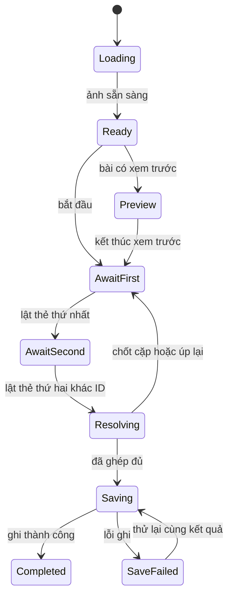

# Lật Thẻ — Đảo Ký Ức: kế hoạch remake

Ngày: 08/09/2026. Trạng thái: **đã triển khai v2 và kiểm tra kỹ thuật tại local**. Báo cáo thực tế: [memory-match-implementation.md](D:/Quyetnm/Dev/mathgenius-kids/docs/memory-match-implementation.md). Thử cảm ứng trên thiết bị thật và thử chơi với trẻ vẫn cần thực hiện trước khi kết luận về độ cuốn hút.

**Chỉ đạo đã chốt:** ưu tiên trải nghiệm chơi; không ràng buộc vào việc tái sử dụng asset. Bản triển khai dùng 48 hình vector mới cùng phong cách và cảnh đảo SVG riêng. Các bảng khảo sát asset cũ bên dưới là lịch sử khảo sát, không phải yêu cầu tái sử dụng.

Phạm vi là game **Ghép Thẻ Hình Ảnh / MemoryMatch**, mở từ Games. Không bao gồm Giai Điệu Vui Nhộn hoặc flashcard mầm non. Kế hoạch dựa trên mã nguồn hiện tại và kiểm tra một số asset local; chưa có benchmark hay thử chơi với trẻ cho bản mới.

## 1. Hướng sản phẩm

Đề xuất tên **Lật Thẻ — Đảo Ký Ức**. Trẻ chọn một vùng khám phá, lật thẻ tìm cặp và dần hoàn thiện một cảnh nhỏ: vườn thú, thị trấn, trạm không gian. Hoàn thành một bài đem lại một thay đổi thấy được trên đảo cùng một món trang trí đã biết trước.

Giữ thao tác trung tâm đơn giản: **chạm → quan sát → nhớ vị trí → tìm cặp**. Cảm giác tiến bộ đến từ nhận ra hình, nhớ đường đi của mắt và thấy thế giới hoàn thiện. Bối cảnh không chen vào giữa mỗi lượt lật.

Phạm vi v2 đề xuất:

- 30 nhiệm vụ, 5 vùng × 6 bài; chế độ chơi nhanh chọn chủ đề/số cặp và các preset hỗ trợ.
- Hai kiểu bài: tìm hình giống nhau và quan sát trước rồi tìm cặp. Hình–bóng chỉ mở ở phần nâng cao với bộ hình đã kiểm tra tính phân biệt.
- Mở màn từ 3–4 cặp; chiến dịch tối đa 12 cặp. Bàn 15 cặp giữ ở chơi nhanh nâng cao.
- Bản đồ đảo, sổ bộ thẻ đã khám phá, phần thưởng trang trí cố định theo tiến độ.
- Tự lưu ván đang chơi, kết quả và phần thưởng; giữ lịch sử/sao bản cũ.
- Vòng chơi mục tiêu khoảng 1–4 phút, cần đo khi thử với trẻ. Nhóm thiết kế khoảng 4–10 tuổi, độ khó cho phép tự chọn theo năng lực thay vì chỉ khóa theo lớp.

**Mốc xem thử đầu tiên:** một bộ 12 hình đã chuẩn hóa, 6 bài hoàn chỉnh và một vùng đảo. Chốt chất lượng hình/thao tác ở mốc này trước khi nhân rộng nội dung.

## 2. Hiện trạng đã đọc được

| Hiện trạng | Hệ quả | Hướng xử lý |
|---|---|---|
| Chỉ có 12/20/30 thẻ, tương ứng 6/10/15 cặp | Bàn đầu đã khá nhiều cho người mới; tăng khó chủ yếu bằng số lượng | Thêm 3/4/8/12 cặp, tách số cặp, độ giống nhau và hỗ trợ |
| Generator trộn khoảng 70% emoji từ nhiều nhóm và 30% hình khối | Thiếu bản sắc bộ thẻ; chất lượng hiển thị emoji tùy thiết bị | Manifest hình theo chủ đề, thumbnail đồng nhất, không trộn tùy ý |
| Mặt sau là logo `Card.png` trên nền đen, mặt trước gradient theo pairId | Chưa có ngôn ngữ hình ảnh thống nhất cho game | Mặt sau theo chủ đề nhưng giống nhau trên toàn bàn; khung và nền trước nhẹ |
| Lưới 20 thẻ dùng 7 cột trên màn lớn; 30 thẻ dùng 8 cột | Hàng cuối không đều; nhiều cột làm thẻ nhỏ trên điện thoại | Chọn bố cục từ số thẻ và diện tích thực, ưu tiên hàng/cột cân đối |
| Tam giác dùng kích thước cố định 80×70 px | Có thể lớn hơn ô thẻ hẹp | Hình vector cùng viewBox, scale trong safe area |
| Thẻ là `div` có `onClick`, chưa có ngữ nghĩa nút/điều khiển bàn phím | Khó tiếp cận bằng bàn phím hoặc trình đọc màn hình | Nút thẻ có tên theo vị trí/trạng thái, điều hướng bằng bàn phím |
| Timeout ghép đúng 600 ms, ghép sai 1.200 ms; không giữ handle để hủy | Cần bảo vệ khi rời ván/reset/chuyển cấu hình; thời gian nhìn ảnh bị trộn với animation | State machine, timer theo phiên, thời gian giữ ảnh tính sau khi lật xong |
| Timer chạy từ khi vào component, kể cả tab ẩn | Không phản ánh thời gian chơi chủ động | Bắt đầu ở lượt lật đầu, loại phần giới thiệu, pause và tab ẩn |
| Chỉ gọi `onComplete` khi bấm nút Hoàn thành | Thắng rồi tải lại/đóng trang trước nút này có thể chưa được ghi nhận | Commit kết quả ngay khi cặp cuối được xác nhận |
| `GamePage` ghi `durationSeconds: 0`, `difficulty: 'easy'` cho callback chung | Lịch sử sai độ khó/thời lượng; thành tích memory mức khó không nhận đúng nguồn dữ liệu | Completion payload đầy đủ, tích hợp riêng có chống trùng |
| Điểm = `max(0, 1000 - moves × 10)` | Ngay ván hoàn hảo cũng bị trừ theo số cặp: 6 cặp còn 940, 15 cặp còn 850 | Chuẩn hóa theo cấu hình, ghi riêng số lượt và hỗ trợ |
| Medal dùng ngưỡng 1,5×/2× số cặp; comment còn ghi 1,2×/1,5× | Spec và code lệch nhau; tham số thời gian không dùng | Một nguồn cấu hình chấm điểm, công bố tiêu chí rõ |
| Chưa có chủ đề do trẻ chọn, hành trình hoặc tiếp tục ván dở | Lý do quay lại chủ yếu là một bàn ngẫu nhiên mới | Thêm vùng khám phá, bộ thẻ và tiến độ nhìn thấy được |

Chưa xác nhận lỗi chạm đúp bằng tái hiện: `Card` hiện có chặn thẻ đã lật ở UI. Dù vậy engine mới vẫn cần tự từ chối chọn cùng ID hai lần và sự kiện đến nhanh; không dựa hoàn toàn vào trạng thái giao diện.

Nguồn chính: [memoryMatchEngine.ts](D:/Quyetnm/Dev/mathgenius-kids/games/memoryMatchEngine.ts), [MemoryMatchGame.tsx](D:/Quyetnm/Dev/mathgenius-kids/games/MemoryMatch/MemoryMatchGame.tsx), [Card.tsx](D:/Quyetnm/Dev/mathgenius-kids/games/MemoryMatch/Card.tsx), [GamesMenu.tsx](D:/Quyetnm/Dev/mathgenius-kids/games/GamesMenu.tsx), [GamePage.tsx](D:/Quyetnm/Dev/mathgenius-kids/src/pages/GamePage.tsx).

## 3. Vòng chơi và trải nghiệm

1. **Chọn điểm đến:** màn đầu có Chơi tiếp, Chơi nhanh và bộ thẻ. Thấy món trang trí sẽ nhận ở bài tiếp theo.
2. **Chuẩn bị:** giới thiệu tối đa một thao tác mới bằng hình. Trẻ bấm Sẵn sàng; ảnh của cả bàn phải tải/giải mã xong trước khi mở ván.
3. **Quan sát:** bài có preview chỉ bắt đầu đếm sau bước Sẵn sàng. Chế độ thư giãn cho chủ động kết thúc preview; preset thử thách dùng thời lượng đã công bố.
4. **Lật:** thẻ phản hồi ngay khi chạm. Ghép sai để nhìn đủ lâu, úp lại nhẹ nhàng; không còi báo lỗi hoặc rung mạnh.
5. **Tìm đúng:** viền sáng và âm thanh ngắn; một dấu tiến độ trên đảo sáng lên. Thẻ đã ghép vẫn nằm đúng ô, không dồn lưới hoặc di chuyển các thẻ còn lại.
6. **Hoàn tất:** lưu kết quả trước; thêm một chi tiết vào đảo, hiện sao mới, kết quả và lựa chọn Tiếp tục/Chơi lại/Nghỉ ở đây.

Nhịp animation khởi điểm để thử: lật 180–240 ms; giữ cặp sai 800–1.100 ms sau khi ảnh đã hiện; cặp đúng phản hồi khoảng 250–400 ms. Có tùy chọn giữ lâu hơn. Giảm chuyển động thay lật 3D bằng chuyển trạng thái nhẹ, vẫn giữ đủ thời gian quan sát.

Không thay vị trí hoặc số thẻ giữa ván. Resize chỉ tính lại kích thước trước khi chơi; nếu xoay thiết bị giữa ván thì tạm dừng, giữ thứ tự hàng/cột và cho tiếp tục sau khi bố cục ổn định. Thay đổi độ khó được gợi ý giữa hai ván, có lựa chọn của trẻ.

## 4. Nội dung 30 nhiệm vụ

| Vùng | 6 bài theo thứ tự | Cặp/bài đề xuất | Thành quả sau vùng |
|---|---|---|---|
| Vườn bạn nhỏ | Làm quen; nhớ hai góc; tìm theo hàng; xem trước; nhớ xa nhau; hội bạn | 3, 4, 4, 6, 6, 8 | Vườn thú nhỏ, ghế nghỉ, cổng chào |
| Thị trấn tí hon | Xe và nhà; xe phục vụ; công trình quen; quan sát phố; nối trí nhớ; hội chợ | 4, 6, 6, 8, 8, 10 | Đường, trường học, trạm cứu hỏa, quảng trường |
| Trạm không gian | Những vật thể khác nhau; theo dấu rover; ghép hành tinh; xem trước; khám phá xa; về trạm | 4, 6, 8, 8, 10, 12 | Bãi đáp, rover, đài thiên văn |
| Xưởng hình học | Hình quen; tìm đường nét; hình và bóng; phân biệt dáng; nhớ theo cụm; xưởng sắc màu | 4, 6, 6, 8, 10, 12 | Vườn hình khối và cổng trang trí |
| Đảo hội ngộ | Bạn và xe; phố dưới sao; xem trước hỗn hợp; bộ hình nâng cao; chuyến cuối; ngày hội | 6, 8, 8, 10, 12, 12 | Hoàn thiện cảnh đảo và quyền đổi các trang trí đã mở |

Đây là đề cương thiết kế, chưa phải dữ liệu level đã có. Mỗi bài phải khai báo tập hình, kiểu ghép, bố cục, preview, hỗ trợ và ngưỡng huy hiệu riêng. Không coi đổi background của cùng một bàn là một bài mới.

V2 có ba chế độ trình bày dùng chung engine:

- **Hành trình:** 30 bài, phần thưởng mở một lần, chủ đề xuất hiện theo tiến độ.
- **Chơi nhanh:** chọn bộ, 3/4/6/8/10/12/15 cặp, có/không preview; bắt đầu lại bằng seed mới. Không cấp lại sao vô hạn từ chiến dịch.
- **Thư giãn:** preset hỗ trợ trong hai chế độ trên: xem trước tự kết thúc, giữ cặp sai lâu hơn, ẩn đồng hồ, gợi ý dễ gọi. Không tách thành game/cơ chế lưu riêng.

Hình–bóng có rule riêng: một thẻ minh họa và đúng một bóng tương ứng; không chấp nhận hình khác chỉ vì cùng màu. Bộ thử đầu ưu tiên dáng khác nhau rõ. Không dùng các góc nhìn của hình tròn/cầu hoặc vật gần giống khiến một bóng có nhiều đáp án hợp lý.

Ghép hình–chữ, phép tính–kết quả, tiếng kêu–con vật và hai người luân phiên là hướng sau v2. Mỗi loại đòi hỏi kiểm chứng nội dung/luật riêng; không gộp vào bản đầu chỉ để tăng số chế độ.

## 5. Mỹ thuật ưu tiên trải nghiệm chơi

Phong cách triển khai: nền kem sáng dịu, mặt sau xanh lá đồng nhất, hình chiếm phần lớn mặt thẻ. 48 SVG vẽ riêng, cùng viewBox và nét viền; xe dùng hình nhìn ngang hoặc từ trên xuống rõ ràng. Đảo có cảnh thưởng riêng theo vùng. Không nhập mô hình Three.js, texture hành tinh hay avatar cũ vào phần đồ họa Memory v2. Bảng bên dưới ghi lại nguồn từng được cân nhắc.

| Nguồn đã có | Tái sử dụng | Việc còn phải làm |
|---|---|---|
| 7 avatar động vật trong `public/avatars` | Nhóm động vật khởi đầu, mascot | Tạo thumbnail/căn khung; bổ sung hình cùng phong cách nếu bài cần 8–12 cặp |
| Bộ Album động vật/con giáp | Nguồn ứng viên cho bộ nâng cao | Duyệt từng ảnh; một số ảnh đã có chữ/khung, không đặt nguyên thẻ Album vào trong thẻ game |
| `vehicleModels.ts`: 6 loại xe | Nhóm xe thị trấn | Render thumbnail góc nhìn thống nhất; ô tô và taxi phải phân biệt bằng hình/dấu hiệu, không chỉ màu |
| `buildingInstances`: các công trình thị trấn | Nhóm công trình và cảnh đảo | Chọn mô hình có dáng khác nhau, giản lược chi tiết nhỏ và thống nhất ánh sáng |
| `public/textures` của Solar System | Hình hành tinh và bối cảnh không gian | Render ảnh quả cầu tĩnh cùng camera; không đưa texture phẳng lên thẻ rồi gọi đó là quả cầu |
| `RoverPortrait` và đạo cụ KidCoder | Rover đồng hành/thẻ không gian | Kiểm tra lại ở 56–96 px; không tính năm phối màu rover là năm loài hình khác nhau ở bài dễ |
| Hình khối hiện tại | Tập hình cơ bản | Chuẩn hóa SVG cùng viewBox, bỏ kích thước tam giác cố định |

Đã xem mẫu avatar cáo, thẻ con giáp chó và mặt sau `Card.png`: chúng khác rõ phong cách và tỷ lệ. Vì vậy tái sử dụng phải qua bước biên tập, không ghép nguyên tất cả vào một bộ.

**Cổng kiểm tra mỹ thuật trước khi làm đủ 30 bài:** một bảng gồm 12 mặt trước, mặt sau, 3 cặp dễ nhầm, trạng thái ghép đúng và cảnh đảo; xem ở 56/72/96/160 px, nền sáng/tối và cả khi không phân biệt màu. Kiểm tra phối cảnh xe/công trình, crop và chữ ở kích thước thật. Đây là bước cần thiết sau phản hồi về hình rover.

Mỗi ảnh có ID, tên tiếng Việt, category, visual identity và phiên bản. Ảnh của hai thẻ cùng cặp dùng cùng một nguồn. Tránh hai `pairId` khác nhau nhưng hình nhìn giống hệt; mặt sau không để lộ cặp qua màu, viền, vị trí icon hoặc tên truy cập.

## 6. Giao diện và khả năng tiếp cận

- Bố cục desktop: thông tin gọn ở trên, bàn thẻ ở giữa, đảo/tiến độ nhỏ bên cạnh. Điện thoại: một cột; thu phần đảo thành dải tiến độ trong khi chơi.
- Thẻ gần vuông để tận dụng diện tích. Các bố cục ưu tiên: 6 thẻ = 3×2; 8 = 4×2; 12 = 4×3; 16 = 4×4; 20 = 5×4; 24 = 4×6 hoặc 6×4; 30 = 5×6 hoặc 6×5.
- Chọn bố cục trước ván dựa trên chiều rộng và chiều cao sử dụng được. Mục tiêu thẻ khoảng 64–96 px; tối thiểu 56 px cho hình và vùng chạm không dưới 44 px. Nếu màn quá hẹp cho bàn 15 cặp, đề xuất bàn nhỏ trước khi bắt đầu; không âm thầm giảm số cặp của một nhiệm vụ.
- Ưu tiên bàn nhìn được trọn vẹn. Khi người dùng phóng chữ/zoom quá lớn, cho cuộn thay vì thu nút dưới ngưỡng hoặc cắt mất thẻ.
- Dùng nút thật: Enter/Space lật, phím mũi tên di chuyển focus theo lưới. Thẻ úp có nhãn “Hàng 2 cột 3, đang úp”; chỉ công bố tên hình khi đã lật. Matched có trạng thái riêng, không tự dồn focus về đầu.
- Modal giữ focus và trả lại vị trí hợp lý khi đóng. Thẻ đúng có icon/viền/nhãn, không chỉ đổi màu. Âm thanh, giọng đọc và animation đều có lựa chọn tắt.
- Gợi ý khi còn một thẻ ngửa: chỉ một vị trí phù hợp trong thời gian ngắn, không tự ghép; số lần trợ giúp được ghi trong kết quả. Dùng gợi ý không trừ sao hay cấm hoàn thành.

## 7. Giữ hứng thú và chấm kết quả

Ba lớp động lực:

1. **Trong ván:** cảm giác lật nhạy, nhìn hình rõ, phản hồi đúng dễ chịu và tiến độ cặp tăng. Ghép liên tiếp có lời chúc ngắn, không tạo hệ số thưởng bắt trẻ chạy đua.
2. **Giữa các bài:** cảnh đảo có thêm chi tiết sau mỗi nhiệm vụ; mốc cuối vùng mở một cách trang trí. Trẻ biết trước món sắp nhận, có thể lựa chọn giữa các món đã mở.
3. **Quay lại:** chơi chủ đề yêu thích, thử bố cục/seed khác, hoàn thiện huy hiệu hoặc thay trang trí đảo. Ván dở có nút Chơi tiếp ngay màn đầu.

Không thêm chuỗi đăng nhập bị mất khi nghỉ, năng lượng chờ hồi, đếm ngược mặc định hoặc gacha mới. Không dùng lời đánh giá năng lực trí nhớ từ một ván có yếu tố may mắn.

Chấm kết quả dự kiến:

- Hoàn thành luôn đạt ít nhất một sao. Hai/ba sao theo ngân sách lượt thử của từng bài; dùng 2×/1,5× số cặp hiện tại làm điểm xuất phát để hiệu chỉnh, không coi là chuẩn giáo dục đã được kiểm chứng.
- Một lượt thử là chọn **hai thẻ khác nhau hợp lệ**, bất kể đúng/sai. Chạm thẻ đã ngửa/đã ghép không cộng lượt.
- Điểm thống kê có thể dùng `round(1000 × pairs / attempts)` với ván hợp lệ đã hoàn thành. Kỷ lục so trong cùng số cặp, kiểu ghép, preview và mức hỗ trợ. Thời gian chỉ là thông tin tùy chọn, không khóa phần thưởng.
- Bản nháp giữ seed/bố cục. “Chơi lại ván này” giữ seed để luyện; “Ván mới” tạo seed mới. Không gọi việc thuộc lại một bố cục là đánh giá kỹ năng mới.
- Khi nhiều lần liên tiếp khó khăn, gợi ý giảm số cặp hoặc bật preview cho **ván sau**. Không tự đổi luật giữa ván hoặc âm thầm chấm lại độ khó.

## 8. Engine và kiến trúc đề xuất

```text
games/MemoryMatch/
  MemoryAdventure.tsx        Hành trình, chế độ chơi, điều hướng
  content/                   Chủ đề, manifest hình, 30 nhiệm vụ
  engine/                    Kiểu dữ liệu, RNG, reducer, matching, scoring
  session/                   Đồng hồ, timer, pause/resume, snapshot
  components/                Bàn, thẻ, HUD, gợi ý, kết quả, bộ sưu tập
  rendering/                 Hình thẻ và cảnh đảo nhẹ
  progress/                  Schema/migration, lưu ván và commit kết quả
```

State machine:



Pause là trạng thái bao ngoài, lưu phase đang dừng. Tab ẩn, mở tùy chọn hoặc rời app dừng đồng hồ và che bàn; trở lại không tự chạy thời gian quan sát. Timer lưu hạn/độ trễ còn lại và mang `sessionId`, action cũ không được áp lên ván mới. Logic vẫn đúng khi không có animation hoặc `transitionend` không phát ra.

Deck lưu thứ tự cố định, instance ID, match key, mặt thẻ và nhóm trạng thái. `canMatch(a,b)` bắt buộc khác ID, chưa matched và đúng rule. Bộ sinh kiểm tra mỗi key có đúng hai thẻ, số hình đủ cho số cặp, không trùng visual identity ngoài chủ đích. Shuffle có seed để tái hiện lỗi.

Generator chỉ chọn/shuffle vài chục thẻ nên v2 chưa cần Worker riêng. Kiểm chứng deck là duyệt tuyến tính; không cần solver tìm lời giải như KidCoder.

## 9. Lưu, phần thưởng và tích hợp

- Thêm schema phiên bản cho `memoryMatch` trong hồ sơ: nhiệm vụ đã qua, huy hiệu đã trả, trang trí đã mở, best theo preset. Không thay ý nghĩa `kidCoder` hoặc dữ liệu thị trấn.
- Lưu một ván dở theo học sinh: version, session ID, mission/preset, deck cụ thể, seed, phase, cặp đã ghép, lượt thử, thời gian chủ động, trợ giúp và resolution đang chờ. Khi restore phải hoàn tất resolution đúng một lần hoặc chuẩn hóa về lượt ổn định, không vừa cộng cặp vừa chạy timer cũ.
- Ghi trạng thái sau mỗi lượt/phase quan trọng; có hạn dung lượng và kiểm tra schema. Khi asset version không còn dùng được, thông báo và cho tạo ván mới, không xóa tiến độ đã hoàn thành.
- Commit chiến dịch bằng khóa `studentId + missionId + badgeId`. Seed mới, replay hoặc đổi version hình không tự cấp lại sao. Tối đa 90 sao từ 30 bài, chưa tính thành tích chung; phần trang trí mở theo lần hoàn thành đầu.
- `attemptId` chống xử lý cùng kết quả hai lần. Sao, lịch sử và unlock dùng một snapshot; ghi thành công rồi mới thông báo Đã lưu. Lỗi ghi giữ màn kết quả, cho retry hoặc chủ động bỏ kết quả.
- Chơi nhanh/thư giãn ngoài chiến dịch ghi kỷ lục riêng có giới hạn lịch sử; đề xuất không phát sao/gacha cho mỗi lần lặp. Đây là thay đổi kinh tế của v2 cần thể hiện rõ trên UI, không thay phần thưởng các game khác.
- Giữ `gameType: 'memory'`, `difficulty: 'easy'|'medium'|'hard'` để tương thích thành tích có sẵn. Metadata mới chứa version, mission ID, pairs, mode, preview, assistance, seed, attempts, duration và badge delta; không đưa mission ID vào trường difficulty.
- Mapping độ khó thống kê: 3–6 cặp dễ, 7–10 trung bình, 11–15 khó. Chiến dịch chỉ tăng thống kê thắng ở lần hoàn thành đầu một bài; cải thiện huy hiệu cập nhật delta sao/ngày nhận sao, không cộng lại game win. Luyện tập có bảng thống kê riêng để tránh phần thưởng gián tiếp qua achievement bị farm.
- Cần adapter completion riêng cho Memory v2 trong `GamesMenu`/`GamePage` và một action commit có chống trùng trong `StudentContext`; không đi đồng thời qua callback `processGameReward` cũ rồi lại cộng thưởng mới. Luồng game khác giữ nguyên.
- Đọc hồ sơ cũ thiếu schema mới bình thường. Không tự sửa các bản ghi cũ bị đánh dấu easy thành hard vì không còn dữ liệu để suy ra.
- Bản cũ giữ sau cờ tính năng/đường quay lại trong đợt đầu. Các tiện ích seed, draft hoặc UI KidCoder chỉ tách dùng chung khi thật sự cùng contract; không import hệ thưởng KidCoder với mission ID riêng sang Memory.

Bảo đảm ban đầu là một cửa sổ đang ghi hồ sơ. Muốn nhiều cửa sổ chơi đồng thời phải bổ sung điều phối lưu; localStorage riêng lẻ không có transaction nhiều writer.

## 10. Đồ họa và hiệu năng

Thẻ dùng DOM/CSS/SVG; transform tạo cảm giác lật có chiều sâu. **Không dựng Canvas/WebGL cho mỗi thẻ.** Xe/công trình/hành tinh dùng hình vector minh họa. Cảnh đảo dùng SVG ở v2; Canvas cho đảo động là lựa chọn sau khi đo, không là điều kiện để chơi.

Ngân sách khởi điểm để kiểm chứng:

- Lazy-load giao diện Memory khi mở game. Hình vector nằm trong module, không cần request/decode ảnh trong lượt. Ngân sách ảnh raster ban đầu đã được thay bằng module SVG nhẹ; số liệu bundle thực tế ở báo cáo triển khai.
- Mặt trước dựng sẵn cùng bàn; cùng cặp dùng cùng hàm vẽ. Không có placeholder ảnh mạng có thể khiến các hình khác nhau trở nên giống nhau khi tải lỗi.
- Tối đa hai thẻ đang lật; hiệu ứng matched/confetti có giới hạn số hạt và thời gian, không làm layout thay đổi.
- CSS dùng chung một file, không lặp khối style trong từng thẻ. Cập nhật thẻ có liên quan; timer hiển thị 1 giây/lần và không làm tải lại ảnh.
- Mục tiêu phản hồi thị giác sau chạm <100 ms, không có bước nhập liệu bị mất; animation mượt trên tablet tầm trung. Chốt FPS/frame time sau khi có thiết bị đo, không lấy số đo KidCoder thay cho Memory.
- Kiểm tra asset với base `/Genius-kids/`, offline sau khi bộ hình đã được cache và reload trong ván.

## 11. Thứ tự triển khai

| Mốc | Phạm vi | Đầu ra để đánh giá | Ước lượng sơ bộ |
|---|---|---|---|
| M0 | Spec thao tác/chấm thưởng, 12 hình và mockup bàn/đảo | Đọc được ở kích thước thật, xe/công trình đúng phối cảnh, thống nhất phong cách | 1–2 ngày công |
| M1 | Reducer, deck có seed, timer/phase và test cốt lõi | Chạm nhanh không hỏng ván; pause/reset/restore xác định | 2–3 ngày công |
| M2 | 6 bài vùng đầu, thẻ mới, âm thanh, UI điện thoại, lưu/thưởng | Một vòng chơi hoàn chỉnh để xem thử | 3–4 ngày công |
| M3 | Đủ 30 bài, các bộ còn lại, đảo/sổ thẻ, preset chơi nhanh | Nội dung/asset được duyệt từng bộ, unlock/replay đúng | 4–6 ngày công |
| M4 | Hồi quy dữ liệu, hiệu năng, accessibility, thử với trẻ và chỉnh nhịp | Báo cáo thiết bị/người chơi, gói phát hành và đường quay lại v1 | 2–4 ngày công |

Tổng dự kiến **12–19 ngày công**, phụ thuộc số hình cần bổ sung và phản hồi ở M0/M2; đây là quy mô lập kế hoạch, không phải thời gian chạy công cụ. Không mặc định gọi M4 hoàn tất chỉ vì TypeScript và build qua.

## 12. Tiêu chí nghiệm thu

**Luật và sự kiện:** generator nhiều seed cho mọi số cặp; không deck thiếu cặp; cùng ID không tự ghép; không chọn thẻ thứ ba khi resolving; ghép sai không cộng matched; cặp cuối lưu đúng một lần. Thử pointer nhanh, bàn phím, reset giữa animation, tab ẩn, đổi học sinh và callback trễ.

**Trải nghiệm:** thẻ không di chuyển sau ghép; ảnh đủ rõ ở 56 px; các bộ hình dễ nhầm được kiểm tra thủ công; bàn không cắt mất nút ở 360×640, 390×844, 768×1024 và desktop. Thử cảm ứng thật, không thay bằng kết quả viewport giả lập. Hình úp không lộ tên qua accessibility; giảm chuyển động không làm kẹt phase.

**Dữ liệu:** thắng rồi thoát/tải lại còn kết quả; lỗi ghi/retry không cộng đôi; cải thiện huy hiệu chỉ trả phần mới đúng ngày; lịch sử v1/achievement/số sao và game khác còn đúng. Restore phase đang lật một/hai thẻ hoặc chưa commit được kiểm tra riêng.

**Hiệu năng:** không tải toàn bộ thư viện asset, không khựng vì decode trong lượt; kiểm tra cả bàn 30 thẻ và chuyển nhiều bộ. TypeScript, các test phù hợp và production build phải qua.

**Thử chơi quan sát:** bắt đầu với khoảng 5–8 trẻ trong nhóm tuổi phù hợp, quan sát cùng người phụ trách. Ghi chỗ trẻ cần trợ giúp, thời gian tới lượt ghép đầu, tỷ lệ hoàn tất, số lần chạm nhầm và có tự chọn chơi tiếp hay không. Không thêm analytics gửi dữ liệu ra ngoài chỉ để thử bản remake. So với bản cũ trên cùng số cặp để tránh kết luận tốt hơn chỉ vì bàn dễ hơn. Việc quay lại sau vài ngày cần một đợt theo dõi riêng; chưa thể khẳng định khả năng giữ chân từ một buổi chơi.

## 13. Quyết định đề xuất để triển khai

1. Chốt Đảo Ký Ức, 30 bài và 5 vùng; làm vùng đầu có 6 bài trước.
2. Ưu tiên chất lượng bộ thẻ, nhịp lật và lưu chắc chắn; dùng đảo nhẹ với phần thưởng trang trí cố định.
3. Giữ thuật toán ghép đơn giản, vị trí ổn định; tăng chiều sâu bằng nội dung/bố cục có chủ đích và hỗ trợ rõ ràng.
4. Đánh giá hình ở kích thước thật trước khi sản xuất hàng loạt; không coi asset có sẵn là đã đủ chất lượng cho thẻ nhỏ.
5. V2.1 mới xem xét đảo 3D tương tác, tự tạo bộ thẻ, ghép kiến thức và hai người cùng chơi.
