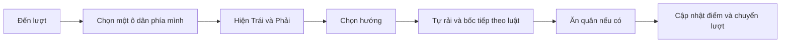

# Ô Ăn Quan 3D — kế hoạch triển khai

Ngày lập: 15/09/2026. Trạng thái: kế hoạch để Đại ca xem trước khi triển khai.

## 1. Mục tiêu và phạm vi bản đầu

Một bàn **Ô ăn quan bằng đồ chơi 3D trong sân đình tí hon**. Người chơi chạm một ô, chọn **Trái / Phải**, rồi xem dân rải quanh bàn, ăn liên tiếp và quan về khu ghi điểm. Sức hút đến từ việc tính nước đi và phản hồi hình ảnh, âm thanh rõ ràng.

**Đại ca đã yêu cầu/chốt:**

- Bàn, dân và quan có hình dạng/nhân vật 3D; ưu tiên hình ảnh cuốn hút và trải nghiệm chơi.
- Thao tác chính: chọn ô → chọn hướng trái/phải.
- Chơi với bạn cùng thiết bị hoặc đánh với máy, kế thừa trải nghiệm Cờ Cá Ngựa.
- Được dùng Google Flow hỗ trợ tạo ảnh và asset.
- Luật gọn: khi cả năm ô phía mình hết dân, dùng dân đã ăn để rải lại; **không đủ 5 dân thì kết thúc và tính điểm**. Không vay nợ.

**Mặc định em đề xuất:**

- Hai người: chủ hồ sơ và một bạn hoặc một máy; bạn chỉ nhập tên/chọn avatar, không cần hồ sơ mới.
- Một bàn, một phong cách sân đình, ba mức máy Dễ/Vừa/Khó. Mặc định Vừa; mầm non mặc định Dễ và giới thiệu cách chơi.
- 50 dân, 2 quan; 1 dân = 1 điểm, 1 quan = 10 điểm; cho ăn quan ngay khi đủ điều kiện vị trí.
- Tự lưu, tiếp tục ván, chơi lại, tạm dừng, chế độ nhẹ và bàn 2D dự phòng.
- Mở ở mọi lớp như Cờ Cá Ngựa; không chèn câu hỏi học tập hoặc phát sao/gacha trong bản đầu.
- Multiplayer qua mạng, bàn 3–4 người, nhiều bản đồ, bộ sưu tập nhân vật và chiến dịch để dành cho đợt sau.

Các mặc định mỹ thuật, quy đổi quan và chi tiết quyết toán dưới đây là đề xuất của em; không ghi nhận thành yêu cầu đã được Đại ca xác nhận.

## 2. Hướng hình ảnh: Sân đình tí hon

### Bàn và bối cảnh

- Bàn dài bằng gỗ sáng hoặc đất nung phủ men mờ, chia rõ hai hàng năm ô và hai ô quan bán nguyệt. Thành ô thấp, bo tròn, có độ sâu vừa đủ để giữ cảm giác đặt quân.
- Bối cảnh sân gạch, bóng cây, một vài chi tiết tre và mái đình ở ngoài vùng chơi. Vùng bàn sáng và ít họa tiết hơn hậu cảnh.
- Hai hàng có viền màu và biểu tượng riêng để nhận biết người đang chơi. **Dân là quân dùng chung**: không tô màu quân theo chủ sở hữu cố định vì chúng sẽ chạy qua cả hai phía.
- Hai quan có giá trị như nhau. Khác biệt trang trí nhỏ được phép, nhưng không tạo cảm giác quan ở đầu này mạnh hơn đầu kia.

### Dân và quan

| Thành phần | Tạo hình | Chuyển động chính |
| --- | --- | --- |
| Dân | Tượng đất/gỗ nhỏ, đầu tròn, thân gọn, gợi trang phục dân gian; 2–3 biến thể mỹ thuật cùng giá trị | Nhún khi chọn, nhảy ngắn khi rải, vui vẻ về khay khi được ăn |
| Quan | Nhân vật lớn khoảng 1,6–1,8 lần dân, mũ/áo và đường nét dễ phân biệt từ góc cao | Chào nhẹ khi được chú ý, hiệu ứng thu quan riêng, ăn mừng ngắn |
| Ô được chọn | Viền sáng, số dân nổi rõ, nhóm dân cùng hướng theo lựa chọn | Nhấc nhẹ cả nhóm, không thay vị trí logic |
| Khu ghi điểm | Khay nhỏ bên avatar, tượng quan đã thu và cụm dân đại diện | Nhận quân cùng nhịp bộ đếm tăng |

Nhân vật được dựng thành mesh có thể chiếu sáng và xoay nhìn trong scene. Ảnh Flow dùng làm tham chiếu và ảnh giao diện; mô hình tương tác cần được dựng riêng.

### Khi một ô có rất nhiều dân

- Mọi ô luôn có **số dân chính xác**. Ô quan ghi riêng, ví dụ `1 quan · 7 dân`; không dùng số 17 khiến người chơi tưởng có 17 quân để rải.
- Với ít quân, xếp từng nhân vật thành cụm có khoảng cách. Với ô đông, dùng cụm 3D đại diện tối đa khoảng 12 nhân vật và số tổng rõ ràng; ngưỡng cuối được chọn sau thử trực tiếp.
- Khi rải, số dân đang cầm và số ở từng ô cập nhật đúng từng lần thả, kể cả khi cụm trước đó được rút gọn.
- Kiểm tra các mật độ 1, 5, 12, 30, 50 dân cùng quan. Không thu nhỏ cả nhân vật đến mức không đọc được hình dạng hoặc để chúng che số đếm.
- Bóng đổ, cảnh phụ và vòng sáng phải phục vụ việc nhìn ô. Không dùng rung camera hoặc chớp toàn màn hình khi ăn quân.

## 3. Thao tác hai lần chạm



1. Đến lượt, năm ô thuộc người chơi được nhấn nhẹ; chỉ ô có dân nhận thao tác.
2. Chạm cả vùng ô để chọn. Hiện số quân cùng hai nút lớn **← Trái / Phải →**. Người chơi được chọn lại ô hoặc chạm vùng trống để bỏ chọn.
3. Mũi tên trên bàn cho thấy **ô nhận dân đầu tiên** của từng hướng. Chọn một nút là thực hiện ngay, không thêm hộp xác nhận.
4. Game tự xử lý toàn bộ rải, bốc nối, ăn và ăn liên tiếp. Người chơi không phải chạm từng dân hoặc xác nhận từng ô được ăn.
5. Khi chuỗi kết thúc, thông báo ngắn như `Bông ăn 6 dân`, `Ăn 1 quan và 3 dân`, hoặc `Dừng trước ô quan`; sau đó chuyển lượt.

**Các quyết định UX:**

- Giai đoạn chọn chỉ cho xem đường bắt đầu và số quân; không mặc định tiết lộ toàn bộ kết quả tốt nhất của hai hướng. Hướng dẫn riêng có thể minh họa từng bước.
- Bấm hai lần, hai ngón chạm cùng lúc hoặc bot trả kết quả muộn chỉ tạo một nước đi.
- Trong hoạt ảnh, khóa lựa chọn nước mới; Pause, âm thanh và nút xem nhanh vẫn dùng được.
- Nút Trái/Phải cao tối thiểu 48 px. Có lựa chọn ô bằng DOM/bàn phím bên ngoài canvas để dùng được khi chạm 3D khó.
- Không nhắc thúc người thật bằng đồng hồ đếm ngược. Máy có chỉ báo đang suy nghĩ, rồi trình diễn giống người thật.

### Trái/phải và camera

- Trái/phải được hiểu theo **bàn đang hiển thị trên màn hình**, không theo chiều kim đồng hồ cố định. Hàng trên và hàng dưới ánh xạ sang vòng đi ngược nhau.
- Bản đầu có góc Thẳng/Nghiêng, zoom giới hạn và xoay nhẹ quanh góc mặc định; giữ trục dài của bàn gần ngang màn hình. Không tự xoay 180° theo lượt.
- Giới hạn xoay ngang khởi điểm ±25°, góc cao khoảng 40–75° so với mặt bàn; preset Thẳng nhìn từ trên. Kiểm tra thực tế rồi điều chỉnh trong phạm vi không đảo hướng trái/phải.
- Khi đang chọn hướng, camera đứng yên. Đổi preset/zoom thì bỏ lựa chọn trước, rồi cho chọn lại theo góc mới.
- Tách chạm và kéo theo cách đã làm ở Cờ Cá Ngựa. Kéo đi rồi trở lại điểm đầu cũng không được tính thành chọn ô.
- Bàn ngang là bố cục chính. Màn dọc giữ bàn vừa khung và đặt hộp thao tác bên dưới; trên điện thoại có thêm năm nút chọn ô đủ lớn.

## 4. Nhịp chơi và hiệu ứng

| Tình huống | Hình ảnh và âm thanh | Ngân sách trình diễn khởi điểm |
| --- | --- | --- |
| Chọn ô | Dân nhún một nhịp, viền sáng, tiếng gỗ nhẹ | Phản hồi thấy được trong khoảng 100 ms |
| Bốc dân | Cụm dân nhấc lên; xuất hiện số đang cầm | 150–220 ms |
| Rải | Từng dân nhảy theo cung ngắn, ô đích sáng thoáng qua, tiếng gõ nhỏ | Cách nhau 80–130 ms; không đợi một dân hoàn tất mới phát dân sau |
| Bốc nối | Nhấn rõ ô mới và số quân vừa bốc | Nghỉ nhịp 180–250 ms |
| Ăn dân | Ô trống được nhấn trước, quân từ ô được ăn về khay, bộ đếm tăng | 350–550 ms cho một cụm |
| Ăn quan | Quan chào và về khay, hiệu ứng lá giấy/ánh vàng quanh ô | 650–900 ms |
| Ăn liên tiếp | Đường nối ngắn giữa những ô được ăn, âm có cao độ tăng nhẹ | Giữ tổng phần ăn khoảng 1–2 giây nếu có thể |
| Kết thúc | Thu dân còn lại theo luật, hai bảng điểm mở rõ, nhân vật ăn mừng | 1–2 giây rồi hiện nút chơi tiếp |

- Mục tiêu lượt phổ biến khoảng 2–5 giây trình diễn; lượt rải dài tự tăng tốc sau các bước đầu. Luôn có **Xem nhanh** để tới trạng thái cuối đã tính xong.
- Thời gian trên là mục tiêu điều chỉnh khi thử, không giới hạn số bước luật. Chuỗi dài vẫn phải giải quyết đầy đủ.
- Chế độ giảm chuyển động dùng chuyển vị trí ngắn/fade, giữ số đếm và thông báo. Chế độ nhẹ giảm cảnh phụ và bóng, vẫn giữ các dấu hiệu chọn/rải/ăn.
- Nhạc nền nhỏ, âm rải không chồng thành tiếng ồn; âm lượng nhạc/hiệu ứng dùng cài đặt chung. Nhạc và hiệu ứng có nguồn được phép sử dụng, kiểm tra khả năng lặp trước tích hợp.
- Tutorial 3 bước trong bàn riêng: chọn ô → chọn hướng → nhìn ô trống và ô được ăn. Hoàn thành hoặc bỏ qua đều vào sảnh; không tính thành ván thật.

## 5. Bộ luật cụ thể cho engine

Tên cấu hình dự kiến: `family-v1`, hiển thị cho người chơi là **Luật gọn**.

### 5.1. Sơ đồ và hướng đi

```text
                   Người chơi B
             [10] [ 9] [ 8] [ 7] [ 6]
  QUAN TRÁI [11]                       [5] QUAN PHẢI
             [ 0] [ 1] [ 2] [ 3] [ 4]
                   Người chơi A

Vòng +1: 0 → 1 → 2 → 3 → 4 → 5 → 6 → ... → 11 → 0
Vòng -1: chiều ngược lại.
```

ID chỉ dùng cho code/tài liệu. Người chơi thấy nhân vật và số quân. A chọn ô 0–4, B chọn ô 6–10. Hai ô quan không thuộc tập ô được bốc để bắt đầu.

- Khởi tạo: mỗi ô dân có 5 dân; mỗi ô quan có 1 quan, chưa có dân.
- Dân = 1 điểm, quan = 10 điểm. Quan ở lại ô quan cho đến khi bị ăn; không bốc quan để rải.
- Bắt đầu bằng bốc toàn bộ dân từ một ô hợp lệ của mình. Rải từng dân vào ô kế tiếp, đi qua cả hai ô quan. Một vòng dài có thể rải trở lại ô xuất phát đã bốc rỗng.
- Giữ nguyên hướng trong cả lượt. Hết quân trên tay: nếu ô kế tiếp là ô dân có quân thì bốc toàn bộ ô đó để rải tiếp, kể cả ô ở hàng đối phương.

Khung bàn, phân phía và nguyên tắc rải/bốc nối được đối chiếu với [hướng dẫn của Tiểu học Thanh Am](https://ththanham.hanoi.edu.vn/goc-sang-tao/cach-choi-o-an-quan-5-o/ctmb/2923/173407). ID vòng đi và cách ánh xạ trái/phải ở đây là thiết kế triển khai.

### 5.2. Ăn và dừng lượt

- Sau lần thả cuối: nếu ô kế tiếp là **ô dân trống**, và ô sau đó có quân, ăn toàn bộ quân ở ô sau đó. Được ăn ô dân của bất kỳ phía nào hoặc ô quan.
- Sau một lần ăn, lấy ô vừa ăn làm mốc. Nếu tiếp tục gặp một ô dân trống rồi một ô có quân, tự ăn tiếp; dừng khi chuỗi không còn hợp lệ.
- Nếu ô kế tiếp là ô quan, kể cả ô quan đã trống, dừng lượt. Ô quan trống không làm khoảng trống để nhảy qua ăn ô sau.
- Hai ô liên tiếp trống làm dừng lượt. Sau chuỗi ăn không quay lại bốc/rải trong cùng lượt.
- Quan được ăn cùng mọi dân đang có trong ô đó. Đề xuất không dùng điều kiện “quan non” hoặc cấm ăn quan đầu ván trong `family-v1`.

Các nguồn hướng dẫn có biến thể về quan non và ô quan trống; [MN Bắc Cầu](https://mnbaccau.hanoi.edu.vn/tro-choi-cho-be/tro-choi-dan-gian-o-an-quan/ctmb/13293/394514) mô tả quan non là điều kiện có thể thêm. Kế hoạch chọn rõ cách xử lý trên để cả người và máy chơi cùng một luật.

### 5.3. Rải lại, kết thúc và tính điểm

- Đầu lượt, nếu cả năm ô của người đến lượt không còn dân: lấy **5 dân đã ăn**, đặt mỗi ô 1 dân và trừ 5 khỏi kho dân của họ. Rải lại là tự động, có thông báo ngắn; sau đó họ chọn nước bình thường.
- Nếu kho có ít hơn 5 dân, kết thúc theo lựa chọn đã chốt của Đại ca. Quan đã ăn không đổi thành dân để tiếp tục; không vay.
- Kết thúc thông thường khi **hai ô quan đều không còn cả quan lẫn dân**. Việc hai nhân vật quan đã được ăn nhưng một ô quan còn dân chưa đủ để kết thúc.
- Kiểm tra kết thúc thông thường ngay sau mỗi lần ăn, trước khi tìm bước ăn tiếp; nếu chưa hết ván thì tiếp tục chuỗi. Chỉ kiểm tra thiếu dân khi chuẩn bị lượt tiếp theo.
- Khi kết thúc, mỗi bên thu dân còn ở năm ô phía mình. Điểm cuối = dân trong kho + 10 × quan đã ăn. Bằng điểm là hòa.
- **Đề xuất quyết toán khi kết thúc sớm vì thiếu dân:** vẫn thu dân hai hàng như trên; quân còn trong hai ô quan không tính cho bên nào. Bảng kết quả ghi số điểm còn trên bàn và lý do kết thúc. Thiếu dân không tự động đồng nghĩa thua: so điểm cuối.
- Vì vậy tổng điểm hai người có thể dưới 70 khi kết thúc sớm. Không hiển thị điểm ván như tỷ lệ trả lời đúng hoặc buộc tổng phải bằng 70.

[MN Bắc Biên](https://mnbacbien.hanoi.edu.vn/tro-choi-cho-be/tro-choi-o-an-quan/ctmb/10904/221058) mô tả cách rải lại, kết thúc khi hết dân/quan ở hai đầu và thu quân phía mình. Quy tắc không vay và kết thúc khi thiếu dân là lựa chọn riêng của bản này; cách xử lý quân giữa bàn khi kết thúc sớm là đề xuất sản phẩm.

### 5.4. Ván lặp và ví dụ bắt buộc

- Engine nhận diện trạng thái lặp, không giả định mọi chuỗi bốc/rải luôn ngắn. Bản đầu đề xuất kết thúc tính điểm như trường hợp bế tắc nếu cùng trạng thái đầy đủ ở đầu lượt lặp ba lần.
- Nếu một chuỗi rải tự quay lại đúng trạng thái xử lý đã gặp trong lượt, phát hiện tại ranh giới hết quân trên tay; dừng ván với lý do bế tắc và quyết toán theo cùng quy tắc. Không tự bỏ bớt bước để thoát vòng lặp.
- Trạng thái dùng nhận diện lặp gồm dân, quan, kho hai bên và người đi; trong lượt có thêm vị trí mốc, hướng và giai đoạn. Thông số chống lặp thuộc `rulesVersion`.
- Ví dụ cần khóa trước khi code scene: A chọn ô 2 sang phải; B chọn ô 8 sang phải; rải quá một vòng; bốc nối sang hàng đối thủ; dừng trước quan trống; ăn quan có dân; ăn hai cụm cách ô; rải lại từ đúng 5 dân; thiếu dân dù đã có quan; kết thúc sớm còn quan; kết thúc hai đầu trống; hòa điểm.

## 6. Chơi với bạn, đấu máy và kết quả

### Sảnh

- Hai thẻ ghế cố định: chủ profile và đối thủ. Đối thủ chuyển giữa **Chơi với bạn / Chơi với máy**.
- Với bạn: tên tiếng Việt, avatar có sẵn. Với máy: tên thân thiện và mức Dễ/Vừa/Khó. Lưu lựa chọn theo profile.
- Không thêm profile khi tạo bạn; không cho tên rỗng/trùng sau chuẩn hóa. Tên/avatar chủ lấy từ profile hiện tại.
- Bốc thăm người đi đầu ở ván mới; chơi lại cùng nhóm đổi người đi đầu để cân bằng. Lựa chọn này được lưu trong snapshot.
- Có Tiếp tục ván và Luật chơi; mở đường dẫn trực tiếp cũng vào đúng sảnh của game.

### Trong ván và kết quả

- Luôn thấy người đến lượt, điểm đang giữ, số quan đã ăn và năm ô thuộc mỗi người. Khi rải lại, điểm đang giữ giảm đúng 5.
- Chế độ cùng nhìn một màn hình là mặc định; tùy chọn Chuyền máy hiện tên và nút Sẵn sàng trước lượt người thật.
- Kết quả ghi Thắng/Thua/Hòa đúng người, tách dân/quan, dân thu cuối ván và lý do kết thúc. Có Chơi lại, Đổi đối thủ, Về danh mục.
- Khách thắng không cộng thắng cho chủ hồ sơ. Ván hòa được ghi riêng. Không tự cộng thành tích thắng chỉ vì callback hoàn thành chạy.

## 7. Máy chơi: tìm nước đáp trả, chạy trên thiết bị

Mỗi lượt có tối đa 10 lựa chọn ban đầu: năm ô × hai hướng. Một cạnh tìm kiếm là **toàn bộ lượt đã giải quyết xong**, bao gồm bốc nối, chuỗi ăn, kiểm tra kết thúc và rải lại đầu lượt sau.

Đề xuất minimax với alpha–beta: xét nước của mình rồi nước đáp trả của đối thủ; bỏ các nhánh không thể cải thiện lựa chọn hiện tại. Đây là cách tìm kiếm phù hợp để thử cho bàn hai người, thông tin đầy đủ, không có xúc xắc. Cơ sở thuật toán: [Berkeley CS188 — Minimax](https://inst.eecs.berkeley.edu/~cs188/textbook/games/minimax.html). Độ mạnh thực tế phải đo trên engine của game.

| Mức | Hành vi | Ngân sách thử ban đầu |
| --- | --- | --- |
| Dễ | Nhìn lợi ích gần, chọn đa dạng trong nhóm nước hợp lý; luôn nhận ra thắng ngay | 1–2 lượt sâu, khoảng 20–40 ms |
| Vừa | Cân bằng ăn trước mắt, nguy cơ đối thủ ăn lại và giữ dân để đi | Tăng dần tới khoảng 4–6 lượt, trần khoảng 150–200 ms |
| Khó | Xét bẫy ăn liên tiếp, quyền ăn quan và thời điểm kết thúc ván | Tăng dần tới khoảng 8–12 lượt nếu kịp, trần khoảng 450–600 ms |

- Chiều sâu là mục tiêu, không hứa luôn đạt. Dùng cả giới hạn thời gian và số nút; lưu nước tốt nhất của vòng tìm kiếm hoàn tất gần nhất.
- Đánh giá điểm thực, nước ăn đáp trả mạnh nhất, độ cơ động, kho đủ rải lại, quan còn trên bàn và kết quả cuối. Không dùng số quân rải được làm đại diện duy nhất cho nước tốt.
- Engine bot và người là một. Không đổi số dân/quan, không đọc thao tác chưa xác nhận để tạo lợi thế.
- Worker mang `matchId`, `revision`, `requestId`; pause/rời ván hủy worker, bỏ kết quả cũ. Timeout/lỗi dùng lựa chọn chiến thuật hợp lệ có giới hạn.
- Cache tìm kiếm phải xét luật và lịch sử có ảnh hưởng đến kết thúc lặp; không lấy đánh giá của một ngữ cảnh lặp khác làm kết quả chính xác.
- Có thể hiện một câu lý do ngắn từ đặc điểm nước đi, không dùng API AI hoặc phát sinh phụ thuộc mạng để chơi.

### Nghiệm thu sức mạnh

- Tối thiểu 30 thế cờ độc lập: thắng ngay, ăn quan nhưng thua đáp trả, ăn chuỗi, tránh hết dân, chủ động kết thúc sớm có lợi, hòa, bốc nối và hướng đảo theo hàng.
- Mọi mức đi hợp lệ 100%; Khó đạt ít nhất 90% các đáp án chiến thuật đã phân tích độc lập; thắng ngay có thể xác định phải chọn đúng.
- Đánh giá ít nhất 128 vị trí mở đầu/trung cuộc khác nhau, hợp lệ và tách khỏi tập chỉnh bot; mỗi vị trí chơi cả hai phía. Dùng thêm khai cuộc chuẩn đổi người đi đầu.
- Baseline ngẫu nhiên và tham lam ăn nhiều điểm ngay trong lượt. Báo thắng/hòa/thua, hiệu số điểm, nguyên nhân kết thúc, độ sâu, số nút, thời gian p50/p95.
- Mục tiêu ban đầu: điểm đối sánh `(thắng + 0,5 × hòa) / số ván` của Khó ≥80% trước ngẫu nhiên, ≥60% trước tham lam; Khó phải có cải thiện so với Vừa trên tập độc lập.
- Đây là tiêu chí dự kiến. Chạy lặp một khai cuộc xác định không tạo thêm bằng chứng độc lập; nếu dùng khoảng tin cậy, gom cặp theo vị trí gốc. Chưa đo thì không gọi bot đã đạt hoặc bảo đảm thắng người giỏi.

## 8. Dùng Flow và dựng asset 3D

Project đã có trong ngữ cảnh: [Game Assets trên Flow](https://flow.google.com/project/7b20f6a9-d1ff-4fbb-9152-27694219b8d5). Quyền dùng Flow phục vụ game đã được Đại ca cho phép. Khi triển khai sẽ kiểm tra giao diện/công cụ thực tế rồi tạo asset; lượt lập kế hoạch này chưa tạo ảnh.

| Asset | Cách làm | Đầu ra dự kiến |
| --- | --- | --- |
| Concept tổng thể | Flow: hai hướng chất liệu cùng bố cục sân đình | 2 ảnh 16:9 để đối chiếu ánh sáng, mật độ cảnh |
| Thiết kế dân/quan | Flow: cùng reference, góc trước/nghiêng/bên; nền đơn giản | Bảng tham chiếu hình dáng và chất liệu |
| Cover danh mục | Flow theo hướng đã chọn, kiểm tra crop | WebP 800×450 và 400×225 |
| Nền sảnh | Flow, chừa vùng tên và nút | Ảnh responsive, không tải vào bàn nếu không cần |
| Texture phụ | Flow nếu thật sự cải thiện hình ảnh | Gỗ/đất/gạch 512–1024 px, kiểm tra đường nối và ánh sáng baked |
| Dân/quan tương tác | Dựng geometry/GLB từ reference trong dự án | Mesh dùng chung, vật liệu gọn, chuyển động nhảy/chào đơn giản |
| Bàn và ô | Dựng từ dữ liệu bố cục của engine | Đúng 12 ô và đường rải, hitbox riêng rộng |
| Vòng chọn, vệt di chuyển, lá giấy | Mesh/particle và animation trong scene | Hiệu ứng có thể giảm chất lượng và dừng khi pause |

- Flow phục vụ ảnh và tham chiếu; kế hoạch không phụ thuộc việc Flow xuất được GLB hoặc rig. Nếu có khả năng mới, chỉ đưa vào quy trình sau khi kiểm chứng.
- Làm một dân, một quan và một đoạn bàn ở tỷ lệ chơi thật trước khi mở rộng chi tiết. Dùng vật liệu/geometry chung và instancing cho các hình lặp.
- Dân có thể dùng chuyển động thân cứng: nhảy, nghiêng, co giãn nhẹ. Quan có thêm vài bộ phận cho động tác chào. Tránh tạo 52 bộ xương animation đầy đủ ngay bản đầu.
- Số ô, số quân, chữ và nút được dựng từ code; không giao cho ảnh sinh quyết định sơ đồ hoặc số lượng quân.
- Lưu manifest: nguồn/project, prompt, reference, bản đã chọn, vai trò, kích thước, tên file. Concept thử không vào gói tải chơi.

Prompt định hướng concept:

> Premium miniature Vietnamese O An Quan board game in a peaceful village communal courtyard, warm terracotta and pale wood, friendly tiny painted clay villagers, two larger mandarin figurines, clear overhead three-quarter view, two rows of five shallow square pits with a semicircular pit at each end, restrained banyan foliage and bamboo details around the perimeter, soft daylight, readable playing surface, no text, no labels, no UI.

Concept chỉ thể hiện hướng mỹ thuật; sơ đồ đúng và số quân cuối cùng do scene dựng.

## 9. Kiến trúc và phần kế thừa

Đã đối chiếu Cờ Cá Ngựa: `HorseRaceGame.tsx` điều phối sảnh/lượt/hoạt ảnh, `engine.ts` độc lập, `bot.worker.ts` chạy máy, `persistence.ts` lưu theo profile; camera và gesture đã tách. Kế thừa cách tổ chức và các phần phù hợp, viết engine Ô ăn quan riêng.

| Phần hiện có | Áp dụng cho Ô ăn quan |
| --- | --- |
| `games/HorseRace/HorseRaceGame.tsx` | Tham khảo sảnh, avatar, pause, chế độ chuyền máy; tách component cho game mới |
| `games/HorseRace/BoardCamera.tsx`, `view.ts`, `boardGesture.ts` | Kế thừa nguyên tắc giữ tỷ lệ/phối cảnh và phân biệt kéo/chạm; thay giới hạn camera phù hợp bàn dài |
| `games/HorseRace/persistence.ts` | Snapshot có version, validator, owner; chống ghi trùng kết quả |
| `src/components/hub/catalog.ts`, `HubArt.tsx` | Thêm `o-an-quan`, thẻ/cover và quy tắc xuất hiện theo lớp |
| `games/GameLauncher.tsx` | Lazy load entry riêng, mở sảnh trực tiếp, xử lý lỗi tải |
| `src/contexts/StudentContext.tsx`, `types.ts` | Hành động hoàn thành riêng, metadata `oAnQuan`, ghi đúng hồ sơ |
| `src/components/UserProfileScreen.tsx` | Hiển thị thắng/hòa/thua và điểm dân/quan, tránh diễn giải thành điểm học tập |
| `services/profileService.ts`, `achievementService.ts` | Kiểm tra migration, bảo toàn metadata, chỉ tăng thắng khi chủ thắng |
| `vite.config.ts` | Cache có phạm vi cho asset cần chơi; hiện GLB precache chỉ nhắm `dragon/*.glb`, cần thêm nếu dùng GLB mới |

```text
games/OAnQuan/
  OAnQuanGame.tsx
  model.ts / rules.ts / board.ts / engine.ts
  engine.test.ts / rules.fixtures.ts
  bot.ts / bot.worker.ts / bot.test.ts
  persistence.ts / persistence.test.ts
  useOAnQuan.ts / presentation.ts
  components/   Lobby, TurnPanel, Results, Guide
  scene/        Board3D, Villagers, Mandarin, Camera, Effects, Board2D
  audio.ts / o-an-quan.css / preview.tsx
public/o-an-quan/
  art/ / models/ / audio/
scripts/
  build-o-an-quan-assets.mjs
  benchmark-o-an-quan.ts
docs/
  o-an-quan-implementation-plan.md
  o-an-quan-implementation-report.md
  o-an-quan-asset-manifest.md
```

### Trạng thái luật và trình diễn

- `Match`: version/rulesVersion, ID ván, owner, hai ghế, 12 số dân, trạng thái hai quan, kho dân/quan, người đi, revision, số lượt, người đi đầu, thời lượng, lịch sử lặp, kết quả và lý do kết thúc.
- `Action`: ô xuất phát + hướng vòng đi + revision. Máy và giao diện gọi cùng hàm kiểm tra.
- `resolveTurn(state, action)` trả `{ nextState, events }`: các bước bốc, thả, ăn, rải lại, thu cuối ván và chuyển lượt.
- Logic thuần, không DOM/Three/âm thanh. Bot dùng đường chạy gọn không tạo toàn bộ dữ liệu animation nếu không cần, nhưng phải cho cùng trạng thái cuối.
- Chốt và lưu `nextState` trước khi trình diễn; hình đang hiển thị đọc từ trạng thái trước và chuỗi sự kiện. Số trên ô/điểm phải khớp khung hình đang thấy, không nhảy trước tới điểm cuối.
- Xem nhanh kết thúc trình diễn và dựng đúng `nextState`, không áp dụng nước đi lần nữa. Reload giữa chuỗi về trạng thái đã chốt; không ăn quân hoặc cộng điểm hai lần.
- Nếu tính một lượt dài có nguy cơ chiếm main thread, dùng tác vụ worker có hủy. Mốc phản hồi chọn ô không chờ tính toàn bộ preview.

## 10. Lưu ván, hồ sơ và offline

- Một ván dở/profile; lưu nhóm chơi, độ khó, luật và cài đặt riêng. Snapshot kết thúc sớm giữ phần quân không được tính điểm để giải thích kết quả.
- Bất biến ở snapshot ổn định: tổng dân trên bàn + kho + phần không nhận ở kết quả = 50; tổng quan tương ứng = 2. Khi kiểm tra từng event trung gian phải tính thêm quân đang cầm/đang di chuyển. Không dùng ảnh/animation làm nguồn số lượng.
- Rời trang/ẩn tab/pause hủy bot, dừng âm và animation; tiếp tục không tự làm thêm nước. Đổi profile không mở nhầm ván.
- Lưu lỗi hiển thị trạng thái thật, có thử lại. Chỉ đánh dấu ghi lịch sử thành công sau khi ghi profile được.
- Kết quả dùng ID ván chống trùng, `hostResult: win | loss | draw`, điểm hai bên, dân/quan đã thu, lý do kết thúc, độ khó và phiên bản luật/bot. `score` tương thích là điểm chủ; `maxScore` 70 là trần tài nguyên, không phải phần trăm học lực.
- Giữ lịch sử và tiền sao của mọi game khác. Xóa profile dọn đúng dữ liệu Ô ăn quan của profile đó.
- Tải game/scene/worker theo nhu cầu. Dùng `BASE_URL` để chạy dưới `/Genius-kids/`.
- Offline sau khi tải/cache xong tài nguyên cần chơi; kiểm thử production service worker. Chưa cache phải báo đúng, không hứa mở lần đầu khi đang offline.

## 11. Ngân sách chất lượng và hiệu năng

Các con số là ngưỡng khởi điểm phải đo, chưa phải kết quả hiện có.

| Hạng mục | Mục tiêu |
| --- | --- |
| Tương tác | Ô/nút có phản hồi trong khoảng 100 ms; thao tác DOM hoạt động khi scene đang tải |
| Hình ảnh chuyển động | Hướng tới 60 fps trên thiết bị thử đủ khả năng; chế độ nhẹ khoảng ≥30 fps |
| Scene cân bằng | Khoảng ≤100 draw calls, ≤100 nghìn tam giác; đo cả lúc thu quan/ăn nhiều ô |
| Texture | Chủ yếu 512–1024 px; giới hạn DPR khoảng 1–1,5 như Cờ Cá Ngựa |
| Tải riêng của game | Mục tiêu ≤6 MB ảnh/model/âm cần thiết; báo riêng JS và thư viện dùng chung |
| Máy Khó | p95 tính nước ≤600 ms trên thiết bị thử; thời gian làm hiệu ứng suy nghĩ đo riêng |
| Khi đứng yên/ẩn | Render theo nhu cầu, hoạt ảnh idle thưa; không chạy cả scene liên tục chỉ để dân thở |

- Các chất lượng cùng luật và cùng sự kiện. Giảm bóng, số vật trang trí/particle trước khi giảm độ rõ của quân và số đếm.
- WebGL không hỗ trợ hoặc mất context chuyển 2D giữ nguyên ván, hai lần chạm và số lượng quân.
- Camera dùng khoảng cách/khung chiếu, không kéo giãn mesh bàn khi resize hoặc fit. Số/nhãn không bị thành ô hoặc nhân vật che.

## 12. Thứ tự triển khai và điều kiện hoàn thành

| Chặng | Công việc | Đầu ra để xem | Điều kiện qua chặng |
| --- | --- | --- | --- |
| 1. Luật và thao tác | Engine, sơ đồ 12 ô, chọn trái/phải, fixtures rải/ăn/kết thúc | Bàn thử đơn giản chơi hết một ván hai người | Đúng luật gọn, hai lần chạm, số quân bảo toàn |
| 2. Mẫu 3D ngắn | Flow concept, 1 dân/1 quan, bàn thật, chuỗi rải–ăn đại diện | Một scene có thể chạm, rải, ăn dân và quan | Nhân vật rõ ở tablet, số rõ khi ô đông, hướng không nhầm, nhịp dễ theo dõi |
| 3. Ván hoàn chỉnh | Nhóm chơi, toàn bộ animation, âm, pause, lưu/tiếp tục, kết quả | Chơi với bạn từ sảnh đến kết thúc | Reload giữa chuỗi không mất/nhân đôi quân, đúng mọi lý do kết thúc đã quy định |
| 4. Máy và benchmark | Ba mức, worker, fixture chiến thuật và tập đánh giá | Người đấu máy hết ván, có số đo | Không nghẽn UI, mọi nước hợp lệ, báo mức đạt so với ngưỡng |
| 5. Tích hợp và hoàn thiện | Danh mục/profile, responsive, offline, fallback, QA và sửa lỗi | Bản local hoàn chỉnh cùng báo cáo | Kiểm tra mục 13; công khai phần chưa đo trên thiết bị thật |

Thứ tự này đưa rủi ro hình ảnh/thao tác ra kiểm tra sớm ở chặng 2. Chỉ mở rộng asset sau khi mẫu 3D đã chứng minh đọc bàn rõ và xem rải/ăn thú vị. Chặng 1 là nền kiểm tra luật; sản phẩm bàn giao chính vẫn là game 3D hoàn chỉnh.

## 13. Kiểm thử và tiêu chí bàn giao

### Luật, lưu dữ liệu và máy

- Bảng ví dụ mục 5.4; kiểm tra đối xứng hai phía, chọn trái/phải đúng, rải lại, quan trống/có dân, kết thúc sớm và hòa.
- Hàng nghìn chuỗi nước hợp lệ có seed để tái hiện; kiểm tra bất biến 50 dân/2 quan, số không âm, lượt và điểm. Test cả trạng thái đông quân và lặp.
- Đối chiếu trình giải phục vụ bot với bản có event; phát hết event phải khớp snapshot cuối. Kết thúc giữa chuỗi không còn event cộng điểm sau đó.
- Reload lúc đang chọn, bốc, rải, ăn quan, bot nghĩ, rải lại và kết quả; xử lý worker trả chậm sau pause/chơi lại.
- Kho đầy, JSON hỏng, phiên bản luật sai, nhầm profile, thử lưu lại, mở kết quả nhiều lần; hồ sơ cũ vẫn đọc được.

### Trực quan và trải nghiệm

- Viewport 1024×768, 1180×820, 820×1180, 390×844; không có phần bàn hoặc nút bắt buộc bị hộp điều khiển che.
- Chọn được ô đông quân, ô sát quan, hàng xa; kéo không thành chạm; hai lần chạm rõ ràng, bàn phím/DOM tương đương.
- Đúng hình ảnh cả dân lẫn quan, đọc được số lượng, điểm tăng đúng nhịp, ăn quan nổi bật; âm không dồn chồng khi rải nhanh.
- Pause, Xem nhanh, tắt âm, giảm chuyển động, đồ họa nhẹ, mất WebGL và offline đều giữ trạng thái.
- Nếu có điều kiện, thử 3–5 người mới chơi: sau tutorial ngắn tự đi được một lượt và hiểu vì sao ăn được quân. Mục tiêu ít nhất 4/5 nếu đủ năm người; báo quan sát thực, không suy từ test code.
- Đo trên iPad/Safari và Android/Chrome thật khi có thiết bị. Mô phỏng viewport không được ghi thành đã đo cảm ứng, FPS, nhiệt máy hoặc pin trên tablet.
- Khi tích hợp xong: chạy test tập trung, TypeScript, suite hiện có và build; thử lại Cờ Cá Ngựa cùng các đường dùng chung đã sửa.

## 14. Trạng thái sau bước planning

- Đầu ra hiện tại là tài liệu này; chưa triển khai game và chưa tạo ảnh mới trên Flow.
- Luật thiếu dân đã được Đại ca xác nhận; các mặc định còn lại đã ghi cụ thể để có thể góp ý trực tiếp.
- Chặng triển khai đầu tiên nên làm **engine + một mẫu 3D rải/ăn có thể chơi thử**, sau đó mở rộng thành ván đầy đủ theo bảng chặng.
- Độ đẹp của scene, tốc độ trên tablet và sức mạnh bot sẽ được xác minh bằng bản chạy và số đo trong quá trình triển khai.

## 15. Cập nhật triển khai — 15/09/2026

Đã triển khai game local: engine `family-v1`, bàn 3D và nhân vật, sân đình chi tiết, chọn ô/chọn hướng ngay trên bàn, chơi cùng bạn hoặc máy ba mức, animation, lưu/tiếp tục, kết quả, tích hợp danh mục và hồ sơ, fallback 2D. Chặng 1–5 đã có mã và bản chạy; phần đo thiết bị thật và thử người dùng vẫn là việc nghiệm thu tiếp theo.

- [Báo cáo triển khai và kiểm chứng](o-an-quan-implementation-report.md).
- [Nguồn ảnh và asset](o-an-quan-assets.md).
- Benchmark riêng: ba file `o-an-quan-benchmark-*-128-20260915.json`.
- Các ngưỡng ở mục 11 và tiêu chí thử người dùng là mục tiêu, không phải khẳng định tất cả đã đạt. Xem số đo và giới hạn trong báo cáo.
