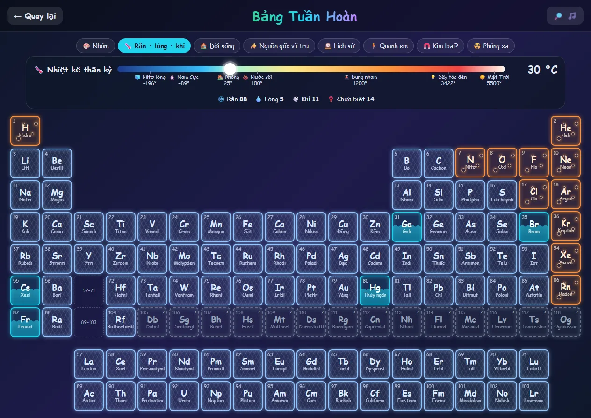
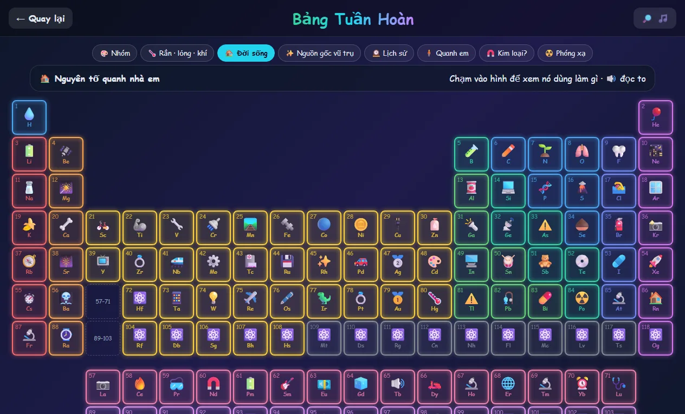
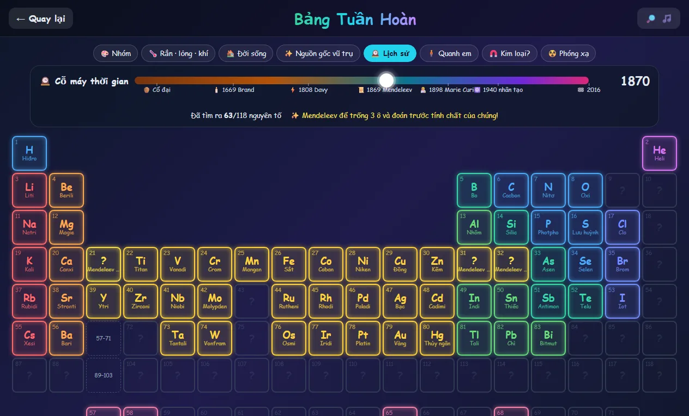
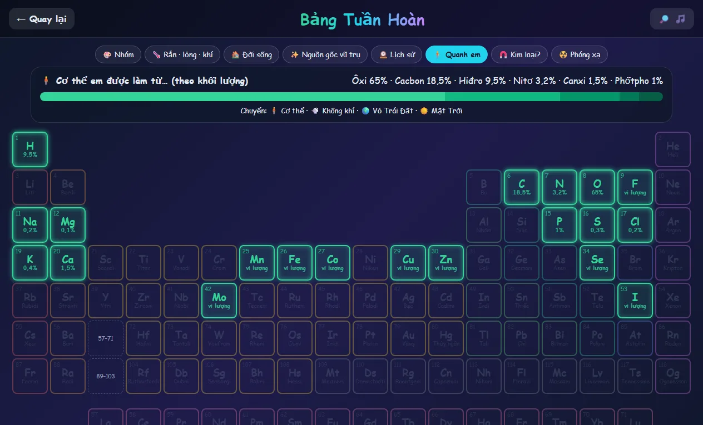
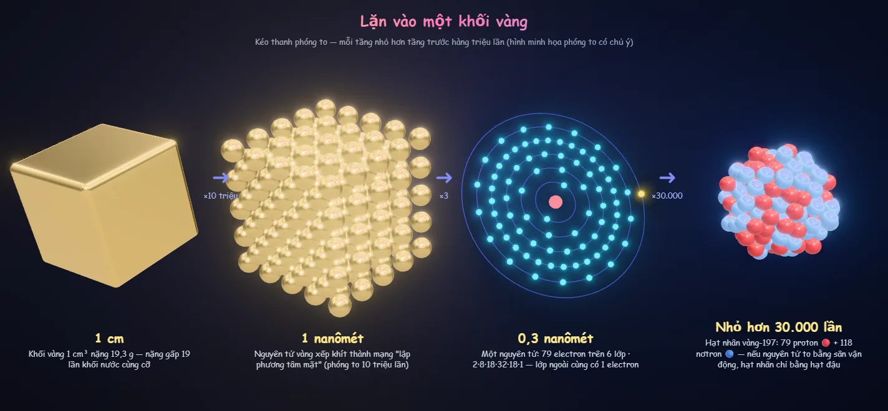
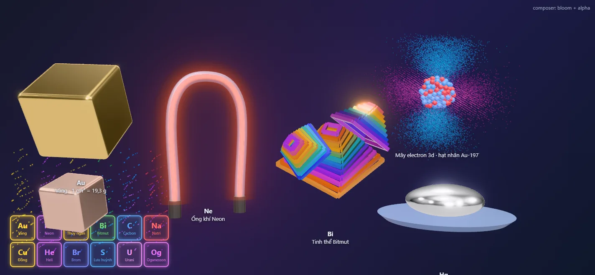

# Làm mới "Bảng Tuần Hoàn": 118 cánh cửa dẫn vào vật chất

Ngày 29/09/2026. Nhánh đề xuất: `feat/periodic-table-wow` (tag `ptable-before-wow` đặt trên `main` trước khi sửa).
Route giữ nguyên: `/science/periodic-table` (catalog, test hub và App.tsx không đổi).
Tài liệu đi kèm: [periodic-table-wow/](periodic-table-wow/) — ảnh ý tưởng (dựng bằng bản thử, **không phải** code app) và dữ liệu nghiên cứu.

> **Nguyên tắc số 1 (người dùng chốt 29/09):** bố cục bảng hiện tại (lưới 18 cột, ô neon tô theo nhóm, hai hàng f bên dưới) **giữ nguyên**. Không dời, không đổi cỡ, không đổi màu mặc định của ô nào. Mọi thứ mới được xây *quanh* bảng hoặc *đè lên* bảng.

---

## 0. Tóm tắt một phút

Hiện giờ bảng tuần hoàn là một tấm bảng đẹp, nhưng chạm vào ô chỉ mở ra một hộp chữ kèm mô hình nguyên tử đơn giản. Bé không có gì để *làm*. Đề xuất: giữ tấm bảng, thổi sự sống vào nó theo bốn lớp.

| Lớp | Bé làm gì | Ví dụ khoảnh khắc |
| --- | --- | --- |
| **1. Kính lọc** — bảng đổi *nội dung* ô, ô không dịch chuyển | Chọn kính, kéo thanh trượt | Kéo nhiệt kế lên 30 °C: Gali, Xesi, Franxi chảy thành nước; lên 3.000 °C: chỉ còn 5 nguyên tố chưa chảy |
| **2. Bước vào nguyên tố** — chạm ô | Xoay mẫu vật, làm thí nghiệm, phóng to | Khối vàng 1 cm³ bay ra khỏi ô Au; lặn vào: mạng nguyên tử → 79 electron → hạt nhân 79 proton + 118 nơtron |
| **3. Phòng thí nghiệm** | Pha màu pháo hoa, lắp ráp nguyên tử | Pháo hoa giao thừa: Stronti đỏ + Natri vàng = "cờ đỏ sao vàng" trên Hồ Gươm |
| **4. Chơi và sưu tầm** | Truy tìm, tọa độ, cân khối, tủ sưu tập | "Tìm giúp tớ nguyên tố làm bóng bay bay lên!" → bé chạm ô He |

Mở màn (lần đầu mỗi phiên, ~20 s, chạm để bỏ qua): **"Từ Vụ Nổ Lớn đến em"**. Bảng tối đen, một chớp sáng thắp ô H và He, các ngôi sao thắp C, N, O, siêu tân tinh thắp tới Fe, hai sao neutron va nhau thắp Au, Pt, U. Kết thúc: "Cơ thể em được làm từ bụi sao!", ô O, C, H, N sáng quanh avatar của bé.

Ảnh ý tưởng (bản thử, cùng kiểu ô với bảng thật):

| Kính nhiệt độ 30 °C | Kính đời sống | Kính lịch sử 1870 |
| --- | --- | --- |
|  |  |  |

| Kính "quanh em" (cơ thể) | Lặn vào khối vàng | Mẫu vật 3D + phát sáng đè lên bảng DOM |
| --- | --- | --- |
|  |  |  |

---

## 1. Hiện trạng (xem trực tiếp trên dev server 29/09/2026, 1280×720)

| Hạng mục | Hiện tại | Vấn đề |
| --- | --- | --- |
| Bảng | 118 ô neon theo 10 nhóm, chú giải chip, nút ⓘ; bảng rộng 1.265 px | **Đẹp, giữ nguyên.** Nhưng iPad ngang (1024 px) phải cuộn ngang, điện thoại dọc bảng rộng ~2,7 màn. Hai ô nhóm 3 ở chu kỳ 6–7 trống, bé không biết La–Lu, Ac–Lr thuộc về đâu |
| Chạm ô | modal: mô hình nguyên tử + lưới thông số + 3 "Bạn có biết?" + nút infographic | toàn chữ, không đọc to, không có việc gì để *làm*; modal che hết bảng |
| `Atom3D` | Bohr, vòng electron nghiêng ngẫu nhiên | giới hạn 50 hạt nhân nên **96 nguyên tố (từ V trở đi) hiện sai hạt nhân**, riêng 69 nguyên tố từ Sn trở đi hiện **0 nơtron**; nơtron tính bằng `round(khối lượng) − Z` nên sai đồng vị ở 35 nguyên tố (vd Cu-64, Br-80, Ag-108 đều là đồng vị phóng xạ không có trong tự nhiên); vị trí hạt dùng `Math.random` nên mỗi lần mở một khác; vòng nghiêng ngẫu nhiên khác cách SGK vẽ (vòng tròn đồng tâm) |
| Tìm kiếm | lọc theo tên/ký hiệu/số | không bỏ dấu: gõ "hidro" không ra H (vì chữ "đ") |
| Tên nguyên tố | tên cũ: Hiđro, Oxi, Cacbon, Photpho… | lệch chuẩn SGK mới (mục 2.2) và lệch cả infographic ("SODIUM (Na)") |
| Dữ liệu số | mật độ, năm phát hiện đủ 118; nóng chảy 104/118, sôi 100/118 | nhìn chung đúng (mục 2.3), vài chỗ cần sửa |
| Động lực | không huy hiệu, sổ tay, trò chơi, giọng đọc | so với Tế bào và Cây Tiến Hóa (vừa làm lại) đang tụt hai bậc |
| Infographic | 118 ảnh trên Supabase, tiếng Việt, chất lượng tốt | giữ và dùng lại trong thẻ mới (như Cây Tiến Hóa dùng lại 229 ảnh) |

---

## 2. Nghiên cứu

### 2.1 Những trải nghiệm bảng tuần hoàn đáng học hỏi
| Tham chiếu | Điều làm nên "wow" | Áp dụng ở đây |
| --- | --- | --- |
| *The Elements* (Theodore Gray, iPad 2010) | mỗi nguyên tố là **một vật thật** xoay 360° — bảng tuần hoàn thành bộ sưu tập đồ vật | mẫu vật 3D procedural cho cả 118 ô (ảnh của Gray có bản quyền, không dùng) |
| ptable.com | **thanh nhiệt độ** làm cả bảng đổi rắn/lỏng/khí; nhiều "chế độ xem" trên cùng một bố cục | kính lọc: bố cục giữ nguyên, nội dung ô đổi |
| RSC Periodic Table | thanh **lịch sử** cho thấy nguyên tố xuất hiện dần | kính 🕰️ + khoảnh khắc Mendeleev |
| Toca Lab: Elements (Toca Boca) | trẻ *khám phá* nguyên tố bằng dụng cụ (đun, làm lạnh, ly tâm) thay vì đọc | thí nghiệm kinh điển, mỗi nguyên tố một việc để làm |
| PhET *Build an Atom* (ĐH Colorado) | kéo proton/nơtron/electron, tên nguyên tố và **ô trên bảng mini sáng lên**, báo bền/không bền, điện tích | Xưởng nguyên tử |
| Minecraft Education – Chemistry | ghép nguyên tử thành hợp chất có công dụng | Bếp phân tử (đợt 3) |
| Johnson 2019 (*Science* 363:474) + biểu đồ NASA/ESA | tô bảng theo **nơi các nguyên tố được "nấu" trong vũ trụ** | kính ✨ + mở màn "Bụi sao" |
| Bảng "Element Scarcity" của EuChemS (2019) | truyền thông điệp bằng cách đổi cách tô bảng | ý tưởng cho kính 🧍/♻️ đợt sau |
| three.js "css3d periodic table" (mrdoob) | bảng biến hình mượt thành cầu/xoắn | "Thành phố nguyên tố" (GĐ7): bảng dựng đứng thành cột |
| *Powers of Ten* (Eames 1977), *Cell Size and Scale* (Learn.Genetics) | zoom liên tục qua nhiều bậc độ lớn, luôn có thước đo | lặn vào nguyên tử 4 tầng + HUD thước đo |

### 2.2 Chương trình học (GDPT 2018) — căn cứ chính thức
- **Tên nguyên tố**: *Chương trình GDPT môn KHTN* (Thông tư 32/2018/TT-BGDĐT), mục VIII.1 "Giải thích thuật ngữ".
  - Thuật ngữ hóa học theo khuyến nghị IUPAC và TCVN 5529:2010, 5530:2010.
  - **Giữ tên tiếng Việt cho 13 nguyên tố** (ở dạng đơn chất): vàng, bạc, đồng, chì, sắt, nhôm, kẽm, lưu huỳnh, thiếc, nitơ, natri, kali, thủy ngân. Kèm tên tiếng Anh trong ngoặc.
  - Chương trình môn Hóa học có cùng nguyên tắc.
  - Hệ quả cho app:
    - 105 nguyên tố còn lại dùng tên IUPAC: hydrogen, oxygen, carbon, sodium… Riêng Na, K vẫn là "natri", "kali";
    - tên cũ (Hiđro, Oxi, Cacbon, Photpho…) thành tên phụ và từ khóa tìm kiếm;
    - ảnh infographic ghi "SODIUM" vẫn dùng được, thẻ ghi "Natri (sodium)".
- **KHTN 7**, chủ đề Nguyên tử – Nguyên tố – Sơ lược bảng tuần hoàn:
  - trình bày mô hình Rutherford–Bohr (electron sắp xếp theo lớp);
  - khối lượng nguyên tử theo amu;
  - **đọc được tên 20 nguyên tố đầu tiên**;
  - cấu tạo bảng: **ô, nhóm, chu kì**;
  - chỉ ra kim loại / phi kim / khí hiếm trên bảng.
  - → Huy hiệu `first20`, trò Tọa độ, kính 🧲, Bohr kiểu SGK.
- **Khoa học 4**:
  - sự chuyển thể của nước, dùng thuật ngữ bay hơi, ngưng tụ, đông đặc, nóng chảy;
  - thành phần chính của không khí: "nitơ (nitrogen), oxi (oxygen), khí cacbonic (carbon dioxide)";
  - vật dẫn nhiệt tốt/kém.
  - → Kính 🌡️ và 🧍/💨.
- **Khoa học 5**:
  - đặc điểm chất ở thể rắn, lỏng, khí; ví dụ biến đổi trạng thái;
  - **biến đổi hóa học** (đinh bị gỉ, giấy cháy, than cháy);
  - hỗn hợp và dung dịch (tách muối);
  - vật dẫn điện/cách điện.
  - → Thí nghiệm `burn`, `heat`, liên kết Mạch điện.
- **Đối tượng app**: Lớp 1–5 (catalog đặt `allowPreschool: false`). Bảng tuần hoàn chính thức học ở lớp 7, nên với bé đây là *làm quen trước*: hình, việc để làm, câu ngắn, đọc to. Ít con số.

### 2.3 Kiểm dữ liệu `elementsData.ts`
Đối chiếu với PubChem, CIAAW (IUPAC), NUBASE2020, NIST ASD, bảng dữ liệu Wikipedia (WebElements / CRC / Lange). Dữ liệu thô: `periodic-table-wow/research/`.

| Trường | Kết quả | Việc cần làm |
| --- | --- | --- |
| `electronShells` | **0 lỗi** (đã so với cấu hình chuẩn, kể cả Cr, Cu, Pd, Au, La, Th, Lr…) | — |
| `electronConfig` | chỉ Lr lệch PubChem, nhưng khớp NIST (7p¹) | giữ |
| `atomicMass` | chỉ số khối quy ước của vài nguyên tố siêu nặng khác CIAAW (vd Hs 277 ↔ 269/270) | sửa theo `isotopes.json` |
| Nóng chảy | lệch nhỏ ở Y, Nd, Yb, Ra (≤ 5 °C); Bk 986 là dạng β (dạng α 1.050); Rf 2.100 chỉ là dự đoán | đánh dấu "dự đoán" cho Rf |
| Sôi | Sm 1.900 → **1.794** (mọi nguồn 1.794–1.803); C 4.027 → nên ghi "thăng hoa ~3.642 °C"; Ra 1.737 ↔ PubChem 1.140 (các nguồn không thống nhất); At, Fr, Pa, Bk, Cf, Es, Rf là giá trị ước tính | sửa Sm; thêm cờ `sublimes` (C, As) và `estimated` |
| Mật độ | các giá trị của Rf → Og là **dự đoán lý thuyết** (vd Hs 40,7) | hiện "khoảng … (dự đoán)" hoặc ẩn |
| Trạng thái | Cn, Fl, Og để "chưa biết" (các nghiên cứu còn tranh luận) | giữ "chưa biết", đúng tinh thần khoa học |
| Năm phát hiện | lệch do định nghĩa "nhận ra" hay "tách được" (F 1886 ↔ 1670, Mg 1755 ↔ 1808, Si 1824 ↔ 1854…). Với dữ liệu hiện tại, số nguyên tố biết tới 1869 là **63**, khớp lịch sử (bảng Mendeleev) | giữ một định nghĩa; thêm `by`/`country` |
| Nơtron | công thức hiện tại sai đồng vị ở **35 nguyên tố** | dùng `isotopes.json`: A của đồng vị bền phổ biến nhất (CIAAW), hoặc đồng vị sống lâu nhất (NUBASE2020) với nguyên tố phóng xạ. Bi-209 coi như bền (chu kỳ bán rã 2×10¹⁹ năm) |
| Facts | cần rà lại bằng tay trong GĐ0, ví dụ Mc "nổi tiếng trong thuyết âm mưu UFO" không hợp với trẻ em | thay bằng chuyện khác |

### 2.4 Kiểm chứng kỹ thuật (bản thử 29/09, `periodic-table-wow/proto/`)
- **Canvas trong suốt + EffectComposer (Bloom + ToneMapping) đè lên DOM chạy đúng.** Quầng sáng cộng lên ô DOM phía dưới. → Dùng **một canvas cho cả trang** (mục 4.3).
- Khối kim loại PBR (vàng, đồng), giọt thủy ngân, ống neon + bloom trông tốt ngay với `RoomEnvironment`, không cần HDR.
- Tinh thể bitmut: iridescence của three.js trên kim loại **không đủ rõ**. Dùng màu màng ôxit theo từng bậc (đẹp, cần hạ độ bão hòa khi làm thật).
- Hạt nhân Au-197 xếp khít bằng 80 vòng đẩy nhau (O(A²), ~40 ms): chạy một lần rồi cache.
- Đám mây electron 3d: 26k điểm lấy mẫu từ |ψ|², cộng sáng. Đẹp, nhưng nên để ở tầng L2 như lựa chọn phụ.
- Kính lọc dựng bằng DOM thuần trên đúng kiểu ô hiện tại (5 ảnh ý tưởng). Đổi kính không đụng tới bố cục.

---

## 3. Trải nghiệm

### 3.1 Năm khoảnh khắc "wow" (tiêu chí nghiệm thu)
1. **Bụi sao thành bảng** (mở màn, mục 3.8).
2. **Nhiệt kế thần kỳ**: kéo thanh là các ô đóng băng, tan chảy, sôi sủi bọt ngay lập tức. Ở 30 °C, Gali, Xesi, Franxi hóa lỏng (thêm Brom, Thủy ngân là 5). Ở 3.000 °C chỉ còn Cacbon, Tantali, Vonfram, Rheni, Osmi là rắn.
3. **Mẫu vật bay ra khỏi ô**: chạm Au là khối vàng 1 cm³ nhô lên từ chính ô đó rồi bay ra giữa màn. Ne là ống khí sáng đỏ cam, Hg là giọt thủy ngân rung rinh, Og là "chưa ai nhìn thấy" kèm cảnh hai hạt nhân va nhau.
4. **Lặn vào nguyên tử** (véo/cuộn): khối → mạng nguyên tử → nguyên tử (vòng electron kiểu SGK, lớp ngoài cùng sáng vàng) → hạt nhân đúng số hạt.
5. **Pháo hoa giao thừa**: nạp muối kim loại rồi bắn lên trời đêm Hồ Gươm. Thử thách "cờ đỏ sao vàng" = Stronti + Natri.

### 3.2 Lớp 1 — Kính lọc (bảng giữ nguyên, ô đổi nội dung)

| Kính | Ô hiển thị | Điều khiển | Gắn với |
| --- | --- | --- | --- |
| 🎨 **Nhóm** (mặc định) | y hệt hiện tại | — | KHTN 7 |
| 🌡️ **Rắn · lỏng · khí** | rắn: vân tinh thể màu băng · lỏng: mực nước sóng sánh · khí: bọt nổi lên · chưa biết: viền đứt "?" | thanh −273 → 6.000 °C (thang phi tuyến) + mốc quen thuộc + nút "nhiệt độ phòng" + đếm số ô mỗi thể | Khoa học 4–5: sự chuyển thể |
| 🏠 **Đời sống** | emoji công dụng thay tên (💧 H, 🎈 He, 🔋 Li, ✏️ C, 🧂 Na, 🔌 Cu, 🥇 Au…); chạm → câu ngắn + 🔊 | — | Lớp 1–2 được gợi ý kính này |
| ✨ **Nguồn gốc vũ trụ** | ô chia dải màu theo tỉ lệ nguồn gốc (Johnson 2019) | ▶ "Chuyện của vũ trụ" (có thuyết minh) | Hệ Mặt Trời |
| 🕰️ **Lịch sử** | ô chưa tìm ra thành "?" mờ; ô vừa tìm ra lóe sáng + chip người/nước | cỗ máy thời gian cổ đại → 2016, ▶ chạy | Mendeleev, Marie Curie |
| 🧍 **Quanh em** | ô thuộc tập sáng theo tỉ lệ (thang log) + % ; còn lại mờ | tab: 🧍 cơ thể · 💨 không khí · 🌍 vỏ Trái Đất · ☀️ Mặt Trời | Tế bào, Khoa học 4 (không khí) |
| 🧲 **Kim loại hay phi kim?** | 3 màu + đường bậc thang | chạm kim loại: "sáng bóng, dẫn điện" + liên kết Mạch điện | KHTN 7 |
| ☢️ **Phóng xạ** | ô không có đồng vị bền sáng lục nhấp nháy + chu kỳ bán rã dễ hiểu | — | "Urani-238: 4,5 tỷ năm, bằng tuổi Trái Đất" |
| *(đợt sau)* 📏 Cỡ nguyên tử · ⚖️ Độ nặng | vòng tròn / cột mức trong ô | — | xu hướng tuần hoàn |

Mốc của kính 🕰️:
- cổ đại: 10 nguyên tố;
- 1669: Brand tìm ra phốtpho, người đầu tiên được ghi tên;
- 1807–1808: Davy dùng điện phân;
- 1860–1861: phổ học tìm ra Cs, Rb;
- **1869: Mendeleev**, lúc đó đã biết 63 nguyên tố. Ba ô ông để trống và đoán trước sáng vàng; kéo tới 1875 (Ga), 1879 (Sc), 1886 (Ge) thì hiện "Đúng như ông đoán!";
- 1894–1898: khí hiếm;
- 1898: Marie Curie tìm ra Po, Ra;
- 1937: Tc, nguyên tố nhân tạo đầu tiên;
- 1940: Np, Pu;
- 2016: đặt tên Nh, Mc, Ts, Og. Nh là nguyên tố đầu tiên được tìm ra ở châu Á (Nhật Bản).

Quy tắc chung:
- Kính **chỉ** đổi màu viền/nền/nội dung trong ô. Kích thước và vị trí ô bất biến (có test so rect trước/sau).
- **Khoang giữa bảng** (vùng trống nhóm 3–12, chu kỳ 1–3, khoảng 10×3 ô) làm bảng điều khiển của kính: thanh trượt, chú giải, "ô phóng to" của nguyên tố đang trỏ (hover trên desktop) hoặc "Nguyên tố của ngày". Trang không cao thêm, không ô nào dịch.
- Hai ô trống nhóm 3 ở chu kỳ 6–7 ghi mờ "57–71" và "89–103", dẫn xuống hai hàng f. Đây là nội dung trong ô trống, không đổi bố cục.
- Đổi kính: màu lan dần theo số hiệu (≤ 0,6 s). Không có animation CSS chạy lặp trong ô.
- Chuyển động liên tục (bọt khí, sóng nước lấp lánh, sương giá, tia sưu tầm) do lớp FX WebGL vẽ đè (mục 4.3). DOM chỉ đổi màu tĩnh. Bật reduced-motion thì tắt FX.

### 3.3 Lớp 2 — Bước vào nguyên tố

**Luồng**
1. Chạm ô: ô nhô lên và sáng (150 ms). Mẫu vật 3D hiện đúng chỗ ô (canvas trong suốt đè lên bảng) rồi bay ra giữa màn trong 0,7 s. Bảng tối và mờ dần phía sau (lớp DOM), vẫn nhìn thấy.
2. **Sân khấu**: mẫu vật trên đế xoay chậm, ánh sáng studio, viền màu theo nhóm. Kéo để xoay, véo hoặc cuộn để lặn vào (3.4).
3. **Thẻ** nằm bên phải khi màn ngang, dưới đáy khi màn dọc (kéo lên được):
   - ký hiệu lớn, **tên theo SGK** + tên quen gọi, số hiệu, "Chu kỳ 3 · Nhóm 1", chip nhóm, chip thể ở 25 °C, huy hiệu an toàn (☢️ phóng xạ · ☠️ độc · 💥 phản ứng mạnh với nước) nếu có;
   - câu cho bé + 🔊 (tự đọc với Lớp ≤ 1);
   - **so sánh vui** thay số khô: "Khối 1 cm³ nặng 19,3 g, bằng 19 khối nước", "Chảy ở 1.064 °C, lò nướng nhà em không làm chảy được", "Tìm ra năm 1807, Humphry Davy (Anh)";
   - emoji công dụng, nơi gặp (cơ thể, không khí, vỏ Trái Đất, Mặt Trời) và nguồn gốc vũ trụ;
   - 3 mục "Em có biết?" (đã rà soát);
   - nút: 🔬 Lặn vào nguyên tử · 🧪 Thí nghiệm (nếu có) · 🖼️ Infographic (trình xem zoom được, dùng lại của Cây Tiến Hóa) · ‹ › sang Z−1/Z+1 (phím mũi tên) · ✕;
   - liên kết chéo: ☀️ Hệ Mặt Trời (H, He) · 🧫 Tế bào (C, H, O, N, P, S, Ca…) · ⚡ Mạch điện (Cu, Al) · 🌳 Cây Tiến Hóa (Ir → `?t=66` thiên thạch; O → sự kiện ôxi).
4. Đóng: mẫu vật bay ngược về ô, ô có thêm dấu ✦ nhỏ ở góc ("đã sưu tầm").

**Mẫu vật** — sinh bằng code, 0 byte tải thêm, tham số lấy từ `specimen` (mục 5):

| Kiểu | Dùng cho | Hình |
| --- | --- | --- |
| `metal-cube` | kim loại bền trong không khí | khối 1 cm³ bo cạnh, PBR kim loại dùng F0 đo thực (Au, Cu, Ag, Fe, Al, Ti, Cr, Ni, Pt, Zn…), vết xước mờ |
| `ampoule` | kim loại kiềm, kiềm thổ hoạt động mạnh, Br | ống thủy tinh hàn kín (argon/dầu) chứa mẫu; Cs vàng nhạt, Br lỏng nâu đỏ bốc hơi |
| `crystal` | S, I, Bi, Si, C, B, P, As, Sb, Se, Te, Ge | tinh thể theo loại: bitmut hình phễu óng ánh, lưu huỳnh vàng, iot tím đen, kim cương tán sắc ↔ than chì |
| `gas-tube` | khí hiếm, H, N, O | ống phóng điện; bật điện thì sáng đúng màu (Ne đỏ cam, Ar tím, He hồng cam…) + quầng bloom |
| `gas-flask` | F₂, Cl₂ | bình cầu có khí màu cuộn xoáy (shader nhiễu rẻ) |
| `liquid` | Hg | giọt kim loại lỏng rung rinh trên đĩa |
| `radioactive` | Tc, Pm, Po → Cf | hộp chì mở nắp, mẫu phát sáng mờ (Ra, Ac xanh nhạt), máy đếm Geiger lách tách |
| `atoms-only` | Es → Og | máy gia tốc: hai hạt nhân va nhau, hạt nhân mới nhấp nháy rồi phân rã |

Mỗi kiểu nhận 2–4 tham số (màu, kim loại, độ nhám, biến thể). Không vẽ tay 118 mô hình.

### 3.4 Lặn vào nguyên tử (4 tầng)

| Tầng | Cỡ thật | Hiển thị | So sánh vui |
| --- | --- | --- | --- |
| L0 Mẫu vật | 1 cm | mẫu vật | "Khối vàng 1 cm³ nặng 19,3 g" |
| L1 Sắp xếp | ~1 nm | kim loại: mạng tinh thể đúng kiểu (lập phương tâm khối / tâm mặt / lục giác). Khí: phân tử bay loạn xạ (H₂, N₂, O₂ hình quả tạ, khí hiếm từng nguyên tử), tốc độ theo nhiệt độ của kính 🌡️. Lỏng: nguyên tử chen chúc trượt | "10 triệu nguyên tử xếp hàng mới dài 1 mm" |
| L2 Nguyên tử | 0,1–0,3 nm | mô hình Rutherford–Bohr **kiểu SGK**: vòng tròn đồng tâm, electron đúng số mỗi lớp, lớp ngoài cùng sáng vàng. Nút "☁️ Đám mây electron": điểm lấy mẫu từ orbital, minh họa "electron giống đám mây hơn là hạt chạy vòng" | "Nguyên tử gần như toàn là khoảng trống!" |
| L3 Hạt nhân | 1–15 fm | proton đỏ + nơtron xanh, **đúng số theo đồng vị phổ biến nhất** (Au-197: 79 + 118), xếp khít tất định. Hạt nhân phóng xạ rung, thỉnh thoảng bắn hạt alpha | "Nếu nguyên tử to bằng sân vận động Mỹ Đình, hạt nhân chỉ bằng hạt đậu ở giữa sân" |

- Mỗi tầng là một mô hình riêng. Zoom là một biến `z ∈ [0, 3]` điều khiển tỉ lệ và độ mờ chéo giữa các tầng, kiểu *Powers of Ten*. Camera không bay theo kích thước thật.
- HUD: thước đo (cm → nm → pm → fm), độ phóng đại, nút nhảy tầng ●○○○. Chân HUD ghi chú "hình phóng to có chủ ý" như mục Cắt hành tinh.

### 3.5 Thí nghiệm kinh điển (11 mẫu dùng lại, ~45 nguyên tố)

| Mẫu | Nguyên tố | Chuyện gì xảy ra | Ghi chú an toàn |
| --- | --- | --- | --- |
| `water` Thả vào nước | Li, Na, K, Rb, Cs (+ Ca, Mg để so sánh) | càng xuống nhóm 1 càng dữ: Li sủi bọt → Na chạy vòng → K bốc lửa tím → Rb, Cs nổ tung | "Chỉ nhà khoa học mới làm, có kính và găng" |
| `flame` Màu ngọn lửa | Li, Na, K, Ca, Sr, Ba, Cu, B… | que nhúng muối vào lửa → đổi màu + "mã vạch ánh sáng" (vạch phổ) | nối sang Pháo hoa |
| `discharge` Bật điện | He, Ne, Ar, Kr, Xe, H, N, O, Hg | ống sáng đúng màu; trò "biển hiệu neon tên em" đổi khí là đổi màu | — |
| `voice` Giọng nói | He (cao chí chóe), Xe (trầm ồm) | TTS đọc câu với cao độ đổi | "Đừng hít khí từ bóng bay, có thể ngất!" |
| `heat` Nóng · lạnh | Ga (chảy trong lòng bàn tay 29,8 °C), Hg, Br, I (thăng hoa hơi tím), W (dây tóc rực), N (nitơ lỏng làm giòn bông hoa), O (ôxi lỏng xanh nhạt) | thanh nhiệt độ riêng của mẫu | — |
| `magnet` Nam châm | Fe, Co, Ni, Gd, Nd, O lỏng; so sánh Cu, Al, Au không hút | kẹp giấy bay tới | — |
| `burn` Đốt | Mg (sáng trắng chói), H (tiếng "bụp"), P (que diêm), S (lửa xanh), Fe (bùi nhùi thép tóe lửa), C | — | "Không nhìn thẳng lửa magie" |
| `float` Nổi hay chìm | nước: Li (trên dầu), Al, Fe, Pb · thủy ngân: Fe, Pb nổi, Au chìm | bể nước và bể thủy ngân | — |
| `uv` Đèn cực tím | U (thủy tinh urani xanh lục), Eu (tiền euro), Ra (sơn dạ quang xưa) | bật đèn UV trong phòng tối | ☢️ |
| `geiger` Máy đếm | nguyên tố phóng xạ có mẫu thật | tiếng lách tách theo độ mạnh (định tính) | ☢️ |
| `collide` Máy gia tốc | Rf → Og | bắn hạt nhân (vd Ca-48 vào Cf-249 → Og) → nhấp nháy → phân rã sau vài phần nghìn giây | — |

Số liệu, nguồn và câu thuyết minh của từng mẫu: lập trong GĐ0 (mục 5.5).

### 3.6 Lớp 3 — Phòng thí nghiệm

**🎆 Pháo hoa giao thừa** (wow cao, gắn Tết)
- Cảnh: trời đêm, mặt hồ phản chiếu, bóng Tháp Rùa (SVG đơn giản), sao lấp lánh.
- Bé chọn 1–3 "muối kim loại" (chip có ký hiệu + màu), chọn kiểu nổ (cầu, hoa cúc, liễu vàng, trái tim, ngôi sao), rồi chạm lên trời để bắn tại chỗ đó.
- Hạt tính bằng GPU theo công thức đóng (không cập nhật CPU mỗi frame), vệt sáng + bloom, tiếng bùm + lách tách tổng hợp bằng Web Audio.
- Thử thách: "Cờ đỏ sao vàng" (Sr + Na, kiểu ngôi sao) · "Cầu vồng" (Sr, Ca, Na, Ba, Cu, Sr + Cu) · "Pháo bạc" (Mg/Al/Ti) · "Màu tím" (Sr + Cu).
- "Vì sao có màu?": electron nhảy lên khi nóng, rơi về thì nhả ánh sáng đúng màu của nguyên tố (hoạt ảnh 3 bước), nối sang vạch phổ.

**⚛️ Xưởng nguyên tử** (kiểu PhET *Build an Atom*)
- Kéo proton, nơtron, electron vào. Tên nguyên tố đổi theo số proton, và **ô trên bảng mini sáng lên**. Có số khối, điện tích; hạt nhân không bền thì rung.
- Cấp độ: (1) "Thêm 3 hạt đỏ để có Liti" — Lớp 1–2; (2) nguyên tử trung hòa (e = p); (3) hạt nhân bền (chọn số nơtron); (4) ion Na⁺, Cl⁻ — Lớp 5.
- Engine `builder.ts` + bảng đồng vị bền (mục 5).

**🧪 Bếp phân tử** *(đợt 3, tùy chọn)*
- Ghép H, O, C, N, Na, Cl theo hóa trị thành H₂, O₂, N₂, H₂O, CO₂, CH₄, NH₃, NaCl, HCl, O₃, H₂O₂, CO.
- Mỗi phân tử có thẻ đời sống. Phản ứng minh họa: H₂ + O₂ "bụp" ra giọt nước, Na + Cl₂ lóe sáng ra tinh thể muối.
- Gắn KHTN 7 (phân tử, liên kết, hóa trị) và Khoa học 5 (biến đổi hóa học).

### 3.7 Lớp 4 — Chơi và sưu tầm
- **🔎 Truy tìm**: giọng đọc gợi ý ("Tớ làm bóng bay bay lên cao và làm giọng em the thé!"), bé chạm đúng ô trên bảng. Sai không phạt: ô bị chạm tự giới thiệu một câu rồi cho thử lại (như Truy tìm bào quan). Lượt 8 câu. Lớp 1–2 chơi với kính 🏠 bật sẵn (tìm theo hình), Lớp 3–5 có gợi ý vị trí.
- **🧭 Tọa độ** (Lớp 3–5): "Chu kỳ 4, nhóm 8 là ai?" → chạm Fe. Chiều ngược lại: ô sáng lên → chọn chu kỳ/nhóm. Dạy đọc bảng đúng KHTN 7.
- **⚖️ Ai nặng hơn?**: hai khối 1 cm³ lên cân, bé đoán rồi xem cân nghiêng. Có cặp gây bất ngờ: Au (19,3 g) nặng hơn Pb (11,3 g); Li nổi trên nước.
- **🌡️ Rắn, lỏng hay khí?**: "Ở 100 °C, Natri là gì?" (lỏng, vì chảy ở 97,8 °C).
- **Nguyên tố của ngày** trong khoang giữa bảng (chọn theo ngày).
- **🗄️ Tủ sưu tập** (ý tưởng lấy từ ảnh bìa hub: tủ kính trưng mẫu vật): 118 ngăn. Một nguyên tố được sưu tầm khi thẻ mở ≥ 3 s hoặc làm thí nghiệm của nó. Tiến độ theo nhóm.
- **Huy hiệu** `periodicBadges`, mỗi cái +10 ⭐, chỉ trao một lần:

| id | Điều kiện |
| --- | --- |
| `first20` | sưu tầm đủ 20 nguyên tố đầu (đúng yêu cầu KHTN 7) |
| `alkali` | đủ nhóm 1 (Li → Fr) |
| `noble` | đủ khí hiếm |
| `collector50` | 50 nguyên tố |
| `stardust` | xem trọn "Chuyện của vũ trụ" |
| `mendeleev` | chạy cỗ máy thời gian qua 1886 (ba ô Mendeleev đoán đã sáng) |
| `fireworks` | xong 3 thử thách pháo hoa |
| `builder` | lắp 10 nguyên tử khác nhau |
| `detective` | Truy tìm đúng ≥ 6/8 |

### 3.8 Mở màn "Từ Vụ Nổ Lớn đến em" (~20 s)
Chạy lần đầu mỗi phiên (`sessionStorage`). Bỏ qua khi có `?intro=0` hoặc reduced-motion. Chạm để bỏ qua. Mở màn chỉ có chữ + âm thanh, không đọc to; bản đọc to là "Chuyện của vũ trụ" trong kính ✨, chuyển đoạn khi `onEnd` (bài học Cây Tiến Hóa).

| t (s) | Hình | Chữ |
| --- | --- | --- |
| 0 | bảng tối đen, một đốm sáng | — |
| 0,6 | chớp trắng + bùm; tia bay vào H, He (và chút Li) | "13,8 tỷ năm trước, Vụ Nổ Lớn tạo ra Hiđro và Heli" |
| 3,5 | sao nhỏ lấp lánh khắp màn, tia bay vào C, N, Sr, Ba, Pb… | "Các ngôi sao nấu ra nguyên tố mới" |
| 7 | vòng sóng xung kích siêu tân tinh; O, Ne, Mg, Si, S, Ca… | "Sao khổng lồ nổ tung, rắc chúng khắp vũ trụ" |
| 10 | chớp sao lùn trắng; Fe, Ni, Mn, Co, Cr | "Sao lùn trắng bùng nổ tạo ra sắt" |
| 12,5 | hai chấm xoắn vào nhau rồi hòa làm một (kilonova); tia vàng vào Au, Pt, Eu, U… | "Hai sao neutron va nhau tạo ra vàng!" |
| 15 | vệt tia vũ trụ; Li, Be, B | "Tia vũ trụ đập vỡ nguyên tử" |
| 16,5 | Tc, Pm, 93 → 118 sáng lần lượt, tích tắc | "Con người tạo ra phần còn lại trong phòng thí nghiệm" |
| 18,5 | kính 🧍: O, C, H, N, Ca, P sáng lục; avatar của bé hiện trong khoang giữa | "Cơ thể em được làm từ bụi sao ✨" |
| 21 | trở về kính 🎨 Nhóm | — |

- Mỗi ô sáng ở nhịp của nguồn gốc **lớn nhất** của nó (tính từ `origin`, không liệt kê tay).
- Tia là một Points: mỗi hạt có (điểm đầu, điểm điều khiển, đích = tâm ô, t0, thời lượng, màu). Vị trí tính trong vertex shader, CPU chỉ ghi attribute một lần.

### 3.9 Theo lứa tuổi
- **Lớp 1–2**:
  - tự đọc to;
  - chip kính 🏠 nảy nhẹ để gợi ý;
  - thẻ rút gọn: câu cho bé, 1 "Em có biết?", các so sánh vui; ẩn khối lượng nguyên tử;
  - Truy tìm chơi theo hình;
  - Xưởng nguyên tử chỉ có cấp 1.
- **Lớp 3–5**:
  - thẻ đầy đủ;
  - có Tọa độ, Lịch sử, vạch phổ;
  - Xưởng nguyên tử tới ion (Lớp 5).
- Kính mặc định luôn là 🎨 Nhóm (bảng như người dùng đã ưng).

### 3.10 Chữ giao diện (dùng nguyên văn)
- Màn chờ lần đầu mở mẫu vật: "Đang mở tủ mẫu vật…"
- Mở màn: "Chạm để bỏ qua"
- Chú thích sân khấu: "Kéo để xoay · Véo hoặc cuộn để phóng to · ‹ › nguyên tố bên cạnh"
- Kính: "🎨 Nhóm", "🌡️ Rắn · lỏng · khí", "🏠 Đời sống", "✨ Nguồn gốc vũ trụ", "🕰️ Lịch sử", "🧍 Quanh em", "🧲 Kim loại?", "☢️ Phóng xạ"
- Nhiệt kế: "🌡️ Nhiệt kế thần kỳ", nút "🏠 Nhiệt độ phòng"
- Lịch sử: "🕰️ Cỗ máy thời gian", lúc 1869: "Mendeleev để trống 3 ô và đoán trước tính chất của chúng!"
- Lặn: "🔬 Lặn vào nguyên tử", các tầng "Mẫu vật · Sắp xếp · Nguyên tử · Hạt nhân"
- Tủ: "🗄️ Tủ sưu tập", "Em đã sưu tầm {n}/118 nguyên tố"

---

---

## 4. Kiến trúc kỹ thuật

### 4.1 File
```
src/pages/PeriodicTablePage.tsx           viết lại: trạng thái trang (kính, nguyên tố chọn, chế độ) + ghép UI (giữ tên export)
src/components/periodic/
  PeriodicTable.tsx, ElementCell.tsx      GIỮ bố cục; nhận `look` (CellLook) + `collected`; kính 'group' cho DOM y hệt bản cũ
  TableBay.tsx                            khoang giữa bảng: điều khiển kính + ô phóng to + nguyên tố của ngày
  legacy/ElementDetail.tsx, legacy/Atom3D.tsx   bản cũ (chuyển nguyên), cho máy không có WebGL2 hoặc ?view=legacy
  engine/                                 TS THUẦN (không import react/three), có test
    elements.ts   ghép ELEMENTS_DATA + dữ liệu phụ → ElementFull; byZ, bySymbol, neighbors
    lenses.ts     LENSES, lookFor(el, lens, ctx) → CellLook, legendFor(lens, ctx)
    states.ts     stateAt(el, °C) (có thăng hoa), TEMP_MARKS, fracTemp / tempAtFrac (thang phi tuyến)
    history.ts    discoveredBy(year), HISTORY_MARKS, MENDELEEV_GAPS, fracYear / yearAtFrac
    origin.ts     ORIGIN_IDS, dominantOrigin(z), introBeats() (thứ tự thắp ô)
    atom.ts       shells(z), valence(z), nucleusPack(Z, A) (tất định, cache), isotopeLabel
    builder.ts    identify(p, n, e) → nguyên tố / đồng vị / điện tích / bền?
    fireworks.ts  SALTS, mixColors(picks), CHALLENGES, checkChallenge
    games.ts      CLUES, coordQuestion, heavierPairs, pickRound(bank, n, seed)
    search.ts     searchElements(q): không dấu; tên SGK + tên cũ + tiếng Anh + ký hiệu + số
    compare.ts    câu "so sánh vui" từ số liệu (mật độ ↔ nước, nhiệt độ ↔ đồ vật quen)
    *.test.ts
  stage/                                  R3F — MỘT canvas cho cả trang (lazy chunk)
    PeriodicCanvas.tsx   <Canvas> trong suốt phủ màn, mount lười 1 lần, tier, ShaderWarmup, context-lost, API
    params.ts            ?tier=low|high ?intro=0 ?debug=perf ?fx=0 ?el=<Z|ký hiệu> ?lens= ?t= ?year= ?view=legacy
    screen.ts            DOM rect ↔ thế giới (1 đơn vị = 1 px CSS ở z = 0); cache rect ô (ResizeObserver + scroll)
    fx/CellFx.tsx        1 Points bám ô: bọt khí, sóng lấp lánh, sương giá, tia sưu tầm
    fx/CosmicIntro.tsx   mở màn + "Chuyện của vũ trụ": chớp, sao, sóng xung kích, kilonova, tia bay vào ô
    specimen/            MetalCube, Ampoule, Crystal (bismuth, sulfur, iodine, diamond, graphite…), GasTube,
                         GasFlask, LiquidBlob, RadioBox, Collider
    atom/                Lattice, Molecules, BohrAtom, ElectronCloud, Nucleus (+ AlphaDecay)
    experiments/         WaterTrough, Flame, Discharge, Voice, Heat, Magnet, Burn, FloatSink, UvLamp, Geiger, Collide
    labs/                Fireworks.tsx, AtomBuilder.tsx, (MoleculeKitchen.tsx)
    StageRig.tsx         CameraControls: xoay quanh mẫu vật, zoom tầng (log), chừa chỗ thẻ; chế độ bảng ↔ sân khấu
    materials.ts         vật liệu dùng chung (kim loại, thủy tinh giả, tinh thể, quầng) + useDisposable
    Effects.tsx          lazy: Bloom + ToneMapping Neutral (tier cao), chạy cả ở chế độ bảng
  ui/
    LensBar.tsx, LensControls.tsx, ElementSheet.tsx, ScaleHud.tsx, ExperimentPanel.tsx,
    FireworksUI.tsx, AtomBuilderUI.tsx, games/{FindGame,CoordGame,ScaleGame}.tsx, Cabinet.tsx, IntroOverlay.tsx
  collectionStore.ts     localStorage theo hồ sơ (mẫu của cell/notebookStore.ts)
src/data/periodic/       dữ liệu phụ, tách khỏi elementsData.ts:
  names.ts, kid.ts, isotopes.ts, specimen.ts, origin.ts, composition.ts, discovery.ts, experiments.ts, clues.ts, fireworks.ts
src/components/shared/InfographicViewer.tsx   chuyển từ evolution/ui/NodeSheet.tsx để dùng chung
src/utils/text.ts        normalizeVi (chuyển từ evolution/engine/search.ts; evolution import lại)
```

### 4.2 Engine — kiểu chính
```ts
export type SpecimenKind = 'metal-cube' | 'ampoule' | 'crystal' | 'gas-tube' | 'gas-flask' | 'liquid' | 'radioactive' | 'atoms-only';
export type OriginId = 'big_bang' | 'cosmic_ray' | 'low_mass_stars' | 'massive_stars' | 'white_dwarfs' | 'neutron_stars' | 'human_made';
export type ExperimentId = 'water' | 'flame' | 'discharge' | 'voice' | 'heat' | 'magnet' | 'burn' | 'float' | 'uv' | 'geiger' | 'collide';
export interface ElementFull extends ElementData {
  sgkName: string; oldName: string; aliases: string[];
  kid: string;                                   // ≤ 20 từ, đọc được ở Lớp 2
  uses: { emoji: string; text: string }[];       // 1–3
  isotope: { A: number; stable: boolean; abundancePct?: number; halfLife?: string };
  specimen: { kind: SpecimenKind; color: string; metal: boolean; roughness: number; variant?: string };
  structure?: 'bcc' | 'fcc' | 'hcp' | 'diamond' | 'graphite' | 'molecular' | 'monatomic' | 'other';
  molecule?: 'H2' | 'N2' | 'O2' | 'F2' | 'Cl2' | 'Br2' | 'I2' | 'P4' | 'S8';
  origin: Partial<Record<OriginId, number>>;     // tổng ≈ 1
  flame?: string; discharge?: string;            // hex
  experiments: ExperimentId[];
  around: { body?: number; air?: number; crust?: number; sun?: number }; // %
  found: { year: number; ancient?: boolean; by?: string; country?: string };
  hazard?: ('radioactive' | 'toxic' | 'reactive' | 'flammable')[];
}
export type LensId = 'group' | 'state' | 'uses' | 'origin' | 'history' | 'around' | 'metal' | 'radioactive';
export interface LensCtx { tempC: number; year: number; around: 'body' | 'air' | 'crust' | 'sun' }
export interface CellLook { key: string; color: string; glow: string; dim: boolean;
  pattern?: 'solid' | 'liquid' | 'gas' | 'unknown'; big?: string; sub?: string;
  stripes?: { color: string; frac: number }[]; badge?: string }
export function lookFor(el: ElementFull, lens: LensId, ctx: LensCtx): CellLook;
export function stateAt(el: ElementFull, c: number): 'solid' | 'liquid' | 'gas' | 'unknown'; // bp < mp → thăng hoa
export function nucleusPack(Z: number, A: number): Float32Array;  // xyz, proton trước; seed = Z·1000 + A
export function identify(p: number, n: number, e: number): { z: number; A: number; charge: number; stable: boolean | null };
```

**Test bắt buộc**
- *Dữ liệu*:
  - 118 phần tử, ký hiệu duy nhất;
  - tổng `electronShells` = Z, và khớp `electronConfig`;
  - Z ≤ A ≤ 300;
  - `origin` cộng lại ≈ 1 (±0,02);
  - nguyên tố nào cũng có `kid`, ≥ 1 `uses`, `specimen`;
  - nguyên tố không có đồng vị bền/sống lâu → `human_made`.
- *states*:
  - ở 25 °C có đúng 11 khí (H, He, N, O, F, Ne, Cl, Ar, Kr, Xe, Rn) và 2 lỏng (Br, Hg);
  - ở 30 °C có Ga, Cs lỏng;
  - C, As thăng hoa;
  - ở 3.000 °C các ô rắn là {C, Ta, W, Re, Os}.
- *history*: số nguyên tố có năm ≤ 1869 = 63; Sc, Ga, Ge tìm ra sau 1869.
- *search*: "hidro" → H · "natri", "sodium" → Na · "sat" → Fe · "vang" → Au · "26" → Fe.
- *atom*: `nucleusPack` tất định, khoảng cách tối thiểu ≥ 1,9 r, đúng A hạt.
- *builder*: (1,0,1) → H trung hòa · (6,6,6) → C-12 bền · (6,8,6) → C-14 không bền · (11,12,10) → Na⁺.
- *lenses*: kính `group` trả đúng màu hiện tại của `CATEGORY_COLORS`.
- *fireworks*: Sr + Na đạt "cờ đỏ sao vàng".

### 4.3 Một canvas trong suốt cho cả trang (đã kiểm bằng bản thử)
- `<Canvas>` `position: fixed; inset: 0`:
  - `gl={{ alpha: true, antialias: false, premultipliedAlpha: true, stencil: false, powerPreference: 'high-performance' }}`;
  - `onCreated`: `setClearColor(0x000000, 0)` + tone mapping theo tier (như Tế bào);
  - mount lười lần đầu cần (mở màn, chạm ô, vào lab) rồi **không unmount**.
- Chế độ `mode`:
  - `'table'`: `pointer-events: none`, chỉ vẽ FX bám ô; `frameloop` là 'always' khi có FX, 'never' khi rảnh;
  - `'element'`: `pointer-events: auto`, sân khấu + thẻ;
  - `'lab'`: pháo hoa, xưởng nguyên tử.
- **Bản thử 29/09** (`concept-specimens.webp`, `concept-dive-gold.webp`) đã xác nhận: canvas `alpha: true` + EffectComposer (HalfFloat, multisampling 4) + Bloom + ToneMapping Neutral cho vùng trong suốt nhìn xuyên xuống DOM, quầng bloom cộng sáng lên DOM. Vì vậy chỉ cần **một** canvas, và không phải đổi tone mapping khi đổi chế độ (tránh bẫy biên dịch lại toàn bộ shader).
- Nền sân khấu là **DOM** (div gradient + làm tối bảng), không phải mesh, để canvas luôn trong suốt.
- **Tọa độ**:
  - camera phối cảnh fov 30; ở chế độ bảng, mặt z = 0 khớp pixel (1 đơn vị = 1 px CSS, gốc ở góc trên trái, lật trục y);
  - vị trí ô lấy thẳng từ `getBoundingClientRect` (cache, cập nhật khi resize/scroll/zoom);
  - "nhô ra khỏi ô" = mẫu vật bắt đầu tại tâm ô ở z = 0 với cỡ bằng ô;
  - ở chế độ `element`, CameraControls quay quanh tâm sân khấu, vẫn dùng đơn vị px.
- **Ngân sách**:
  - bảng ≤ 3 draw call, ≤ 20k hạt (tier thấp 6k);
  - sân khấu ≤ 40 draw call, ≤ 250k tam giác (thấp 100k);
  - pháo hoa ≤ 30k hạt (thấp 10k);
  - tổng ~12 program.
- **ShaderWarmup** (`compileAsync`, `frameloop='never'` tới khi xong):
  - lượt 1 lúc mount: chỉ FX;
  - lần đầu vào `element`: biên dịch toàn bộ vật liệu mẫu vật + nguyên tử (màn "Đang mở tủ mẫu vật…");
  - lab có lượt riêng.
- **Tier**:
  - cao/thấp như Tế bào; PerformanceMonitor chỉ đo khi trang hiển thị ≥ 4 s, không tự nâng lại;
  - tier thấp: dpr 1, không composer, vật liệu Standard, quầng giả bằng sprite cộng.
- Không có WebGL2: kính lọc vẫn chạy (DOM thuần), chạm ô mở modal cũ (`legacy/`).

### 4.4 Tầng DOM của bảng
- `ElementCell` giữ markup:
  - thêm `look?: CellLook` (không truyền thì y hệt cũ) và `collected?: boolean`;
  - màu đi qua CSS variable, `React.memo` theo `(z, look.key)`.
- Kéo nhiệt kế: tính `stateAt` cho 118 ô, chỉ ô đổi thể mới render lại.
- **Vừa màn hình**:
  - bảng rộng hơn màn thì `zoom` về vừa bề ngang;
  - điện thoại dọc: chụm để phóng (react-zoom-pan-pinch đã có trong dependencies) + gợi ý "Xoay ngang để xem rõ hơn";
  - bố cục không đổi, chỉ đổi tỉ lệ.
- Hover trên desktop: khoang giữa hiện "ô phóng to".
- Bàn phím: mũi tên đi qua các ô, Enter mở, Esc đóng.

---

---

## 5. Dữ liệu và nội dung (GĐ0)

### 5.1 Sửa `elementsData.ts`
- Theo bảng 2.3: Sm (điểm sôi), cờ `sublimes` cho C và As, cờ `estimated` cho các giá trị dự đoán, số khối siêu nặng.
- `name` đổi sang **tên SGK** (IUPAC; 13 tên Việt), tên cũ chuyển sang `oldName`.
- Viết lại các facts không hợp trẻ em.

### 5.2 `names.ts`
- `{ z, sgk, old, en, aliases[] }`.
- `sgk` theo quy tắc mục 2.2: chữ thường như SGK trong câu, viết hoa đầu khi làm nhãn ô.
- `aliases` gồm tên cũ, tên không dấu và tên gọi dân gian (vd "muối i-ốt" → I, "ô-xi" → O).

### 5.3 `kid.ts`
- `{ z, kid, uses: [{ emoji, text }] }` cho 118 nguyên tố.
- Câu cho bé ≤ 20 từ, đọc được ở Lớp 2.
- Người dùng duyệt 20 nguyên tố đầu trước, rồi mới viết tiếp.
- Bộ emoji ở ảnh `concept-lens-uses.webp` là bản nháp: 💧 H, 🎈 He, 🔋 Li, 🛰️ Be (gương kính James Webb), ✏️ C, 🌱 N, 🫁 O, 🦷 F, 🌃 Ne, 🧂 Na, 🎇 Mg, 🥫 Al, 💻 Si, 🧬 P, 🌋 S, 🏊 Cl, 🪟 Ar, 🍌 K, 🦴 Ca, 🔩 Fe, 🔌 Cu, 🥁 Sn (trống đồng: đồng + thiếc), 🩹 I, 💡 W, 🥇 Au, 🌡️ Hg, 🦖 Ir (lớp iridi của thiên thạch diệt khủng long), ⚡ U, 🛰️ Pu (pin tàu Voyager), 🚨 Am (đầu báo khói)…

### 5.4 `isotopes.ts`
- Chép `research/isotopes.json` (CIAAW + NUBASE2020): `A`, `stable`, `abundancePct`, `halfLife`.
- Thêm danh sách đồng vị bền của Z ≤ 20 cho Xưởng nguyên tử.

### 5.5 `specimen.ts`, `origin.ts`, `composition.ts`, `experiments.ts`, `discovery.ts`, `fireworks.ts`
- **specimen**:
  - kiểu mẫu vật (mục 3.3) + màu gốc + kim loại? + độ nhám + biến thể;
  - kiểu mạng tinh thể (bcc/fcc/hcp/diamond/graphite/phân tử);
  - F0 của kim loại lấy theo số đo quang học phổ biến (vàng ≈ (1,00; 0,71; 0,29), đồng ≈ (0,95; 0,64; 0,54), bạc ≈ (0,97; 0,96; 0,91)…).
- **origin**:
  - tỉ lệ 7 nguồn cho từng nguyên tố, đọc từ biểu đồ Johnson 2019.
  - Với nguyên tố nặng: tách s-process (sao nhỏ già đi) / r-process (sao neutron va nhau) theo bảng tỉ lệ s/r của Hệ Mặt Trời (Bisterzo và cs. 2014).
  - Nguyên tố không có đồng vị bền/sống lâu (Tc, Pm, Z ≥ 84 trừ Th, U) → `human_made`.
  - Kiểm neo: H → Vụ Nổ Lớn; B → tia vũ trụ; O → sao lớn; Fe, Mn → sao lùn trắng là phần lớn; Ba, Pb → sao nhỏ; Au, Eu, Pt, U → sao neutron.
  - Chỉ chép *số liệu* (sự kiện khoa học), không chép hình biểu đồ.
- **composition** (% khối lượng, riêng không khí là % thể tích):
  - cơ thể: O 65, C 18,5, H 9,5, N 3,2, Ca 1,5, P 1,0, K 0,4, S 0,3, Na 0,2, Cl 0,2, Mg 0,1 + vi lượng (Fe, Zn, Cu, I, Se, F, Mn, Co, Mo);
  - không khí khô: N₂ 78,08, O₂ 20,95, Ar 0,93, CO₂ ~0,04;
  - vỏ Trái Đất: O ~46, Si ~28, Al ~8, Fe ~5, Ca ~3,6, Na ~2,8, K ~2,6, Mg ~2,1;
  - Mặt Trời: H ~73, He ~25, O ~0,8, C ~0,3…
  - GĐ0 kiểm lại từng con số với nguồn và ghi URL vào file.
- **experiments**: mẫu (mục 3.5) + tham số (màu lửa, màu phóng điện, cường độ phản ứng) + câu thuyết minh + ghi chú an toàn + số liệu then chốt kèm nguồn:
  - Ga chảy ở 29,76 °C; W chảy ở 3.422 °C; ôxi lỏng màu xanh nhạt và bị nam châm hút;
  - màu lửa: Li đỏ thẫm, Na vàng, K tím nhạt, Ca đỏ cam, Sr đỏ, Ba xanh lục, Cu xanh lam-lục;
  - màu phóng điện: Ne đỏ cam, Ar tím, He hồng cam, Kr trắng ngà, Xe xanh lam;
  - vạch phổ nổi bật: H 656/486/434/410 nm, Na 589,0/589,6 nm.
- **discovery**: `year`, `by`, `country`, `how` (điện phân, phổ học, máy gia tốc…). Mốc Mendeleev: Ga (1875), Sc (1879), Ge (1886) là ba ô ông đoán trước (eka-nhôm, eka-bo, eka-silic).
- **fireworks**: muối → màu (Sr đỏ, Ca cam, Na vàng, Ba xanh lục, Cu xanh lam, Sr + Cu tím, Mg/Al/Ti trắng bạc, than + sắt kim tuyến vàng) + thử thách.

### 5.6 Giấy phép và ghi nguồn
- Toàn bộ hình 3D, FX, biểu tượng: tự sinh bằng code (0 byte, không vướng bản quyền).
- **Số liệu** (nhiệt độ, đồng vị, tỉ lệ nguồn gốc, bước sóng) là sự kiện khoa học. Ghi nguồn trong file dữ liệu và ở màn "Nguồn" của trang.
  - Chỉ dùng vài bước sóng nổi tiếng, không chép nguyên cơ sở dữ liệu NIST.
  - Không dùng bộ "Periodic-Table-JSON" vì giấy phép CC BY-SA kéo theo.
- **Ảnh thật của mẫu nguyên tố** (tùy chọn, mục 10):
  - ảnh Wikimedia Commons có giấy phép khác nhau từng file (thường CC BY / CC BY-SA / FAL), phải kiểm và ghi tác giả từng ảnh;
  - ảnh của Theodore Gray (periodictable.com) **có bản quyền**, không dùng.

---

## 6. Tích hợp với app
- **Route**: `/science/periodic-table`, lazy import như cũ. Test `hub/catalog.test.ts` phải xanh.
- **Hồ sơ**:
  - `useStudent()`, `useStudentActions().updateStudent`;
  - thêm `periodicBadges?: string[]` vào `StudentProfile` (types.ts, cạnh `cellBadges`, `evoBadges`);
  - mẫu code trao huy hiệu: khối `onAward` trong `CellBiologyPage.tsx`.
- **Giọng đọc**:
  - `speak(text, { lang: 'vi-VN', rate: 0.92 })`, `cancelSpeech()` khi đóng thẻ hoặc rời trang; nút `SpeakButton`; tự đọc cho Lớp ≤ 1;
  - thuyết minh tự chuyển đoạn chỉ chuyển khi `onEnd` (+ hẹn giờ an toàn).
  - **Giọng heli/xenon**: `pitch: 2` / `pitch: 0.1` với giọng máy. Nhánh dự phòng MP3/Google TTS không có pitch → phát qua `<audio>` với `preservesPitch = false`, `playbackRate` 1,6 / 0,7. Cần thêm option `voiceFx?: 'helium' | 'xenon'` vào `speech.ts`.
- **Âm thanh**:
  - dùng lại `sfx.ts` (playBlip, playWhoosh, playSuccess, playImpact);
  - thêm playFizz, playPop, playZap, playBoom, playCrackle, playChime, playGeiger;
  - nhạc nền SCIENCE tự vào.
- **Liên kết chéo**:
  - `/science/cell-biology?cell=animal`, `/science/evolution?t=66`, `/science/electricity`;
  - Hệ Mặt Trời cần thêm `?focus=sun` (sửa nhỏ `SolarSystemPage`).
- **Tài sản**:
  - mẫu vật, nguyên tử, FX đều sinh bằng code (0 byte);
  - infographic Supabase chỉ xem được khi online, lỗi thì hiện "Cần mạng để xem ảnh này";
  - `stage/` là chunk lazy, chỉ tải khi cần.
- **Dev**: `window.__ptR3F`, `window.__ptApi`. URL `?tier= ?intro=0 ?debug=perf ?fx=0 ?el=Au ?lens=state&t=30 ?year=1869 ?view=legacy`.

---

## 7. Bẫy đã biết (checklist trước khi báo xong mỗi GĐ có 3D)
1. **Biên dịch shader** là nút thắt trên ANGLE/D3D11.
   - Luôn `compileAsync` với `frameloop='never'` tới khi xong.
   - Giữ ~12 program, không vòng lặp động trong GLSL.
   - Không N8AO, không DOF, không `transmission` ở tier thấp.
2. Material nào sẽ mờ dần thì phải `transparent` từ đầu.
3. **Tone mapping**:
   - tier cao: renderer `NoToneMapping` (đặt trong `onCreated`) + `<ToneMapping>` cuối composer;
   - tier thấp: renderer Neutral;
   - ShaderMaterial phải `#include <tonemapping_fragment>` và `<colorspace_fragment>`.
4. Emissive > 1 cộng Neutral làm màu nhạt phấn → giữ ≤ ~1,2, để bloom lo phần lóe.
5. `<Suspense>` bên trong Canvas quanh mọi thứ có tải texture.
6. Canvas **mount một lần**. Đổi nguyên tố, kính, lab chỉ đổi cây con/uniform. Có màn "Chạm để tải lại" khi mất context.
7. Không setState theo frame. Mọi chuyển động qua ref/uniform.
8. `PerformanceMonitor` chỉ đo khi trang hiển thị ≥ 4 s.
9. Đo fps trong browser pane không tin được; đo đối chứng trang nhẹ trước; số thật lấy trên máy người dùng.
10. `setFocalOffset`: Y dương đẩy mục tiêu lên, X dương đẩy sang trái.
11. Keyframe CSS dùng `transform` đè `-translate-x-1/2` của Tailwind → dùng `translate`/`scale` riêng.
12. Không `setPointerCapture` trên div bọc canvas.
13. **Test trong pane**:
    - chọn hồ sơ là state trong bộ nhớ nên reload phải chọn lại;
    - vào trang nhanh bằng `history.pushState(...,'/Genius-kids/science/periodic-table'); dispatchEvent(new PopStateEvent('popstate'))`;
    - thêm file vào dự án có thể làm Vite reload mọi tab.
14. three r181 chỉ chạy WebGL2 → kiểm `getContext('webgl2')`.
15. *(mới)* **Canvas trong suốt + composer**: giữ `premultipliedAlpha` mặc định, clear alpha 0, bật multisampling của composer thay cho `antialias`. Không vẽ nền trong canvas.
16. *(mới)* **Rect ô**: đọc lại khi resize/scroll/zoom (ResizeObserver + scroll passive), không đọc layout mỗi frame. Bảng đang chụm-phóng thì ánh xạ phải tính cả transform.
17. *(mới)* **Không animation CSS lặp trong 118 ô**. Chuyển động nằm ở lớp FX.
18. *(mới)* **Không tính nơtron từ khối lượng nguyên tử.** Dùng bảng đồng vị (mục 5).
19. *(mới)* **Pitch TTS**: nhánh Google/MP3 bỏ qua `pitch` → giọng heli phải qua `<audio>` + `playbackRate`.
20. *(mới)* **Emoji** khác nhau theo hệ điều hành (Fluent / Noto / Apple). Kiểm trên tablet Android trước khi chốt bộ emoji.

---

## 8. Lộ trình

| GĐ | Nội dung | Effort | Vì sao |
| --- | --- | --- | --- |
| 0 | Dữ liệu + engine + test | medium | nhiều dữ liệu nhưng đã nghiên cứu sẵn; test bắt lỗi chép |
| 1 | Bảng sống: kính lọc DOM, khoang giữa, vừa màn, tìm không dấu, TTS | medium | DOM thuần, rủi ro thấp, wow sớm |
| 2 | Canvas + sân khấu mẫu vật + thẻ mới | **high** | mỹ thuật + hiệu năng + chuyển cảnh, cần mắt thẩm mỹ |
| 3 | Mở màn "Bụi sao" + kính ✨ kể chuyện + FX bám ô | **high** | biên đạo hạt/ô, căn thời gian |
| 4 | Lặn vào nguyên tử 4 tầng | high | zoom liền mạch + HUD |
| 5 | Thí nghiệm kinh điển (11 mẫu) | medium → high | mẫu dùng lại; nước/lửa cần tinh chỉnh |
| 6 | Pháo hoa + Xưởng nguyên tử + trò chơi + tủ + huy hiệu | medium (pháo hoa: high) | logic rõ, có test |
| 7 | *(tùy chọn)* Bếp phân tử · "Thành phố nguyên tố" 3D (bảng dựng đứng thành cột theo tính chất) | medium–high | wow lớn nhưng không bắt buộc |
| 8 | Hoàn thiện: test, build, đo máy thật, dọn legacy | medium | — |
| — | Review cuối mỗi GĐ (`/code-review`) | high | — |

**Đợt phát hành**: đợt 1 = GĐ0–3 (bảng sống + mẫu vật + mở màn) · đợt 2 = GĐ4–6 · đợt 3 = GĐ7.

### GĐ0 — Dữ liệu và engine (medium)
1. `git switch -c feat/periodic-table-wow` rồi `git tag ptable-before-wow main`.
2. Sửa `elementsData.ts` theo mục 5.1 (lỗi đã kiểm). Thêm `src/data/periodic/*` (mục 5.2–5.6).
3. Viết engine (4.2) + test.
4. Trang cũ vẫn chạy nguyên (chưa đổi UI).

**DoD**: `npm test` xanh (kể cả test cũ), `npm run build` qua, không nguyên tố nào thiếu trường bắt buộc.

### GĐ1 — Bảng sống (medium)
1. `ElementCell` nhận `look`; kính 🎨 cho DOM y hệt (so ảnh chụp trước/sau ở 1280×800).
2. `LensBar`, `TableBay`, `LensControls`: đủ 8 kính mục 3.2 (✨ và 🕰️ chưa có kể chuyện/hạt).
3. Vừa màn hình + chụm phóng; ô "57–71"/"89–103"; tìm kiếm không dấu; phím mũi tên.
4. Thẻ tạm: vẫn modal cũ nhưng thêm tên SGK, câu cho bé + 🔊, so sánh vui. Sửa hạt nhân của `Atom3D` cũ theo bảng đồng vị để không còn sai trong lúc chờ GĐ2.
5. `collectionStore` + dấu ✦.

**DoD**:
- ảnh chụp mỗi kính ở 1280×800, 1024×768, 390×844 (ngang);
- rect của 118 ô bất biến khi đổi kính (test DOM);
- kéo nhiệt kế không giật trên Iris Xe;
- `document.getAnimations()` không đếm animation nào trong bảng.

### GĐ2 — Sân khấu mẫu vật (high)
1. `PeriodicCanvas` (một lần, trong suốt, composer), `screen.ts`, `StageRig`.
2. 8 kiểu mẫu vật + vật liệu + ánh sáng studio (RoomEnvironment/Lightformer, không tải HDR).
3. Chuyển cảnh ô → sân khấu → ô. `ElementSheet` mới (mục 3.3), `InfographicViewer` dùng chung, ‹ ›.
4. Chuyển modal cũ vào `legacy/`.

**DoD**:
- 13 nguyên tố tham chiếu được người dùng duyệt "wow": Au, Cu, Fe, Hg, Br, Na, Ne, He, C, S, Bi, U, Og;
- lần đầu mở (chưa có cache shader) ra hình ≤ 2 s sau màn chờ;
- tier cao ≥ 50 fps khi xoay trên Iris Xe 1280×800;
- tier thấp vẫn đẹp.

### GĐ3 — Mở màn và kể chuyện (high)
1. `CellFx` (bọt, sóng, sương, tia) nối với kính 🌡️.
2. `CosmicIntro` + `introBeats` + `IntroOverlay`; bản kể chuyện có đọc to trong kính ✨.
3. Kính 🕰️ có ▶ chạy + khoảnh khắc Mendeleev.

**DoD**:
- 4 khung hình mở màn được người dùng duyệt;
- tia bay đúng vào ô cả khi trang đã cuộn hoặc đang phóng;
- chạm là bỏ qua ngay;
- reduced-motion không chạy.

### GĐ4 — Lặn vào nguyên tử (high)
- Lattice, Molecules, BohrAtom (kiểu SGK), ElectronCloud, Nucleus (+ phân rã alpha), ScaleHud, zoom log liền mạch.

**DoD**:
- số electron mỗi lớp và số proton/nơtron đúng với cả 118 (test engine + kiểm ngẫu nhiên 10 ô bằng mắt);
- zoom mượt 4 tầng;
- ảnh chụp 4 tầng của 3 nguyên tố (Au, Ne, U).

### GĐ5 — Thí nghiệm (medium → high)
- 11 mẫu của mục 3.5, `ExperimentPanel`, ghi chú an toàn, giọng heli/xenon, âm thanh mới.

**DoD**: mỗi mẫu chạy ở ít nhất 1 nguyên tố; người dùng duyệt clip nhóm 1 thả vào nước, He giọng cao, Ne bật điện.

### GĐ6 — Phòng thí nghiệm, trò chơi, huy hiệu (medium; pháo hoa high)
- Pháo hoa + thử thách, Xưởng nguyên tử 4 cấp, Truy tìm, Tọa độ, Ai nặng hơn, Tủ sưu tập, `periodicBadges` + ⭐.

**DoD**: chơi trọn từng trò; huy hiệu chỉ trao một lần; ⭐ cộng đúng; test `games`, `builder`, `fireworks` xanh.

### GĐ7 — Tùy chọn
- Bếp phân tử.
- "Thành phố nguyên tố": 118 cột instanced đặt đúng lên ô DOM, bảng ngả ra sau rồi cột mọc lên theo tính chất (nóng chảy, độ nặng, độ nhiều trong vũ trụ…). Chạm cột là mở nguyên tố.

### GĐ8 — Hoàn thiện (medium)
- Toàn bộ test + build.
- Người dùng đo trên tablet Android rẻ và điện thoại.
- Xóa `legacy/` sau một bản phát hành ổn định.
- Cập nhật bảng trạng thái + memory `periodic-table-wow`.

---

## 9. Rủi ro và cách đỡ

| Rủi ro | Cách đỡ |
| --- | --- |
| Nội dung 118 nguyên tố (câu cho bé, công dụng, so sánh) sai hoặc khô | Sinh theo khuôn + test đủ trường; người dùng duyệt danh sách 20 nguyên tố đầu trước; dữ liệu số lấy từ nguồn kiểm (mục 5) |
| Phình phạm vi | Đợt 1 chỉ GĐ0–3; GĐ7 để sau |
| Máy yếu | Tier thấp tự hạ; kính lọc DOM chạy cả khi không có WebGL2; chunk `stage/` lazy |
| Thí nghiệm "nguy hiểm" gây tò mò bắt chước | Huy hiệu an toàn + câu "Chỉ nhà khoa học làm trong phòng thí nghiệm" + đọc to lời nhắc; không hướng dẫn cách làm |
| Tên SGK mới làm bé/phụ huynh bối rối | Luôn hiện cả tên quen gọi; tìm kiếm nhận cả hai |
| Emoji hiển thị khác nhau giữa máy | Chọn emoji phổ biến (Unicode ≤ 13); kiểm trên Android |
| Bảng khó xem trên điện thoại dọc | Vừa màn + chụm phóng + gợi ý xoay ngang; thẻ nguyên tố dạng sheet dưới |

---

## 10. Quyết định đã chốt (người dùng 29/09: "làm theo gợi ý")
1. **Tên trên ô = tên SGK** (IUPAC + 13 tên Việt), tên cũ làm tên phụ và từ khóa tìm kiếm. Dữ liệu gốc giữ `name` = tên cũ; engine sinh `sgkName`.
2. **Ảnh thật của mẫu vật: để đợt 2** (cần kiểm giấy phép từng ảnh). Mẫu vật 3D procedural là chính.
3. **Giữ thí nghiệm "nguy hiểm"** kèm huy hiệu an toàn và câu nhắc; không hướng dẫn cách làm.
4. **Làm toàn bộ** GĐ0 → GĐ7 theo thứ tự.
5. **Pháo hoa ở Hồ Gươm** (bóng Tháp Rùa).
6. *(người dùng dặn thêm)* **Không bỏ phí 118 infographic**:
   - ảnh xem trước ngay trong thẻ nguyên tố;
   - trình xem phóng/kéo dùng chung (`shared/Infographic.tsx`);
   - tranh của các mẫu mới sưu tầm trong Tủ sưu tập;
   - test `engine.test.ts` giữ đủ 118 đường dẫn ảnh.

## 11. Bảng trạng thái

| GĐ | Trạng thái | Ghi chú |
| --- | --- | --- |
| Nghiên cứu + plan | ✅ 29/09/2026 | ảnh ý tưởng, kiểm dữ liệu, căn cứ tên SGK, bản thử canvas trong suốt + bloom |
| GĐ0 Dữ liệu + engine | ✅ 29/09 | `src/data/periodic/*` + `components/periodic/engine/*`, 28 test; sửa Sm, fact Mc |
| GĐ1 Bảng sống | ✅ 29/09 | 8 kính; khoang giữa (nguyên tố của ngày / ô phóng to); vừa màn (`zoom`, tối thiểu 0,55 + gợi ý xoay ngang); ô 57–71/89–103; tìm không dấu; phím mũi tên; dấu ✦ |
| GĐ2 Sân khấu mẫu vật | ✅ 29/09 | 8 kiểu mẫu vật, bay ra từ ô, thẻ mới + infographic; modal cũ ở `legacy/` (`?view=legacy` / không WebGL2), hạt nhân cũ đã sửa |
| GĐ3 Mở màn + kể chuyện | ✅ 29/09 | `TableFx`: tia bay vào ô, siêu tân tinh, kilonova, bọt khí bám ô; "Chuyện của vũ trụ" chờ đọc xong; cỗ máy thời gian ▶ + sự kiện |
| GĐ4 Lặn vào nguyên tử | ✅ 29/09 | 4 tầng, Bohr kiểu SGK, mây electron (bật tay), hạt nhân đúng đồng vị + alpha; tầng dựng lười |
| GĐ5 Thí nghiệm | ✅ 29/09 | 11 mẫu; giọng helium/xenon (pitch, hoặc playbackRate cho nhánh audio); biển neon tên bé; mã vạch ánh sáng |
| GĐ6 Lab + trò chơi + huy hiệu | ✅ 29/09 | Pháo hoa (4 thử thách), Xưởng nguyên tử 4 cấp, Truy tìm, Tọa độ, Ai nặng hơn, Rắn-lỏng-khí, Tủ sưu tập, 9 huy hiệu `periodicBadges` (+10 ⭐) |
| GĐ7 Tùy chọn | ✅ 29/09 | 🏙️ Thành phố nguyên tố (4 tính chất, chạm cột mở nguyên tố); 🧪 Bếp phân tử (13 công thức, sổ công thức) |
| GĐ8 Hoàn thiện | ⏳ | build production qua; **cần đo fps trên máy thật** (headless dùng SwiftShader nên tự hạ tier); ảnh thật mẫu vật; xóa `legacy/` sau 1 bản phát hành |

## 12. Bài học triển khai
- **`compileAsync` có thể không bao giờ resolve.**
  - three văng lỗi nội bộ (`checkMaterialsReady`: program undefined) khi vật liệu bị thay giữa chừng, và màn chờ kẹt mãi.
  - `ShaderWarmup` giờ có hẹn giờ an toàn 2,5 s.
- **Mở nguyên tố chậm** vì dựng cả 4 tầng và lấy mẫu 16k điểm mây electron ngay lúc mở. Nay tầng chỉ dựng khi sắp lặn tới, mây chỉ tính khi bật.
- **Đồng hồ thí nghiệm phải là thời gian thật** (`performance.now`), không cộng `dt` đã kẹp. Nếu cộng `dt`, máy chậm làm thí nghiệm chạy chậm và lệch âm thanh.
- **Chip chọn muối pháo hoa** phải cập nhật dạng hàm (`setPicks(p => …)`). Hai lần bấm trong cùng nhịp dùng closure cũ nên mất lựa chọn.
- **Nền sân khấu**: gradient có tâm trong suốt làm bảng lộ ra. Nay dùng nền 2 lớp: lớp tint trong suốt + lớp tối đặc.
- **Chunk 3D**:
  - trang import giá trị (không chỉ type) từ `ElementStage` nên kéo cả three/R3F vào chunk trang → đã tách `stage/live.ts`;
  - modal cũ (có Canvas) cũng chuyển sang lazy.
- **Chụp ảnh kiểm tra**:
  - browser pane nhỏ và bị ẩn (rAF dừng), nên dùng Chrome headless qua CDP (script trong scratchpad);
  - các bước: tạo hồ sơ Test bằng JS, `pushState` vào route, chụp 1280×800 và 390×844;
  - SwiftShader không có KHR_parallel_shader_compile nên lần mở đầu chậm vài giây — không phản ánh máy thật.

## Nguồn chính
- Chương trình GDPT môn Khoa học tự nhiên (Thông tư 32/2018/TT-BGDĐT), mục VIII.1 "Giải thích thuật ngữ" — tên 13 nguyên tố giữ tiếng Việt; yêu cầu cần đạt KHTN 7 (Nguyên tử, Nguyên tố, Sơ lược bảng tuần hoàn).
- Chương trình GDPT môn Khoa học (lớp 4–5), chủ đề Chất.
- Chương trình GDPT môn Hóa học (2018), nguyên tắc thuật ngữ IUPAC.
- J. A. Johnson, "Populating the periodic table: Nucleosynthesis of the elements", *Science* 363 (2019) 474–478.
- S. Bisterzo và cs., "Galactic chemical evolution and solar s-process abundances", *ApJ* 787 (2014) 10 — tỉ lệ s/r.
- CIAAW (IUPAC) — khối lượng nguyên tử và thành phần đồng vị: https://www.ciaaw.org
- NUBASE2020 (Kondev và cs., *Chinese Physics C* 45, 2021) — chu kỳ bán rã.
- PubChem Periodic Table: https://pubchem.ncbi.nlm.nih.gov/periodic-table/
- NIST Atomic Spectra Database: https://physics.nist.gov/asd
- Tham khảo trải nghiệm: ptable.com · rsc.org/periodic-table · PhET *Build an Atom* · Toca Lab: Elements · *The Elements* (Theodore Gray) · Minecraft Education Chemistry.

