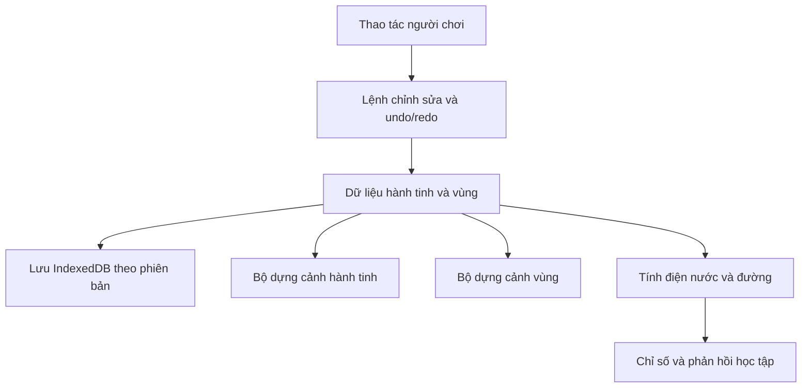

# Kế hoạch phát triển Xưởng Hành Tinh

Bản nghiên cứu em chuẩn bị cho Đại ca ngày 07/09/2026. **Cập nhật triển khai:** các nhóm chức năng của mốc 0–4 đã được đưa vào mã nguồn. Xem [báo cáo triển khai và kiểm chứng](planet-maker-implementation.md) để biết schema thực tế, cách sử dụng, kết quả test và các tiêu chí thiết bị còn cần nghiệm thu. Phần nghiên cứu bên dưới được giữ làm cơ sở thiết kế; ước lượng và phác thảo schema trong đó không phải báo cáo kết quả thực hiện.

## Hướng đề xuất

Phát triển thành một xưởng sáng tạo có ba mức: **ngắm hành tinh → chọn một vùng → nặn địa hình và xây thị trấn trong vùng đó**. Trẻ tạo ra một nơi có câu chuyện và có thể quay lại phát triển tiếp.

Theo định hướng Đại ca bổ sung: **phần xây dựng là một cảnh độc lập**, chuyển vào bằng hiệu ứng zoom. Giữ React Three Fiber, Three.js và mô hình địa hình hiện có cho mức toàn cầu; cảnh xây dựng dùng bản đồ độ cao riêng trên mặt phẳng với góc nhìn 3D từ trên xuống/nghiêng. Không bắt buộc địa hình vùng phải khớp từng điểm hoặc tỷ lệ với bề mặt quả cầu. Đây là lựa chọn kiến trúc đề xuất, chưa phải kết luận từ benchmark tablet.

Hành tinh làm nơi chọn địa điểm và trưng bày thành quả. Vùng xây dựng liên kết với hành tinh bằng ID, vị trí đánh dấu, tên, ảnh đại diện và một số thông số môi trường. Mô hình quả cầu hiện tại có thể giữ nguyên độ chia 5; độ chi tiết của vùng xây dựng phát triển độc lập.

Giả định để lập kế hoạch: ưu tiên tablet và laptop; phong cách 3D gọn, nhiều màu; chơi được offline; một người phát triển đã quen dự án; dùng bộ công trình đơn giản tự dựng hoặc tài sản có giấy phép phù hợp. Điện thoại cần khảo sát và ngân sách riêng trước khi cam kết cùng mức chi tiết.

## 1. Hiện trạng đã xác minh

| Phần | Đã có trong mã | Hệ quả với việc mở rộng |
|---|---|---|
| Địa hình | Icosphere tự chia nhỏ và hàn đỉnh, `createTerrain(5)`; mỗi hướng có một giá trị độ cao | Phù hợp đồi, núi và lòng chảo. Cấu trúc một độ cao trên một hướng không biểu diễn hang xuyên núi hoặc vách nhô có nhiều lớp bề mặt |
| Công cụ | Nâng, hạ, mượt, rừng, núi lửa, xóa; ba cỡ cọ | Có nền để thêm san nền, làm sắc, tô sinh cảnh và đóng dấu địa hình |
| Dựng hình | Buffer cấp phát một lần, cập nhật qua ref; cây dùng hai `InstancedMesh` | Đã tránh cập nhật React mỗi frame; có thể tái sử dụng cách dựng nhiều đối tượng cùng loại |
| Nước | Một quả cầu ở mực nước chung | Hố thấp hơn biển sẽ có nước; chưa có hồ trên núi, đường sông hay dòng chảy riêng |
| Lưu | Một hành tinh/học sinh, localStorage, độ cao lượng tử hóa một byte | Chưa phù hợp nhiều vùng, nhiều công trình và lịch sử dài |
| Hoàn tác | Tối đa 12 snapshot của độ cao, paint và cây | Chưa có redo; đổi mực nước, tên và trang trí chưa thuộc lịch sử hoàn tác |
| Trang trí | Khí quyển, mây, vành đai, 0–2 mặt trăng | Có thể giữ lại; nên giảm che khuất trong lúc nặn |
| Hệ Mặt Trời | Hành tinh tự tạo có quỹ đạo, nhãn và thẻ thông tin | Đang dùng cùng `PlanetModel` và độ chia 5; cần bản hiển thị nhẹ khi dữ liệu editor lớn lên |
| Nội dung mở rộng | Kế hoạch cũ có kệ 3 hành tinh, đánh giá sự sống, địa tầng | Chưa thấy các phần này được nối vào Xưởng hiện tại; không đưa vào danh sách đã làm |

Các điểm mã để bắt đầu:

- `src/components/planetmaker/terrainOps.ts:27`: tạo địa hình; `:85`: cọ; `:229`: snapshot; `:300`: serialize.
- `src/components/planetmaker/PlanetModel.tsx:128`: khi dirty, cập nhật toàn bộ vị trí/màu/normal/bounding sphere và ma trận cây.
- `src/components/planetmaker/planetStore.ts:43`: lỗi ghi localStorage bị nuốt.
- `src/pages/PlanetMakerPage.tsx:145`: nút Lưu vẫn phát âm thành công và hiện toast sau khi gọi lưu.
- `src/pages/PlanetMakerPage.tsx:169`: tắt toàn bộ OrbitControls khi bắt đầu nặn; cần kiểm tra chuyển một ngón sang hai ngón.
- `src/pages/PlanetMakerPage.tsx:61`: việc nạp ban đầu không phụ thuộc `studentId`; cần kiểm tra đổi hồ sơ nếu trang vẫn được giữ mounted.
- `src/components/solar/scene3d/CustomPlanetMesh.tsx:34`: tạo lại lưới độ chia 5 từ bản lưu.
- `src/components/solar/scene3d/Scene3D.tsx:55`: có cơ chế hạ chất lượng ở cảnh Hệ Mặt Trời; Xưởng chưa dùng cơ chế tương đương.

## 2. Khảo sát thực tế và giới hạn bằng chứng

Đã chạy Vite local và mở giao diện bằng trình duyệt trong app, ở viewport desktop mặc định 1280×720. Tạo hồ sơ local tên “Khảo sát Xưởng”, vào Khoa Học → Xưởng Hành Tinh, thử kéo cọ, xác nhận nút Hoàn tác bật, hoàn tác, đổi tên, lưu, rời trang và mở lại. Tên “Hành tinh khảo sát” được khôi phục. Đây là kiểm tra luồng cơ bản; chưa so sánh từng đỉnh địa hình trước/sau thao tác bằng giao diện.

Quan sát: lớp mây che khá nhiều bề mặt ở góc nhìn đã chụp; cỡ cọ nằm trong bảng Trang trí; nhiều nút màu/toggle chưa có tên truy cập rõ trong DOM. Những điểm này cần sửa khi thêm nhiều công cụ. Chưa kiểm tra pinch bằng thiết bị cảm ứng thật, WebGL context loss, FPS/GPU hay độ ổn định khi chơi dài trên tablet.

Chạy các phép kiểm tra trực tiếp engine TypeScript bằng Node, không sửa engine:

| Độ chia | Đỉnh | Tam giác | Bộ nhớ mảng của 12 snapshot độ cao + paint |
|---|---:|---:|---:|
| 5, hiện tại | 10.242 | 20.480 | 614.520 byte |
| 6 | 40.962 | 81.920 | 2.457.720 byte |
| 7 | 163.842 | 327.680 | 9.830.520 byte |

Các số bộ nhớ trên chưa gồm cây, overhead JavaScript, geometry và buffer GPU; không phải tổng RAM hay đo FPS.

Kết quả khác:

- Bản địa hình seed 42, mực nước 0,02: JSON của elevation/paint/trees dài 27.778 byte; chưa gồm metadata hành tinh.
- Sai số độ cao lớn nhất sau một lượt lưu/mở: khoảng 0,000787 đơn vị bán kính hành tinh. Chi tiết nhỏ hơn bước lượng tử hóa dễ bị mất khi lưu.
- Bản lưu độ chia 5 nạp vào terrain độ chia 6 trả `false`. Tăng riêng tham số độ chia sẽ làm mất khả năng đọc bản cũ theo đường nạp hiện tại.
- Với lưới độ chia 7, cây ở đỉnh 70.000 được lưu/mở thành đỉnh 4.464 do `Uint16Array`. Cần bỏ phụ thuộc chỉ số đỉnh dựng hình trước khi tăng độ phân giải.
- Giả lập `localStorage.setItem` ném lỗi: `saveCustomPlanet` không ném lỗi và trả `undefined`. Kết hợp với luồng `saveNow`, UI có thể báo “Đã lưu” dù thao tác ghi thất bại.

Môi trường khảo sát còn giới hạn: launcher npm hiện trỏ tới `npm-cli.js` không dùng được trong lần chạy thử; Vite ghi cache bị chặn trong sandbox. Đã chạy Vite trực tiếp bằng Node với quyền ngoài sandbox, chỉ bind `127.0.0.1`. Không thay cấu hình bảo mật hoặc cài thêm package. Đây là vấn đề môi trường chạy, tách khỏi thiết kế module.

## 3. Ba phương án và lựa chọn

| Phương án | Trải nghiệm | Độ khó và chi phí | Đánh giá |
|---|---|---|---|
| Thêm nhà trực tiếp lên quả cầu hiện tại | Chạm để đặt công trình lớn kiểu mô hình đồ chơi | Thấp hơn; dễ làm bản demo. Kích thước và cách chọn nhà bị giới hạn khi muốn có đường phố chi tiết | Hợp một bản trang trí nhanh; chưa đáp ứng đầy đủ yêu cầu địa hình và đô thị sâu |
| Quả cầu + cảnh xây dựng độc lập | Chọn nơi trên hành tinh, zoom chuyển cảnh sang bản đồ riêng; quay lại thấy dấu mốc thị trấn | Trung bình; chỉ dựng một cảnh nặng; không phải khớp lưới hoặc độ cong hành tinh | **Chọn theo định hướng Đại ca** |
| Zoom liên tục từ vũ trụ xuống mặt đất trên toàn cầu | Tự do bay và xây ở mọi nơi | Cao; cần chia địa hình thích nghi, tải theo vùng, xử lý mép lưới và độ chính xác tọa độ | Để sau khi bản vùng xây dựng chứng minh được giá trị và hiệu năng |

Voxel phù hợp nếu muốn đào hang, tầng ngầm và xây từng khối. Phạm vi đó cần kiến trúc thể tích, sinh mesh và lưu dữ liệu khác; chưa đưa vào bản đầu.

## 4. Trải nghiệm đề xuất

Luồng mẫu: chọn hành tinh quần đảo → chọn một bờ biển → bấm “Xây nơi này” → san nền → đặt vài ngôi nhà → nối đường tới trường học và công viên → đặt tên thị trấn → quay ra ngắm hành tinh có khu dân cư của mình.

| Mức nhìn | Trẻ làm gì | Dữ liệu/hình ảnh cần tải |
|---|---|---|
| Hành tinh | Nặn lục địa, đổi biển, chọn vùng; ngắm các nơi đã xây | Lưới toàn cầu nhẹ, hình đại diện vùng và công trình biểu tượng |
| Vùng xây dựng | Chỉnh đồi, bờ biển, đường, cây và công trình | Địa hình chi tiết của một vùng, các đối tượng thuộc vùng |
| Công trình | Chọn, xoay, di chuyển, đổi mẫu/màu; sau này lắp mái, thân, trang trí | Dữ liệu công trình được chọn; bảng công cụ ngắn |

Mức công trình ban đầu dùng cùng cảnh vùng và một bảng chỉnh sửa; không cần làm nội thất hoặc cảnh riêng. Bấm “Xây nơi này” → camera tiến về điểm chọn → lớp mây/fade che việc đổi cảnh → hiện bản đồ xây dựng. Có nút “Về hành tinh” để chuyển ngược. Camera không thực sự phải đi liên tục từ quỹ đạo xuống mặt đất.

### Vòng đời cảnh và hiệu ứng chuyển

1. Khi ngắm hành tinh, chỉ dựng cảnh hành tinh. Có thể tải trước mã và dữ liệu vùng được chọn; không giữ sẵn cả cảnh xây dựng cùng texture/GPU buffer.
2. Khi bấm xây dựng, tải dữ liệu và tài sản tối thiểu của vùng, thực hiện zoom ngắn. Nếu tài sản chưa sẵn sàng, giữ lớp chuyển cảnh kèm tiến trình.
3. Dừng vòng cập nhật cảnh cũ, tháo scene và giải phóng geometry/material/texture do cảnh đó sở hữu. Dùng một Canvas làm vỏ và thay scene con là phương án ưu tiên; không dựng hai Canvas nặng đồng thời.
4. Dựng cảnh xây dựng rồi mở lớp che. Nếu cần hình hành tinh trong hiệu ứng, dùng ảnh chụp/ảnh đại diện tĩnh nhẹ; không giữ toàn bộ scene cũ chỉ để làm nền.
5. Khi quay ra, commit dữ liệu vùng, cập nhật thumbnail và dấu mốc rồi đổi cảnh ngược. Nếu lưu lỗi, giữ trạng thái chỉnh sửa và báo lỗi trước khi giải phóng dữ liệu chưa lưu.
6. Chỉ giữ cache có giới hạn cho tài nguyên thật sự dùng chung. Kiểm tra ownership/ref-count trước khi dispose; không giải phóng nhầm tài nguyên còn được dùng ở cảnh khác.

Lợi ích dự kiến: giảm tải dựng hình từ cảnh ngoài vũ trụ, giảm bộ nhớ GPU nếu giải phóng tài nguyên đúng, và giảm độ phức tạp dựng đường/nền nhà trên mặt cầu. Chỉ ẩn bằng CSS hoặc `visible=false` có thể vẫn giữ tài nguyên và callback chạy nền. Mức cải thiện phải đo; một cảnh xây dựng quá nhiều nhà, bóng và mô phỏng vẫn có thể nặng hơn cảnh hành tinh hiện tại.

Giao diện chia theo việc đang làm: **Địa hình – Thiên nhiên – Xây dựng – Khám phá**. Mỗi nhóm chỉ hiện công cụ liên quan. Cỡ và lực cọ ở ngay cạnh công cụ nặn. Chế độ xây có bản xem trước, xoay, xác nhận, hủy; không đặt công trình ngay khi người dùng chỉ đang đổi góc nhìn.

## 5. Phạm vi tính năng theo độ sâu

### Địa hình

Ưu tiên: cọ nhỏ hơn trong vùng; lực cọ; san nền theo cao độ lấy mẫu; làm mượt theo hàng xóm; nội suy nét kéo để không đứt khi kéo nhanh; đóng dấu đồi, miệng hố, đảo và dãy núi. Tách “xóa đối tượng” khỏi “sửa địa hình” để hành vi dễ đoán và dễ undo.

Sinh cảnh: tô cỏ, cát, đá, tuyết bằng lớp dữ liệu riêng. Tự phân bố cây theo vùng, độ dốc và mực nước; có preview mật độ. Chi tiết nhìn gần có thể bổ sung bằng vật liệu/normal map; phần này cải thiện ánh sáng bề mặt, không thay thế geometry khi cần san nền hoặc raycast chính xác.

Nước triển khai sau nền tảng vùng: hồ có cao độ và biên riêng; sông là đường đi qua các điểm điều khiển, có lòng sông và kiểm tra độ dốc. Hiệu ứng nước chảy phục vụ quan sát. Chưa mô phỏng thủy động lực hoặc xói mòn liên tục. Không gọi mọi rãnh dưới quả cầu nước hiện nay là sông có dòng chảy.

### Xây dựng

Bản thị trấn đầu có 8 loại: nhà ở, trường học, công viên, nông trại, trạm nước, pin mặt trời, trạm quan sát và bến đáp. Nhà có vài mẫu mái và màu; ưu tiên mẫu dễ nhận ra từ trên cao.

Thao tác: đặt, chọn lại, xoay, di chuyển, sao chép, xóa, undo/redo. Hệ thống kiểm tra diện tích chân công trình, độ dốc, ngập nước và chồng lấn; báo ngắn gọn như “Chỗ này dốc quá”. Cầu và nhà trên cọc là loại công trình riêng ở mốc sau, không dùng quy tắc nhà thường.

Đường ban đầu đi theo lưới với cổng kết nối rõ; tự chọn đoạn thẳng, góc, chữ T và ngã tư. Mỗi công trình có điểm tiếp cận đường. Đường cong theo spline, cầu vượt và đường hầm là các phần mở rộng sau khi hệ kết nối cơ bản ổn định.

Các cấu kiện mái–thân–cổng có thể mở thành “Xưởng Công Trình” sau bản thị trấn. Bắt đầu với điểm gắn cố định và bộ phận có sẵn; chưa làm trình thiết kế kiến trúc tùy ý.

### Một thế giới có phản hồi

Sau khi xây dựng và lưu đã ổn định mới thêm nhu cầu điện, nước và kết nối đường ở mức đơn giản. Dân cư và xe ban đầu là hình ảnh minh họa; các chỉ số tính theo tòa nhà/vùng, không chạy AI cho từng người.

Ví dụ phản hồi: nhà chưa nối đường; khu dân cư thiếu nước; pin mặt trời cấp điện cho một số công trình; nâng mực nước cho thấy khu thấp bị ngập. Cho phép undo toàn bộ thí nghiệm để trẻ không mất thành quả. Các quy tắc là mô hình học tập đơn giản; không quảng bá thành mô phỏng khí hậu hay chứng nhận hành tinh ở được.

Giữ chế độ sáng tạo tự do. Nhiệm vụ là lựa chọn thêm: nối 5 ngôi nhà tới trường, chia đủ nước, bố trí công viên, đo chiều dài đường hoặc diện tích khu đất. Không bắt giải bài toán để được tiếp tục đặt từng ngôi nhà.

## 6. Kiến trúc dữ liệu và dựng hình



**Dữ liệu có thẩm quyền tách khỏi mesh đang hiển thị.** Các thực thể mới không lưu vị trí bằng index của lưới render. Dấu mốc trên hành tinh dùng hướng đơn vị; trong vùng dùng `regionId`, tọa độ cục bộ, góc quay và loại nền móng. Đổi LOD chỉ thay hình ảnh. Cây V1 có thể tiếp tục dùng chỉ số trong adapter lưới legacy cố định, vì không cần tăng độ phân giải globe để có cảnh xây dựng chi tiết.

Phác thảo cấu trúc V2:

```text
PlanetDocV2
  id, studentId, schemaVersion, revision, generatorVersion
  name, createdAt, updatedAt, cosmetics, seaLevel, showInSolar
  baseTerrain: legacy-grid | generated(seed, parameters)
  regionIds, activeRegionId

RegionDoc
  id, planetId, markerDirection, name, thumbnail
  preset, seed, generatorVersion, environmentSnapshot
  extent, heightScale, gridSpec, terrainTiles, biomeTiles
  waterBodies, entityIds, roadGraph, revision

EntityDoc
  id, regionId, type, localPosition, yaw, appearance
  footprint, foundation, accessPorts

EditCommand
  id, kind, affectedIds, before, after, randomSeed, baseRevision
```

Chỉ là thiết kế cần chốt ở spike, chưa phải schema đã được thực hiện. Typed arrays lưu dưới dạng binary trong IndexedDB, không chuyển toàn bộ thành chuỗi base64.

### Hợp đồng giữa hành tinh và vùng

1. Chọn vị trí trên globe; raycast sang hướng đơn vị để lưu dấu mốc. Hệ tọa độ của cảnh xây dựng độc lập với hướng này; không cần dựng đường phố theo độ cong hành tinh.
2. Khởi tạo vùng từ preset và seed: bờ biển, đồng bằng, đồi núi, sa mạc hoặc băng. Có thể gợi ý preset từ điểm chọn trên globe và lấy một bản chụp thông số môi trường. Trẻ vẫn được chỉnh vùng tự do; không cần nội suy và đồng bộ từng đỉnh globe.
3. Bản đầu chọn một vùng hoạt động; đề xuất 128×128 ô, tương ứng 129×129 mẫu cao độ. Lưới địa hình tách với lưới đặt công trình. Có thể chia thành tile 32×32 ô với biên dùng chung.
4. Sửa globe về sau không tự sinh lại hoặc ghi đè bản đồ xây dựng. Hai nơi có dữ liệu địa hình riêng; không cần khóa cọ hành tinh quanh dấu mốc.
5. Sửa trong vùng cập nhật thumbnail, tên và dấu mốc ở mức hành tinh. Có thể dùng một cụm nhà biểu tượng trên globe; không đồng bộ geometry của mọi công trình về bề mặt cầu.
6. Mực nước/hồ/sông của vùng lưu riêng. Thay mực nước toàn hành tinh không tự phá bản xây dựng. Tính năng áp dụng thay đổi môi trường từ hành tinh, nếu bổ sung sau, phải có preview và undo; bản đầu dùng thông số chụp tại lúc tạo vùng.
7. Khi tăng/hạ đất dưới công trình: bảo vệ nền móng, hoặc xem trước tác động rồi commit cùng một lệnh. Không để nhà trôi nổi hoặc chìm âm thầm.
8. Bản đầu có một vùng/hành tinh. Khi cho nhiều vùng, cần đảm bảo dấu mốc dễ chọn và mỗi bản đồ có ID riêng; không cần kiểm tra vùng địa hình trên quả cầu có chồng lưới lên nhau hay không.

### Undo và lưu

- Một nét kéo là một lệnh; dựng nền và đặt nhà trong cùng thao tác là một transaction.
- Lưu phần thay đổi theo tile/đối tượng, cộng checkpoint; giới hạn lịch sử theo byte để chịu được vùng lớn. Không giữ vô hạn bản sao toàn thế giới.
- RNG có seed hoặc lưu trực tiếp các thực thể đã sinh; redo không trồng rừng khác lần trước.
- Dùng IndexedDB cho hành tinh, vùng, đối tượng và checkpoint. Tách metadata nhỏ phục vụ kệ hành tinh.
- Hiện trạng thái đang lưu/đã lưu/lỗi lưu theo kết quả transaction thực tế. Không báo thành công trước khi commit.
- Autosave sau lệnh và debounce trong khi chỉnh thông số; không trông cậy vào ghi bất đồng bộ lúc đóng tab.
- Có bản xuất/nhập để phục hồi. IndexedDB vẫn chịu hạn mức và chính sách xóa dữ liệu của trình duyệt; offline không đồng nghĩa đã sao lưu.

### Di chuyển V1 sang V2

Giữ nguyên bản V1 làm dự phòng. Xác thực đầy đủ trước khi nạp: độ dài mảng, số hữu hạn, khoảng độ cao, index cây, cosmetics. Dựng đúng lưới V1 và giữ dữ liệu trong adapter `legacy-grid`; chưa bắt buộc chuyển vị trí cây cũ khi globe vẫn dùng độ chia 5. Nếu sau này thay lưới globe, chuyển cây thành tọa độ độc lập ở migration riêng. V1 không lưu seed, vì vậy không tạo seed giả để thay thế địa hình của trẻ. Cảnh xây dựng mới có seed và schema riêng ngay từ đầu.

Ghi V2 trong transaction, đọc lại và kiểm tra; chỉ đánh dấu migration hoàn tất sau thành công. Chạy lại migration phải không nhân đôi hành tinh. Nếu thất bại, giữ bản cũ để tiếp tục dùng và cho xuất dữ liệu. Bản xem trước Hệ Mặt Trời phải đọc được cả V1 và V2 trong giai đoạn chuyển tiếp.

## 7. Tối ưu theo điểm nghẽn hiện có

| Hiện tại | Thay đổi đề xuất | Cách chứng minh hiệu quả |
|---|---|---|
| Mỗi cọ quét mọi đỉnh | Chỉ mục không gian cho globe; tile và phạm vi ô cho vùng | Đo thời gian cọ theo p50/p95 và số mẫu thật sự bị chạm |
| Một dirty flag cập nhật cả cảnh | Tách dirty địa hình, màu, nước và thực thể | Đổi màu không tính normal; thêm cây không xây lại terrain |
| Normal toàn cầu mỗi lần dirty | Tính normal ở vùng bẩn cộng hàng xóm; cập nhật biên tile nhất quán | So với normal chuẩn sau commit và kiểm tra ánh sáng ở biên |
| Upload toàn bộ attribute | Gộp các khoảng thay đổi hợp lý, dùng update ranges có sẵn trong Three 0.181.2 | Đo chi phí upload; không tạo hàng nghìn khoảng quá nhỏ |
| Cây cùng một nhóm không culling | Nhóm instance theo loại và theo vùng/tile; cập nhật bounding volume đúng | Quan sát số draw call, tam giác và đối tượng được dựng |
| Hành tinh nhỏ dùng model editor | Giữ globe nhẹ, thành phố dạng thumbnail/dấu mốc; tháo cảnh globe khi vào xây dựng | Đo frame time và tài nguyên GPU trước/sau chuyển cảnh |
| Mây/mặt trăng luôn chuyển động | Chế độ chỉnh sửa giảm hiệu ứng; pause khi ẩn; render khi cần nếu chuyển động đã dừng | Kiểm tra thao tác vẫn cập nhật sau invalidate và mức sử dụng khi idle |
| Sinh địa hình và tuần tự hóa trên luồng UI | Worker cho tác vụ đủ nặng; việc nhẹ tại chỗ nếu worker có overhead lớn hơn | Đo input latency và thời gian chuyển dữ liệu |

Khi dùng Worker: gắn revision cho request/result, bỏ kết quả cũ; không chuyển quyền sở hữu buffer đang được renderer dùng. Dùng buffer đầu ra riêng hoặc hai buffer luân phiên. `ArrayBuffer` đã transfer sẽ bị detach ở nơi gửi.

Instancing theo loại giúp giảm draw call nhưng không tự làm nhẹ mọi trường hợp: mỗi material/submesh, shadow pass và hiệu ứng vẫn có chi phí. Giữ bộ nhà ít material; bóng giới hạn vùng nhìn; không bật hiệu ứng nặng ngay trong lúc kéo cọ.

Không cần chuyển sang WebGPU hoặc thêm physics engine để đạt bản đầu. Chỉ xem xét khi có số đo chứng minh giới hạn cụ thể.

## 8. Các mốc triển khai

Ước lượng là ngày công kỹ thuật sơ bộ cho một người quen stack, chưa gồm chờ phản hồi, thiết kế asset phức tạp hoặc đồng bộ cloud. Chốt lại sau mốc 0.

| Mốc | Đầu ra cụ thể | Ước lượng | Điều kiện qua mốc |
|---|---|---:|---|
| 0 — Nền và thử kiến trúc | Sửa báo lưu sai; adapter V1 và schema vùng; prototype zoom chuyển sang bản đồ riêng có thể nặn và đặt nhà mẫu; đo trên thiết bị mục tiêu | 2–3 ngày | V1 vẫn đọc được; đúng liên kết hành tinh–vùng; chỉ một cảnh nặng hoạt động; có số đo thực tế |
| 1 — Nặn chính xác | Lực/cỡ cọ ngay trong thanh công cụ; san nền; nét kéo liên tục; undo/redo thống nhất; dirty theo vùng; cải thiện touch | 3–5 ngày | Nét cọ độc lập mật độ sự kiện; hai ngón không nặn nhầm; undo đổi mực nước/trang trí được |
| 2 — Cảnh xây dựng độc lập | Zoom chuyển vào/ra bản đồ riêng, preset/seed, tile cao độ và sinh cảnh, tọa độ độc lập LOD, lưu vùng và thumbnail | 5–8 ngày | Mở lại đúng terrain; mép tile ổn; sửa globe không ghi đè vùng; scene cũ được dừng và giải phóng |
| 3 — Thị trấn đầu tiên | 8 loại công trình, đặt/xoay/di chuyển/sao chép/xóa, đường theo lưới, kiểm tra nền, lưu và undo | 6–9 ngày | Trẻ hoàn thành vòng tạo vùng → xây thị trấn → ngắm hành tinh → mở lại; công trình không lệch vị trí |
| 4 — Phản hồi học tập | Điện/nước/đường mức đơn giản; 3 nhiệm vụ; thí nghiệm ngập; chuyển động trang trí; xuất ảnh và bản sao dữ liệu | 4–6 ngày | Chỉ số có quy tắc rõ, dự đoán được; thí nghiệm hoàn tác được; không gây giật khi mô phỏng chạy |
| Sau đó | Hồ cao/sông, cầu, nhiều vùng, lắp ghép cấu kiện, sinh vật, thời tiết, chia sẻ và đồng bộ | Ước lượng riêng | Chỉ mở rộng khi bản thị trấn đạt nghiệm thu và có phản hồi sử dụng |

Mốc 0–3 là **16–25 ngày công**, cộng khoảng 25% dự phòng thành khoảng **4–7 tuần làm việc**. Cả mốc 4 là **20–31 ngày công**, cộng dự phòng khoảng **5–8 tuần**. Đây không phải cam kết tiến độ của một phiên chạy agent. Mốc 0 phải thu hẹp phạm vi nếu máy mục tiêu không đạt hoặc vùng/LOD phức tạp hơn dự kiến.

Phần di chuyển dữ liệu V2 ở mốc 0 chỉ dựng nền tương thích và spike tối thiểu; hoàn thiện lưu theo tile/checkpoint và mọi đường lỗi trong mốc 1–2. Không coi một prototype đã là phiên bản production.

## 9. Nghiệm thu và ngân sách thử nghiệm

Các số sau là **mục tiêu đo**, chưa phải hiệu năng đã đạt:

- Chọn một tablet phổ thông và một laptop GPU tích hợp làm chuẩn, ghi rõ model, trình duyệt và DPR.
- Cảnh chuẩn ban đầu: một vùng 128×128 ô, 200 công trình, 1.000 cây/đồ trang trí, 300 ô đường. Giảm giới hạn hoặc mức render nếu cần, giữ nguyên dữ liệu đã lưu.
- Mục tiêu laptop: frame time p95 ≤ 20 ms khi thao tác trong cảnh chuẩn; tablet: p95 ≤ 33 ms. Loại riêng thời gian tải đầu; đo đoạn chơi tương tác tối thiểu 60 giây.
- Phản hồi thao tác cọ: p95 từ input tới thay đổi nhìn thấy ≤ 100 ms. Theo dõi long task trên luồng chính, tránh tác vụ > 50 ms trong lúc kéo.
- Tải lại vùng đã lưu trên máy chuẩn: mục tiêu ≤ 2 giây sau khi tài sản chung đã cache. Ngân sách geometry, draw call và dung lượng thực tế được chốt bằng spike, không suy từ số lượng nhà.
- Chạy 20 chu kỳ vào/ra vùng và kiểm tra tài nguyên được giải phóng; theo dõi xu hướng RAM/geometry/texture sau thời gian ổn định, không yêu cầu bộ nhớ tức thời tuyệt đối bằng nhau.

Kiểm tra tính đúng cần viết khi triển khai:

1. V1 → V2 giữ độ cao, cây, tên, mỹ thuật và quyền sở hữu theo hồ sơ; không nhân đôi khi chạy migration lần nữa.
2. Dữ liệu hỏng, quota, đóng tab giữa các bước ghi: không báo lưu thành công giả; bản commit trước vẫn đọc được.
3. Undo/redo chuỗi có nặn, cây, nhà, nền, đường và nước đưa về trạng thái dự kiến; RNG lặp lại được.
4. Biên tile và đổi LOD trong bản đồ riêng không làm seam, lệch nhà hay mất lựa chọn; dấu mốc trên globe gần cực vẫn chọn đúng vùng.
5. Nhà chồng lấn, độ dốc lớn, ngập, xóa đường và thay nền được xử lý nhất quán.
6. Hai ngón/pinch, pointer cancel, kéo ra ngoài canvas và đổi công cụ giữa thao tác không gây nặn ngoài ý muốn.
7. WebGL context loss và thiết bị không đủ 3D có đường phục hồi/đọc bản lưu; không âm thầm ghi đè bằng hành tinh mới.
8. Hồ sơ A/B, nhiều tab, và worker trả kết quả muộn không ghi vào nhầm hành tinh hoặc ghi đè revision mới.
9. Zoom vào/ra liên tục không giữ hai cảnh nặng, không tích lũy texture/geometry; cập nhật globe không làm biến dạng hoặc tái sinh bản đồ xây dựng đã lưu.

Khảo sát với trẻ sau mỗi mốc có giao diện: quan sát xem trẻ tự tìm được cỡ cọ, chọn lại nhà và hoàn tác hay không; ghi nhận thao tác nhầm và điểm bỏ cuộc. Không thay việc thử với trẻ bằng chỉ số FPS.

## 10. Phân tách mã dự kiến

```text
src/components/planetmaker/
  engine/       world, terrain, brushes, placement, roads, commands
  persistence/  schema, migrationV1, repository, checkpoints
  rendering/    globe, region, terrainTiles, buildingInstances, vegetation
  ui/           toolGroups, brushControls, buildingPalette, regionPicker
  workers/      terrainWorker
src/data/
  planetPresets, buildingCatalog, planetMissions
```

Đây là cách phân trách nhiệm, không yêu cầu tạo toàn bộ thư mục ngay. Giữ engine thuần để kiểm tra không cần GPU; renderer chỉ dựng từ dữ liệu; page điều phối công cụ. Giữ adapter `PlanetModel`/`CustomPlanetMesh` trong thời gian chuyển đổi để không làm gián đoạn Hệ Mặt Trời.

## 11. Điều chỉnh đã triển khai cho công trình

Đã thay thao tác tap chọn vị trí bằng kéo chính mô hình xem trước, thả rồi xác nhận. Preview dùng cùng hình học với công trình đã xây và khóa camera trong lúc kéo. Mái hai dốc được dựng theo kích thước thân nhà và xoay đồng bộ. Nhà ở/trường/đài thiên văn có giới hạn lần lượt 6/4/3 tầng; các hạ tầng còn lại giữ 1 tầng. Cả 8 loại có ba phong cách Cổ điển, Hiện đại, Sinh thái. Bổ sung tối đa 48 cư dân minh họa đi trên đường bằng instancing. Chi tiết hành vi, tương thích dữ liệu và kết quả kiểm chứng nằm trong [tài liệu triển khai](planet-maker-implementation.md).

## 12. Nguồn kỹ thuật đã đối chiếu

- [Three.js — InstancedMesh](https://threejs.org/docs/pages/InstancedMesh.html): gom nhiều đối tượng cùng geometry/material, cập nhật instance và bounding volume. Áp dụng cho cây và các loại nhà lặp lại.
- [Three.js — BufferAttribute](https://threejs.org/docs/pages/BufferAttribute.html): cập nhật từng khoảng dữ liệu. Đã xác minh `addUpdateRange` có trong bản Three 0.181.2 đang cài.
- [React Three Fiber — Scaling performance, nguồn chính thức](https://github.com/pmndrs/react-three-fiber/blob/master/docs/advanced/scaling-performance.mdx): LOD, tái sử dụng tài nguyên, điều chỉnh chất lượng và render theo nhu cầu. Chỉ dùng render theo nhu cầu khi quản lý đúng các chuyển động và invalidate.
- [MDN — IndexedDB](https://developer.mozilla.org/en-US/docs/Web/API/IndexedDB_API): lưu dữ liệu có cấu trúc, binary và transaction.
- [MDN — Transferable objects](https://developer.mozilla.org/en-US/docs/Web/API/Web_Workers_API/Transferable_objects): chuyển quyền sở hữu ArrayBuffer giữa các luồng.
- [MDN — Storage quotas and eviction](https://developer.mozilla.org/en-US/docs/Web/API/Storage_API/Storage_quotas_and_eviction_criteria): giới hạn lưu trữ và khả năng dữ liệu bị thu hồi.

Tài liệu tham khảo xác nhận cơ chế kỹ thuật; không chứng minh ứng dụng sẽ đạt số FPS, thời gian tải hoặc tiến độ ước lượng. Quyết định sản phẩm, phạm vi mốc và ngân sách là đề xuất từ lần khảo sát này.
