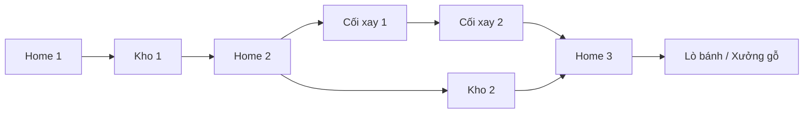

# Làng Mầm — kế hoạch nâng cấp nông trại 1–25

> **Thiết kế hiện hành.** Nếu bắt đầu ở máy/phiên mới, đọc [bàn giao và thứ tự toàn bộ tài liệu](README.md) trước. [CURRENT_STATE](CURRENT_STATE.md) mô tả code thực tế; nội dung dưới đây là kế hoạch nâng cấp, không phải danh sách đã triển khai.

Ngày 17/09/2026. **Thiết kế đích; 0.2 đã triển khai nhiều phần, kiểm CURRENT_STATE và VERIFICATION để biết bằng chứng. Không tự đánh dấu toàn bộ E đã nghiệm thu.** Em lập kế hoạch này theo 17 yêu cầu của Đại ca và các bổ sung: bản đồ ngẫu nhiên hoàn toàn, nâng cấp cuối game kéo dài nhiều ngày, công trình tối đa cấp 25, bản đồ rộng và khai phá vật cản bằng tiền/dụng cụ để nhận tài nguyên, địa hình hồ/sông/suối/vách đá với cầu cảng và đánh cá. Phương án sinh map đề xuất là mẫu địa hình đã kiểm duyệt kết hợp bộ sinh theo seed.

Tất cả công việc tiếp tục trong `modules/farm`. Module có trang chạy, cấu hình, tài nguyên và dữ liệu lưu riêng; chỉ ghép vào dự án chính khi Đại ca yêu cầu. Đăng nhập, Supabase, thăm vườn và giao dịch giữa người chơi thực hiện sau khi gameplay chính đạt yêu cầu. Giao dịch người chơi bắt buộc online.

## 1. Hướng thiết kế và phạm vi thay đổi

Mục tiêu là game xây dựng, sản xuất và kinh doanh nông trại có thể chơi lâu dài. Người chơi cân nhắc nâng nhà nào, giữ nguyên liệu gì, nhận đơn nào và tận dụng thế mạnh bản đồ; đồng thời tạo một nơi mình thích quay lại ngắm và sắp xếp.

Vòng chơi chính:

**Trồng/chăn nuôi/khai thác → chế biến → bán hàng hoặc giao đơn → tích lũy tiền và vật liệu → nâng công trình → nâng Home → mở đất, giống, công nghệ và mục tiêu mới.**

Ba tầng mục tiêu cùng tồn tại:

- Trong một phiên: thu hoạch, xếp hàng sản xuất, giao đơn, khai thác một lô, trang trí.
- Trong vài ngày: hoàn thiện chuỗi hàng, nâng công trình bắt buộc, chuẩn bị nâng Home, làm dự án vùng.
- Trong nhiều tuần: phát triển Home 25, chuyên môn hóa, xây cảnh quan, sưu tập và hoàn thiện các nhánh sản xuất.

Người lớn có chiều sâu ở việc phân bổ nguồn lực và lập kế hoạch. Thời gian chờ cần có ý nghĩa, nhưng kéo dài bộ đếm không tự tạo chiều sâu. Cây chín không hỏng, vật nuôi không chết khi vắng mặt; chính tuyến không ép đăng nhập mỗi ngày hoặc phụ thuộc phản xạ trong mini game.

### Khoảng cách với bản thử hiện tại

| Hiện tại | Sau nâng cấp |
|---|---|
| XP mở giống; chưa có Home | Home quyết định giới hạn và mở khóa; XP chuyển thành danh tiếng/chuyên môn |
| Ba công trình, tối đa ba cấp; nâng ngay | Home và công trình chức năng có hệ thống 1–25, nâng theo công việc có thời hạn |
| Mỗi công trình một mẻ | Hàng đợi hữu hạn, nguyên liệu giữ chỗ, kho thành phẩm tại công trình |
| Bản đồ giống nhau; tối đa 32 luống | Bản đồ có seed và tài nguyên riêng; mở khu đất và tăng giới hạn ruộng theo Home |
| Chọn từng luống, đặt đồ bằng xác nhận vị trí | Công cụ giữ lựa chọn, thao tác nhiều ô, kéo thả và xoay tại vật thể |
| Camera cố định hướng | Xoay bản đồ, pan/zoom, trở về hướng chuẩn |
| Sáu mục tiêu dạng thành tích | Chính tuyến theo Home, thành tựu nhiều bậc, hợp đồng và mục tiêu dài hạn |
| Hàng hóa chỉ là nông sản/thành phẩm | Tài nguyên thô, vật liệu chế tạo, giống, vật phẩm tăng tốc, bản thiết kế và decor |
| Ngoại hình dựng thử | Phong cách nông trại thủ công ấm áp; bộ model nhiều bậc có nhận diện rõ |

## 2. Giao diện và thao tác trên nông trại

### 2.1 Bố cục

- Thanh trên: tên trại, **Home Lv**, xu, dung lượng kho; nút cài đặt nhỏ. Tài nguyên quan trọng của mục tiêu đang ghim hiện trong bảng mục tiêu.
- Bản đồ là vùng chính. Desktop dùng bảng bên phải có thể thu gọn; mobile dùng bảng trượt dưới, giữ nút quay về ruộng rõ ràng.
- Thanh dưới gồm đúng năm mục: **Xây dựng · Cửa hàng · Kho hàng · Nhiệm vụ · Đơn hàng**.
- Bộ công cụ thao tác nhỏ, tách khỏi menu: **Chọn · Gieo · Tưới · Thu hoạch · Khai thác · Sắp xếp**. Mở menu không làm mất lựa chọn hạt giống trước đó.
- La bàn, xoay trái/phải, zoom, bản đồ tổng quan và trở về Home ở cạnh bản đồ. Bản đồ tổng quan hiển thị đất đã mở, ranh giới có thể khai phá, công trình được ghim và job đang chạy. Ghim một mục tiêu chính, tối đa ba mục tiêu phụ.

Nội dung các menu:

| Mục | Các nhóm chính |
|---|---|
| Xây dựng | Công trình, ruộng/vườn, khai thác, chăn nuôi, đường/hàng rào, trang trí; lọc đã mở/chưa mở |
| Cửa hàng | Hạt giống, tài nguyên hệ thống, vật tư, vật phẩm hỗ trợ; chợ người chơi là tab riêng ở đợt online |
| Kho hàng | Nông sản, sản phẩm, vật liệu; túi vật phẩm hỗ trợ/bản thiết kế; kho decor đã cất |
| Nhiệm vụ | Chính tuyến, thành tựu; mục tiêu phụ/hội chợ xuất hiện khi được mở |
| Đơn hàng | Đơn NPC thường, hợp đồng nhiều bước, đơn đang ghim; thông tin kho còn lại sau khi giao |

### 2.2 Thông báo không che thao tác

Lỗi trong ảnh có nguyên nhân cụ thể: dock đang neo gần đáy, toast cũng `fixed` gần đáy nên hai lớp đè nhau. Quy hoạch một vùng thông báo theo vùng thực tế dock/panel chiếm, cộng safe area; không chữa bằng một con số `bottom` cố định cho mọi màn hình.

- Toast nằm trên thanh công cụ, không chặn click xuyên vào bản đồ; tối đa hai thông báo ngắn cùng lúc.
- Thao tác liên tục được gộp: “Thu hoạch 8 ô · +24 lúa mì”; không dựng tám toast.
- Lỗi đặt đồ/thiếu vật liệu hiện ngay cạnh đối tượng hoặc nút tương ứng. Lỗi lưu dữ liệu cần dải trạng thái bền vững, không biến mất như toast thường.
- Thông báo màn hình đọc dùng mức ưu tiên nhẹ; không chen vào từng ô khi quét nhiều ô.
- Kiểm tra ở 360/390 px, tablet và desktop, cả lúc bảng dưới mở và bàn phím ảo hiện.

### 2.3 Chọn một lần, làm trên nhiều ô

Chọn **Gieo → Ngô**, sau đó chạm nhiều ô liên tiếp hoặc giữ và quét qua các ô. Công cụ tiếp tục được giữ cho đến khi đổi hoặc bấm thoát. Tưới, thu hoạch và khai thác dùng cùng cách chọn công cụ, nhưng khai thác chỉ tác động nút tài nguyên hợp lệ.

- Trong lúc quét: tô sáng ô hợp lệ, hiện tổng hạt/chi phí và số ô. Ô không đủ điều kiện có ký hiệu và lý do, không chỉ dùng màu.
- Một ô chỉ được xử lý một lần trong một nét quét; đi qua lại không tiêu hạt hoặc nhận hàng hai lần.
- Số ô vượt ngân sách/dung lượng được đánh dấu bỏ qua **trước** khi thả tay. Thứ tự ô xác định theo nét quét.
- Thả tay: gửi một giao dịch cho tập ô đã xem trước. Nếu trạng thái/giá thay đổi thì yêu cầu xem lại, không âm thầm mua tập khác hoặc trừ một phần.
- Chạm từng ô là từng giao dịch nhanh, vẫn giữ công cụ. Nhấn Escape, nút Hủy hoặc bắt đầu cử chỉ hai ngón sẽ hủy nét quét chưa xác nhận.
- Chỉ báo nổi ngắn “+3” tại nơi thu hoạch; một toast tổng kết. Sau này thêm chọn vùng chữ nhật và “gieo lại vùng vừa thu” khi có nhu cầu ở quy mô lớn.

### 2.4 Di chuyển, xoay đồ và xoay camera

**Sắp xếp → chọn vật thể → kéo thả.** Bóng xem trước bám lưới, màu/ký hiệu báo hợp lệ. Cụm nút **Xoay 90° · Xác nhận · Hủy** bám cạnh vật thể và tự tránh mép màn hình. Thả tại ô hợp lệ áp dụng di chuyển; chọn xoay mà không kéo dùng nút xác nhận. Vị trí sai trả lại chỗ cũ. Có hoàn tác bố trí gần nhất.

- Camera tạm ngừng nhận kéo khi đang kéo vật thể; ngưỡng kéo phân biệt với chạm chọn.
- Xoay tính lại footprint, kiểm tra lấn đất/đè đồ, không làm thay đổi job hoặc thời gian sản xuất.
- Công trình đang sản xuất được chuyển; công trình đang thi công bị khóa di chuyển đến khi xong. Home được chuyển khi rảnh, không được bán/cất/xóa. Mỏ tự nhiên và rừng tài nguyên là địa hình cố định; decor cây trồng trang trí được chuyển.
- Hoàn tác chỉ sửa bố trí; không khôi phục tiền/kho về trạng thái cũ. Nếu vị trí cũ đã bị chiếm thì báo lý do.
- Camera xoay ngang đủ 360°, khóa góc nghiêng trong khoảng dễ nhìn. Có nút xoay từng 90° và la bàn đặt lại; không buộc người chơi dùng gesture.
- Desktop: kéo phải xoay, giữ Space + kéo trái để pan, con lăn zoom; Q/E xoay khi canvas có focus, không nhận phím lúc nhập chữ.
- Mobile: một ngón thao tác theo công cụ; hai ngón pan/pinch/twist. Khi bắt đầu hai ngón, hủy thao tác một ngón đang xem trước. Nút xoay luôn là phương án thay thế.
- Sau mọi góc xoay, raycast về tọa độ thế giới để chọn đúng ô. Làm mờ vật che khuất đối tượng chọn khi cần.
- Hover hiện “Cối xay gió · Cấp 8/25”; focus bàn phím hoặc chạm trên mobile cho cùng thông tin. Đang nâng hiện “8 → 9 · còn 2 giờ”. Tạm ẩn tooltip trong nét quét/kéo thả.

## 3. Home và 25 cấp công trình

### 3.1 Quy tắc đã chốt

1. Mỗi trại có một **Home**, bắt đầu cấp 1; Home tối đa cấp 25.
2. Công trình chức năng có lộ trình nâng tối đa **25**. Decor/đường/hàng rào không bị ép thành 25 cấp nâng vô nghĩa.
3. Cấp công trình không vượt **cấp Home đã hoàn thành**. Home đang nâng 8 → 9 thì các công trình vẫn bị giới hạn ở 8.
4. Home mở giới hạn ruộng, khu đất có thể mua, công trình, cây/con giống, công thức và chức năng. Cấp của trạm sản xuất mở công thức cụ thể và cải thiện vận hành.
5. XP vẫn ghi nhận hoạt động, dùng cho danh tiếng/thành tựu/chuyên môn. Không buộc cày thêm một thanh XP để mở lại thứ Home đã cho phép.
6. Nâng Home mở **quyền tạo thêm ruộng**; người chơi vẫn chọn vị trí và trả chi phí khai hoang. Không tự rải thêm ô ruộng hoặc tự chiếm chỗ decor.
7. Mỗi loại nhà phải có lợi ích minh bạch từng cấp: sức chứa, hàng đợi, công thức, hiệu suất hoặc số vật nuôi. Giảm thời gian có trần; không giảm lũy thừa 15% mỗi cấp như cách mở rộng đơn giản từ bản thử.
8. Không bắt nâng tất cả mọi công trình lên 25 để hoàn tất Home 25. Người chơi chọn nhánh chuyên môn sau khi đáp ứng vài yêu cầu lõi.

### 3.2 Lộ trình Home dự thảo

**Các con số dưới là đề xuất cân bằng, chưa phải yêu cầu cố định của Đại ca.** Thời gian là riêng một lần nâng lên cấp ở cột đầu; chưa cộng thời gian kiếm vật liệu và nâng nhà phụ. Home 1 có sẵn. Bảng đầy đủ điều kiện công trình nằm trong [progression-draft.json](progression-draft.json), chỉ là dữ liệu thiết kế, game chưa đọc file này.

| Home | Thời gian nâng | Trần ruộng | Đội thợ | Mở khóa/mục tiêu nổi bật |
|---|---:|---:|---:|---|
| 1 | Có sẵn | 8 | 1 | Kho, lúa mì, cà rốt, thu gom gỗ/đá |
| 2 | 2 phút | 10 | 1 | Cối xay, gà, ngô, đơn hàng |
| 3 | 10 phút | 12 | 1 | Lò bánh, xưởng gỗ, trạm đá, bí đỏ |
| 4 | 30 phút | 16 | 1 | Bò, xưởng sữa, quặng sắt, đậu tương |
| 5 | 1 giờ | 20 | 2 | Luyện kim, cừu, dệt, bông |
| 6 | 2 giờ | 24 | 2 | Cây ăn quả, ong, mật |
| 7 | 3 giờ | 28 | 2 | Gốm, hướng dương, thủy tinh |
| 8 | 4 giờ | 32 | 2 | Dụng cụ, hàng đợi mở rộng |
| 9 | 6 giờ | 36 | 2 | Ép dầu/nước quả, dâu tây |
| 10 | 8 giờ | 40 | 2 | Nhà kính, cà chua, thêm khu đất |
| 11 | 12 giờ | 44 | 2 | Ao cá, cầu cảng, đánh cá/câu cá tùy chọn |
| 12 | 16 giờ | 48 | 3 | Nhà bếp, hợp đồng nhiều món |
| 13 | 20 giờ | 52 | 3 | Mứt, anh đào, quà đặc sản |
| 14 | 24 giờ | 56 | 3 | May mặc, decor bằng vải |
| 15 | 30 giờ | 60 | 3 | Hội chợ NPC và bộ sưu tập |
| 16 | 36 giờ | 64 | 3 | Kem và sản phẩm sữa/quả |
| 17 | 42 giờ | 68 | 3 | Thảo mộc, oải hương |
| 18 | 48 giờ | 72 | 3 | Nhuộm, vải màu |
| 19 | 54 giờ | 76 | 3 | Lê, nhánh chuyên môn |
| 20 | 60 giờ | 80 | 4 | Nhà trà, giống trà |
| 21 | 66 giờ | 88 | 4 | Dự án cảnh quan lớn |
| 22 | 72 giờ | 96 | 4 | Hoa nhà kính và giống nâng cao |
| 23 | 80 giờ | 104 | 4 | Lễ hội vùng, hợp đồng nhiều bước |
| 24 | 88 giờ | 112 | 4 | Công trình biểu tượng |
| 25 | 96 giờ / 4 ngày | 120 | 4 | Hoàn tất chính tuyến; phát triển chuyên môn và sưu tập |

Công trình phụ có bảng thời gian riêng tăng theo cấp; thời gian xây mới cũng phụ thuộc loại nhà. Đề xuất cấp thấp vài phút, trung cấp vài giờ, cấp cao 1–3 ngày tùy nhà. Không lấy nguyên bảng Home áp cứng cho mọi trạm. Công trình vừa mở ở Home cao vẫn bắt đầu cấp 1; các nâng cấp đầu phải đủ ngắn để đưa chuỗi mới vào sử dụng.

Mỗi trạm dự kiến một bản chính để ưu tiên nâng cấp. Chỉ cho phép bản thứ hai ở mốc Home cụ thể, có giới hạn theo loại và chi phí, sau khi đã đo tác động tới sản lượng/hiệu năng. Điều kiện cấp mặc định kiểm tra một công trình đạt mốc, không cộng cấp của nhiều bản.

### 3.3 Ràng buộc chéo không được tạo ngõ cụt

Ví dụ bắt buộc đưa vào lượt chơi Home 1–3:

Với Home mục tiêu N, mọi công trình bắt buộc phải mở được trước N và cấp yêu cầu không vượt N−1. Công trình mới mở không nên bị đòi leo hàng chục cấp ngay để lên Home tiếp theo. Các chương sau luân phiên dùng trạm cũ đã có thời gian phát triển.

Kiểm tra thêm ngoài quan hệ cấp:

- Nguyên liệu phải có nguồn ở giai đoạn trước; Home mở lò luyện không được đòi vật liệu chỉ lò ấy mới làm ra.
- Dụng cụ khai thác sắt đầu tiên không được đòi sắt chưa có nguồn lấy.
- Sức chứa kho phải chứa được chi phí hoặc có cơ chế đóng góp nhiều đợt được thiết kế rõ; bản đầu chọn chi phí nằm trong kho khả dụng.
- Còn đủ đất để đặt công trình bắt buộc; mở vùng tài nguyên không đòi chính vật liệu chỉ vùng đó cung cấp.
- Không lấy phần thưởng cuối nhiệm vụ làm điều kiện hoàn thành chính nhiệm vụ đó.
- Phải hoàn tất chính tuyến bằng chơi solo, không dùng tăng tốc, ở mọi loại map; giao dịch giúp thuận lợi hơn.

## 4. Xây dựng và nâng cấp có thời gian

### Trạng thái và đội thợ

Luồng: **Đủ điều kiện → xem chi phí/lợi ích/thời gian → xác nhận → chờ mẻ hiện tại nếu có → đang thi công → hoàn thành**. Cấp mới và giới hạn mới chỉ có hiệu lực khi job hoàn tất. Có giàn giáo, chuyển động thợ đơn giản, biểu tượng tiến độ và ngày/giờ dự kiến xong.

Mỗi công việc xây/nâng dùng một đội thợ. Home 1/5/12/20 lần lượt có 1/2/3/4 đội theo bảng dự thảo. Nâng Home dùng một đội; phần còn lại của nông trại hoạt động bình thường. Không bán đội thợ bằng tiền thật trong phạm vi này.

Với công trình đang sản xuất, đề xuất đặt lịch nâng như sau:

1. Xác nhận giữ chi phí nâng và một chỗ trong lịch thợ; không cho thêm mẻ mới vào trạm.
2. Mẻ đang chạy được làm xong; mẻ chưa bắt đầu tạm dừng, giữ nguyên nguyên liệu đã đặt.
3. Bắt đầu thi công ngay khi mẻ hiện tại kết thúc và thợ được cấp. Job phụ thuộc ID mẻ, không dựa vào một giờ hẹn có thể sai sau khi tăng tốc.
4. Trong thi công trạm đó không sản xuất; các trạm khác vẫn chạy. Kho, Home và các chức năng thiết yếu giữ công năng cũ.
5. Hoàn thành áp cấp mới đúng một lần, thả đội thợ và tiếp tục hàng đợi. Thành phẩm đang chờ nhận không mất.

Lịch nâng chưa khởi công được hủy và hoàn phần giữ chỗ. Khi đã khởi công, bản đầu không hỗ trợ hủy; UI báo trước khi xác nhận. Không phát sinh trường hợp nhận lại vật liệu nhưng giữ lợi ích tăng tốc.

### Tiến trình khi đóng game

Bản thử đang chặn tổng thời gian offline ở 24 giờ trong `advanceTime`; phải thay cách này trước khi có nâng cấp nhiều ngày. Công việc hữu hạn tính hoàn thành theo hạn thực tế, không cắt cả đồng hồ sau 24 giờ. Giới hạn sản lượng offline bằng số mẻ đã xếp, vật liệu đã giữ và sức chứa đầu ra, không bằng làm chậm thời gian xây nhà.

Mở lại sau bốn ngày: nhà cần ba ngày đã xong; trạm chỉ làm số mẻ hợp lệ đã xếp, không tự mua nguyên liệu hoặc sinh sản lượng vô hạn. Các mốc hoàn tất được xử lý theo thứ tự, kể cả lịch nâng sau mẻ sản xuất. Khi đầu ra đầy, mẻ xong ở trạm; hàng đợi dừng trước mẻ tiếp theo, không vứt thành phẩm.

Local dùng nguồn giờ có thể thay thế và chống xử lý lặp. Đồng hồ máy vẫn có thể bị người dùng sửa, nên dữ liệu local không được coi là tài sản giao dịch đáng tin cậy. Đợt online bổ sung giờ server và quyền xử lý giao dịch. Đây là phần hoãn có ranh giới rõ, không cam kết chống gian lận bằng frontend.

## 5. Bản đồ ngẫu nhiên và hệ thống tài nguyên

### 5.1 Phát bản đồ

Theo quyết định của Đại ca: **phát ngẫu nhiên hoàn toàn, không màn hình chọn một trong ba vùng**. Lần tạo trại sinh seed, kiểu vùng, địa hình, vị trí tài nguyên, đất có thể mở và vài đặc điểm phụ. Lưu seed cùng phiên bản bộ sinh; tải lại không quay lại kết quả khác.

Ba nhóm cảnh quan ban đầu, mỗi nhóm có nhiều bố cục:

| Vùng | Thế mạnh | Hình ảnh | Quyết định kinh tế |
|---|---|---|---|
| Rừng xanh | Gỗ, tái trồng và chế biến gỗ thuận lợi | Cụm cây đa dạng, đường rừng, suối | Bán gỗ/ván, mua bớt quặng hoặc vật tư |
| Thung lũng đá | Đá, đất sét, cát | Vách đá tầng, đá màu, bãi khai thác | Gốm/vật liệu xây dựng, trao đổi gỗ |
| Đồi quặng | Quặng sắt, tầng mỏ tốt | Đất đỏ, vỉa đá lộ thiên, miệng mỏ | Luyện kim/dụng cụ, nhập nông sản hoặc gỗ |

Đây là thế mạnh so sánh. Không cần mọi map đều có một mỏ công nghiệp mỗi loại: vùng thiếu mỏ lớn vẫn có cách thu gom nhỏ, nhiệm vụ khai thác lặp lại hoặc mua NPC. Nguồn nguyên liệu thiết yếu luôn tồn tại trước lúc bị yêu cầu. Khác biệt nên làm người chơi thích trao đổi, không khiến map ngẫu nhiên trở thành vé may rủi quyết định ai phát triển được.

Các bộ sinh phải bảo đảm: khu khởi đầu đủ Home/kho/ruộng, đường tiếp cận khu chức năng, vùng mở kế tiếp có giá vừa sức, mỏ không nằm sau rào cản cần chính quặng đó. So sánh bản đồ theo giá trị sản lượng và thời gian/chi phí khai thác, không so trực tiếp “100 gỗ = 100 sắt”. Mục tiêu cân bằng ban đầu: diện tích dùng được tương đương và tiềm năng kinh tế không lệch quá khoảng 10% sau khi tính giá trị; cần mô phỏng mới chốt.

Map local không thể ngăn người dùng tự xóa dữ liệu để nhận seed khác. Khi online, server cấp và lưu seed/quyền sở hữu; không dùng seed hoặc kho do client tự khai làm bằng chứng cho giao dịch.

### 5.2 Tài nguyên, nguồn cung và công cụ

| Nhóm | Nội dung ban đầu | Mục đích |
|---|---|---|
| Thô | Gỗ, đá, đất sét, cát, quặng sắt, sợi bông, len | Xây/nâng nhà, chế biến, rao bán |
| Chế tạo | Ván, gạch, thỏi sắt, đinh, kính, vải | Chuỗi nâng cấp sâu hơn, decor, dụng cụ |
| Nông nghiệp | Hạt giống, nông sản, thức ăn chăn nuôi, trứng/sữa/mật/cá | Chuỗi sản xuất thực phẩm và thu nhập |
| Hỗ trợ | Tăng tốc, phân bón theo vụ, phiếu cung ứng | Mục tiêu/giải thưởng, xử lý nhu cầu tức thời |
| Sưu tập | Bản thiết kế, mảnh trang trí, danh hiệu, mẫu giống | Mục tiêu dài hạn và cá nhân hóa |

Gỗ tái sinh qua trồng lại hoặc chu kỳ lâm nghiệp. Mỏ có từng lô trữ lượng; khai hết mở công việc khảo sát/tầng mới theo chi phí đã biết, không cạn vĩnh viễn làm hỏng save. Trạm khai thác trên map không có vỉa chuyên dụng vẫn có công việc thu gom/khảo sát cơ bản, năng suất thấp hơn. Cát/đất sét là đầu ra từ nguồn đá phù hợp trước khi mở kính/gốm.

Vật phẩm hỗ trợ, bản thiết kế và decor cất kho có túi riêng, không chiếm kho nguyên liệu. Kho nguyên liệu có số **khả dụng / đã giữ chỗ**, cho phép ghim số lượng dự trữ cho mục tiêu và cảnh báo trước khi bán/giao hết. Phần thưởng vật liệu vượt kho vào ngăn nhận thưởng hữu hạn theo giao dịch đã ghi, không mất hoặc nhận lặp.

### 5.3 Chuỗi sản xuất tạo quyết định

- Lúa mì → bột → bánh; trứng/sữa/mật/quả mở các nhánh bánh khác.
- Ngô/đậu tương → thức ăn → sữa → bơ/phô mai → món ăn/kem.
- Bông/len → sợi/vải → vải màu → đồ may và trang trí.
- Gỗ → ván; quặng → thỏi → đinh/dụng cụ; đá/đất sét → gạch/gốm; cát → kính.
- Trái cây → nước quả/mứt → giỏ đặc sản; thảo mộc/trà → đồ uống và sản phẩm hương thơm.

Mỗi công thức khai báo đầu vào, đầu ra, thời gian, Home/trạm/cấp tối thiểu và giá bán tham chiếu. Kinh tế đánh giá cả giá trị nguyên liệu và thời gian chiếm máy. Bán nguyên liệu, chế biến sâu và làm đơn phải có hoàn cảnh phù hợp; không để một món thắng mọi lựa chọn ở mọi giai đoạn.

Các giống có nhịp ngắn/vừa/dài để chọn theo lịch chơi. Tưới thủ công là lợi ích có giới hạn, không bắt tưới từng giờ; mở dụng cụ/vùng tưới và thao tác hàng loạt ở giữa game. Chăn nuôi dùng đàn/sức chứa chuồng, không đòi chạm từng con để làm công việc lặp.

### 5.4 Thế giới lớn và khai phá đất

Đại ca bổ sung: map hiện nhỏ, cần thấy nhiều đất ở xa với cây cối/núi đá cản lối; dùng tiền hoặc item đặc thù để dọn, thu lại tài nguyên tương ứng. Đưa khai phá thành một nhánh tiến trình gắn Home, kinh tế và khám phá.

**Quy mô đề xuất:** thế giới logic **96 × 96 ô**, chia 36 khu 16 × 16. Ban đầu sở hữu bốn khu liền nhau, tương đương 32 × 32; khoảng 24 × 24 ô đã dọn để có chỗ bố trí rộng hơn bản thử, phần rìa còn vật cản. Ban đầu vẫn tám luống, phần đất trống không tự biến thành ruộng. Đây là kích thước để đo thử, không phải cam kết tải toàn bộ model cùng lúc.

Các khu xa đã hiện đường nét địa hình, rừng và núi ở mức chi tiết thấp; sương nhẹ che tài nguyên chưa khảo sát. Người chơi nhìn thấy nơi muốn tới. Home mở trần số khu có thể nhận, dự thảo: cấp 1/5/10/15/20/25 tương ứng 4/6/11/16/22/36 khu; điền các mốc trung gian theo nhịp chương. Chỉ nhận khu kề vùng đã có đường tiếp cận, không mua xuyên qua núi chưa mở.

Tách hai bước và hiển thị chi phí riêng:

1. **Khảo sát/nhận khu:** đủ Home, giáp đất đã có, trả xu hoặc phiếu khảo sát kiếm được qua công việc/quest. Biết diện tích, nhóm tài nguyên và chi phí trước khi xác nhận. Phiếu bắt buộc nếu có phải có nguồn chắc chắn, không chỉ rơi ngẫu nhiên.
2. **Dọn vật cản trong khu:** chọn cây/đá, xem dụng cụ/xu, thời gian, tài nguyên thu được và diện tích giải phóng; xác nhận rồi tạo công việc. Không trả tiền nhận đất rồi mới phát hiện không có cách kiếm dụng cụ dọn khu đó ở cấp hiện tại.

| Vật cản | Cách dọn dự kiến | Thu lại | Khi xuất hiện trong tiến trình |
|---|---|---|---|
| Bụi rậm, cành khô, đá nhỏ | Lao động hoặc ít xu; dọn nhanh | Ít gỗ/sợi/đá | Ngay Home 1; nguồn phục hồi khi thiếu tiền |
| Gốc cây, cây già | Rìu cơ bản hoặc thuê dọn bằng xu | Gỗ; đôi khi hạt cây theo bảng thưởng đã công bố | Từ đầu game; rìu lấy ở nhiệm vụ/cửa hàng trước khi tự chế được |
| Đá tảng | Cuốc/chạm đá cơ bản hoặc thuê thợ | Đá, có thể kèm đất sét | Khi mở khai thác đá; có nguồn dụng cụ ở cùng giai đoạn |
| Cụm đá chứa quặng | Bộ dụng cụ khai thác; chọn giữ làm điểm khai thác nếu phù hợp | Đá và quặng đúng loại đã khảo sát | Sau khi có đường tiếp cận quặng |
| Cây lớn/cụm rễ dày | Cưa/dụng cụ tốt, nhiều thời gian hơn | Nhiều gỗ; cơ hội mảnh decor giới hạn | Giữa game, hỗ trợ xưởng dụng cụ |
| Vách đá mở đường | Thiết bị khoan/thợ chuyên dụng; job dài | Đá/quặng và lối sang vùng mới | Home cao; yêu cầu vật tư đã sản xuất được ở vùng hiện hữu |

Hai nhóm được phân biệt rõ: **vật cản dọn một lần để lấy đất** và **điểm tài nguyên khai thác lâu dài**. Rừng trồng/mỏ chuyên dụng có icon, tên và cơ chế riêng; bấm công cụ thu hoạch không tự phá mất chúng. Không cho xóa mất nguồn thiết yếu cuối cùng; nếu chuyển công năng khu tài nguyên phải có giải pháp tái tạo/thay thế trước. Vách núi ở ngoài biên bản đồ chỉ là cảnh nền, không giả làm vật cản sắp phá được.

Quy tắc vận hành:

- Công cụ **Khai phá** là chế độ rõ ràng trong nhóm khai thác/sắp xếp. Chọn nhiều vật cản hiện tổng chi phí/thời gian/thưởng; phải xác nhận phá, không vô tình dọn cả rừng khi kéo camera.
- Dọn nhỏ nhanh; dọn lớn tạo job và dùng đội khai phá riêng, khởi đầu một đội. Thợ xây không bị chiếm bởi mỗi bụi cây; thêm đội khai phá ở mốc Home được cân bằng sau. Thời gian vẫn tiến triển khi đóng game.
- Định nghĩa rõ dụng cụ nào tiêu hao, trang bị nào dùng bền; bản đầu dùng phiếu dụng cụ tiêu hao có số lượng để tránh thêm hệ độ bền sớm. Có thể chọn trả xu thuê nếu catalog cho phép, không tự trừ xu khi hết dụng cụ.
- Tài nguyên rơi vào kho hoặc thùng chờ nhận tại chỗ nếu đầy; không mất, không cho nhận lặp. Vật cản đã phá không tự sinh lại khi reload. Rừng sản xuất tái sinh qua job riêng, không trộn với vật cản đã dọn.
- ID vật cản ổn định theo seed/khu; lưu trạng thái còn nguyên/đang dọn/đã dọn và biên nhận thưởng. Một giao dịch cập nhật vật cản, chi phí, job và phần thưởng. Hai lệnh phá cùng đá chỉ có một kết quả thành công.
- Đất đã khai phá không bị cây hoang tự mọc kín lại. Người chơi có thể giữ cây tự nhiên vì cảnh quan, chuyển sang chế độ bảo tồn, hoặc trồng decor thay thế.
- Rương nhỏ/điểm khám phá có thể cho blueprint/decor; phần thưởng hiếm là phụ, không quyết định khả năng qua chính tuyến. Có nhiệm vụ mở tuyến đường, phục hồi góc vườn và khai phá diện tích nhất định.

**Hiệu năng:** dữ liệu 96 × 96 không đồng nghĩa dựng 9.216 mesh mặt đất và mọi cây cùng lúc. Gom đất theo khu, chỉ tải chi tiết gần camera, cây/đá lặp dùng instancing, vùng xa dùng LOD. Bản đồ tổng quan và nút nhảy về Home giúp di chuyển trên thế giới lớn. Nghiệm thu phải đo lúc pan nhanh qua ranh khu, không chỉ khi đứng yên ở nhà.

### 5.5 Địa hình vừa tạo cảnh quan, vừa tạo cách chơi

Thế giới có các bậc cao độ, mặt nước và vách dốc thật trong cảnh 3D. Cây, công trình và bóng đổ bám theo mặt đất; camera/picking biết độ cao. Chia lớp mặt đất xây được, bờ nước, nước, vách đá và lối lên xuống; không chỉ sơn một mảng xanh thành hồ.

| Địa hình | Hoạt động / ý nghĩa | Quy tắc bố trí và tiến trình |
|---|---|---|
| Hồ tự nhiên | Cầu cảng, câu cá, thả lưới theo job, loài cá theo vùng; cảnh quan bờ hồ | Mọi map có ít nhất một bờ nước đủ đặt cầu cảng và tiếp cận được trước mốc mở nghề cá |
| Sông | Chia khu, đặt cầu, nghề cá/điểm thu gom dọc bờ | Có vị trí vượt sông được thiết kế; vật liệu cầu lấy được ở bờ khởi đầu |
| Suối | Đường nước uốn qua rừng, đá bước chân/cầu nhỏ, âm thanh và sinh vật | Không cắt vụn đất thành các mảnh không xây được; giữ lối khởi đầu |
| Vách đá / gờ núi | Ranh giới tự nhiên, lộ quặng, mục tiêu khai phá | Một số là vật cản mở đường; phần cố định có dấu nhận biết; không cho đặt nhà chênh nửa vách |
| Cao nguyên / đồi bậc | Khu xây ở cao độ khác, vườn cây và điểm ngắm cảnh | Có đường dốc/cầu nối; footprint nhà nằm trọn một mặt bằng phù hợp |
| Bãi bồi / thung lũng | Vùng đất rộng phù hợp ruộng và chăn nuôi | Là đất có đặc tính, không tự biến thành toàn ruộng; số ruộng vẫn bị Home giới hạn |

**Cầu cảng** là công trình chức năng, mở dự thảo ở Home 11 và nâng tối đa 25 dưới giới hạn Home. Đặt ở bờ hồ/sông: phần chân bờ nằm trên đất có thể đi tới, phần sàn nhô ra mặt nước đủ diện tích/độ sâu quy ước. Preview tô riêng các ô đất và nước; không cho đặt trên đất khô hoặc giữa hồ chưa có đường tới. Xoay bến kiểm tra lại cả hai phần.

Cầu cảng có công việc đánh cá hữu hạn dùng mồi/lưới, hàng đợi và kho đầu ra; nâng mở thêm công thức mồi, điểm đánh cá, sức chứa và loại chuyến. Câu cá chủ động là mini game tùy chọn cho phần thưởng bổ sung. Cá dùng trong nhà bếp/đơn hàng/sưu tập; loài hiếm không làm điều kiện bắt buộc duy nhất của Home. Ao nuôi cá và cầu cảng có vai trò riêng: ao ổn định sản lượng, bến tận dụng cá tự nhiên/khám phá. Hiệu suất hai nguồn phải được cân bằng trước khi đưa vào chợ.

**Cầu qua sông** là hạ tầng mở đường, khác cầu cảng. Các vị trí cầu hợp lệ được bộ sinh tạo cùng hai đầu bờ; người chơi xem chi phí và thời gian xây. Có cầu gỗ, cầu đá, kiểu trang trí nâng cao; không cần biến mọi đoạn cầu/đường thành chuỗi 25 cấp như trạm sản xuất. Dự thảo cầu gỗ từ Home 4, sau khi đã có ván ở Home 3. Cầu bắt buộc để tới tài nguyên tiếp theo không được đòi chính tài nguyên nằm phía bên kia.

Người chơi tùy biến trang trại trên địa hình sẵn có, dọn vật cản và mở lối theo nội dung. Bản nâng cấp này chưa cần hệ đào đất tùy ý hoặc mô phỏng thủy lực. Giữ mặt nước/mức cao độ có quy tắc để kiểm đường đi, xử lý đặt đồ và duy trì hiệu năng. Không phạt bằng lũ phá nhà hoặc cây chết nếu chưa có thiết kế và yêu cầu riêng.

Mỹ thuật dùng nước phản chiếu đơn giản theo mức đồ họa, gợn và bọt ở dòng suối, đá bờ/chênh cao không đều, lau sậy/cây bờ nước, thác nhỏ ở vị trí cao độ phù hợp. Góc nhìn xa vẫn phân biệt được bờ xây được, vùng nước và vách không đi qua.

### 5.6 Phương án bộ sinh bản đồ

Em đề xuất **bộ sinh có ràng buộc, dựa trên họ mẫu địa hình**. Ngẫu nhiên chọn mẫu và tham số cho từng người chơi; người chơi không tự chọn kiểu map. Mẫu tạo bố cục đẹp và đường tiến trình kiểm soát được, seed tạo khác biệt đủ lớn trong từng họ. Đây là một hệ thống nội bộ module, chưa cần thêm một engine/game framework bên ngoài.

| Cách làm | Điểm mạnh | Phần phải trả giá |
|---|---|---|
| Bộ bản đồ cố định | Dễ làm đẹp, kiểm nhiệm vụ và vị trí đặt nhà | Dễ trùng, khám phá giảm sau khi nhận ra mẫu |
| Sinh hoàn toàn tự do | Nhiều biến thể | Khó kiểm tính đẹp, đường đi, mặt bằng xây và các phụ thuộc kinh tế |
| Mẫu + seed + kiểm ràng buộc — đề xuất | Giữ chất lượng bố cục, tạo biến thể, kiểm progression tự động | Cần xây mẫu, generator, validator và bộ xem seed |

Sáu họ địa hình ban đầu: **rừng ven suối, hồ trong thung lũng, đồi quặng cạnh hồ, cao nguyên đá bậc, sông chia hai bờ, bìa rừng ven hồ**. Ba thế mạnh gỗ/đá/quặng là lớp kinh tế gắn với họ địa hình theo tập kết hợp hợp lệ; một hình dạng hồ không mặc định chỉ có một loại tài nguyên. Hệ thống tự chọn tổ hợp và seed, lưu một lần.

Các bước sinh:

1. Chọn họ địa hình, thế mạnh, thông số trong giới hạn và phiên bản generator; tạo các luồng số ngẫu nhiên riêng cho địa hình/tài nguyên/decor.
2. Dựng sơ đồ khu quan trọng: Home/khu đất đầu, nguồn cơ bản, bờ đặt cảng, cửa mở đất, đường dốc, các nhịp cầu tương lai.
3. Sinh cao độ/mặt bằng từ mẫu; tạo lòng hồ, dòng sông/suối liên tục, bờ và vách. Kiểm vùng xây không bị vụn và tổng diện tích dùng được.
4. Đặt tài nguyên dài hạn, vật cản dọn một lần, vùng đất mở theo Home và các vị trí công trình gắn địa hình.
5. Kiểm đường đi hiện tại và đường đi có thể mở theo từng giai đoạn; kiểm chuỗi vật liệu để dọn/xây cầu, tối thiểu một vị trí cảng hợp lệ, không có nguồn thiết yếu bị khóa vòng.
6. Chỉ sau khi đạt kiểm tra mới rải cây cảnh, đá nhỏ, hiệu ứng và sinh vật theo khoảng trống cho phép; decor tự sinh không chặn footprint/đường đã bảo đảm.
7. Tạo bản đồ tổng quan và ghi world snapshot: ID khu/đối tượng, lớp đất/nước/cao độ, điểm nối, tài nguyên, seed, templateId và generatorVersion.

Giới hạn số lần thử nội bộ; nếu sinh không đạt, dùng một mẫu dự phòng đã duyệt tương ứng thế mạnh rồi tạo biến thể trang trí. Không để người chơi chờ vô hạn hoặc nhận map không thể tiến lên. Save lưu kết quả thế giới và các thay đổi, không chỉ seed: cập nhật thuật toán về sau không tự đổi dòng sông dưới nhà đang có.

Các hợp đồng dữ liệu dự kiến:

- `WorldDefinition`: kích thước, seed, template/phiên bản, biome và thông số kinh tế.
- `TerrainChunk`: ô đất/nước/cao độ, mặt bằng xây, vùng đi được, nhịp cầu/lối dốc, ranh khu.
- `ObstacleInstance`: ID bền vững, loại/footprint, điều kiện dọn, chi phí/thời gian/thưởng, trạng thái.
- `ResourceSite`: loại/trữ lượng/tái tạo, lợi thế, điều kiện tiếp cận và công việc khai thác.
- `PlacementRule`: nhà trên đất, cây trên ruộng, bến có phần đất/phần nước, cầu có hai đầu bờ; kiểm trên dữ liệu địa hình thay vì chỉ hình chữ nhật 2D.

Làm trước bộ xem map nội bộ: nhập seed, xem góc toàn cảnh, bật lớp cao độ/đường đi/tài nguyên/vùng khóa, chạy đường mở Home, chụp các góc chuẩn và lưu seed lỗi. Dùng công cụ này duyệt mẫu bằng mắt, rồi sinh hàng loạt seed để kiểm tự động. Mục tiêu thử tối thiểu 1.000 seed mỗi họ ở đợt C, tăng sau khi sửa generator; số seed không thay thế kiểm mỹ thuật hoặc chứng minh toàn bộ kinh tế.

Trong giai đoạn triển khai, làm một họ map có hồ + suối + vách đá + một nhịp cầu trước, dùng nó kiểm đặt cảng/xây cầu/khai phá/hiệu năng. Khi các luật đúng mới mở đủ sáu họ. Login không cần thiết cho bộ sinh local; giai đoạn online server cấp seed/world ID và xác thực quyền mở đất, dựng cầu, dọn vật cản.

## 6. Kinh tế, cửa hàng và chợ

Tiền dùng cho giống, xây/nâng, khai hoang, khảo sát, vật tư, decor và mua hàng. Nguồn tiền chính: bán NPC, đơn hàng, hợp đồng, thưởng nhiệm vụ; về sau thêm bán cho người chơi. Mini game cho phần thưởng giới hạn, không trở thành nguồn tiền vô hạn vượt sản xuất.

**Cửa hàng hệ thống** chạy được khi chưa có server:

- Hạt giống đã mở và nhóm cứu trợ cơ bản luôn có đường mua. Gỗ/đá thiết yếu có nguồn mua giá cao; nguyên liệu hiếm và ưu đãi bán theo lô giới hạn.
- Lô hàng luân phiên có mốc bổ sung, tồn còn lại, giá đơn vị và mua số lượng. Đề xuất chu kỳ vài giờ; chưa cố định con số cho mọi mặt hàng.
- Qua nhiều chu kỳ vắng mặt không cộng dồn tồn vô hạn. Reload không làm mới hàng, không nhân đôi giao dịch. Lưu kỳ hàng và số đã mua.
- NPC thu mua rẻ hơn bán ra. Kiểm tra cả vòng mua nguyên liệu → chế tạo → bán và các phần thưởng để tránh vòng tiền không giới hạn; chế biến có lợi nhuận vẫn hợp lệ khi trả bằng thời gian/máy/nguyên liệu.
- Không dùng duy nhất một lô hiếm đã hết hàng để khóa cứng nhiệm vụ chính. Có nguồn khai thác/chuyển đổi/mua cơ bản thay thế với chi phí hợp lý.
- Khi cạn tiền và giống, có công việc thu gom/cứu trợ nhỏ với giới hạn để khôi phục vòng chơi; không tự cấp xu không giới hạn.

**Chợ người chơi**, ở giai đoạn server:

- Rao bán bằng xu hoặc đề nghị đổi hàng; lọc mặt hàng/số lượng/giá, xem kho sau trao đổi.
- Chỉ online khi đăng, mua, đổi, hủy, nhận kết quả. Hàng rao được giữ riêng; giao dịch server nguyên tử, có mã chống lặp và biên nhận.
- Bán NPC và hoàn thành đơn NPC không cần có người khác. Không đặt chính tuyến bắt mua/đổi với một người chơi thật.
- Phí/giới hạn rao, lịch sử và chính sách tiếp nhận tài sản offline chốt ở đợt server. Dữ liệu thử `local-unverified` không tự biến thành hàng có thể bán online.
- Giao diện module hiện tại chỉ mô tả chức năng tương lai; không giả lập một chợ người thật bằng dữ liệu NPC không được gắn nhãn.

## 7. Nhiệm vụ, thành tựu và phần thưởng

### Chính tuyến bám Home

Một tuyến 25 chương tương ứng 25 giai đoạn, chia thành năm hồi: **Lập nghiệp (1–5), Tự chủ sản xuất (6–10), Trang trại đa ngành (11–15), Chuyên môn và đặc sản (16–20), Trang trại biểu tượng (21–25)**.

Mỗi chương có vài bước ngắn với mục đích rõ: sử dụng nội dung vừa mở → chuẩn bị chuỗi vật liệu → nâng nhà liên quan → nâng Home → nhận một phần thưởng có ích cho giai đoạn kế. Có lời thoại ngắn của người giao việc, bản xem trước phần thưởng và nút dẫn tới vị trí/công thức cần làm.

Ví dụ ở Home 2:

1. Xây cối xay, làm mẻ bột đầu tiên.
2. Hoàn thành vài đơn để có tiền/vật liệu, không yêu cầu nguyên liệu khóa ở Home 3.
3. Nâng cối xay 2 và kho 2; bảng nhiệm vụ theo dõi tiến độ xây thật.
4. Chuẩn bị gỗ/đá/xu và nâng Home 3 trong 10 phút theo bảng thử.
5. Hoàn tất chương, nhận vật tư khởi đầu cho lò bánh; mở chương Home 3.

Nhiệm vụ “chuẩn bị” có cờ riêng với “hoàn thành nâng Home”, tránh vòng Home đòi hoàn tất chương mà chương lại đòi Home mới. Đã có nhà đạt yêu cầu thì công nhận; nhiệm vụ hành động mới phải ghi rõ từ lúc nhận. Nhận thưởng luôn có biên nhận, không nhận lại khi tải trang.

### Thành tựu và mục tiêu phụ

Thành tựu nhiều bậc cho trồng/chăn nuôi/chế biến/khai thác/xây dựng/kinh doanh/trang trí/khám phá. Hiển thị tiến trình cả đời, mốc kế tiếp và phần thưởng. Không dùng chuỗi ngày đăng nhập dễ mất làm trục chính.

Đơn NPC thường giúp tạo tiền đều; hợp đồng dài có nhiều đợt giao và phần thưởng lớn hơn, chỉ dùng hàng đã có khả năng sản xuất. Người chơi xem nhu cầu trước khi nhận, có quyền bỏ qua/đổi đơn theo giới hạn. Đơn thời hạn là lựa chọn phụ, không khiến chính tuyến mất tiến trình nếu vắng mặt.

### Phần thưởng đa dạng và tăng tốc

Xu, gỗ/đá/kim loại, giống, vật liệu chế tạo, decor, bản thiết kế, danh hiệu, vật phẩm sản xuất theo vụ và **phiếu tăng tốc 5 phút / 10 phút / 30 phút / 1 giờ**. Phiếu được kiếm từ chính tuyến, thành tựu, hợp đồng đặc biệt và mini game có giới hạn. Với nâng cấp vài ngày có thể thêm phiếu 3/8 giờ ở giai đoạn cao sau khi cân bằng, không thay bốn loại Đại ca yêu cầu.

Quy tắc dùng phiếu:

- Người chơi chọn một job đang hoạt động: nâng/xây, mẻ chế tạo, khai thác hoặc một vụ cây. Không trừ thời gian toàn bộ nông trại.
- Xem trước “còn 43 phút → còn 13 phút” rồi xác nhận. Gợi ý phiếu nhỏ phù hợp; nếu dư thời gian thì báo phần dư không được hoàn, không tự dùng phiếu lớn.
- Phiếu đa năng được dùng cho nhóm job khai báo trong catalog. Mỗi lần dùng trừ kho và sửa hạn hoàn tất trong cùng một giao dịch có mã chống lặp.
- Nếu job đã xong, phiếu không bị tiêu. Hạn xong không lùi về trước thời điểm hiện tại. Phiếu chưa đủ làm xong vẫn giảm đúng thời lượng.
- Khi làm xong sớm, scheduler xử lý các công việc phụ thuộc theo mốc mới; không cộng lại thành phẩm/thưởng khi quay lại.
- Đề xuất phiếu và phần thưởng sưu tập gắn tài khoản, chưa cho rao/đổi; hàng hóa và vật liệu mới là nền giao dịch ban đầu.

## 8. Nội dung giúp gắn bó lâu dài

- **Chuyên môn:** người chơi phát triển thế mạnh thực phẩm, vật liệu hoặc hàng thủ công; mở công thức/chất lượng, vẫn có thể học thêm nhánh khác. Chuyển hướng có chi phí hợp lý, không phá bỏ thành quả.
- **Dự án dài:** vườn cảnh, nhà hội chợ, cầu nhỏ, khu nghỉ chân; đóng góp vật liệu theo chặng, có thay đổi nhìn thấy được. Các công trình biểu tượng dùng nhiều sản phẩm cũ để tránh chuỗi bị bỏ quên.
- **Sổ bộ sưu tập:** giống, món ăn, đồ thủ công, thiết kế decor và ảnh các cột mốc trang trại.
- **Mini game gắn nghề:** câu cá, ghép ống tưới, chế tác đồ gỗ. Phần thưởng bổ sung, không yêu cầu phải thắng để nâng Home.
- **Không gian sống:** NPC ghé mua hàng, động vật đi lại trong phạm vi nhỏ, khói bếp, cối xay, chim/bướm, âm thanh gỗ/nước/gió. Chu kỳ sáng/chiều thiên về hình ảnh, không ép canh giờ thật để chơi.
- **Sự kiện:** hợp đồng theo chủ đề và bộ decor quay lại; không xóa phần thưởng đã kiếm. Social sau này có thăm vườn, xem cách bố trí, giao dịch và hoạt động chung tùy chọn.
- **Tiện ích cho quy mô lớn:** tìm công trình, lọc hàng, sắp hàng đợi nhiều mẻ, ghim thiếu vật liệu, nhảy tới nhà cần nâng, xem tổng thời gian/chi phí và báo hàng đang được dành cho mục tiêu.

## 9. Mỹ thuật 3D và hiệu năng

Hướng hình ảnh: nông trại thủ công ấm áp, gỗ/đá/đất có chất liệu rõ, bảng màu tiết chế, ánh sáng mềm; công trình dễ nhận ra ở góc xa. Giữ sự thân thiện nhưng giảm cảm giác đồ chơi đồng dạng. UI dùng số liệu và icon rõ, ít mảng trang trí chiếm chỗ.

### 25 cấp không đồng nghĩa 25 bản sao gần giống

Mỗi loại có **sáu bậc ngoại hình chính ở cấp 1/5/10/15/20/25**. Cấp ở giữa bổ sung module phù hợp: mái phụ, khoang chứa, ống khói, máy, biển hiệu, sân. Bảng thông tin luôn ghi chính xác cấp và lợi ích; không dùng đổi màu mái làm toàn bộ khác biệt nâng cấp.

- Home: nhà gỗ nhỏ → nhà có hiên → nhà đá/gỗ → nhà nông trang lớn → khu nhà có tháp nhỏ → điền trang cấp 25, vẫn giữ tỷ lệ ấm áp.
- Cối xay có cánh/bộ máy/bao bột; lò bánh có lò/ống khói/khay; chuồng có sân và máng; xưởng kim loại có lò, ống và dụng cụ. Silhouette khác nhau trước khi thêm chi tiết.
- Giữ footprint logic ổn định theo loại để nâng cấp không phá bố trí cũ. Nếu một công trình đặc biệt cần diện tích lớn hơn thì phải có preview và quy trình mở rộng riêng; không tự đẩy/xóa đồ lân cận.
- Model phải đẹp ở cả bốn phía vì camera xoay. Giàn giáo và vị trí gắn nhãn được định nghĩa chung theo footprint.
- Cây có tối thiểu năm giai đoạn thấy rõ; cây khác nhau cả lá, thân, hình tán và quả. Vườn cây lâu năm khác ruộng mùa vụ. Tài nguyên rừng/đá/quặng có bộ địa hình riêng.
- Decor theo bộ phối hợp: vườn quê, sân đá, bờ suối, hội chợ; thay đổi kích thước/chất liệu/hình dáng, tránh lặp một mẫu đổi màu.

**Dùng skill imagegen khi bước vào đợt mỹ thuật** để tạo concept ba vùng, bảng ngoại hình Home, tham chiếu từng công trình và vật liệu phù hợp. Ảnh concept hiện có là điểm bắt đầu, không thay cho mesh 3D. Từ concept cần dựng/kiểm model, pivot, footprint, vật liệu, LOD và xuất asset tối ưu; không dùng ảnh một góc làm công trình phải xoay đủ 360°.

Danh mục trong bảng tiến trình gồm 28 loại công trình ngoài Home, tính cả cầu cảng: nếu mỗi loại sáu bậc sẽ là khối lượng lớn. Làm trước bộ đại diện Home/cối xay/lò bánh/chuồng/kho, cộng một bộ bờ nước/cảng/cầu, duyệt chất lượng trong cảnh chơi rồi mở rộng kit. Không sản xuất hàng loạt trước khi chốt tỷ lệ, ánh sáng và cách phân bậc.

Mục tiêu đo: bản đồ Home 25 với 120 ô ruộng, công trình và nhiều decor; dùng instancing cho cây/đồ lặp, LOD cho góc xa, atlas/vật liệu chia sẻ, chỉ chạy animation trong vùng nhìn. Tránh một HTML overlay/callback liên tục cho mọi đối tượng. Mục tiêu 60 fps ở desktop phổ thông và 30 fps ổn định trên điện thoại mục tiêu; cần ghi rõ máy đo và mức đồ họa, chưa phải kết quả hiện tại. Có giảm chuyển động và chế độ nhẹ.

## 10. Kiến trúc và dữ liệu lưu

Giữ engine thuần và adapter lưu riêng đang có; tách dần catalog/logic lớn khi bổ sung, không thay toàn bộ công nghệ chỉ để đổi giao diện.

| Khối | Thay đổi cần làm |
|---|---|
| Content | Bảng Home 25 cấp, từng loại nhà/cấp, công thức, item, quest, biome, nguồn cung và chợ NPC có phiên bản |
| State | Home, jobs, đội thợ, seed/biome/vùng đất, tài nguyên, hàng đợi, kho khả dụng/giữ chỗ, tiến độ nhiệm vụ, biên nhận |
| Commands | Công cụ nhiều ô; move/rotate; tạo/hủy lịch nâng; tăng tốc; mua lô hàng; đóng góp nhiệm vụ; nhận thưởng |
| Systems | Kiểm điều kiện, giải quyết thời gian/job, bố trí, tạo map, kinh tế/chợ, tiến trình/thưởng |
| Interaction | Bộ điều khiển chọn/quét ô/kéo vật/xoay camera với trạng thái loại trừ nhau |
| Render | Địa hình theo biome, model bậc nhà, tài nguyên, dấu thi công, nhãn vật thể và mức chi tiết |
| Adapters | Kho local có migration, revision và lưu nguyên tử; TimeProvider/RandomProvider thay được |

Job có ID, loại, chủ sở hữu, trạng thái, mốc giờ, mục tiêu cấp/công thức/vật cản, nguyên liệu đã giữ, job phụ thuộc và phiên bản quy tắc. Công thức/chi phí của job đang chạy được chụp tại lúc đặt để cập nhật catalog không sửa giao kèo đã xác nhận. Khi nâng xong, mẻ đã xếp giữ điều kiện đã báo, mẻ xếp mới dùng cấp mới.

Lệnh kinh tế có mã thao tác và revision kỳ vọng; kiểm tất cả điều kiện rồi mới ghi cả tiền/kho/job/thưởng trong một giao dịch. Ghi lỗi không áp một nửa thay đổi vào UI. Phía server sau này dùng cùng ngữ nghĩa lệnh, không tin toàn bộ snapshot client gửi lên.

### Nâng bản lưu v1

- Giữ một bản sao trước migration; schema mới có bước chuyển rõ, có thể xuất lại bản cũ. Không tự reset nếu đọc lỗi.
- Giữ xu, hàng, luống/cây, ID công trình, vị trí và mẻ đang chạy. Các công trình có sẵn trước khi Home mở được đánh dấu quyền sở hữu kế thừa, không xóa hoặc khóa sản phẩm đang dùng.
- Home khởi tạo ít nhất bằng cấp cao nhất công trình đã sở hữu; trần ruộng chuyển đổi không thấp hơn số ruộng đang có. Gán cấp/đặc quyền chuyển đổi phải hiển thị trong ghi chú save, không âm thầm thu lại tài sản.
- Tìm chỗ Home ở vùng trống hoặc thêm một khu đất khởi đầu an toàn; không chèn lên đồ cũ. Seed/biome mới bao quanh khu đã xây, giữ địa hình bên dưới đồ cũ và đường tiếp cận.
- Migrate mục tiêu cũ bằng ID có namespace/phiên bản và biên nhận, không nhận lại thưởng cũ. Nhiệm vụ mới công nhận hạng mục đã có và giải thích phần nào đã hoàn thành.
- Bản từ phiên bản tương lai không đọc được phải báo rõ và giữ nguyên dữ liệu. Import vẫn xem trước/xác nhận như hiện tại.
- Dữ liệu debug tăng tốc thời gian và cấp vật liệu dùng slot/DB riêng, không đụng save Đại ca đang chơi và không đủ điều kiện giao dịch.

## 11. Các đợt thực hiện và điều kiện nghiệm thu

Mỗi đợt giao một bản chạy riêng có thể chơi thử. Không coi có bảng 25 dòng là đã có gameplay 25 cấp. Thời gian sản xuất toàn bộ nội dung/mỹ thuật chỉ ước lượng sau đợt đại diện, không hứa hoàn tất cả game bằng vài chỉnh sửa.

| Đợt | Phạm vi | Điều kiện hoàn thành |
|---|---|---|
| A — Thao tác và bố cục | Toast, năm menu, giữ công cụ/quét ruộng, kéo thả, nút xoay cạnh vật, xoay camera, tooltip | Không che dock; gieo/thu nhiều ô đúng tiền/kho; chọn/đặt đúng ở mọi hướng; desktop và mobile dùng được |
| B — Nền Home và thời gian | Home, schema/migration, điều kiện chéo, jobs/đội thợ, tăng tốc tối thiểu, nguồn gỗ/đá; lượt chơi Home 1–3 | Cối xay 2 + kho 2 → Home 3; chờ thật, đóng/mở tiếp tục; không thể vượt Home; save cũ giữ tiến trình |
| C — Kinh tế và thế giới | Map lớn chia khu, bộ sinh theo mẫu/seed, ba thế mạnh, hồ/suối/vách/cầu, khai phá nhận tài nguyên, kho, chợ NPC, hàng đợi, chuỗi sản phẩm Home 4–10; thử sớm placement cầu cảng | Mọi vùng lên Home 10 solo; địa hình/đường đi/điểm đặt cảng hợp lệ; không vòng nguyên liệu/tiền; reload không đổi map/stock/tái sinh đá đã phá; pan qua biên khu mượt |
| D — Tiến trình đầy đủ | Content Home 11–25, nhà phụ đến 25, 25 chương, thành tựu, thưởng đa dạng, hợp đồng/chuyên môn | Chạy mô phỏng đầy đủ từng biome không mua người chơi/không tăng tốc; có mục tiêu ngoài chờ Home; bảng chi phí được cân bằng |
| E — Mỹ thuật và độ cuốn | Asset chính thức theo kit, cảnh sống/âm thanh, mini game, decor, tiện ích quy mô lớn, tối ưu và chơi thử dài | Bộ nhà/cây khác biệt ở bốn góc; đạt ngân sách hiệu năng; thử nhịp nhiều ngày và ghi nhận điểm bỏ cuộc/khó hiểu |
| F — Online riêng | Auth/Supabase, save server, thăm vườn, thị trường/đổi hàng, quyền sở hữu và tiếp nhận offline | Giao dịch online nguyên tử; kiểm đa thiết bị, mất mạng, mua trùng và rao/hủy; không đưa tiền local chưa xác minh lên chợ |

Mỹ thuật không đợi đến E mới làm: ở B làm bộ đại diện Home/kho/cối xay và một vùng để kiểm trải nghiệm thật; E là hoàn thiện và mở rộng toàn bộ catalog. Đợt F chỉ bắt đầu khi module chính đủ tốt; việc tích hợp Genius Kids vẫn là một quyết định riêng.

### Kiểm chứng bắt buộc khi triển khai

- **Đồ thị nội dung:** mọi ID/level tồn tại; đủ 1–25; không chu trình điều kiện; nguồn vật liệu có trước nhu cầu; không khóa vì kho/đất/giống/tiền khởi đầu. Kiểm điều kiện level đơn thuần chưa đủ để chứng minh kinh tế đi được.
- **Nhịp phát triển:** mô phỏng lịch chơi 5/15/30 phút mỗi ngày, không tăng tốc; thử mọi biome. Ghi thời gian tới mốc, thiếu hụt, tỷ lệ thời gian không có lựa chọn có ích; chỉnh từng khoảng Home thay vì nhân công thức chung.
- **Jobs:** đóng tab 2 giờ/3 ngày/7 ngày; nhiều job hoàn tất nối nhau; mẻ xong rồi nâng; tăng tốc trước/sau deadline; khóa đồng hồ lùi; không trả thưởng hai lần.
- **Giao dịch local:** double-click, gửi lại mã lệnh, hai tab, lỗi ghi, kho đầy, nhận thưởng quá kho, mua hết stock; không âm kho/xu, không mất job.
- **Khai phá:** mở đất liền kề, cấp Home/nguồn dụng cụ đúng, đủ diện tích lối đi; phá lúc kho đầy; nhận thưởng sau ba ngày; tải lại/đổi phiên bản bộ sinh không hoàn nguyên vật cản; không phá mất nguồn tài nguyên thiết yếu cuối cùng.
- **Địa hình/generator:** đủ mặt bằng và bờ nước cho cảng, đầu cầu có đường tới, sông không đứt ở ranh chunk, vách không làm nhà treo, không mở lối bằng vật liệu chỉ ở phía bị khóa; cùng seed/phiên bản cho cùng map, seed lỗi dùng dự phòng, save cũ giữ nguyên mặt nước và cao độ.
- **Điều khiển:** quét qua lại một ô, thiếu một hạt, đổi công cụ giữa nét, kéo ra ngoài canvas, hai ngón xuất hiện giữa nét, xoay bản đồ rồi kéo/rotate nhà; no-op không tốn tiền.
- **Save:** migration/import/export, phiên bản không hỗ trợ, lỗi snapshot, slot debug tách save thật; không làm mất vườn hiện tại.
- **UX/mỹ thuật:** kiểm va chạm overlay thực tế, chữ và touch target, giảm chuyển động, chế độ nhẹ; ảnh chụp và đo FPS trên thiết bị chỉ định, không chỉ build thành công.

## 12. Đối chiếu yêu cầu của Đại ca

| # | Yêu cầu | Mục thiết kế / đợt |
|---|---|---|
| 1 | Thông báo đè toolbar | 2.2 / A |
| 2 | Một công cụ, nhiều ô ruộng | 2.3 / A |
| 3 | Kéo thả và xoay cạnh vật thể | 2.4 / A |
| 4 | Home ban đầu, mở khóa nội dung | 3 / B–D |
| 5 | Nâng cấp cần thời gian tăng dần | 3.2, 4 / B–D |
| 6 | Xoay bản đồ | 2.4 / A |
| 7 | Nhiều level, hover tên/cấp | 2.4, 3, 9 / A–D |
| 8 | Home cho thêm ruộng | 3.1–3.2 / B–D |
| 9 | Chính tuyến xoay quanh Home | 7 / B–D |
| 10 | Nhà phụ thuộc nhau | 3.3 / B–D |
| 11 | Cấp nhà bị giới hạn bởi Home | 3.1 / B |
| 12 | Năm menu và nhóm nhiệm vụ | 2.1, 7 / A–D |
| 13 | Thưởng đa dạng và tăng tốc | 7 / B–D |
| 14 | Gỗ, đá, sắt và nhiều tài nguyên | 5.2–5.3 / B–D |
| 15 | Map có thế mạnh riêng | 5.1 / C |
| 16 | Mua tài nguyên NPC giá cao/hạn chế | 6 / C |
| 17 | Game sâu, đầy đủ, người lớn chơi được | 1, 5–9, kiểm chứng nhịp chơi / C–E |
| Bổ sung | Map ngẫu nhiên hoàn toàn | 5.1 / C |
| Bổ sung | Nâng cuối game tới vài ngày | 3.2, 4 / B–D |
| Bổ sung | Công trình tối đa cấp 25 | 3, bảng dữ liệu / B–D |
| Bổ sung | Bản đồ rộng, khai phá bằng item/xu, phá vật cản được tài nguyên | 5.4 / C–E |
| Bổ sung | Hồ, cầu cảng, đánh cá, sông/suối, vách đá | 5.5 / C–E |
| Bổ sung | Sinh map tự động hoặc các họ map kiểm duyệt | 5.6 / C |

## 13. Tham khảo và các quyết định còn cần đo

Kiểm tra dữ liệu thiết kế ngày 17/09/2026: đủ 25 mốc Home và 28 loại nhà phụ; các ID hợp lệ, thời gian tăng dần, trần ruộng/đội thợ nhất quán giữa bảng và JSON. Đồ thị 725 nút (Home và cấp các nhà) không có chu trình; nhà bắt buộc đã mở ở giai đoạn trước và không vượt trần Home. Đã kiểm số khu 16 × 16 khớp thế giới 96 × 96. Kiểm tra này **chưa** chứng minh nguồn vật liệu/chi phí cân bằng, generator tạo được map hoặc gameplay đã chạy; các phần đó thuộc nghiệm thu B–E.

Mẫu thiết kế tham khảo, không sao chép nội dung hoặc tỷ lệ cân bằng:

- [Supercell — bản cập nhật Town Hall 15 năm 2022](https://supercell.com/en/games/clashofclans/blog/release-notes/full-release-notes-2/) cho ví dụ nhà trung tâm mở công trình và mức nâng mới. Áp dụng vào Home và điều kiện đọc được; không mang chiến đấu/cơ chế trả tiền vào phạm vi này.
- [Township — thị trường hệ thống](https://playrix.helpshift.com/hc/en/3-township/faq/9012-how-does-the-market-and-the-dealer-work-1656549726/?s=parental-guide) mô tả hàng hóa/vật liệu và lô hàng được làm mới định kỳ. Áp dụng vào nguồn cung NPC có giới hạn, với giá và chu kỳ riêng của Làng Mầm.
- [Anno 1800 — Game Update 8](https://www.anno-union.com/updates/game-update-8-june-2-2020/) ghi thay đổi tạo map để bảo đảm các loại fertility xuất hiện trong thế giới và điều chỉnh phân bố tài nguyên. Bài học em rút ra: phải kiểm tính khả thi của map, lưu phiên bản bộ sinh và kiểm nguồn cung; không suy ra mọi nông trại phải có mọi mỏ lớn.

Đã chốt bởi Đại ca: giới hạn 25, map ngẫu nhiên, timer có thể nhiều ngày, bản đồ rộng với khai phá vật cản nhận tài nguyên và địa hình hồ/sông/suối/vách đá/cầu cảng, các yêu cầu 1–17, module riêng, server sau, trading online. Em đề xuất để thử: thời gian cụ thể 2 phút → 4 ngày của Home, 8 → 120 ruộng, bốn đội thợ, thế giới 96 × 96 ô, bộ sinh sáu họ địa hình với seed riêng, danh mục 28 nhà phụ và các mốc mở. Chi phí từng cấp, sản lượng, giá, trữ lượng, hạn mức NPC và độ hiếm thưởng phải có bảng định lượng/mô phỏng ở B–D trước khi coi là cân bằng hoàn chỉnh. Kế hoạch chưa chứng minh người chơi sẽ gắn bó; cần chơi thử để kiểm điều đó.

## Cập nhật triển khai 0.2 — 17/09/2026

Home JSON đã được import vào game. Core có 25 cấp, 28 nhà phụ, chuỗi recipe, migration, generator và giao dịch; UI và cảnh mới chạy riêng. Nghề gồm ba nhánh/ba bậc, dự án ba chặng nhận decor, mini game câu cá và ghép ống. Hợp đồng bắt đầu Home 12 với hàng đã mở, dùng quà đặc sản từ 15. Chi phí vật liệu nhà phụ từ cấp 4 đã giảm sau mô phỏng; Home giữ timer 2 phút→96 giờ. Mô phỏng 3 biome × 3 lịch đạt Home 25, một lượt hoàn tất 25 chương; xem ECONOMY_VERIFICATION. Asset hiện dùng kit mesh procedural sáu mốc, không phải bộ GLB mỹ thuật đã duyệt. Điện thoại thật, duyệt mỹ thuật và chơi dài với người thật còn mở; chưa đóng E, chưa bắt đầu F.
