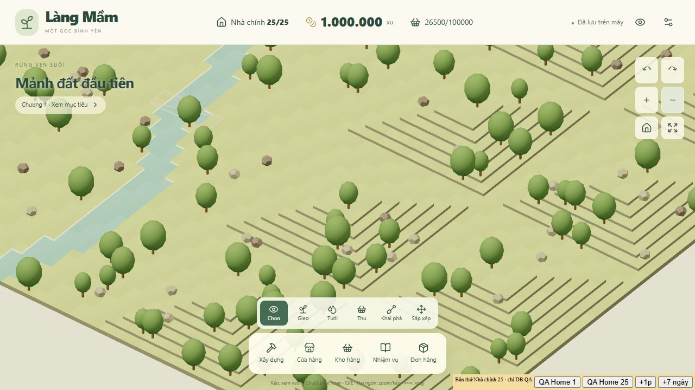
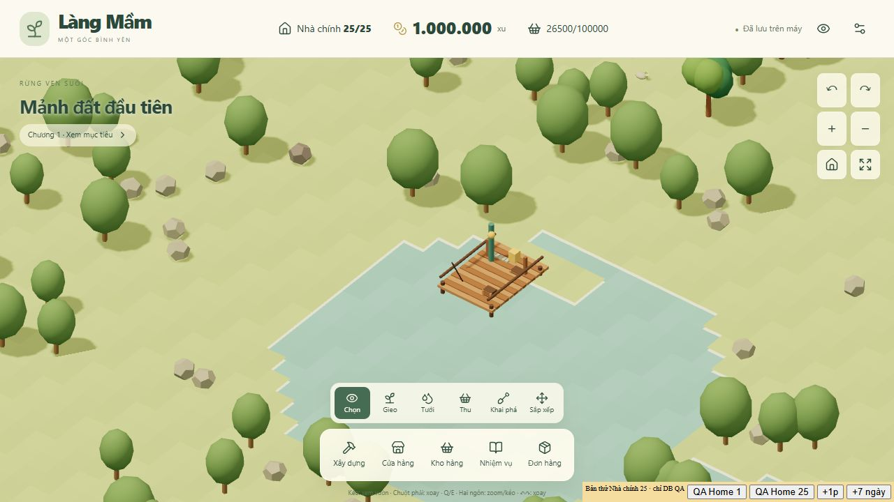

# Kiểm tra bản 0.2 và đề xuất góc nhìn cố định

Ngày 18/09/2026. Baseline: commit `bc020ce`, đối chiếu bản kế hoạch ở `c501221` và yêu cầu hiện tại của Đại ca. Phạm vi: đọc code, chạy kiểm tra, xem trình duyệt bằng sân QA riêng; không thay gameplay, save thật, host hoặc online.

**Kết luận:** khung gameplay đã được triển khai đáng kể và bộ kiểm tra hiện có đạt. Địa hình chưa đạt mục tiêu mỹ thuật của kế hoạch: cấu trúc cao độ, bờ nước, cách phân bố cảnh quan và mức khác biệt giữa các họ map còn mang tính bản thử. Không thể coi đợt C/mỹ thuật đã nghiệm thu chỉ vì có 6.000 seed hợp lệ.

Đại ca xác nhận điều chưa ưng: địa hình thô, vuông và thiếu tự nhiên. Sau đó Đại ca đề xuất bỏ xoay camera, chỉ pan/zoom và dùng ảnh 2D giả vật thể 3D; em khuyến nghị hướng 2.5D kết hợp ở cuối tài liệu. Đây là đề xuất kiến trúc đang trao đổi, **chưa phải renderer đã được chuyển đổi**.

## 1. Kết quả kiểm chứng mới

| Phép kiểm | Kết quả và giới hạn |
|---|---|
| Vitest toàn module | 64/64 test, 7/7 file; 156,74 giây trên máy lần này |
| TypeScript module | Đạt |
| TypeScript host `--noEmit` | Đạt |
| Production build module | Đạt; JS 1.261,70 kB / 364,95 kB gzip; còn cảnh báo chunk >500 kB |
| World tests | Có 6.000 seed và 120 seed kiểm tiếp cận sau khi đặt cả hai cầu đã xây; không chứng minh mọi bước mở đất/xây nhà trước cầu đều đúng |
| Solo tests | Ba biome × ba lịch chơi đạt Home 25 theo chiến lược của test; không phải nghiệm thu cân bằng với người thật |
| Trình duyệt | QA Home 1/25, xem khu cao và hồ, pan/zoom/minimap; không thấy warning/error trong log lúc kiểm |
| Chẩn đoán bổ sung | Tái hiện được đặt đồ ở bờ chưa tiếp cận; xác nhận nhịp cao độ lặp theo khu; validator không bắt vật cản trên nước |

Chẩn đoán hàng đợi khi đầu ra đầy không tìm ra lỗi backdate: sau nhận hàng, mẻ đã bị chặn được trả sản phẩm và mẻ kế tiếp bắt đầu từ thời điểm nhận. Không đưa giả thuyết này vào danh sách lỗi.

Bằng chứng: [JSON](review-2026-09-18/evidence.json), [script chẩn đoán](review-2026-09-18/reproduce.cjs). Script dùng fixture trong bộ nhớ và ghi JSON cùng thư mục; không đọc/ghi IndexedDB. Chạy từ repo bằng `node modules/farm/docs/review-2026-09-18/reproduce.cjs`.

## 2. Các vấn đề xác nhận được

### A. Cao độ lặp thành những khối vuông theo từng khu — ưu tiên cao về hình ảnh

Nguồn: [world.ts](../src/core/world.ts), dòng 86–88. Cao độ dùng khoảng cách tới mép khu tính bằng `x % 16`, `z % 16`, rồi tăng 0,25 tới trần 1,5. Mỗi khu lại hạ về 0 ở mép. Biên lưu trữ 16 × 16 đang quyết định hình dạng đồi, tạo các kim tự tháp cụt giống nhau.

Seed 20260917, hàng z=72, đoạn x=64..95 lặp hai lần dãy `0 → 0,25 → … → 1,5 → … → 0`. Các seed đại diện đủ sáu họ đều không có ô cao tại biên khu. Đây là nguyên nhân trực tiếp của cảm giác thô và vuông, không chỉ do màu hoặc thiếu texture.

Sửa hướng sinh địa hình: tạo đường sống núi, mặt cao nguyên và dốc ở quy mô toàn vùng, cho phép chạy qua biên khu; chunk chỉ phục vụ quản lý/render. Giữ mặt bằng đủ phẳng để xây, đường lên rõ và vách đá có chủ ý. Không dùng nhiễu màu để che một cấu trúc cao độ vẫn sai.

### B. Nước là các mặt ô hạ thấp, bờ hồ thiếu phần chuyển tiếp

Nguồn: [FarmWorld.tsx](../src/render/FarmWorld.tsx), dòng 41–68. Mặt nước dùng cùng kiểu mesh tô màu từng ô như đất, hạ xuống y=-0,16. Điều kiện dựng mặt bên lại so cao độ logic; bờ đất và ô nước cùng cao độ logic 0 nên không tạo phần nối bờ xuống mặt nước ở đó. Hình hồ còn có vết cắt vuông do vùng cảng cố định.

Cần đường viền bờ liên tục, hình học khép kín ở ranh đất/nước, lớp nước riêng và chuyển tiếp cạn/sâu. Rải lau/cỏ/đá theo bờ. Lớp hình ảnh được làm mềm nhưng vẫn phải khớp vùng đất/nước dùng cho đặt cảng và tương tác.

### C. Sáu họ map hiện dùng chung một cấu trúc chính

Nguồn: [world.ts](../src/core/world.ts), dòng 74–104. Cả sáu họ cùng mô hình: khởi đầu góc trên trái, hồ quanh x=25..29/z=42..46, sông gần x=50..52, cao nguyên phía đông nam. Family chủ yếu đổi vài tham số sóng/ellipse/ngưỡng. Cảng cố định quanh x=24..28/z=36..40; cầu luôn ở z=20 và 68.

Có ngẫu nhiên seed và tỉ lệ tài nguyên; chưa có sáu bố cục cảnh quan khác biệt như kỳ vọng về mẫu được duyệt. Cần template mô tả vị trí vùng, trục sông, hồ, cao nguyên, đường tiếp cận và nguồn tài nguyên; seed biến đổi bên trong các ràng buộc đó.

### D. Cảnh quan rải đều và lặp hình dáng

Nguồn: [world.ts](../src/core/world.ts), dòng 91–94; [FarmWorld.tsx](../src/render/FarmWorld.tsx), dòng 81–91. Vật cản được rải độc lập với xác suất 7,5%, đồng thời chừa dải ba ô theo từng biên khu. Cây dùng một thân trụ/tán đa diện; đá và quặng gần như chung hình với khác màu. Kết quả là các chấm rời rạc và những hành lang vuông đều, chưa hình thành rừng, bãi đá hoặc vùng quặng có bản sắc.

Cần cụm có chủ ý và khoảng trống có bố cục: cây chủ đạo/cây phụ, bụi/cỏ, đá nhiều cỡ, chi tiết bờ nước. Dữ liệu hiện cũng chưa tách khu tài nguyên lâu dài khỏi vật cản một ô có thể phá; cần bổ sung nếu tiếp tục mục tiêu rừng/mỏ đặc thù của từng trại.

### E. Có thể đặt đồ qua sông dù chưa có đường tiếp cận — lỗi gameplay P2

Nguồn: [engine.ts](../src/core/engine.ts), dòng 23–60. `placementError` kiểm sở hữu, cao độ, nước và va chạm, nhưng không kiểm liên thông tới khu đã tiếp cận. Một khu sở hữu có thể bao trùm cả hai bờ sông.

Tái hiện: tạo seed 20260917; fixture cho Home 25 và đủ xu; thực thi lệnh mở các khu 2, 3, 8, 9. Cả hai cầu chưa xây, `reachableTiles` báo ô (56,0) chưa tiếp cận được, nhưng lệnh đặt ghế thành công và snapshot vẫn hợp lệ. Điều kiện sở hữu đang cho phép bỏ qua cổng tiếp cận của địa hình.

Cần định nghĩa điểm tiếp cận công trình/ruộng và kiểm nó thuộc vùng liên thông; riêng cảng dùng chân bờ, cầu có quy tắc thi công riêng. Test trước/sau xây cầu và mở khu nằm hai bờ; không chỉ kiểm toàn map sau khi dựng đủ cầu.

### F. Bộ kiểm thế giới còn hẹp so với thiết kế — khoảng trống kiểm thử P2

Nguồn: [world.ts](../src/core/world.ts), dòng 106–121. `worldErrors` kiểm kích thước, miền cao độ/nước, vùng đầu, vài ô bến cảng và ID vật cản; chưa kiểm phân bố hợp lệ hoặc đường tiến trình. Fixture chèn cây vào ô nước vẫn nhận mảng lỗi rỗng. Đây là kiểm tra validator thiếu điều kiện, không phải bằng chứng mọi map sinh ra có cây dưới nước.

Bổ sung kiểm bờ khép kín/liên thông, vật cản đúng địa hình, vị trí cầu/cảng hợp lệ và chuỗi tiếp cận theo giai đoạn. Duyệt ảnh các seed đại diện riêng; tăng số seed không tự bắt được hình đồi xấu.

## 3. Phần nên giữ và phạm vi chưa kết luận

Giữ nền core hiện có: Home 1–25, jobs hữu hạn, hàng đợi, giới hạn kho, batch, nguyên liệu, điều kiện nâng, persistence/migration, nhiệm vụ và các menu. Đợt kiểm này không tìm lý do phải viết lại toàn bộ game. Bộ test đạt là bằng chứng cho các trường hợp được kiểm, không chứng nhận mọi tính năng hoặc trải nghiệm dài hạn.

Chưa kiểm mới trên GPU/cảm ứng điện thoại thật; chưa nghiệm thu mỹ thuật toàn bộ công trình; chưa có thử giữ chân người chơi nhiều ngày. Online/trading/account tiếp tục hoãn theo phạm vi Đại ca đã chốt. Không dùng thời gian solo bảo thủ trong docs làm dự đoán thời gian chơi của mọi người.

## 4. Đề xuất 2.5D theo trao đổi mới với Đại ca

**Em khuyến nghị:** camera trực giao cố định góc nghiêng và hướng nhìn, chỉ pan/zoom; nền đất/cao độ/nước/cầu dùng hình học đơn giản, phần lớn nhà/cây/decor dùng ảnh có nền trong suốt đặt trong thế giới. Giữ Three.js/React Three Fiber ở giai đoạn đầu để tận dụng core, tọa độ, cao độ và tương tác hiện có. So sánh renderer 2D khác chỉ khi bản mẫu cho thấy chi phí hiện tại không phù hợp.

Code đã dùng `Canvas orthographic` trong FarmWorld.tsx. Khi đổi, phải khóa mọi đường xoay: OrbitControls, nút trái/phải, phím Q/E, xoay hai ngón và các lệnh camera. Pan chỉ đổi vị trí, zoom chỉ đổi độ phóng đại; reset/focus không đổi góc. Xoay **vật thể** vẫn giữ 0/90/180/270 độ và đổi ảnh tương ứng, đồng thời đổi footprint/hit area.

| Lớp | Phương án đề xuất |
|---|---|
| Logic | Giữ ID, vị trí, rotation, level, job; art chỉ là cách hiển thị |
| Đất và cao độ | Mesh tiết chế, đường viền tự nhiên, texture có chuyển tiếp; không lặp đồi theo chunk |
| Hồ/sông/cầu/cảng | Nước và nền đỡ có độ sâu rõ; hình học hoặc ghép nhiều lớp khi vật khác phải đi trước/sau |
| Nhà/cây/decor | Ảnh cùng camera, tỉ lệ, bảng màu, hướng sáng; khai báo điểm chân, footprint và vùng chọn |
| Vật thể chuyển động | Sprite sheet hoặc các bộ phận tách lớp: cánh quạt, khói, tán lá, hiệu ứng thu hoạch |
| Bóng/che khuất | Bóng tiếp đất riêng; quy tắc chiều sâu và các lớp trước/sau, làm mờ vật che khi thao tác |

Không coi một tấm ảnh là đủ cho mọi vật thể: nhà dài, cầu hoặc vòm có thể cần nhiều lớp hay hình học đỡ để không che sai. Click phần trong suốt phải xuyên qua, không chọn nguyên hình chữ nhật của ảnh. Tán cây/nhà cao có thể che ô phía sau khi không xoay camera; chế độ sắp xếp cần làm mờ/ẩn phần che và vẫn chọn được mục tiêu.

Chuẩn asset cần chốt trước khi tạo hàng loạt: camera/góc chiếu, số pixel trên ô ở zoom chuẩn, mức zoom tối đa, điểm chân, bảng màu, hướng sáng, bóng tách riêng, vùng alpha và hướng nhìn. Dùng imagegen tạo ảnh mẫu và biến thể có cùng ảnh tham chiếu; kiểm bằng cách ghép thật vào scene. Không giả định imagegen luôn giữ đúng hình học ở bốn hướng. Nhà bất đối xứng không được lật ảnh tùy tiện; có thể cần model đơn giản để render các góc thống nhất hoặc chỉnh từng biến thể.

Quy mô ảnh cần tính rõ: 29 công trình gồm Home × 6 mốc ngoại hình × 4 hướng = **696 tổ hợp hình**, chưa gồm cây, decor và hoạt ảnh nếu mỗi tổ hợp dùng ảnh riêng. Dùng phần thân dùng chung/phần nâng cấp tách lớp và tái sử dụng hướng chỉ khi hình thực sự đối xứng. Không đặt mục tiêu 25 bộ ảnh khác nhau cho 25 cấp.

Ảnh 2D giảm việc dựng mesh phức tạp nhưng không bảo đảm game nhẹ hơn: phải kiểm bộ nhớ texture, tải theo vùng, atlas và số lớp trong suốt. Ánh sáng vẽ sẵn cũng giới hạn thay đổi hướng nắng; đề xuất giờ/ngày đầu tiên dùng cùng hướng sáng, đổi sắc độ và hiệu ứng có kiểm soát.

Tham chiếu kỹ thuật chính thức: [OrthographicCamera](https://threejs.org/docs/pages/OrthographicCamera.html), [Sprite](https://threejs.org/docs/pages/Sprite.html). Sprite luôn hướng camera và không tự đổ bóng bằng `castShadow`; không nhầm với mesh mang texture có các khả năng khác.

## 5. Thứ tự thực hiện đề xuất

1. Giữ bản 0.2 và save. Sửa lỗi tiếp cận qua sông kèm test cho các giai đoạn mở đất.
2. Làm một cảnh thử 2.5D độc lập trong module: một Home đủ bốn hướng, một xưởng, ba loại cây, đá/bụi, một loại cây trồng đủ giai đoạn, đoạn bờ hồ và vách đá. Chưa sản xuất toàn bộ catalog.
3. Duyệt ngay trong game ở zoom gần/xa và khung điện thoại: nền và vật thể hòa hợp, không viền trắng, chân không nổi, che khuất đúng, kéo thả/đổi hướng đúng, vẫn thao tác được ô bị che.
4. Thay cấu trúc đồi/bờ của một họ map để cảnh mẫu có chất lượng; sau đó mở sang các template khác và kiểm seed. Không giữ địa hình vuông rồi chỉ phủ thêm sprite.
5. Đo tải đầu, bộ nhớ và tốc độ trên thiết bị mục tiêu trước khi nhân toàn bộ asset theo level/hướng. Chỉ đổi phần trình bày không cần reset schema; nếu thay topology địa hình phải version/migration riêng và bảo toàn đất/công trình hiện hữu.

Các đề xuất này chưa được triển khai trong lượt review. Nếu Đại ca chọn hướng 2.5D, cập nhật đồng bộ yêu cầu camera/asset trong README, REVAMP_PLAN và art plan trước khi code; không tiếp tục ràng buộc xoay tự do của kế hoạch cũ.
