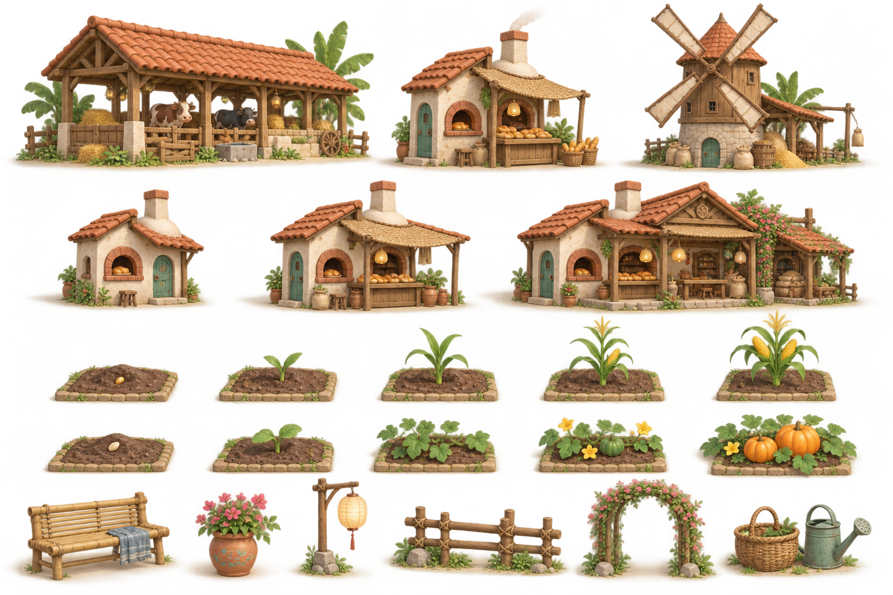

# Làng Mầm — kế hoạch mỹ thuật và sản xuất tài nguyên 3D

> **Quy trình mỹ thuật tham khảo, quy mô nội dung đã đổi.** Đọc [bàn giao](README.md) và [REVAMP_PLAN mục 9](REVAMP_PLAN.md) cho hướng hiện hành: tối đa 25 cấp, sáu bậc ngoại hình 1/5/10/15/20/25, có địa hình/nước/cầu/cảng. Các dự toán 3 mốc/5 cấp/12 họ ở dưới là mẫu tính công cũ, không phải giới hạn mới. Cảnh 3D dựng thử đã tồn tại theo [CURRENT_STATE](CURRENT_STATE.md), chất lượng asset sản xuất chưa được nghiệm thu. Giữ các quy tắc nhận diện, footprint, pipeline và đo hiệu năng dưới đây khi làm bộ mới.

Ngày: 17/09/2026. Trạng thái: thiết kế sản xuất và concept, chưa có model nông trại hoặc cảnh chơi 3D được nghiệm thu. Bổ sung cho [thiết kế game](farm-research-and-design.md) và [kinh tế, công trình, trang trí](farm-economy-and-engagement.md).

Đại ca yêu cầu công trình, cây theo giai đoạn và đồ trang trí có chất lượng, có bản sắc, tránh giống nhau. Hướng hiện tại chuyển sang **thế giới 3D thật**, thay đề xuất 2D trước đây. Các thông số, số lượng và phong cách cụ thể dưới đây là đề xuất của em để kiểm chứng bằng một cảnh mẫu.

## 1. Quyết định sản xuất

Làm một bộ mỹ thuật nhỏ, đủ đẹp và hoạt động được trong engine trước khi mở rộng danh mục. Chất lượng được đánh giá ở khoảng cách camera khi chơi, cả trên điện thoại, cùng ánh sáng và giao diện thực tế.

Ba nguyên tắc:

1. **Khác loại phải khác dáng:** công trình nhận ra bằng hình khối, cây bằng lá/thân/quả, đồ trang trí bằng hình dáng và cách bố trí.
2. **Cùng thế giới phải cùng ngôn ngữ:** tỷ lệ, vật liệu, độ chi tiết, bảng màu, ánh sáng và mức cách điệu nhất quán.
3. **Tiến bộ phải nhìn thấy:** nâng cấp thêm cấu trúc/thiết bị; cây chuyển hình thái; nơi được chăm chút trở nên sinh động.

Không lấy số file hoặc số màu làm thước đo độ phong phú. Khối lượng dự toán phải tách model gốc, bộ phận dùng chung, cấu hình lắp ghép, chuyển động và biến thể vật liệu.

## 2. Phong cách đề xuất và concept đầu tiên

**Một làng quê thu nhỏ, ấm và có chất thủ công.** Nhà mái ngói, gỗ sơn nhẹ, tường kem, giỏ tre, đất nung, cây lá mềm; điểm nhấn xanh ngọc và hoa. Các khối chính hơi phóng đại để dễ đọc trên màn hình nhỏ; cạnh mềm vừa phải. Đây là thế giới hư cấu có nét làng quê Việt, không yêu cầu mô phỏng kiến trúc hay nông nghiệp chính xác tuyệt đối.

- Bề mặt gỗ, đất, lá, kim loại phân biệt được; độ bóng có chủ ý, phần lớn bề mặt mờ.
- Màu nền đất/cỏ dịu để nông sản, công trình và trạng thái tương tác nổi bật. Đồ hiếm có thiết kế đặc trưng, không chỉ thêm ánh sáng chói.
- Chi tiết chia ba tầng: dáng nhận diện ở xa; bộ phận chức năng khi chơi bình thường; nét thủ công khi zoom gần.
- Camera thử đầu tiên: góc nhìn xiên từ trên, ưu tiên orthographic, pan/zoom; chỉ hiện lưới khi sắp xếp. Khả năng xoay camera được thử riêng, không suy từ yêu cầu Ca-rô. Model có đủ mặt để xoay công trình trên đất.

Ảnh dùng **imagegen tích hợp**, tạo mới từ mô tả, không dùng hình game tham khảo làm đầu vào. [Prompt đầy đủ và ghi chú đánh giá](farm-3d-art-prompts.md).

Đọc concept: hàng đầu là ba công trình khác chức năng; hàng hai là ba mốc ngoại hình của cùng lò bánh; hai hàng sau là ngô/bí qua năm giai đoạn; hàng cuối là đồ trang trí. Đây là ảnh raster định hướng, không chứa mesh, UV hay rig.

Điểm giữ: dáng công trình khác nhau, nhận diện lò bánh qua các cấp, lá ngô/bí khác rõ, đồ decor có chất liệu. Điểm cần sửa khi dựng thật: giảm chi tiết ngói/lá vụn ở khoảng cách chơi; góc camera cao hơn; ngô giai đoạn gần chín và chín cần khác rõ hơn; ánh sáng nắng ngoài trời phải giữ được màu và bóng tiếp xúc. Ảnh đẹp chưa chứng minh chất lượng hoặc hiệu năng của model.

## 3. Công trình: một bộ nhận diện cho từng nghề

| Công trình | Dáng và bộ phận nhận diện | Khi nâng cấp | Chuyển động khi làm việc |
|---|---|---|---|
| Chuồng bò | Dài, thấp, mái rộng, các gian mở và máng ăn | Thêm gian, cửa thông gió, khu chăm sóc | Bò ăn, đuôi vẫy, cửa nhỏ mở |
| Chuồng gà | Nhà nhỏ kê cao, thang lên, ổ đẻ, sân rào | Thêm ổ và hiên, khay thức ăn | Gà ra sân, mổ hạt, ổ có trứng |
| Lò bánh | Khối lò tròn, ống khói thấp, quầy bánh | Mái hiên, bàn sơ chế, gian phụ | Ánh lò, khói nhẹ, bánh xuất hiện trên khay |
| Cối xay | Dáng cao, cánh quay và phễu hạt | Bệ máy, kho hạt, bộ truyền động | Cánh và trục quay theo trạng thái |
| Trạm sữa | Khối thấp gọn, bình sữa, bồn và kệ mát | Kệ ủ, bàn chế biến, mái che | Khuấy, đổi khay sản phẩm |
| Xưởng dệt | Mái mở lộ khung cửi, cuộn vải | Thêm khung, kệ chỉ, giàn phơi | Khung cửi chuyển động, vải được cuộn |
| Lò gốm | Lò vòm, bàn xoay, kệ chum | Buồng nung, sân phơi, quầy trưng bày | Bàn xoay, lò sáng khi nung |
| Nhà kính | Mái vòm trong, khung cong, cây nhìn thấy bên trong | Thêm khoang, giàn và tưới | Cửa thông gió, tưới nhẹ |

Đề xuất 3 mốc ngoại hình lớn cho công trình có 5 cấp gameplay: cấp 1, 3, 5 thay cấu trúc; cấp 2, 4 thêm bộ phận thấy được như bàn/kệ/thiết bị. Mỗi cấp vẫn có dấu hiệu cụ thể. Dùng chung cửa, mái, cột, vật liệu giúp giảm công dựng, trong khi hình khối tổng thể và thiết bị đặc trưng được thiết kế riêng.

Ưu tiên giữ diện tích đặt ổn định qua các cấp: chừa sẵn sân trong footprint, nâng cấp lấp sân hoặc thêm cấu trúc theo chiều cao. Trường hợp thực sự mở rộng đất phải có preview vùng mới và giải quyết vật cản trước khi nâng; không đè lên luống hoặc tự dời đồ người chơi.

Ngoại hình theo tiến trình và trạng thái làm việc là hai lớp riêng: một lò cấp 3 có thể rảnh, đang làm, chờ nhận hoặc thiếu đầu vào. Khói, máy quay và khay hàng phải khớp trạng thái gameplay.

## 4. Cây trồng: thiết kế theo hình thái, không chỉ tăng kích thước

Khung cho cây ruộng: **đã gieo → mầm → cây non → phát triển hoa/quả/hạt → thu hoạch được**. Tên và hình ảnh từng mốc điều chỉnh theo cây; không ép mọi loài đều có hoa nhìn thấy hoặc quả trên cành.

| Họ cây | Cây dự kiến | Nhận diện và thay đổi quan trọng |
|---|---|---|
| Thân đứng, lá dài | Ngô | Lá mở theo tầng, thân cao, cờ/râu, bắp xuất hiện |
| Cụm thân mảnh | Lúa mì, lúa | Dáng bông, độ rủ và nền luống khác nhau; đến chín có hạt và thân đổi sắc |
| Lá sát đất/củ | Cà rốt, bắp cải | Cà rốt lá tơ và vai củ nhô đất; bắp cải lá cuộn thành bắp |
| Dây bò | Bí đỏ | Tán lan ngang, lá xẻ thùy, hoa và quả lớn nằm mặt đất |
| Cây phân cành | Cà chua, đậu nành, bông | Cà chua chùm quả/cọc; đậu có chùm vỏ; bông có quả nang mở bông trắng |
| Bụi thấp ra quả | Dâu tây | Lá chụm, hoa thấp, quả chuyển xanh sang đỏ ở sát tán |
| Cây lâu năm | Cam, táo | Cây non → tán trưởng thành → hoa → quả non → quả chín; thu hoạch vẫn giữ thân/tán |

Cho mỗi cây 2–3 biến thể nhỏ có kiểm soát ở các mốc cần thiết: thế lá, hướng quả, góc thân. Vị trí dùng seed cố định để reload không đổi hình ngẫu nhiên. Hạn chế xoay/scale nhẹ giúp luống tự nhiên, không làm quả mất khả năng nhận diện hoặc xuyên sang luống khác.

Đất mới gieo có thể dùng chung mesh nền và dấu gieo; giai đoạn sau cần model đặc trưng của từng cây. Cây đổi giai đoạn theo thời gian gameplay, hiệu ứng nảy/chuyển tiếp chỉ trình bày kết quả. Không thay đổi tiền, kho hay thời gian sinh trưởng từ animation.

## 5. Trang trí, vật nuôi và cảm giác có sự sống

Đề xuất 30 món decor gốc chia thành ba bộ dễ phối:

- **Vườn nhà:** hàng rào, ghế, chậu hoa, luống hoa, lối đi, cổng, dụng cụ và giỏ.
- **Góc bờ suối:** cầu, đá, cỏ lau, sàn gỗ, chỗ ngồi, biển chỉ đường, cây bóng mát.
- **Hội chợ làng:** đèn, dây cờ, quầy, giàn hoa, bảng trưng bày, bàn tiệc và đồ kỷ niệm.

Mỗi bộ có món chủ đạo, món nối không gian và chi tiết nhỏ. Đường/hàng rào cần đoạn thẳng, góc, đầu và cổng khớp nhau; có thể đặt theo nét kéo. Màu bổ sung không tính là món mới. Đồ trang trí lớn mở theo mốc chơi và một số món do xưởng thủ công làm ra để kết nối mỹ thuật với kinh tế.

Vật nuôi cần dáng, bước đi và hành vi riêng. Bộ đầu của một loài: đứng/chớp mắt, đi, ăn, phản ứng khi chạm; chuyển động đặc thù bổ sung theo loài. Không để cả đàn/cánh đồng chạy cùng pha animation. Thú cưng có biểu cảm và tương tác để tạo gắn bó.

Gió nhẹ, bóng tiếp xúc, tiếng chân và hiệu ứng thu hoạch được thiết kế cùng asset. Có mức giảm chuyển động. Thay đổi ngày/đêm và lễ hội nên chủ yếu dùng ánh sáng cùng bộ trang trí nhỏ; chưa nhân đôi toàn bộ model cho bốn mùa.

## 6. Nguồn tài nguyên và vai trò công cụ

| Nhóm sản xuất | Dùng ở đâu | Công việc cần làm |
|---|---|---|
| Thiết kế/dựng riêng | Công trình chủ đạo, cây trồng, vật nuôi, đồ trang trí đặc trưng | Concept → dựng model → UV/vật liệu → chuyển động → kiểm tra trong engine |
| Model có sẵn, chọn lọc | Cây nền, đá, dụng cụ, một số nền công trình | Kiểm tra giấy phép, chỉnh dáng/tỷ lệ/vật liệu, giảm chi tiết, đồng bộ với phong cách |
| Lắp ghép và sinh bằng code | Đường, rào, bố trí cỏ/đá, cụm luống và biến thể có quy tắc | Dùng module đã đạt chất lượng, kiểm tra chỗ nối và va chạm |
| Imagegen | Concept công trình/cây, nghiên cứu màu và vật liệu, minh họa phụ | Tạo ảnh tham chiếu; chuyển thiết kế sang model có thể kiểm soát trong công cụ 3D |

Hai nguồn đã kiểm tra ngày 17/09/2026: [Quaternius Farm Buildings](https://quaternius.com/packs/farmbuildings.html) công bố 13 model, định dạng FBX/OBJ/Blend, giấy phép CC0; [Kenney Nature Kit](https://kenney.nl/assets/nature-kit) công bố bộ 3D với 330 file, giấy phép CC0. Đây là ứng viên để đánh giá và tái thiết kế, chưa tải/nhập vào nông trại. 330 file không đồng nghĩa 330 mẫu độc lập phù hợp game.

Model từ các nguồn khác nhau cần được đặt chung một cảnh thử để so tỷ lệ và vật liệu. Những model không hòa vào phong cách được loại hoặc dựng lại. Lưu nguồn, tác giả, giấy phép, phiên bản và các chỉnh sửa trong manifest tài nguyên.

Imagegen hiện tạo ảnh raster, không trực tiếp xuất model GLB có topology, UV, rig và các trạng thái nhất quán. Nếu sau này dùng công cụ AI sinh mesh, coi đầu ra là bản dựng thô cần kiểm tra và sửa; chưa đưa dịch vụ, tài khoản hay chi phí đó vào phạm vi đã có.

Em có thể thực hiện hệ thống tải/hiển thị, công cụ xem và đo model, manifest, bố trí cảnh, hoạt ảnh lập trình, module hình học và concept. Mức chi tiết có cá tính như mẫu cần khâu tạo hình và chỉnh mỹ thuật trong Blender hoặc công cụ tương đương; phải tính công này vào kế hoạch, có thể cần nghệ sĩ 3D cho bộ chủ đạo. Chưa có căn cứ để hứa toàn bộ sẽ đạt mẫu chỉ bằng sinh hình học tự động.

## 7. Quy trình cho một tài nguyên hoàn chỉnh

1. **Phiếu thiết kế:** vai trò, kích thước ô, camera, dáng nhận diện, cấp/giai đoạn, điểm tương tác và trạng thái.
2. **Concept:** chọn dáng chính; tài nguyên phức tạp có trước/bên/sau. So các hình chiếu để tránh chi tiết mâu thuẫn từ ảnh sinh tự động.
3. **Khối thô trong engine:** thử tỷ lệ, độ che khuất và vùng bấm ở khoảng cách chơi trước khi thêm chi tiết.
4. **Model hoàn chỉnh:** chỉnh đường nét, UV, vật liệu, điểm neo và bộ phận chuyển động; giữ file nguồn có thể sửa.
5. **Hoạt ảnh:** rig khi cần, đặt trục quay cho cửa/cánh quạt, thêm vùng gió cho cây; có chế độ giảm chuyển động.
6. **Xuất GLB:** tên và phiên bản ổn định, material dùng chung, mức chi tiết phù hợp, bounds và footprint được kiểm tra.
7. **Duyệt trong cảnh thật:** cạnh các asset khác, có bóng, UI, pan/zoom và chế độ điện thoại. Render icon cửa hàng từ cùng model để hình mua và đồ đặt khớp nhau.
8. **Đo, đóng gói:** dung lượng tải, texture sau giải nén, draw calls, thời gian khung hình; tối ưu rồi kiểm tra lại hình ảnh.

Phiếu asset tối thiểu: `assetId`, `revision`, `kind`, `modelUrl`, `visualStage`, `footprint`, `pivot`, `interactionAnchor`, `attachments`, `animations`, `bounds`, `lods`, `materialSet`, `thumbnail`, `license/source`, `reviewStatus`. Đây là thiết kế schema, chưa phải API đã tồn tại.

Quy ước đề xuất: 1 đơn vị thế giới = 1 ô đất; trục Y lên; pivot ở mặt đất theo tâm footprint; công trình đặt theo bước 90°. Lưới hiển thị và hitbox dùng footprint dữ liệu; tán lá/hiên trang trí được tách khỏi vùng chiếm chỗ nhưng phải kiểm tra che khuất. Phiên bản mỹ thuật tách khỏi cấp công trình và phiên bản bản lưu.

## 8. Khối lượng và cách dự toán

| Nhóm | Quy mô lập kế hoạch bản đầu | Cách tính công |
|---|---|---|
| Công trình chính | Khoảng 12 họ × 3 mốc ngoại hình | Khoảng 36 cấu hình lắp ghép; chia core riêng và module chung, phụ kiện cấp trung gian tính riêng |
| Cây ruộng | 10 cây × 5 trạng thái | 50 liên kết trạng thái; đất/mầm được dùng chung khi hợp lý, không báo thành 50 mesh độc lập |
| Cây ăn quả | 2 cây × 5 trạng thái | 10 cấu hình thân/tán/hoa/quả; tính thêm chu kỳ sau thu hoạch |
| Vật nuôi/thú cưng | 4 loài sản xuất + 1 thú cưng | Model + rig + từng animation + kiểm tra phối hợp với chuồng |
| Decor | Khoảng 30 mẫu gốc | Bộ đường/rào tính đủ góc/đầu/nối; bảng màu tính thành biến thể |
| Nền cảnh | Một bộ địa hình, cây nền, nước và đường | Mesh/module, vật liệu, bố trí, bóng và xử lý che khuất |
| NPC/vật phẩm/hiệu ứng | Theo bản nội dung | Tách dự toán nhân vật/rig khỏi icon; chỉ dựng vật phẩm 3D khi thật sự xuất hiện trong thế giới |

Đây là quy mô để phân tích, chưa phải cam kết sản xuất đủ trong một lượt. Danh sách 12 họ cần đối chiếu chính xác với 6 trạm sản xuất, chuồng và hạ tầng của bản 1 trước khi đặt công dựng. Công trình trang trí lớn, cầu và chợ có thể làm tăng số lượng.

Dùng bộ thử để đo: một công trình gốc mất bao nhiêu công dựng/sửa, một cấp bổ sung, một cây đầy đủ giai đoạn, một món decor, một rig và một animation. Dự toán tổng = công model gốc + phần biến thể + hoạt ảnh + tích hợp/tối ưu + số vòng sửa được thống nhất. Chưa ấn định lịch/chi phí khi chưa biết năng suất thực và thiết bị đích.

## 9. Tận dụng dự án và giữ cảnh chơi nhẹ

Repo đã có `three`, `@react-three/fiber`, `@react-three/drei`, tải GLB/animation trong DragonQuest và bố trí cảnh 3D trong PlanetWorkshop. Có thể kế thừa kỹ thuật, còn bộ mỹ thuật nông trại cần thiết kế riêng. Dùng React cho giao diện và React Three Fiber/Three.js cho thế giới 3D.

- Dùng instancing theo nhóm cùng mesh/vật liệu cho cây, rào và decor lặp; chia cụm theo vùng để tải/cắt cảnh hợp lý. [Three.js InstancedMesh](https://threejs.org/docs/pages/InstancedMesh.html) mô tả điều kiện dùng chung geometry/material và mục tiêu giảm draw calls. Biến thể hình học quá nhiều làm giảm lợi ích này.
- Dùng atlas/bảng vật liệu chung có kiểm soát; nén model/texture sau khi đo chất lượng và hỗ trợ thiết bị. Ngói, vân gỗ và đất không cần mọi chi tiết đều là hình học riêng.
- Mức chi tiết xa giảm lá/chi tiết phụ; giữ dáng công trình và dấu hiệu cây chín. Bóng động tập trung khu vực đang nhìn; không bật hậu kỳ nặng mặc định cho mọi máy.
- Tải riêng nội dung vùng/cấp cần thiết. Chơi offline cần gói đã tải đủ và cache có phiên bản. Bản thăm vườn cần xử lý asset chưa tải mà không hiển thị sai cấp/trạng thái.
- Bản lưu/Supabase lưu ID tài nguyên, cấp/giai đoạn, tọa độ, hướng và seed; model/texture là tài nguyên dùng chung, không nhét file nhị phân vào mỗi bản lưu.

Ngân sách thử ban đầu, **chưa phải kết quả đo**: gói hình ảnh/model khởi đầu khoảng 10–20 MB; cảnh nhìn thấy hướng tới khoảng 150–200 draw calls và 100–250 nghìn tam giác; mục tiêu 30 FPS trên điện thoại đích, 60 FPS trên máy tính đích. Gói âm thanh tính riêng. Các giới hạn sẽ sửa theo GPU, bộ nhớ texture, độ phân giải và kết quả thực tế; số tam giác thấp không tự bảo đảm chạy mượt.

Cảnh đo dày đề xuất: 250 ô trồng, 30 công trình, 200 đồ trang trí, 20 vật nuôi, có UI và thao tác kéo/đặt. Đo cả cận cảnh, toàn cảnh, tải lần đầu và chuyển vùng; ghi tên thiết bị, trình duyệt, độ phân giải, thời gian khung hình trung vị/p95, đỉnh bộ nhớ và tổng tải. Đây là bài kiểm tra tải, không phải hạn mức nông trại đã chốt.

## 10. Mẫu cần làm trước và điều kiện mở rộng

**Mốc A0 — cảnh kiểm chứng mỹ thuật 3D**, trước khi nhân rộng nội dung:

- Một góc đất có đường, cỏ, hàng rào, nắng và bóng tiếp xúc.
- Ba loại công trình: chuồng bò, lò bánh, cối xay. Lò bánh có ba mốc ngoại hình, tổng năm cấu hình công trình.
- Ba cây đại diện hình thái: ngô, bí đỏ, cà rốt; mỗi cây đủ năm trạng thái.
- Tám món decor phối thành một góc vườn có chủ ý.
- Một con bò có đứng, đi, ăn và phản ứng khi chạm.
- Pan/zoom, chọn, kéo đặt, xoay công trình và đổi thử cấp/giai đoạn; chưa cần toàn bộ vòng kinh tế.
- Một trang xem asset riêng để so cạnh nhau, kiểm tra vật liệu/chuyển động, footprint, dung lượng và thiếu tài nguyên.

Tiêu chí nghiệm thu mẫu:

1. Nhận ra ba công trình khi bỏ tên và nhìn ở zoom chơi; hình bóng vẫn phân biệt được khi bỏ màu.
2. Thấy rõ cây non, đang lớn và sẵn thu hoạch; phần chín được biểu thị bằng hình thái lẫn màu.
3. Lò bánh cấp cao vẫn nhận ra cùng công trình, có bổ sung kiến trúc thật; không va chạm công trình bên cạnh.
4. Các asset nhìn như cùng một bộ; mặt dưới không nổi, bóng không cháy, chất liệu không đồng loạt bóng nhựa.
5. Thao tác tốt ở màn hình rộng khoảng 390 CSS px và máy tính; mái/tán không làm mất vùng chọn luống phía sau. Thử outline/ẩn bớt vật che khi chọn.
6. Model và animation đạt khi xem trực tiếp trong engine, không chỉ đẹp ở ảnh render.
7. Đạt ngân sách hiệu năng đã đo trên thiết bị được chọn; không giảm chất lượng đến mức mất nhận diện.

Sau A0: dựng vòng chơi nhỏ của mốc A trong kế hoạch game, rồi sản xuất từng gói mở khóa. Mỗi gói gồm công trình/cây/sản phẩm/trang trí liên quan để chơi và kiểm tra như một phần nội dung hoàn chỉnh. Nếu mẫu chưa đạt, sửa phong cách hoặc cách sản xuất trước khi tăng số lượng.
