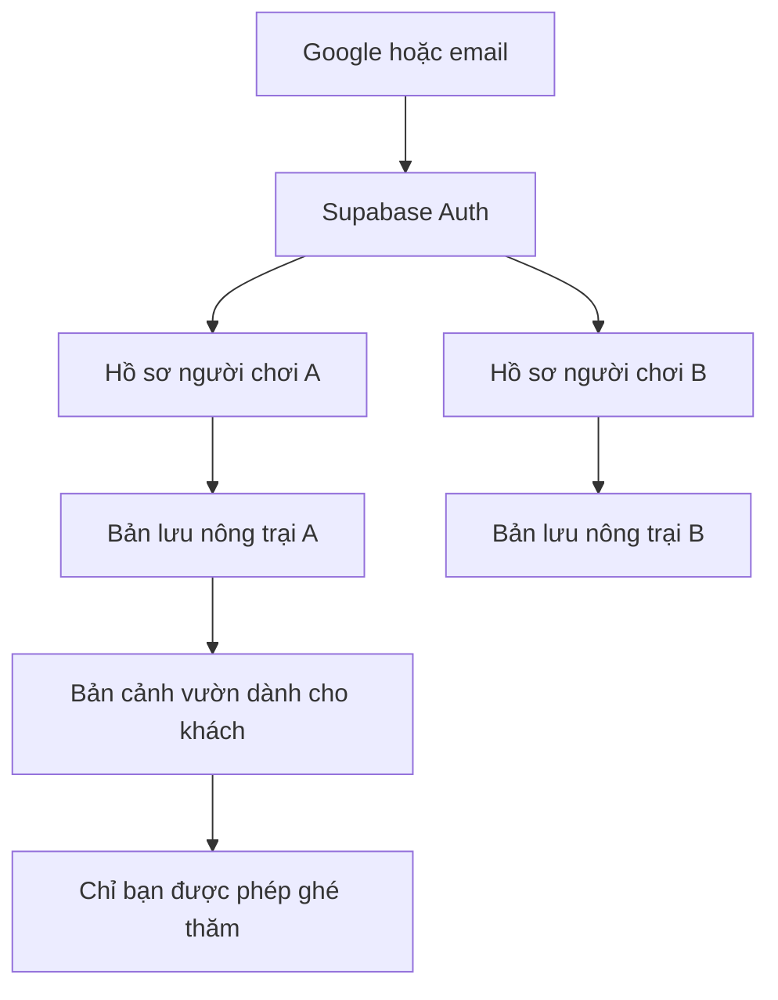

> Cập nhật 18/09/2026: Đại ca đã duyệt làm tài khoản/cloud save trên project hiện tại. Đọc [ACCOUNT_SYNC](ACCOUNT_SYNC.md) cho mã và trạng thái triển khai mới nhất. Các phần marketplace/server-authoritative bên dưới vẫn là kế hoạch tương lai.

# Nông trại online với Supabase

> **Phương án backend tương lai, chưa triển khai.** Theo quyết định mới hơn của Đại ca, hoàn thiện module chính trước; online là đợt F trong [REVAMP_PLAN](REVAMP_PLAN.md). Đề xuất “tài khoản/thăm vườn trong bản 1” bên dưới không còn là thứ tự triển khai hiện hành. Không tạo Auth/database hoặc gắn hồ sơ host khi làm module riêng. Giao dịch bắt buộc online; snapshot không có quyền ghi đè kinh tế, chính sách đưa tài sản local lên chợ chưa chốt. Đọc [bàn giao](README.md) để biết toàn bộ phạm vi.

Ngày: 17/09/2026. Bổ sung cho [thiết kế nông trại](farm-research-and-design.md) theo câu hỏi của Đại ca về liên kết tài khoản và đi thăm nông trại. Đây là phương án đề xuất; chưa tạo bảng, bật Auth hay thay đổi Supabase project.

**Bổ sung ở giai đoạn thiết kế online:** Đại ca đã yêu cầu chợ bán hàng lấy xu và đổi vật phẩm, đồng thời chốt **mọi thao tác giao dịch cần mạng; không hàng đợi giao dịch offline**. [Thiết kế kinh tế](farm-economy-and-engagement.md) bổ sung server xác thực tiền/kho/jobs và giao dịch. Snapshot ở mục 6 chỉ còn phù hợp sao lưu nông trại riêng, không được ghi đè sổ kinh tế của nông trại tham gia chợ. Luồng chuyển nguyên tiến trình khách lên online bên dưới cần phân biệt sao lưu riêng với tài sản được giao dịch; phương án chuyển đổi chưa được Đại ca chốt.

## 1. Phương án chính

Giữ chơi trên máy không cần tài khoản. Người chơi chủ động liên kết Google hoặc email để lưu online, chuyển thiết bị và mở tính năng bạn bè. Nông trại mặc định riêng tư; có thể cho những người đã kết bạn ghé thăm.

Supabase Auth tạo tài khoản người dùng của **Genius Kids** trong project chung của ứng dụng. Người chơi không cần đăng ký tài khoản quản trị tại website Supabase hoặc tạo project riêng. Auth quản lý đăng nhập, bảng ứng dụng lưu hồ sơ và nông trại tham chiếu UUID của Auth. [Quản lý người dùng](https://supabase.com/docs/guides/auth/managing-user-data)

Đề xuất Google trước, email OTP là lựa chọn bổ sung; khi triển khai cần cấu hình provider, redirect và gửi email. [Google](https://supabase.com/docs/guides/auth/social-login/auth-google), [email](https://supabase.com/docs/guides/auth/auth-email-passwordless)

## 2. Tài khoản khác với hồ sơ trẻ

Một tài khoản phụ huynh/gia đình có thể quản lý nhiều hồ sơ, mỗi hồ sơ có một nông trại. Người dùng riêng chỉ cần một hồ sơ. Đây là đề xuất phù hợp ứng dụng hiện hỗ trợ nhiều học sinh trên cùng máy.

- `auth.users.id`: tài khoản sở hữu dữ liệu.
- `player_profiles.id`: UUID hồ sơ online, không lấy tên hoặc ID thời gian cục bộ làm khóa toàn hệ thống.
- `farms.id`: UUID nông trại gắn với hồ sơ.
- Thiết bị giữ ánh xạ hồ sơ cục bộ → UUID online theo tài khoản. Đổi tài khoản không nhận lại dữ liệu/cache của tài khoản trước.
- Người ghé thăm chỉ thấy biệt danh và phần nông trại được chia sẻ; không có email, tuổi/lớp, kết quả học tập, kho và tiền riêng.

Không tự tạo tài khoản Auth cho mọi khách mở ứng dụng. Supabase có anonymous sign-in rồi liên kết danh tính, nhưng đó là người dùng Auth thật, khác API key `anon`; chưa cần dùng trong phương án khách cục bộ này. [Anonymous sign-in](https://supabase.com/docs/guides/auth/auth-anonymous)

## 3. Luồng liên kết lần đầu

1. Chơi cục bộ → chọn “Liên kết để lưu online” → đăng nhập/xác nhận email. Hủy giữa chừng vẫn giữ bản trên máy.
2. Chọn hồ sơ muốn liên kết; không tự tải tất cả hồ sơ học tập trên thiết bị lên mạng.
3. Nếu chưa có nông trại tương ứng: tạo hồ sơ/farm online, kiểm tra và tải bản lưu lên bằng mã thao tác duy nhất. Retry không tạo hai nông trại.
4. Nếu đã có bản online: hiện tên/cấp/thời điểm lưu của hai bản. Chọn dùng bản online hoặc thay bằng bản trên máy sau khi giữ bản dự phòng; có thể nhập thành hồ sơ khác nếu phù hợp.
5. Chỉ hiện “Đã lưu online” khi server xác nhận. Máy mới đăng nhập, chọn hồ sơ rồi tải nông trại.

Không tự cộng tiền/XP/vật phẩm của hai bản. Đăng xuất dừng đồng bộ và tách cache theo tài khoản, không xóa cloud. Xóa bản trên máy, ngắt liên kết và xóa tài khoản online là ba thao tác khác nhau.

## 4. Thăm vườn khi chủ đang offline

Bản đầu tải bản cảnh vườn mà chủ đã đồng bộ rồi dựng bằng bộ đồ họa game. Khách đi dạo, xem công trình, cây, vật nuôi, trang trí và bộ sưu tập được chia sẻ. Cảnh có hoạt ảnh nhưng không làm thay đổi trạng thái nông trại của chủ. Hiện thời điểm cập nhật để người xem biết đây là bản đã lưu.

Luồng: **nhập mã mời → gửi yêu cầu → chủ chấp nhận → danh sách bạn → Ghé thăm**.

- Mặc định chỉ bạn đã chấp nhận; chưa cần danh bạ công khai hay tìm trẻ bằng tên thật.
- Khách không thu hoạch, bán đồ, di chuyển công trình hoặc đọc kho của chủ; không có trộm/phá vườn.
- Có thể thêm phản ứng theo mẫu; không thưởng xu/XP từ lượt thích, không cần chat tự do trong bản đầu.
- Mã mời khó đoán, có thể thu hồi và giới hạn thử trên server. Mã chỉ tìm/gửi yêu cầu, không tự cấp quyền sửa.
- Bỏ kết bạn/chuyển về riêng tư chặn lần truy cập tiếp theo. Không hứa thu hồi được nội dung khách đã tải trước đó.

Tưới giúp, tặng quà và cùng làm việc để giai đoạn sau. Hành động có thưởng cần server kiểm tra quyền, điều kiện, hạn mức và ghi nhận một lần; không tin client tự báo số quà nhận.

## 5. Thành phần và dữ liệu

| Thành phần | Dùng cho |
|---|---|
| Supabase Auth | Đăng nhập, phiên làm việc, định danh tài khoản |
| Postgres + RLS | Bản lưu, hồ sơ, bạn bè và quyền truy cập |
| Database Functions/RPC | Lưu có revision, nhập bản cục bộ, xử lý mời/kết bạn, giao dịch quà nếu thêm |
| Storage | Thumbnail nông trại nếu cần; không nhân bản asset dùng chung theo người chơi |
| Realtime | Hiện diện và sự kiện trực tiếp ở giai đoạn sau; ghé thăm bản lưu chưa cần kết nối liên tục |

RLS cần kết hợp quyền thao tác bảng và danh tính Auth. UI ẩn nút không thay thế kiểm tra quyền trên server. [RLS](https://supabase.com/docs/guides/database/postgres/row-level-security) Các thay đổi liên quan cần đóng gói thành giao dịch database. [Database Functions](https://supabase.com/docs/guides/database/functions)

| Bảng đề xuất | Nội dung | Quyền |
|---|---|---|
| `player_profiles` | UUID, `owner_user_id`, nickname/avatar | Chủ tài khoản; không làm danh bạ công khai |
| `farm_saves` | Farm/player ID, state JSONB, schema/content version, revision, thời điểm lưu | Chủ đọc; ghi qua hàm kiểm tra ownership và revision |
| `farm_visit_snapshots` | Cảnh vườn lược bỏ dữ liệu riêng, chế độ chia sẻ, revision | Chủ và khách thỏa quyền; server tạo từ danh sách trường cho phép |
| `friendships` | Hai hồ sơ và trạng thái đề nghị/chấp nhận/chặn | Các bên liên quan; chỉ bên nhận được chấp nhận lời mời |
| `friend_invites` | Hash mã mời, chủ mã, hết hạn/thu hồi | Tra cứu qua server có giới hạn, không tải danh sách mã |
| `farm_sync_requests` | Farm, mã thao tác, hash payload, revision kết quả | Chống ghi lại do retry; có chính sách dọn bản ghi |

Chưa cần một dòng database cho mỗi cây ở bản lưu riêng. Với yêu cầu chợ mới, bổ sung ví/sổ xu, kho khả dụng, hàng giữ riêng, jobs, listings, trades và receipts. Snapshot phục vụ hiển thị/phục hồi trong quyền cho phép, không phải cách client tự đặt số dư. Chi tiết ở tài liệu kinh tế mới.

Bản cho khách không chứa toàn bộ save rồi nhờ frontend giấu trường riêng. Không đặt snapshot/thumbnail ở bucket public nếu UI hứa chỉ bạn bè được xem. Storage cần quyền tương ứng; URL tạm nếu dùng phải có hạn ngắn. [Storage access control](https://supabase.com/docs/guides/storage/security/access-control)

Client dùng publishable/anon key, tuyệt đối không chứa service-role/secret key. Hàm có quyền nâng cao tự kiểm tra người gọi, không tin `owner_user_id` do client gửi. Bản dữ liệu công khai phải được kiểm tra phía server trước khi xuất.

## 6. Đồng bộ offline và nhiều thiết bị

Supabase cung cấp backend; ứng dụng phải viết phần đồng bộ. Giữ IndexedDB và hàng đợi chưa gửi. UI phân biệt “Đã lưu trên máy”, “Chờ đồng bộ”, “Đã lưu online”, “Có hai bản khác nhau”.

Phương án sau dùng cho **sao lưu nông trại riêng không tham gia kinh tế chợ**, với kiểm tra phiên bản khi ghi. Nông trại tham gia chợ dùng lệnh do server kiểm tra theo tài liệu kinh tế mới; không xếp lệnh mua/bán/đổi vào hàng đợi offline:

1. Thiết bị tải server revision N và giữ `baseRevision = N`.
2. Sau khi chơi, gửi snapshot với `expectedRevision = N`, `requestId` và phiên đăng nhập.
3. Server kiểm tra quyền, schema, kích thước; chỉ ghi nếu revision vẫn N. State, bản dành cho khách và kết quả thao tác được ghi cùng giao dịch, trả N+1.
4. Retry cùng mã/cùng payload trả kết quả cũ; cùng mã/khác payload bị từ chối. Chỉ xóa hàng đợi khi được xác nhận.
5. Nếu thiết bị khác đã ghi N+1: giữ cả hai bản để chọn/phục hồi. Không lấy đồng hồ client để quyết định ghi đè; không cộng hai kho vật phẩm.

Gom các thay đổi liên tiếp và lưu sau hành động quan trọng; không upload mỗi giây đếm ngược/khung hình. Server đổi revision có thể gửi thông báo, nhưng thông báo không tự giải quyết xung đột.

Mô hình này hỗ trợ chuyển máy và offline; không hứa hai máy cùng sửa một vườn sẽ luôn tự gộp được. Muốn chơi đồng thời cần nhật ký lệnh được server xác thực và quy tắc xung đột theo từng loại hành động.

## 7. Thời gian, kinh tế và Realtime

Cloud save chỉ đọc khi thăm có thể nhận bản cục bộ đã kiểm tra cấu trúc. Tuy nhiên, RLS bảo vệ quyền sở hữu, không chứng minh tiền/XP do chủ gửi lên là hợp lệ theo luật game. Vì Đại ca đã yêu cầu chợ, nền kinh tế online phải có server xác thực trước khi mở bán/đổi; không chỉ thêm giao diện chợ lên snapshot này.

Server xác thực các thay đổi tạo tài sản trao đổi, thời điểm, nguyên liệu và hạn mức. Không lấy kho import offline làm nguồn hàng đáng tin để giao dịch. Luồng chuyển nông trại cũ và chơi offline có đối soát được đề xuất trong tài liệu kinh tế, chưa phải quyết định của Đại ca. Giao dịch chỉ dùng tiền/hàng đã đồng bộ; mất phản hồi thì kiểm tra receipt bằng mã cũ, không tự giao dịch lại.

Cây/xưởng vẫn tính từ mốc công việc khi quay lại, không cần cron cho từng cây. Hành động xã hội có thưởng dùng giờ server và mã nhận một lần. Phần thay đổi cần xác nhận online được hiển thị là dự kiến khi mất mạng.

Nếu thêm cùng hiện diện, dùng channel riêng theo farm và quyền vào vườn. Presence để biết ai đang ở đó, không gửi mọi bước di chuyển/khung hình; sự kiện khác dùng cơ chế phù hợp, không để dữ liệu Broadcast quyết định số tiền/vật phẩm. [Realtime Authorization](https://supabase.com/docs/guides/realtime/authorization), [Presence](https://supabase.com/docs/guides/realtime/presence)

## 8. Hiện trạng và thứ tự làm

Đã kiểm tra `src/lib/supabase.ts`: có client và helper ảnh bucket `infographic`. Chưa tìm thấy luồng Auth hay đồng bộ game trong các vùng `src`, `services`, `games` đã kiểm tra. Router/Vite dùng base `/Genius-kids`; callback đăng nhập cần thử đúng host triển khai, cả reload và liên kết từ email.

Đề xuất đưa tài khoản và ghé thăm vào bản 1:

1. **Cùng bản thử A:** chuẩn bị UUID/owner, schema, revision, tách state riêng và cảnh cho khách; chưa cần đăng nhập để thử vòng chơi.
2. **B1:** Google/email, liên kết hồ sơ, nhập bản cục bộ, cloud save, chuyển thiết bị, xử lý hai bản khác nhau.
3. **B2:** mời/kết bạn, ghé thăm chỉ đọc, riêng tư/thu hồi, phản ứng mẫu tùy chọn.
4. **B3 — Chợ theo yêu cầu mới:** rao bán lấy xu, đổi hàng, quầy riêng và danh mục chung; thao tác chỉ khi có mạng. Thiết kế nền kinh tế server từ B1, không chờ tới lúc dựng giao diện chợ.
5. **Sau đó:** giúp việc/quà, dự án nhóm rồi mới cân nhắc cùng chơi trực tiếp. Bật Supabase Realtime không tự tạo multiplayer hoàn chỉnh.

Kiểm thử: A không đọc/sửa save riêng của B; khách chưa được chấp nhận không xem vườn; bỏ kết bạn chặn lần đọc tiếp; client không tự đổi owner/chấp nhận lời mời; retry không tạo bản/quà trùng; hai thiết bị không ghi đè im lặng; logout/account switch không gửi hàng đợi sang nhầm tài khoản; email callback về đúng base; cache không bị nhận là dữ liệu của người mới; backup/migration/xóa tài khoản xử lý đầy đủ bảng và file.

Theo dõi số lần lưu, kích thước snapshot, băng thông ghé thăm và kết nối Realtime để chọn gói dịch vụ sau pilot; chưa giả định gói miễn phí đủ cho quy mô cụ thể.
